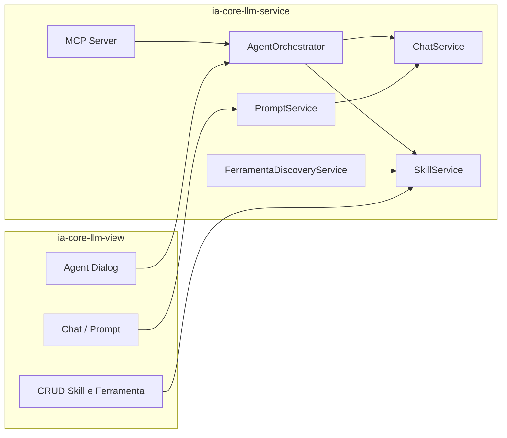

# ADR-048: Embarcar Inteligência Artificial com MCP, Skills e Spring AI

## Status

Aceito

## Contexto

O monólito modular **ia-core** evolui para IA concentrando MCP, tools, skills, orquestração e auditoria em **`ia-core-llm-service`**, com modelo e contratos em **`ia-core-llm-model`** / **`ia-core-llm-service-model`** e interação humana em **`ia-core-llm-view`**.

**Importante**: Todos os módulos do **ia-core** funcionam como bibliotecas/framework e **não podem compor uma aplicação por si só**. Esses módulos são base/framework para construção de outras aplicações, padronizando o desenvolvimento e abstraindo padrões de desenvolvimento. Uma aplicação real é composta pela combinação de múltiplos módulos ia-core mais código específico do domínio da aplicação.

### Estado atual

| Módulo | Responsabilidade                                                      |
|--------|-----------------------------------------------------------------------|
| `ia-core-llm-model` | `Template`, `Prompt`, …                                               |
| `ia-core-llm-service-model` | DTOs, `*UseCase`, `*Translator`                                       |
| `ia-core-llm-service` | `ChatService`, Spring AI 2.0.0-M1                                     |
| `ia-core-llm-rest` | Controllers REST (A2A, WebSearch), WebSearchTool, segurança           |
| `ia-core-llm-view` | MVVM; `*Manager` + `*Client` (Feign) implementam os mesmos `*UseCase` |
| `ia-core-security-service` | JWT, autorização (sem depender de REST)                               |

Stack AI: **Spring AI puro** (2.0.0-M1). **`ia-core-llm-service` não depende de `ia-core-rest`** — permanece camada de serviço; segurança e filtros JWT vêm de `ia-core-security-service` + Spring Security. **`ia-core-llm-rest` depende de `ia-core-llm-service` e `ia-core-rest`** — expõe endpoints REST específicos LLM.

### Nomenclatura e domínio

- **`Prompt`** — entrada de catálogo para uma invocação LLM ligada a `Template`.
- **`Skill`** — capacidade agentic persistida, com instruções e **lista de `Ferramenta`** (agentes e capacidades descobertas dinamicamente).

---

## Separação de domínio: `Template`, `Prompt`, `Ferramenta` e `Skill`

### `Template` (inalterado no papel)

Bloco reutilizável de prompt (conteúdo, parâmetros, `exigeContexto`). **Não** orquestra agentes; **não** associa ferramentas. Usado por `Prompt` e opcionalmente como preâmbulo em `Skill`.

### `Prompt`

| Aspeto | Definição |
|--------|-----------|
| **O que é** | Entrada de **catálogo de prompts**: frase em linguagem natural que dispara **uma** chamada ao `ChatService` com um `Template` e uma `FinalidadePromptEnum`. |
| **Quando usar** | Atalhos na UI, menus, integrações que precisam de “perguntar X e obter texto/JSON” **sem** delegação multi-agente nem ferramentas MCP. |
| **O que não é** | Skill, fluxo agentic, registo MCP, associação a `Ferramenta`. |

**Campos (`Prompt`):**

| Campo | Descrição |
|-------|-----------|
| `titulo` | Identificador único na UI |
| `entrada` | Frase NL que caracteriza o pedido (≤ 500 chars; ex-campo `comando`) |
| `template` | `@ManyToOne Template` (obrigatório) |
| `finalidade` | `FinalidadePromptEnum`: `RESPOSTA_TEXTUAL`, `EXTRAIR_OBJETO`, `EXTRAIR_LISTA` |

### `Ferramenta` (catálogo dinâmico de tools e agentes)

Representa uma **capacidade invocável** pelo orquestrador: sub-agente especialista (`ia-core-*-service`), bean Spring AI `@Tool`, ou capacidade exposta via MCP. **Não** confundir com a anotação `@Tool` do Spring AI — `Ferramenta` é a entidade de domínio persistida; o runtime faz o mapeamento para o nome técnico da tool MCP / método anotado.

| Aspeto | Definição |
|--------|-----------|
| **O que é** | Registo normalizado de uma tool ou agente disponível no ecossistema, **listável e mantível** (CRUD + sincronização automática). |
| **Origem** | Cadastro manual na UI **ou** descoberta dinâmica (`FerramentaDiscoveryService`: scan de `@Tool`, registo de sub-agentes, metadados MCP/agent-card). |
| **Relação com Skill** | `Skill` possui **`@ManyToMany List<Ferramenta>`** — não JSON em `@Lob`. |

**Campos (`Ferramenta`):**

| Campo | Descrição |
|-------|-----------|
| `titulo` | Nome único apresentado na UI e ao orquestrador |
| `descricao` | Resumo da capacidade (metadado MCP / agent-card) |
| `tipo` | `TipoFerramentaEnum`: `AGENTE_ESPECIALISTA`, `TOOL_SPRING`, `RECURSO_MCP` |
| `identificador` | Nome lógico estável (ex. `pessoa.criar`, bean `@Tool`, id do sub-agente) |
| `moduloOrigem` | Módulo ou pacote fonte (ex. `ia-core-pessoa-service`) — agentes especialistas |
| `ativo` | Disponível para associação a skills e invocação |
| `descobertaAutomatica` | `true` se o registo foi criado/atualizado pelo job de discovery |

Tabela: **`LLM_FERRAMENTA`**. Associação: **`LLM_SKILL_FERRAMENTA`** (`skill_id`, `ferramenta_id`).

**Descoberta dinâmica (RF-12):** ao arranque e periodicamente (ou após deploy), `FerramentaDiscoveryService` reconcilia a tabela com:

- beans `@Tool` em `com.ia.core.llm.service.tool` e, quando configurado, outros pacotes permitidos;
- sub-agentes registados em `AgentRegistry` (um por `ia-core-*-service` relevante);
- tools reportadas pelo servidor MCP / `agent-card.json`.

Registos com `descobertaAutomatica = true` podem ser desactivados na UI, mas não apagados automaticamente sem política explícita.

### `Skill`

| Aspeto | Definição |
|--------|-----------|
| **O que é** | **Capacidade agentic** persistida: metadados + instruções + **conjunto de `Ferramenta`** autorizadas. |
| **Quando usar** | Orquestrador, MCP, diálogos multi-passo (ex. cadastro com validação e confirmação). |
| **O que não é** | Atalho de um único `Prompt`; não substitui entradas rápidas de catálogo. |

**Campos (`Skill`):**

| Campo | Descrição |
|-------|-----------|
| `titulo` | Nome único (listagem / RF-07) |
| `descricao` | Resumo curto (metadado) |
| `instrucoes` | `@Lob` — corpo agentskills.io (instruções, validações, tom) |
| `ferramentas` | `@ManyToMany` → `List<Ferramenta>` (ordenável; substitui `@Lob` JSON) |
| `template` | `@ManyToOne Template` opcional (preâmbulo/sistema) |
| `ativo` | Disponível para orquestração |
| `versao` | `HasVersion` (ADR-026) |

Tabela: **`LLM_SKILL`**.

**Regra de ouro:** uma resposta LLM única com template → **`Prompt`**. Vários passos, sub-agentes ou tools → **`Skill`** + **`Ferramenta`** associadas.



---

## Decisão geral

Spring AI 2.0.0-M1 em **`ia-core-llm-service`** (pacotes `mcp`, `tool`, `skill`, `ferramenta`, `agent`, `audit`, `prompt`). **`ia-core-llm-rest`** expõe endpoints REST específicos LLM (A2A, WebSearch). Sem `ia-core-rest` em `ia-core-llm-service`.

---

### ADR-048-01 — Spring AI puro

Starters: modelo, MCP WebMVC, `spring-ai-agent-utils`, vector advisors. Proibido: SDKs de fornecedor, LangChain4j, Spring AI Alibaba.

---

### ADR-048-02 — MCP e descoberta

- Servidor MCP em `com.ia.core.llm.service.mcp`.
- **`GET /.well-known/agent-card.json`** (RF-09).
- HTTP + SSE; listagem automática de tools (RF-01).

---

### ADR-048-03 — Segurança (`ia-core-security-service` e `ia-core-llm-rest`)

**Decisão:**

- `ia-core-llm-service` depende de **`ia-core-security-service`** + `spring-boot-starter-security`.
- **Proibido** dependência de **`ia-core-rest`** no módulo de serviço.
- **`ia-core-llm-rest`** depende de **`ia-core-llm-service`** + **`ia-core-rest`** para expor endpoints REST específicos LLM.

**Implementação:**

| Componente | Módulo | Função |
|------------|--------|--------|
| `JwtCoreManager`, `CoreAuthorizationManager`, encoders | `ia-core-security-service` | Tokens e privilégios |
| `LLMSecurityAutoConfiguration` | `ia-core-llm-service` | `SecurityFilterChain` para rotas LLM/MCP |
| `A2AController`, `WebSearchController` | `ia-core-llm-rest` | Endpoints REST específicos LLM (A2A, WebSearch) |
| `WebSearchTool` | `ia-core-llm-rest` | Built-in tool para busca na internet |
| `CoreRestSecurityConfig` | `ia-core-rest` | Apenas na **aplicação hospedeira** que expõe REST + LLM |

`LLMSecurityAutoConfiguration` regista filtros JWT (reutilizando beans/filtros do security-service, **não** importando classes REST), exige autenticação em `/mcp/**`, `/.well-known/agent-card.json` e endpoints HTTP expostos pelo starter MCP quando a app inclui `ia-core-llm-service`.

`ia-core-llm-rest` expõe endpoints REST específicos para LLM:
- `/a2a/**` - Protocolo A2A (Agent-to-Agent)
- `/web/search` - Busca na internet via WebSearchTool

Serviços que executam `@Tool` validam `SecurityContextHolder` / `BaseSecuredService` antes de chamar outros `*-service`.

A aplicação final (ex. módulo app) pode compor várias `SecurityFilterChain` (`@Order`); `ia-core-rest`, `ia-core-llm-rest` e `ia-core-llm-service` coexistem no classpath da app, **sem** acoplamento Maven entre serviço LLM e REST.

---

### ADR-048-04 — Tool calling

Beans `@Tool` em `com.ia.core.llm.service.tool` → delegação a `*UseCase` / serviços de domínio. Tool Argument Augmenter → auditoria.

**Diretrizes para @Tool em Serviços**:

Todos os serviços podem ser expostos como ferramentas MCP usando a anotação `@Tool`. **Importante: @Tool só pode ser aplicado em métodos, não em classes.** Para expor múltiplos métodos de um serviço, anote cada método individualmente.

**Diretrizes para @Tool em Managers (Camada View)**:

A camada View (`ia-core-view`) contém classes `*Manager` que são semelhantes a `*Service` da camada de serviço. Os Managers também podem expor métodos como ferramentas MCP, seguindo as mesmas diretrizes dos serviços. **@Tool só pode ser aplicado em métodos, não em classes.**

**Quando usar @Tool em Managers**:
- Quando o Manager expõe funcionalidades úteis para o LLM que não estão disponíveis nos serviços
- Quando o Manager atua como um cliente Feign para serviços remotos e deseja expor essa capacidade
- Quando o Manager possui lógica de orquestração ou composição relevante para o LLM

**Configuração de Descoberta**:

Para incluir Managers na descoberta de ferramentas, adicione os pacotes da camada View à configuração. O scan pode usar um pacote mais amplo como `com.ia` para incluir tanto Service quanto View:

```yaml
ia-core:
  llm:
    agent:
      tool-scan-packages:
        - com.ia  # Inclui tanto Service quanto View
    ferramenta:
      discovery:
        scan-packages:
          - com.ia  # Inclui tanto Service quanto View
```

**Abstração para View**:

Toda a abstração utilizada para suportar MCP e tools na camada View deve ficar no módulo `ia-core-llm-view`, seguindo o mesmo padrão de `ia-core-llm-service`. Isso inclui:

- Configurações específicas para View (`ViewLlmAutoConfiguration`, `ViewLlmModuleProperties`)
- Serviços de descoberta de ferramentas na View
- Controllers MCP específicos para View (se necessário)
- Auto-configuração para o módulo View

**Dependência para View**:

Para usar MCP na camada View de forma independente (sem depender de `ia-core-llm-service`), adicione a dependência do módulo `ia-core-llm-view`:

```xml
<dependency>
    <groupId>com.ia</groupId>
    <artifactId>ia-core-llm-view</artifactId>
    <version>${project.version}</version>
</dependency>
```

**Nota**: As camadas Service e View funcionam de forma independente. A camada Service usa `ia-core-llm-service`, enquanto a camada View usa `ia-core-llm-view` para evitar dependência circular.

**Quando usar @Tool em métodos**:
- Quando o método do serviço for relevante para o LLM
- Quando o serviço tem um propósito coeso e bem definido
- Quando não há métodos internos que não devem ser expostos
- Quando deseja controle granular sobre quais métodos são expostos

**Requisitos de Descrição**:

**@Tool em nível de método**:
- Descrever detalhadamente o que o método faz
- Explicar o processo de execução passo a passo
- Listar validações realizadas
- Descrever efeitos colaterais (criação, atualização, exclusão)
- Especificar o formato do retorno
- Mencionar exceções que podem ser lançadas

**@Tool em nível de método (Manager)**:
- Descrever detalhadamente o que o método faz
- Explicar que o Manager delega ao serviço REST via Feign client
- Mencionar que o Manager atua como orquestrador entre UI Vaadin e serviço
- Descrever efeitos colaterais (criação, atualização, exclusão)
- Especificar o formato do retorno
- Mencionar exceções que podem ser lançadas

**@ToolParam**:
- Para tipos simples: Descrever valor esperado, formato, faixas válidas e exemplos
- Para DTOs complexos: Descrever cada campo do DTO, tipos, obrigatoriedade e formatos
- Para coleções: Descrever tipo de elementos, restrições e exemplos

**Limitação Conhecida**:
- Spring AI 2.0.0-M1 não processa @ToolParam em campos de DTOs recursivamente (Issue #2866)
- **Workaround**: Incluir descrição detalhada de todos os campos do DTO no @ToolParam do parâmetro
- Não é necessário anotar campos do DTO com @ToolParam

**Exemplo - @Tool em nível de método**:

```java
@Service
public class PessoaService {

    @Tool(description = "Cria uma nova pessoa no sistema com dados pessoais completos. " +
                       "Inclui validação de CPF, verificação de duplicidade e registro de endereço. " +
                       "O DTO deve conter: nome completo, CPF, data de nascimento, email, telefone e endereço completo.")
    public PessoaDTO criarPessoa(
            @ToolParam(description = "DTO contendo dados completos da pessoa: nome (String, obrigatório), " +
                                     "cpf (String, obrigatório, formato XXX.XXX.XXX-XX), " +
                                     "dataNascimento (LocalDate, obrigatório, formato YYYY-MM-DD), " +
                                     "email (String, obrigatório, formato válido), " +
                                     "telefone (String, opcional, formato (XX) XXXXX-XXXX), " +
                                     "endereco (EnderecoDTO, opcional, com logradouro, numero, complemento, bairro, cidade, uf, cep). " +
                                     "Todos os campos de texto devem ser trimados antes do envio.",
                      required = true) PessoaCreateDTO pessoaDTO) {
        return pessoaRepository.save(pessoaDTO);
    }

    // Este método NÃO será exposto como tool (não tem @Tool)
    private void validarCPF(String cpf) {
        // Validação interna
    }
}
```

---

### ADR-048-05 — `Skill` e `Ferramenta` em base de dados

Entidades **`Skill`** e **`Ferramenta`** em `ia-core-llm-model`; serviços `SkillService`, `FerramentaService`; UseCases homónimos; Flyway `LLM_SKILL`, `LLM_FERRAMENTA`, `LLM_SKILL_FERRAMENTA`.

- **`SkillUseCase.listMetadata()`** — `titulo`, `descricao`, contagem de ferramentas (sem `instrucoes` nem lista completa).
- **`SkillUseCase.loadForActivation(id)`** — `instrucoes` + `List<FerramentaDTO>` resolvidas.
- **`FerramentaUseCase.syncFromDiscovery()`** — dispara reconciliação dinâmica.
- **`FerramentaUseCase.listAvailable()`** — catálogo para associar a skills na UI.

---

### ADR-048-06 — Multi-agente com spring-ai-agent-utils (padrão ia-core)

`spring-ai-agent-utils` em `com.ia.core.llm.service.agent`: orquestrador + sub-agente por `ia-core-*-service`. **Diferença do padrão original**: configurações de agentes, skills e ferramentas são armazenadas em banco de dados (entidades `Agente`, `Skill`, `Ferramenta`) em vez de arquivos YAML.

**Padrão ia-core vs spring-ai-agent-utils original:**

| Aspecto | spring-ai-agent-utils (padrão) | ia-core-llm (adaptação) |
|---------|-------------------------------|------------------------|
| Configuração de sub-agentes | Arquivos `.md` com YAML frontmatter | Entidade `Agente` em banco de dados |
| Configuração de skills | Arquivos `.md` com YAML frontmatter | Entidade `Skill` em banco de dados |
| Configuração de ferramentas | Arquivos `.md` com YAML frontmatter | Entidade `Ferramenta` em banco de dados |
| Multi-model routing | Configuração YAML | Configuração via propriedades do `Agente` |
| Built-in tools | FileSystemTools, ShellTools, GrepTool, GlobTool | Apenas `WebSearchTool` (busca na internet via browser) |
| A2A protocol | Opcional | **Implementado** |

**Entidade Agente (nova):**

| Campo | Descrição |
|-------|-----------|
| `identificador` | Nome único do agente (ex. `llm.core`, `pessoa.especialista`) |
| `titulo` | Nome apresentável na UI |
| `descricao` | Descrição do propósito do agente |
| `instrucoes` | `@Lob` — instruções do sistema (equivalente ao YAML frontmatter) |
| `modelo` | Modelo LLM preferido (ex. `sonnet`, `opus`, `haiku`) |
| `ferramentas` | `@ManyToMany` → `List<Ferramenta>` autorizadas |
| `ativo` | Disponível para orquestração |
| `moduloOrigem` | Módulo ou pacote fonte (ex. `ia-core-pessoa-service`) |

**Integração com spring-ai-agent-utils:**

```java
@Component
public class IaCoreSubagentResolver implements SubagentResolver {

    private final AgenteService agenteService;

    @Override
    public Optional<SubagentDefinition> resolve(String name) {
        return agenteService.findByIdentificador(name)
            .map(this::toSubagentDefinition);
    }

    private SubagentDefinition toSubagentDefinition(Agente agente) {
        return SubagentDefinition.builder()
            .name(agente.getIdentificador())
            .description(agente.getDescricao())
            .instructions(agente.getInstrucoes())
            .model(agente.getModelo())
            .tools(agente.getFerramentas().stream()
                .map(Ferramenta::getIdentificador)
                .collect(Collectors.toList()))
            .build();
    }
}
```

**Encapsulamento em ChatApplicationService:**

O `AgentOrchestratorService` delega toda operação de chat ao `ChatApplicationService`, que encapsula a implementação do `spring-ai-agent-utils`. Isso permite trocar por outra biblioteca/framework se necessário:

```java
@Service
public class AgentOrchestratorService {

    private final ChatApplicationService chatApplicationService;

    public AgentSessionResponseDTO run(AgentSessionRequestDTO request) {
        // Delegação para ChatApplicationService que encapsula spring-ai-agent-utils
        return chatApplicationService.runAgentSession(request);
    }
}

@Service
public class ChatApplicationService {

    private final TaskTool taskTool; // spring-ai-agent-utils (encapsulado)

    public AgentSessionResponseDTO runAgentSession(AgentSessionRequestDTO request) {
        // Implementação com spring-ai-agent-utils
        // Pode ser substituído por outra biblioteca sem afetar AgentOrchestratorService
        ChatClient chatClient = ChatClient.builder(chatModel)
            .defaultToolCallbacks(taskTool)
            .build();

        String response = chatClient
            .prompt(request.getUserMessage())
            .call()
            .content();

        return AgentSessionResponseDTO.builder()
            .response(response)
            .build();
    }
}
```

**Built-in Tool - WebSearchTool:**

Apenas uma built-in tool é implementada: busca na internet usando BraveWebSearchTool do spring-ai-agent-utils (localizado em `ia-core-llm-rest`):

```java
@Service
public class WebSearchTool {

    private final BraveWebSearchTool braveWebSearchTool;

    public WebSearchTool(@Value("${brave.api.key:}") String apiKey) {
        this.braveWebSearchTool = BraveWebSearchTool.builder(apiKey)
            .resultCount(MAX_RESULT_COUNT)
            .build();
    }

    @Tool(description = "Realiza busca na internet usando Brave Search API e retorna os resultados mais relevantes. " +
                       "Útil para obter informações atualizadas, verificar fatos e realizar pesquisas.")
    public String searchWeb(
            @ToolParam(description = "Termo de busca a ser pesquisado na internet", required = true) String query) {
        return braveWebSearchTool.webSearch(query, Collections.emptyList(), Collections.emptyList());
    }
}
```

**A2A Protocol Support:**

Suporte ao protocolo A2A (Agent-to-Agent) para orquestração remota de agentes:

```xml
<dependency>
    <groupId>org.springaicommunity</groupId>
    <artifactId>spring-ai-agent-utils-a2a</artifactId>
</dependency>
```

```yaml
spring:
  ai:
    agent:
      a2a:
        enabled: true
        server-url: ${A2A_SERVER_URL:http://localhost:8080}
        agent-id: ia-core-llm-agent
```

**Configuração YAML (adaptada para banco de dados):**

```yaml
ia-core:
  llm:
    agent:
      enabled: true
      # SubagentResolver usa banco de dados (entidade Agente)
      subagent-resolver:
        enabled: true
        type: database # database (padrão ia-core) ou yaml (padrão original)
      # Built-in tools
      built-in-tools:
        web-search:
          enabled: true
          driver: chrome # ou firefox, edge
      # A2A protocol
      a2a:
        enabled: true
      # Multi-model routing (configurado via entidade Agente)
      multi-model:
        enabled: true
        default-model: ${OLLAMA_CHAT_MODEL:llama3.2-vision}
```

**Cada sub-agente especialista corresponde preferencialmente a uma `Ferramenta` do tipo `AGENTE_ESPECIALISTA`. Na activação de um `Skill`, o orquestrador restringe invocações às `Ferramenta` ligadas na relação `@ManyToMany`.**

---

### ADR-048-07 — Camada de view e dual hosting

**Padrão (igual a `Template` / `Prompt` / `Chat`):** contrato **`XxxUseCase`** em `ia-core-llm-service-model`; duas implementações:

| Implementação | Módulo | Como opera |
|---------------|--------|------------|
| `XxxService` | `ia-core-llm-service` | In-process: JPA, `ChatService`, MCP, orquestrador |
| `XxxManager` + `XxxClient` (Feign) | `ia-core-llm-view` | Remoto: HTTP para API exposta pela app hospedeira |

**Novos contratos e UI:**

| UseCase (`service-model`) | Service (`llm-service`) | View |
|---------------------------|-------------------------|------|
| `SkillUseCase` | `SkillService` | `SkillManager`, `SkillClient`, list/form/page MVVM (associação N:N com ferramentas) |
| `FerramentaUseCase` | `FerramentaService` | `FerramentaManager`, `FerramentaClient`, listagem + sync discovery |
| `PromptUseCase` | `PromptService` | `PromptManager`, `PromptClient`, … (migração desde `comando`) |
| `AgentSessionUseCase` | `AgentSessionService` | `AgentSessionManager`, `AgentSessionClient` |
| `ChatUseCase` (opcional, extrair de `ChatManager`) | método em `ChatService` / facade | `ChatManager`, `ChatClient`, `ChatDialogViewModel` |

**`AgentSessionUseCase`** (novo):

- `run(SkillRequestDTO)` / `runWithPrompt(String userMessage, Long skillId)` — orquestração para UI.
- `listAvailableSkills()` — metadados.
- `confirmPendingAction(ConfirmationDTO)` — RF-04 confirmação humana.

**Agentes de UI:** `AgentDialogViewModel` + `AgentDialogViewModelConfig` (ADR-008) injetam `AgentSessionUseCase`. O ViewModel **não** chama Spring AI directamente; fala sempre com o UseCase (local ou Feign), espelhando `ChatDialogViewModel` → `ChatService` via config.

**Dual hosting:**

1. **Modo serviço** — JAR com `ia-core-llm-service` (+ security): MCP + agent-card + tools; consumo por agentes externos ou outros módulos no mesmo processo.
2. **Modo UI** — App com `ia-core-llm-view`: utilizador interage via Vaadin; `*Manager` usa Feign (`ChatClient`, `AgentSessionClient`, …) para o mesmo backend, ou beans locais se view e service partilham contexto Spring num monólito.

```
ia-core-llm-view/
├── skill/
│   ├── SkillClient.java
│   ├── SkillManager.java / SkillManagerConfig.java
│   ├── list/ SkillListView.java
│   └── form/ SkillFormView.java, SkillFormViewModel.java  # multi-select Ferramenta
├── ferramenta/
│   ├── FerramentaClient.java
│   ├── FerramentaManager.java
│   └── list/ FerramentaListView.java
├── prompt/                 # migração desde comando/
│   ├── PromptClient.java
│   └── PromptManager.java
├── agent/
│   ├── AgentSessionClient.java
│   ├── AgentSessionManager.java
│   └── dialog/ AgentDialogView.java, AgentDialogViewModel.java
└── chat/                   # existente
```

Traduções: `translations_llm_service_model_pt_BR.properties` — chaves `Skill.*`, `Ferramenta.*`, `Prompt.*`, `AgentSession.*`.

---

### ADR-048-08 — Pacotes em `ia-core-llm-service` e `ia-core-llm-rest`

```
com.ia.core.llm.model/
├── prompt/            # Prompt, FinalidadePromptEnum
├── skill/             # Skill
├── ferramenta/        # Ferramenta, TipoFerramentaEnum
└── agente/            # Agente (nova entidade para spring-ai-agent-utils)

com.ia.core.llm.service/
├── chat/
├── template/
├── prompt/            # ex comando/ — PromptService
├── skill/
├── ferramenta/        # FerramentaService, FerramentaDiscoveryService
├── agente/            # AgenteService, IaCoreSubagentResolver, AgentOrchestratorService, AgentSessionService
├── tool/              # beans @Tool (runtime); sincronizam Ferramenta
├── mcp/
├── audit/
└── config/

com.ia.core.llm.rest/
├── a2a/               # A2AController (protocolo Agent-to-Agent)
└── web/               # WebSearchController, WebSearchTool (built-in tool BraveWebSearchTool)
```

---

### ADR-048-09 — Observabilidade

`LLM_AI_INTERACTION_LOG`, Micrometer, Resilience4j (ADR-025).

---

## Proposta: `application-llm-service.yml`

Ficheiro: `ia-core-llm-service/src/main/resources/application-llm-service.yml`.

Alterações previstas (valores exemplificativos; a app hospedeira pode sobrescrever):

```yaml
# --- Perfil lógico do módulo LLM (importado pela aplicação) ---
ia-core:
  llm:
    enabled: true
    # Caminhos protegidos por JWT (documentação; filtros em LLMSecurityAutoConfiguration)
    security:
      protected-paths:
        - /mcp/**
        - /.well-known/agent-card.json
    agent:
      orchestrator-id: ia-core-orchestrator
      # Pacotes onde @Tool são descobertas para MCP/agent utils
      tool-scan-packages:
        - com.ia  # Inclui tanto Service quanto View
    skill:
      progressive-disclosure: true
    ferramenta:
      discovery:
        enabled: true
        # Pacotes adicionais além de llm.service.tool (sub-agentes / @Tool)
        scan-packages:
          - com.ia  # Inclui tanto Service quanto View
        # Intervalo opcional de reconciliação (ISO-8601 duration ou cron na app)
        refresh-on-startup: true
    audit:
      enabled: true
      table: LLM_AI_INTERACTION_LOG

spring:
  ai:
    model:
      chat: ollama
      embedding: ollama
    ollama:
      base-url: ${OLLAMA_BASE_URL:http://localhost:11434}
      chat:
        options:
          model: ${OLLAMA_CHAT_MODEL:llama3.2-vision}
          temperature: 0.3
      embedding:
        options:
          model: ${OLLAMA_EMBEDDING_MODEL:llama3.2-vision}
    mcp:
      server:
        enabled: true
        name: ia-core-llm
        version: 1.0.0
        # SSE/WebMVC — path base do transporte MCP
        sse-endpoint: /mcp/sse
        # Legado/alinhamento com config existente
        path: /mcp
        # agent-card: Spring AI / convenção well-known
        agent-card:
          enabled: true
          path: /.well-known/agent-card.json
      tools:
        # Restringir scan (evitar com.ia inteiro em produção)
        usecase-scan:
          enabled: true
          base-package: com.ia
    # Orquestração multi-agente (spring-ai-agent-utils)
    agent:
      enabled: true
      max-sub-agent-turns: 10
  http:
    client:
      read-timeout: 600000
      connect-timeout: 600000

# Resilience4j — perfis já usados pelo ChatService (@Resilient)
resilience4j:
  # herda config global da app; opcional override:
  # instances:
  #   llm-chat: ...

# NOTA: URLs Feign (feign.host, feign.url.chat, feign.url.skill, …)
# permanecem no YAML da APLICAÇÃO HOSPEDEIRA, não neste módulo,
# pois ia-core-llm-view consome REST exposto pela app, não definido em llm-service.
```

**Resumo das mudanças em relação ao YAML actual:**

| Área | Antes | Depois |
|------|-------|--------|
| `spring.ai.mcp.server` | `port`, `path` apenas | `enabled`, `name`, `sse-endpoint`, `agent-card`, alinhamento well-known |
| `spring.ai.mcp.tools.usecase-scan.base-package` | `com.ia` (amplo) | `com.ia` (amplo) |
| `ia-core.llm.*` | inexistente | flags skill, agent, audit, security paths |
| `spring.ai.agent` | inexistente | bloco agent-utils |
| Ollama | URLs fixas | placeholders `${OLLAMA_*}` |
| Feign | N/A aqui | explicitamente fora deste ficheiro |

---

## Requisitos

### Funcionais

| ID | Descrição |
|----|-----------|
| RF-01 | MCP lista tools automaticamente |
| RF-02 | `@Tool` / `@ToolParam` |
| RF-03 | JWT via `ia-core-security-service` (sem `ia-core-rest` no llm-service) |
| RF-04 | Diálogo agentic com confirmação (`AgentSessionUseCase`) |
| RF-05 | CRUD **`Skill`** em BD |
| RF-06 | Skill com instruções, validações e lista de **`Ferramenta`** |
| RF-07 | Progressive disclosure de skills |
| RF-12 | CRUD **`Ferramenta`** + sincronização dinâmica (agentes, `@Tool`, MCP) |
| RF-08 | `LLM_AI_INTERACTION_LOG` |
| RF-09 | `GET /.well-known/agent-card.json` |
| RF-10 | CRUD **`Prompt`**  para atalhos de catálogo |
| RF-11 | View: `SkillManager`, `FerramentaManager`, `PromptManager`, `AgentSessionManager` implementam UseCases homónimos |

### Não funcionais

| ID | Descrição |
|----|-----------|
| RNF-02 | Troca de LLM só via `spring.ai.*` |
| RNF-03 | MCP stateless |
| RNF-05 | `Skill.instrucoes` compatível com agentskills.io |

### Técnicos

| ID | Descrição |
|----|-----------|
| RT-01 | Módulo `ia-core-llm-rest` para endpoints REST específicos LLM |
| RT-06 | `ia-core-security-service` sim; **`ia-core-rest` não** em `ia-core-llm-service` (mas em `ia-core-llm-rest`) |
| RT-08 |  **`Prompt`**; tabelas `LLM_FERRAMENTA`, `LLM_SKILL_FERRAMENTA` |
| RT-09 | `FerramentaDiscoveryService` alimenta catálogo sem `@Lob` JSON em `Skill` |

---

## Roadmap

| Fase | Entregável |
|------|------------|
| 0 | POM: MCP, agent-utils, security-service; YAML proposto |
| 1 | Migrar **`Prompt`** ; `@Tool` piloto |
| 2 | `LLMSecurityAutoConfiguration`; MCP + agent-card |
| 3 | **`Ferramenta`** + **`Skill`** (N:N), discovery, Flyway, view CRUD |
| 4 | `AgentSessionUseCase` + view `AgentDialog` + orquestrador |
| 5 | Auditoria + tracing |
| 6 | CI conformance MCP |
| 7 | **Integração spring-ai-agent-utils com padrão ia-core**: Entidade `Agente`, `AgenteService`, `IaCoreSubagentResolver`, `WebSearchTool`, A2A support, refatoração `AgentOrchestratorService` → `ChatApplicationService` |

---

## Consequências

### Positivas

- Domínio legível: **`Prompt`** vs **`Skill`** vs catálogo **`Ferramenta`** dinâmico.
- Serviço LLM desacoplado de REST.
- UI e MCP partilham os mesmos UseCases.
- YAML do módulo documenta só o que o serviço LLM controla.

### Negativas

- **`Prompt`** e introdução de **`Ferramenta`** tocam model, service-model, service, view.
- Duas implementações por UseCase exigem disciplina em testes (local vs Feign).

---

## Status de implementação

Entregue na base de código:

- Entidades `Prompt`, `Skill`, `Ferramenta`, `Agente`, `AiInteractionLog` + Flyway `V10022025110000`
- Serviços `PromptService`, `SkillService`, `FerramentaService`, `FerramentaDiscoveryService`, `AgenteService`, `AgentSessionService`, `ChatApplicationService`
- MCP: `application-llm-service.yml`, `LlmAgentCardController`, `LLMSecurityAutoConfiguration`
- REST: `ia-core-llm-rest` com `A2AController`, `WebSearchController`, `WebSearchTool` (BraveWebSearchTool)
- View: pacotes `prompt`, `skill`, `ferramenta`, `agente` (Feign managers/clients)
- Transform: `ImageProcessingService`, `TextExtractionService` (binarização Otsu, extração de texto de imagens)
- Vector: `VectorStoreService` (RAG com Vector Store)
- Audit: `AiInteractionAuditService` (auditoria de interações LLM)
- Agent: `IaCoreSubagentResolver` (SPI para integração com spring-ai-agent-utils), `AgentOrchestratorService`, `AgentSessionService`
- Tool: `LlmToolCatalog` (catálogo de ferramentas), `WebSearchTool` (BraveWebSearchTool em ia-core-llm-rest)
- A2A: Suporte ao protocolo Agent-to-Agent com dependência `spring-ai-agent-utils-a2a`

✅ Concluído (integração spring-ai-agent-utils com padrão ia-core):
- Entidade `Agente` em banco de dados (substitui configuração YAML)
- `AgenteService` e `IaCoreSubagentResolver` (SPI para integração com spring-ai-agent-utils)
- `WebSearchTool` (built-in tool para busca na internet via BraveWebSearchTool do spring-ai-agent-utils)
- Suporte A2A (Agent-to-Agent protocol) com dependência `spring-ai-agent-utils-a2a`
- Refatoração `AgentOrchestratorService` para delegar a `ChatApplicationService` (encapsulamento)
- Configuração YAML adaptada para banco de dados (`subagent-resolver.type: database`)
- Módulo `ia-core-llm-rest` com controllers REST específicos LLM
- Unificação de pastas `agent` e `agente`

## CDUs Relacionados

- **CDU Manter-LLM**: Documenta gerenciamento de LLM incluindo chat, templates, prompts, skills, ferramentas, processamento de imagens, Vector Store e auditoria.
- **CDU Interface-Agente-Conversacional**: Documenta interface conversacional com agentes para execução de ações através de ferramentas, incluindo confirmação humana, recuperação de erros e monitoramento em tempo real.

---

## ADRs relacionados

ADR-001, 003, 004, 005, 007, 008, 012, 013, 015, 016, 017, 019, 020, 022, 025, 026, 028, 042, 043.

---

## Referências

1. Spring AI 2.0 — Tools, MCP Server, Agent Utils
2. [agentskills.io](https://agentskills.io)
3. `Template.java`, `Prompt.java`, padrão `TemplateManager` / `TemplateUseCase`

---

## Histórico

| Data | Alteração |
|------|-----------|
| 2026-05-25 | Criação |
| 2026-05-25 | `ia-core-llm-service` concentrado; security centralizada |
| 2026-05-25 | **`Skill`**; **`PromptComando`** vs Skill; sem `ia-core-rest`; view UseCase; YAML |
| 2026-05-25 | **`Prompt`** (não PromptComando); **`Ferramenta`** N:N em Skill (não `@Lob` JSON); discovery dinâmica |
| 2026-05-28 | Adicionado suporte MCP na camada View com *Manager classes; dependência `ia-core-llm-view`; scan amplo `com.ia`; @Tool apenas em métodos |
| 2026-05-29 | Atualizado status de implementação com Transform (ImageProcessingService, TextExtractionService), Vector (VectorStoreService), Audit (AiInteractionAuditService), Agent (AgentRegistry), Tool (LlmToolCatalog); adicionados CDUs relacionados |
| 2026-05-29 | Atualizado ADR-048-06 com padrão ia-core para spring-ai-agent-utils (banco de dados em vez de YAML), entidade Agente, IaCoreSubagentResolver, encapsulamento em ChatApplicationService, WebSearchTool, A2A support, roadmap fase 7 |

## Revisores

- Architect
- Team Lead
- Responsáveis `ia-core-llm-*` e `ia-core-security-service`
