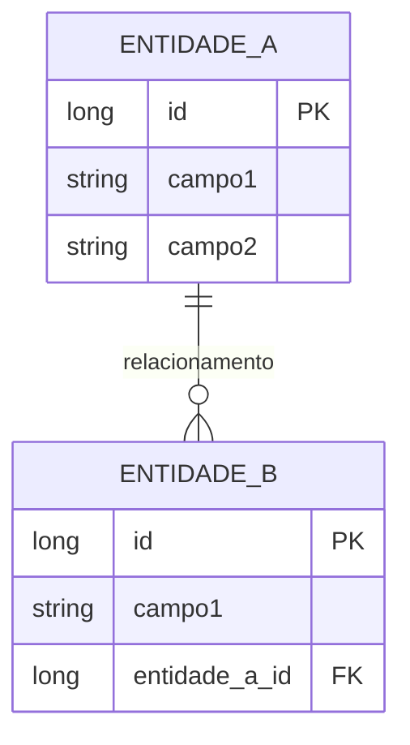

# ADR-053: Usar CDU para Documentação de Casos de Uso

## Status
Aceito

## Contexto
Os CDUs (Casos de Uso de Domínio) são documentos importantes que descrevem o fluxo e as regras de negócio de um domínio de conhecimento. Cada CDU irá subsidiar informações e restrições para elaboração dos casos de testes, por isso o fluxo e as regras de negócio devem ser bem explicadas.

Atualmente, os CDUs existem em pastas separadas, mas não há um padrão formalizado para sua estrutura e conteúdo. A literatura sobre especificação de casos de uso oferece diretrizes detalhadas que podem melhorar a qualidade e consistência dos CDUs.

## Problema
- Falta de padronização na estrutura e conteúdo dos CDUs
- Os CDUs atuais podem não conter informações suficientes para subsidiar casos de teste
- Fluxos e regras de negócio podem não estar bem explicados
- Não há diretriz formal para criação e manutenção de CDUs
- CDUs estão dispersos em diferentes módulos, dificultando reutilização e manutenção

## Decisão
Adotar padrão formal para documentação de CDUs baseado nas melhores práticas da literatura de especificação de casos de uso, incluindo centralização de todos os CDUs em um diretório único.

### Estrutura Centralizada de CDUs

**Localização**: `/home/israel/git/ia-core-apps/ia-core/CDU`

**Estrutura de Diretórios**:
```
CDU/
├── CDU001-NomeDoCasoDeUso/
│   └── README.md
├── CDU002-OutroCasoDeUso/
│   └── README.md
├── CDU003-MaisUmCasoDeUso/
│   └── README.md
└── ...
```

**Padrão de Nomenclatura**:
- CDU seguido de número sequencial de 3 dígitos
- Nome descritivo em kebab-case
- Exemplo: CDU001-GerenciamentoUsuarios
- Exemplo: CDU002-OperacoesCRUD
- Exemplo: CDU003-AutenticacaoJWT

**Conteúdo do README.md**:
- Seguir estrutura completa definida neste ADR
- Incluir todas as seções obrigatórias (metadados, descrição, atores, fluxos, regras, etc.)
- Documentar requisitos especiais e pontos de extensão
- Referenciar ADRs relacionados
- Manter histórico de revisões

**Justificativa para Centralização**:
- Facilita reutilização de CDUs entre módulos
- Centraliza documentação de casos de uso em um único local
- Evita duplicação de CDUs em diferentes módulos
- Facilita manutenção e atualização
- Melhora rastreabilidade entre casos de uso e testes
- Permite visibilidade completa de todos os casos de uso do projeto

### Estrutura Obrigatória do CDU

#### 1. Metadados
- **Nome do CDU**: Identificador único e descritivo
- **Versão**: Versão atual do documento
- **Data**: Data de criação/última atualização
- **Autor**: Responsável pela documentação
- **Status**: (Rascunho, Em Revisão, Aprovado, Obsoleto)

#### 2. Descrição do Caso de Uso
- **Descrição Breve**: Parágrafo(s) que dão uma visão geral do propósito e escopo do caso de uso, definindo claramente os objetivos finais
- **Objetivos**: Lista de objetivos específicos que o caso de uso deve alcançar
- **Escopo**: Limites claros do que está incluído e excluído

#### 3. Atores
Tabela descrevendo todos os atores envolvidos:
| Ator | Descrição | Tipo |
|------|------------|------|
| Nome do Ator | Descrição detalhada do papel | Primário/Secundário |

#### 4. Pré-condições
Estado que o sistema deve estar antes do caso de uso ser iniciado:
- **Precondição 1**: Descrição detalhada
- **Precondição 2**: Descrição detalhada

Cada pré-condição deve ser testável e verificável.

#### 5. Pós-condições
Estado que o sistema deve estar imediatamente após o caso de uso terminar:
- **Pós-condição de Sucesso**: Estado esperado quando o caso de uso termina com sucesso
- **Pós-condição de Falha**: Estado esperado quando o caso de uso falha

#### 6. Fluxo Principal (Basic Flow)
Descrição detalhada do fluxo principal usando formato Given-When-Then ou narrativa passo a passo:

**Trigger**: O caso de uso inicia quando o ator faz algo para dispará-lo

**Passos**:
1. **Dado** [estado inicial]
2. **Quando** [ação do ator]
3. **Então** [resposta do sistema]
4. ...

Cada passo deve:
- Ser numerado sequencialmente
- Usar vocabulário padrão de casos de uso (requests, sends, asks, where)
- Ser claro e conciso
- Focar no "o que" acontece, não no "como"

#### 7. Fluxos Alternativos
Fluxos alternativos significativos que contêm complexidade:

**Fluxo Alternativo X**: [Nome descritivo]
1. **Dado** [estado específico]
2. **Quando** [ação específica]
3. **Então** [resposta específica]

#### 8. Fluxos de Exceção
Fluxos para tratamento de erros e condições excepcionais:

**Fluxo de Exceção X**: [Nome descritivo]
1. **Dado** [condição de erro]
2. **Quando** [ação que causa erro]
3. **Então** [tratamento de erro]

#### 9. Fluxos de Navegação (Mestre-Detalhe)
Para casos de uso com navegação entre entidades relacionadas:

**Navegação X**: [Nome descritivo]
1. A partir de [contexto], ator acessa [destino]
2. Sistema exibe [informação]
3. Ator pode [ação opcional]

#### 10. Regras de Negócio
Regras de negócio extraídas do fluxo de eventos, listadas separadamente:

| ID | Regra de Negócio | Tipo | Aplicação |
|----|------------------|------|-----------|
| RN001 | Descrição da regra | Validação/Cálculo | Onde é aplicada |

Cada regra de negócio deve:
- Ter identificador único (RNn)
- Ser testável
- Ser referenciada no fluxo de eventos usando notação [RNn]
- Ser reutilizável entre casos de uso

**Exemplos**:
- RN001 – Cada usuário é permitido máximo de 3 tentativas de login ao sistema (configurável) antes de ser bloqueado
- RN002 – O CPF deve ser válido segundo algoritmo de validação
- RN003 – O valor total não pode exceder o limite diário configurado

#### 11. Estrutura de Dados
Diagrama ER ou descrição das entidades e relacionamentos envolvidos:

**Regra de Implementação de DTO**:
- Toda classe com sufixo *DTO deve implementar diretamente ou indiretamente a interface DTO<?>
- Quando o *DTO é relativo a uma entidade do banco de dados (estende AbstractBaseEntityDTO), deve implementar DTO<EntityType> onde EntityType é a entidade JPA correspondente
- Quando o *DTO não é relativo a uma entidade do banco de dados (DTOs de requisição, resposta, ou utilitários), deve implementar DTO<Serializable>



#### 12. Contratos de Interface
Endpoints REST ou métodos de serviço envolvidos:

**Interface REST**:
| Método | Endpoint | Descrição | Parâmetros | Retorno |
|--------|----------|------------|------------|---------|
| GET | /api/${api.version}/recurso | Descrição | params | response |

**Endpoints de Relacionamento**:
| Método | Endpoint | Descrição |
|--------|----------|------------|
| GET | /api/${api.version}/recurso/{id}/relacionamento | Lista relacionamentos |

#### 13. Requisitos Especiais
Requisitos não-funcionais específicos do caso de uso:
- Performance
- Segurança
- Usabilidade
- Conformidade

#### 14. Pontos de Extensão
Pontos onde o caso de uso pode ser estendido:
- **Extensão 1**: Descrição de quando e como pode ser estendido

#### 15. Referências
- Links para CDUs relacionados
- Links para ADRs relevantes
- Links para documentação técnica

## Justificativa

### Benefícios
1. **Consistência**: Todos os CDUs seguem a mesma estrutura
2. **Completude**: Garante que todas as informações necessárias estejam presentes
3. **Testabilidade**: Fluxos e regras bem documentados facilitam criação de testes
4. **Manutenibilidade**: Estrutura padronizada facilita atualizações
5. **Reutilização**: Regras de negócio podem ser reutilizadas entre CDUs
6. **Clareza**: Separação de fluxos e regras melhora legibilidade

### Baseado em Literatura

#### Fontes Principais
- **BusinessAnalystMentor**: Diretrizes de especificação de casos de uso com 3 níveis de detalhe (Nome e Descrição Breve, Esboço, Totalmente Detalhado)
- **arXiv (2506.13303)**: Estudo de caso industrial sobre adoção de descrições de casos de uso, mostrando que a orientação a solução tem impacto real na prática
- **RUP (Rational Unified Process)**: Template de especificação de casos de uso com Supplementary Specification para requisitos não-funcionais

#### Pesquisa arXiv - 10 Artigos Mais Relevantes

1. **Adopting Use Case Descriptions for Requirements Specification: an Industrial Case Study (2506.13303)**
   - Estudo de caso industrial com 1188 requisitos de negócio e 1192 casos de uso
   - Avaliou 273 descrições de UCs estilo template contra diretrizes de qualidade estabelecidas
   - Mostra que a orientação a solução tem impacto real na prática
   - Identifica que passos white-box e especificação explícita de atores têm efeitos marginais

2. **A USE-CASE DRIVEN APPROACH IN REQUIREMENTS ENGINEERING (cs/0402008)**
   - Abordagem orientada por casos de uso em engenharia de requisitos
   - Aplica processo de engenharia de requisitos para elicitar especificações
   - Demonstra como casos de uso especificam requisitos de sistema

3. **Validating an Approach to Formalize Use Cases (1603.08632)**
   - Abordagem para formalizar casos de uso
   - Valida a aceitação do usuário da técnica de formalização
   - Foca na validação da CNL (Controlled Natural Language) necessária

4. **Use Case Template & Sample (1307.7096)**
   - Template e amostra de caso de uso
   - Fornece estrutura padrão para documentação de casos de uso
   - Inclui exemplos de pré-condições e fluxos de eventos

5. **A use case driven approach for system level testing (1212.3060)**
   - Abordagem orientada por casos de uso para teste em nível de sistema
   - Cenários de casos de uso criados durante fase de análise
   - Benefícios incluem design de teste em estágios iniciais do ciclo de vida

6. **Requirements-Based Test Generation: A Comprehensive Survey (2505.02015)**
   - Pesquisa abrangente sobre geração de testes baseada em requisitos
   - Categoria híbrida inclui especificações que combinam múltiplos tipos de representações
   - Especificação textual combinada pode incluir diagrama de caso de uso, casos de uso textuais, mockups HTML

7. **UserTrace: User-Level Requirements Generation and Traceability (2509.11238)**
   - Geração e rastreabilidade de requisitos em nível de usuário
   - Engenheiros garantem requisitos em nível de usuário utilizando informações de negócio relacionadas
   - Abstração de intenção do usuário de código para IRs e URs

8. **A Multi-Case Study of Agile Requirements Engineering (2308.11747)**
   - Estudo de múltiplos casos sobre engenharia de requisitos ágil
   - Explora fluxo de informação entre requisitos e testes
   - Discussões semi-estruturadas sobre como casos de teste podem cumprir vários requisitos principais

9. **EARLY-STAGE REQUIREMENTS TRANSFORMATION APPROACHES: A SYSTEMATIC (2408.05221)**
   - Abordagens sistemáticas de transformação de requisitos em estágio inicial
   - Descrições de casos de uso analisadas como base para objetos
   - Abordagem circe para análise sistemática de requisitos em linguagem natural

10. **Natural Language Requirements Testability Measurement (2403.17479)**
    - Medição de testabilidade de requisitos em linguagem natural
    - Requisitos testáveis ajudam a prevenir falhas, reduzir custos de manutenção
    - Facilita realização de testes de aceitação
    - Importância de medir e quantificar testabilidade de requisitos

## Implementação

### Fase 1: Criação do ADR (Atual)
- Documentar decisão e estrutura padrão
- Comunicar equipe sobre novo padrão

### Fase 2: Atualização de CDUs Existentes
- Revisar CDUs existentes
- Adicionar seções faltantes
- Padronizar estrutura
- Priorizar CDUs mais críticos

### Fase 3: Criação de Novos CDUs
- Todos os novos CDUs devem seguir estrutura padrão
- Criar template/base para facilitar criação
- Estabelecer processo de revisão

### Fase 4: Integração com Testes
- Mapear cenários de CDU para casos de teste
- Referenciar CDUs em testes (conforme ADR-012)
- Validar cobertura de testes baseada em CDU

## Práticas Recomendadas

### Nível de Detalhe
- **Fase de Iniciação**: Nome e Descrição Breve
- **Fase de Esboço**: Diagrama, descrição breve, pré-condições, pós-condições, fluxo principal, fluxos alternativos nomeados
- **Fase de Elaboração**: Todas as seções completas

### Escrita de Fluxos
- Usar vocabulário padrão: "O Usuário solicita...", "O Sistema envia mensagem..."
- Numerar passos sequencialmente
- Usar sub-cabeçalhos para agrupar passos relacionados
- Para loops: "PARA CADA ... REPITA Passos X-Y"
- Para condicionais: "SE ... ENTÃO ... FIM SE"

### Referência de Regras de Negócio
- Extrair regras do fluxo de eventos
- Listar em seção separada
- Referenciar no fluxo usando [RNn]
- Manter regras reutilizáveis entre CDUs

### Diagramas de Apoio
- Diagrama de caso de uso (perspectiva do caso de uso)
- Visão do modelo de domínio específica do caso de uso
- Diagrama de transição de estado
- Diagrama de atividade do caso de uso

## Consequências

### Positivas
- CDUs mais completos e consistentes
- Melhor integração com casos de teste
- Facilita manutenção e atualização
- Regras de negócio reutilizáveis
- Melhor comunicação entre equipe

### Negativas
- Tempo adicional para documentação inicial
- Curva de aprendizado para nova estrutura
- Pode requerer revisão de CDUs existentes

## Referências

### Literatura
- BusinessAnalystMentor. "Use Case Specification Guideline – Best Tips & Guidance For 2026". https://businessanalystmentor.com/use-case-specification-guidelines/
- arXiv. "Adopting Use Case Descriptions for Requirements Specification: an Industrial Case Study". https://arxiv.org/abs/2506.13303
- Rational Unified Process. Use Case Specification Template
- Wikipedia. "Use Case". https://en.wikipedia.org/wiki/Use_case

### ADRs Relacionados
- ADR-012: Testing Patterns (Consideração de CDU e Comentários de Método)
- ADR-018: Use Business Rule Chain Pattern

### Documentos Internos
- Estrutura atual de CDUs em /home/israel/git/ia-core-apps/ia-core/CDU/
- ADR-012: Seção 20 - Consideração de CDU e Comentários de Método

## Histórico de Revisões

| Versão | Data | Autor | Mudanças |
|--------|------|-------|----------|
| 1.0 | 2025-06-16 | IA Core | Criação inicial do ADR |
| 2.0 | 2026-06-18 | IA Core | Adição de estrutura centralizada de CDUs em /home/israel/git/ia-core-apps/ia-core/CDU com padrão de nomenclatura e organização em pastas com README.md. Mudança de status para Aceito. |
