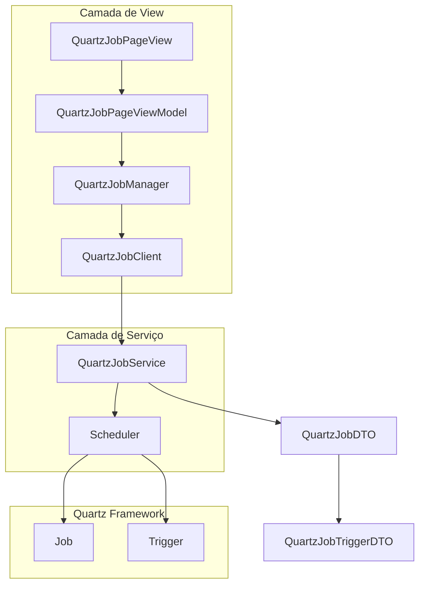

# Análise: Implementação de Gerenciamento de Jobs Quartz

## 1. Contexto Atual

### 1.1 Estrutura Existente do SchedulerConfig

O projeto `ia-core-quartz-service` já possui uma estrutura para gerenciar jobs através de `SchedulerConfig`:

**Entidades existentes:**
- `SchedulerConfig` - Entidade JPA que armazena configurações de jobs
- `SchedulerConfigDTO` - DTO para transferência de dados
- `SchedulerConfigService` - Serviço com operações CRUD e de agendamento
- `SchedulerUseCase` - Interface de use case

**Operações existentes:**
- `agendarJob()` - Agenda um job no Quartz
- `atualizarJob()` - Atualiza um job existente
- `cancelarJob()` - Cancela um job específico
- `cancelAllJobs()` - Cancela todos os jobs

### 1.2 Padrão Page/List/Form Utilizado

O projeto segue o padrão MVVM (Model-View-ViewModel) com as seguintes estruturas:

```
ia-core-quartz-view/
├── quartz/
│   ├── QuartzClient.java          # Interface cliente (chamada REST)
│   ├── QuartzManager.java         # Gerenciador (lógica de negócio)
│   ├── QuartzManagerConfig.java   # Configuração do manager
│   ├── page/
│   │   ├── SchedulerConfigPageView.java
│   │   ├── SchedulerConfigPageViewModel.java
│   │   └── SchedulerConfigPageViewModelConfig.java
│   ├── list/
│   │   └── SchedulerConfigListView.java
│   └── form/
│       ├── SchedulerConfigFormView.java
│       ├── SchedulerConfigFormViewModel.java
│       └── SchedulerConfigFormViewModelConfig.java
```

## 2. Necessidade do Usuário

O usuário deseja manipular os jobs do Quartz **diretamente** (pausar, resumir, remover) sem depender das configurações do `SchedulerConfig`. Isso permite:

- Visualizar todos os jobs ativos no scheduler
- Pausar jobs em execução
- Resumir jobs pausados
- Remover jobs diretamente
- Visualizar status dos jobs (BLOCKED, COMPLETE, ERROR, PAUSED, WAITING)

## 3. Análise de Impactos

### 3.1 Módulos Afetados

| Módulo | Impacto | Descrição |
|--------|---------|-----------|
| `ia-core-quartz-service-model` | Alto | Criar DTOs para Jobs Quartz |
| `ia-core-quartz-service` | Alto | Criar serviço de manipulação de jobs |
| `ia-core-quartz-view` | Alto | Criar page/list/form para Jobs |
| `ia-core-view` | Baixo | Possível reutilização de componentes |

### 3.2 Componentes a Criar

#### 3.2.1 Camada de Modelo (ia-core-quartz-service-model)

1. **QuartzJobDTO** - DTO para representar um job do Quartz
   - `jobKey` (JobKey) - Chave única do job
   - `jobName` (String) - Nome do job
   - `jobGroup` (String) - Grupo do job
   - `description` (String) - Descrição do job
   - `jobClass` (Class<?>) - Classe do job
   - `isDurable` (boolean) - Se o job é durável
   - `jobDataMap` (Map) - Dados do job

2. **QuartzJobTriggerDTO** - DTO para representar um trigger
   - `triggerKey` (TriggerKey)
   - `triggerName` (String)
   - `triggerGroup` (String)
   - `triggerState` (TriggerState) - Estado atual
   - `nextFireTime` (LocalDateTime)
   - `previousFireTime` (LocalDateTime)
   - `startTime` (LocalDateTime)
   - `endTime` (LocalDateTime)
   - `priority` (int)

3. **QuartzJobInstanceDTO** - DTO para instância de execução
   - `instanceId` (String)
   - `fireTime` (LocalDateTime)
   - `scheduledFireTime` (LocalDateTime)
   - `completedExecutionTime` (LocalDateTime)
   - `result` - Resultado da execução

#### 3.2.2 Camada de Serviço (ia-core-quartz-service)

1. **QuartzJobService** - Serviço para manipulação de jobs
   - `findAllJobs()` - Lista todos os jobs
   - `findJob(JobKey)` - Busca job específico
   - `pauseJob(JobKey)` - Pausa um job
   - `resumeJob(JobKey)` - Resume um job pausado
   - `deleteJob(JobKey)` - Remove um job
   - `triggerJob(JobKey)` - Executa um job imediatamente

2. **QuartzTriggerService** - Serviço para manipulação de triggers
   - `findAllTriggers()` - Lista todos os triggers
   - `pauseTrigger(TriggerKey)` - Pausa trigger
   - `resumeTrigger(TriggerKey)` - Resume trigger
   - `unscheduleJob(TriggerKey)` - Remove trigger

#### 3.2.3 Camada de Visualização (ia-core-quartz-view)

1. **QuartzJobClient** - Cliente REST
2. **QuartzJobManager** - Gerenciador
3. **QuartzJobPageView** - Página principal
4. **QuartzJobPageViewModel** - ViewModel da página
5. **QuartzJobListView** - Lista de jobs
6. **QuartzJobFormView** - Formulário de edição (para ações rápidas)

## 4. Implementações a Realizar

### 4.1 Fase 1: Modelo de Dados

```
ia-core-quartz-service-model/
├── src/main/java/com/ia/core/quartz/service/model/job/
│   ├── QuartzJobDTO.java
│   ├── QuartzJobTriggerDTO.java
│   ├── QuartzJobInstanceDTO.java
│   └── QuartzJobTranslator.java
```

### 4.2 Fase 2: Serviço

```
ia-core-quartz-service/
├── src/main/java/com/ia/core/quartz/service/
│   ├── QuartzJobService.java
│   └── QuartzJobServiceConfig.java
```

### 4.3 Fase 3: View

```
ia-core-quartz-view/
├── src/main/java/com/ia/core/quartz/view/job/
│   ├── QuartzJobClient.java
│   ├── QuartzJobManager.java
│   ├── QuartzJobManagerConfig.java
│   ├── page/
│   │   ├── QuartzJobPageView.java
│   │   ├── QuartzJobPageViewModel.java
│   │   └── QuartzJobPageViewModelConfig.java
│   ├── list/
│   │   └── QuartzJobListView.java
│   └── form/
│       ├── QuartzJobFormView.java
│       ├── QuartzJobFormViewModel.java
│       └── QuartzJobFormViewModelConfig.java
```

## 5. Operações do QuartzScheduler

O Quartz Scheduler fornece as seguintes operações que serão expostas:

| Operação | Descrição | Necessária |
|----------|-----------|------------|
| `scheduler.getJobKeys(groupMatcher)` | Lista jobs | Sim |
| `scheduler.getTriggersOfJob(jobKey)` | Triggers de um job | Sim |
| `scheduler.getTriggerState(triggerKey)` | Estado do trigger | Sim |
| `scheduler.pauseJob(jobKey)` | Pausa job | Sim |
| `scheduler.pauseTrigger(triggerKey)` | Pausa trigger | Sim |
| `scheduler.resumeJob(jobKey)` | Resume job | Sim |
| `scheduler.resumeTrigger(triggerKey)` | Resume trigger | Sim |
| `scheduler.deleteJob(jobKey)` | Remove job | Sim |
| `scheduler.unscheduleJob(triggerKey)` | Remove trigger | Sim |
| `scheduler.triggerJob(jobKey)` | Executa job agora | Sim |
| `scheduler.getCurrentlyExecutingJobs()` | Jobs em execução | Sim |
| `scheduler.getJobDetail(jobKey)` | Detalhes do job | Sim |

## 6. Considerações de Segurança

1. **Permissões** - Criar roles específicas para manipulação de jobs:
   - `JOB_VIEW` - Visualizar jobs
   - `JOB_MANAGE` - Pausar/Resumir jobs
   - `JOB_ADMIN` - Remover jobs

2. **Auditoria** - Registrar operações sensíveis (delete, pause)

3. **Validação** - Não permitir remoção de jobs do sistema

## 7. Diagrama de Classes



## 8. Resumo de Impactos

| Item | Impacto | Esforço |
|------|---------|---------|
| Criar DTOs | Médio | 1 dia |
| Criar QuartzJobService | Médio | 2 dias |
| Criar page/list/form | Alto | 3 dias |
| Testes unitários | Médio | 1 dia |
| Integração | Médio | 1 dia |

**Total estimado: aproximadamente 8 dias de desenvolvimento**
