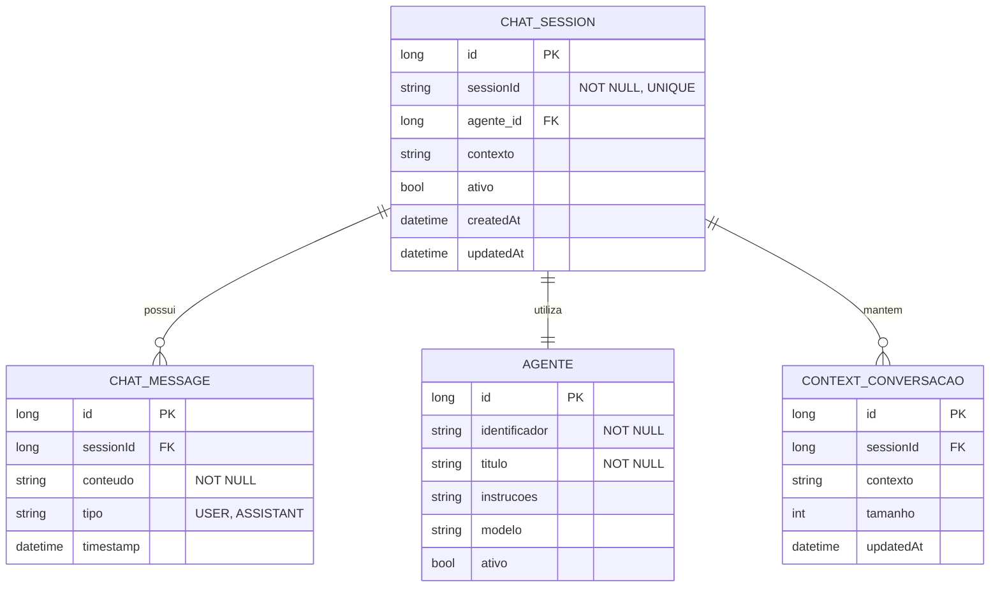

# CDU - Conversação Chat

## 1. Metadados
- **Nome do CDU**: Conversação Chat
- **Versão**: 1.0
- **Data**: 2025-06-16
- **Autor**: IA Core
- **Status**: Em Revisão

## 2. Descrição do Caso de Uso

### 2.1. Descrição Breve
O caso de uso "Conversação Chat" permite o gerenciamento de conversações com modelos de linguagem no sistema ia-core, incluindo criação de sessões, envio de mensagens, e gerenciamento de contexto. Este módulo permite que usuários interajam com agentes LLM de forma conversacional.

### 2.2. Objetivos
- Criar e gerenciar sessões de chat
- Enviar mensagens para agentes LLM
- Manter contexto de conversação
- Continuar conversações existentes
- Encerrar sessões de chat
- Exportar conversações

### 2.3. Escopo
**Incluído**:
- Criação de sessões de chat
- Envio de mensagens
- Gerenciamento de contexto
- Continuação de conversações
- Encerramento de sessões
- Exportação de conversações

**Excluído**:
- Implementação de agentes LLM (tratado em CDU separado)
- Implementação de templates (tratado em CDU separado)
- Análise avançada de performance de conversações

## 3. Atores

| Ator | Descrição | Tipo |
|------|------------|------|
| Usuário Final | Usuário que interage com agentes LLM | Primário |
| Sistema | Sistema que gerencia sessões e contexto | Sistema |

## 4. Pré-condições

### 4.1. Para Iniciar Sessão de Chat
- Ator deve estar autenticado
- Agente deve existir e estar ativo

### 4.2. Para Enviar Mensagem
- Ator deve estar autenticado
- Sessão de chat deve existir e estar ativa
- Agente deve estar disponível

### 4.3. Para Encerrar Sessão
- Ator deve estar autenticado
- Sessão de chat deve existir

## 5. Pós-condições

### 5.1. Pós-condição de Sucesso (Iniciar Sessão)
- Sessão de chat é criada
- Contexto é inicializado
- Sistema retorna sessão criada

### 5.2. Pós-condição de Sucesso (Enviar Mensagem)
- Mensagem é adicionada ao contexto
- Sistema processa prompt
- Sistema exibe resposta ao ator

### 5.3. Pós-condição de Sucesso (Encerrar Sessão)
- Contexto é salvo
- Recursos são liberados
- Sistema confirma encerramento

### 5.4. Pós-condição de Falha (Iniciar Sessão)
- Sessão não é criada
- Erros são identificados e reportados
- Sistema exibe mensagem de erro

## 6. Fluxo Principal (Basic Flow)

### 6.1. Fluxo: Iniciar Sessão de Chat

**Trigger**: O caso de uso inicia quando o ator acessa a interface de chat.

**Passos**:
1. **Dado** ator autenticado
2. **Dado** agente existe e está ativo [RN001]
3. **Quando** ator acessa interface de chat
4. **Quando** ator seleciona agente desejado
5. **Então** sistema cria nova sessão de chat
6. **Então** sistema gera identificador único da sessão
7. **Então** sistema inicializa contexto da conversação
8. **Então** sistema retorna sessão criada

### 6.2. Fluxo: Enviar Mensagem

**Trigger**: O caso de uso inicia quando o ator envia mensagem.

**Passos**:
1. **Dado** ator autenticado
2. **Dado** sessão de chat existe e está ativa
3. **Dado** agente está disponível
4. **Quando** ator digita mensagem
5. **Quando** ator clica em enviar
6. **Então** sistema valida mensagem [RN006]
7. **Se** mensagem válida
    - **Então** sistema adiciona mensagem ao contexto
    - **Então** sistema processa prompt com template do agente
    - **Então** sistema envia prompt ao modelo LLM
    - **Então** sistema recebe resposta do modelo
    - **Então** sistema adiciona resposta ao contexto
    - **Então** sistema exibe resposta ao ator
8. **Se** mensagem inválida
    - **Então** sistema exibe mensagem de erro
    - **Então** fluxo é interrompido

### 6.3. Fluxo: Continuar Conversação

**Trigger**: O caso de uso inicia quando o ator envia nova mensagem em sessão existente.

**Passos**:
1. **Dado** ator autenticado
2. **Dado** sessão de chat existe e está ativa
3. **Quando** ator envia nova mensagem
4. **Então** sistema recupera contexto da sessão
5. **Então** sistema valida tamanho do contexto [RN005]
6. **Se** contexto válido
    - **Então** sistema adiciona nova mensagem ao contexto
    - **Então** sistema processa prompt com contexto completo
    - **Então** sistema envia ao modelo LLM
    - **Então** sistema recebe e exibe resposta
7. **Se** contexto muito grande
    - **Então** sistema resume contexto ou solicita nova sessão
    - **Então** ator decide continuar com contexto resumido ou iniciar nova sessão

### 6.4. Fluxo: Encerrar Sessão

**Trigger**: O caso de uso inicia quando o ator encerra conversação.

**Passos**:
1. **Dado** ator autenticado
2. **Dado** sessão de chat existe
3. **Quando** ator clica em encerrar conversação
4. **Então** sistema salva contexto da sessão
5. **Então** sistema libera recursos
6. **Então** sistema confirma encerramento

## 7. Fluxos Alternativos

### 7.1. Fluxo Alternativo: Erro ao Criar Sessão

1. **Dado** sistema está criando sessão de chat
2. **Quando** sistema detecta erro
3. **Então** sistema exibe mensagem de erro
4. **Então** fluxo é interrompido

### 7.2. Fluxo Alternativo: Modelo LLM Indisponível

1. **Dado** sistema está processando mensagem
2. **Quando** sistema detecta modelo indisponível
3. **Então** sistema exibe mensagem de erro
4. **Então** fluxo é interrompido

### 7.3. Fluxo Alternativo: Timeout na Resposta

1. **Dado** sistema está aguardando resposta do modelo
2. **Quando** sistema detecta timeout [RN004]
3. **Então** sistema exibe mensagem de timeout
4. **Então** ator pode tentar novamente

### 7.4. Fluxo Alternativo: Contexto Muito Grande

1. **Dado** sistema está validando contexto
2. **Quando** sistema detecta contexto muito grande [RN005]
3. **Então** sistema resume contexto ou solicita nova sessão
4. **Então** ator decide continuar com contexto resumido ou iniciar nova sessão

## 8. Fluxos de Exceção

### 8.1. Fluxo de Exceção: Agente Inválido

1. **Dado** sistema está validando início de sessão
2. **Quando** sistema detecta agente inválido [RN001]
3. **Então** sistema exibe mensagem de erro indicando que agente não é válido
4. **Então** sistema impede criação de sessão
5. **Então** ator deve selecionar agente válido antes de continuar

### 8.2. Fluxo de Exceção: Contexto Excedido

1. **Dado** sistema está validando contexto
2. **Quando** sistema detecta contexto excedido [RN005]
3. **Então** sistema exibe mensagem de erro indicando que contexto é muito grande
4. **Então** sistema impede envio de mensagem
5. **Então** ator deve iniciar nova sessão antes de continuar

### 8.3. Fluxo de Exceção: Mensagem Vazia

1. **Dado** sistema está validando mensagem
2. **Quando** sistema detecta mensagem vazia [RN006]
3. **Então** sistema exibe mensagem de erro indicando que mensagem não pode ser vazia
4. **Então** sistema impede envio de mensagem
5. **Então** ator deve digitar mensagem antes de continuar

### 8.4. Fluxo de Exceção: Limite de Sessões Excedido

1. **Dado** sistema está validando criação de sessão
2. **Quando** sistema detecta limite de sessões excedido [RN003]
3. **Então** sistema exibe mensagem de erro indicando que limite de sessões foi atingido
4. **Então** sistema impede criação de sessão
5. **Então** ator deve encerrar sessão existente antes de continuar

## 9. Fluxos de Navegação (Mestre-Detalhe)

### 9.1. Navegação: Visualizar Histórico de Conversação

1. A partir da interface de chat, o ator clica em "Histórico"
2. Sistema exibe lista de sessões anteriores
3. Ator seleciona sessão desejada
4. Sistema exibe histórico completo da conversação

### 9.2. Navegação: Exportar Conversação

1. A partir da interface de chat, o ator clica em "Exportar"
2. Sistema exibe opções de formato (PDF, JSON, TXT)
3. Ator seleciona formato desejado
4. Sistema gera arquivo de exportação
5. Sistema disponibiliza arquivo para download

## 10. Regras de Negócio

| ID | Regra de Negócio | Tipo | Aplicação |
|----|------------------|------|-----------|
| RN001 | Uma sessão deve estar associada a um agente válido | Validação | Criação de sessão |
| RN002 | O contexto da conversação deve ser mantido por até 24 horas | Validação | Gerenciamento de contexto |
| RN003 | O sistema deve suportar até 100 sessões simultâneas por usuário | Validação | Criação de sessão |
| RN004 | Respostas do modelo devem ser retornadas em menos de 10 segundos | Performance | Envio de mensagem |
| RN005 | O sistema deve limitar o tamanho do contexto para evitar timeout | Validação | Gerenciamento de contexto |
| RN006 | Mensagens vazias não devem ser enviadas | Validação | Envio de mensagem |

## 11. Estrutura de Dados

## 12. Contratos de Interface

### 12.1. Interface REST

| Método | Endpoint                          | Descrição                      |
|--------|-----------------------------------|--------------------------------|
| POST   | `/api/${api.version}/llm/chat`               | Inicia nova sessão de chat     |
| GET    | `/api/${api.version}/llm/chat/{sessionId}`    | Busca sessão por ID            |
| POST   | `/api/${api.version}/llm/chat/{sessionId}/ask` | Envia mensagem                |
| DELETE | `/api/${api.version}/llm/chat/{sessionId}`    | Encerra sessão                 |
| GET    | `/api/${api.version}/llm/chat/{sessionId}/messages` | Lista mensagens da sessão |
| GET    | `/api/${api.version}/llm/chat/{sessionId}/export` | Exporta conversação        |
| GET    | `/api/${api.version}/llm/chat/historico`      | Lista sessões anteriores       |

### 12.2. Endpoints de WebSocket

| Endpoint          | Descrição                 |
|-------------------|---------------------------|
| `/ws/chat/{sessionId}` | WebSocket para mensagens em tempo real |

## 13. Requisitos Especiais

### 13.1. Segurança
- Autenticação obrigatória para acessar chat
- Validação de permissões para operações de chat
- Logs de todas as mensagens para auditoria

### 13.2. Performance
- Respostas do modelo devem ser retornadas em menos de 10 segundos [RN004]
- Cache de contexto para performance
- Validação de tamanho de contexto para evitar timeout [RN005]

### 13.3. Conformidade
- Validação de agente [RN001]
- Validação de limite de sessões [RN003]
- Validação de mensagens vazias [RN006]
- Manutenção de contexto por até 24 horas [RN002]

## 14. Pontos de Extensão

### 14.1. Análise de Performance de Conversações
- **Extensão 1**: Monitoramento de performance de conversações
- **Quando**: Requisito de análise de performance
- **Como**: Implementar coleta de métricas de conversações

### 14.2. Integração com Ontologias
- **Extensão 2**: Integração direta com ontologias OWL
- **Quando**: Requisito de agentes que usam ontologias
- **Como**: Integrar conversações com ontologias disponíveis

### 14.3. Suporte a Múltiplos Modelos
- **Extensão 3**: Suporte a múltiplos modelos LLM em uma conversação
- **Quando**: Requisito de conversações com múltiplos modelos
- **Como**: Implementar suporte a múltiplos modelos por sessão

## 15. Referências

### ADRs Relacionados
- ADR-012: Testing Patterns (Consideração de CDU e Comentários de Método)
- ADR-053: Usar CDU para Documentação de Casos de Uso

### CDUs Relacionados
- Manter Agente: Gerenciamento de agentes LLM
- Manter Template: Gerenciamento de templates de prompt
- Manter Ontologia: Gerenciamento de ontologias OWL

### Documentação Técnica
- Documentação de chat no ia-core
- Padrões de configuração de agentes LLM
- Configuração de WebSocket para mensagens em tempo real
