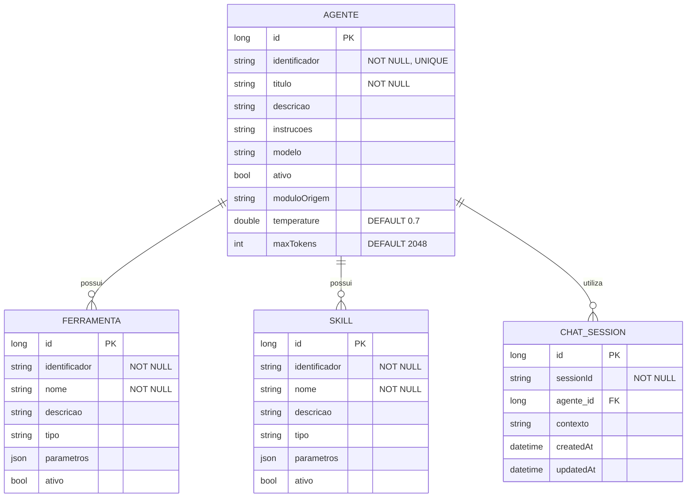

# CDU - Manter Agente

## 1. Metadados
- **Nome do CDU**: Manter Agente
- **Versão**: 1.0
- **Data**: 2025-06-16
- **Autor**: IA Core
- **Status**: Em Revisão

## 2. Descrição do Caso de Uso

### 2.1. Descrição Breve
O caso de uso "Manter Agente" permite o gerenciamento de agentes LLM no sistema ia-core, incluindo o cadastro, atualização, consulta e exclusão de agentes. Este módulo permite que o sistema orquestre ferramentas e habilidades especializadas para interação com modelos de linguagem.

### 2.2. Objetivos
- Cadastrar e gerenciar agentes LLM
- Configurar parâmetros LLM (temperature, maxTokens)
- Associar ferramentas e habilidades a agentes
- Consultar agentes disponíveis
- Validar configurações de agentes

### 2.3. Escopo
**Incluído**:
- Cadastro e gerenciamento de agentes
- Configuração de parâmetros LLM
- Associação de ferramentas e habilidades
- Consulta de agentes com filtros
- Validação de campos e configurações

**Excluído**:
- Implementação de ferramentas (tratado em CDU separado)
- Implementação de habilidades (tratado em CDU separado)
- Execução de conversações (tratado em CDU separado)

## 3. Atores

| Ator | Descrição | Tipo |
|------|------------|------|
| Administrador | Usuário com acesso total ao sistema | Primário |
| Usuário Final | Usuário que utiliza agentes para interações | Secundário |

## 4. Pré-condições

### 4.1. Para Cadastrar Agente
- Ator deve estar autenticado
- Ator deve ter permissão para gerenciar agentes
- Ferramentas e habilidades devem estar disponíveis

### 4.2. Para Atualizar Agente
- Ator deve estar autenticado
- Ator deve ter permissão para gerenciar agentes
- Agente deve existir

### 4.3. Para Excluir Agente
- Ator deve estar autenticado
- Ator deve ter permissão para excluir agentes
- Agente deve existir

## 5. Pós-condições

### 5.1. Pós-condição de Sucesso (Cadastrar Agente)
- Agente é registrado no sistema
- Ferramentas e habilidades são associadas
- Sistema exibe mensagem de sucesso

### 5.2. Pós-condição de Sucesso (Atualizar Agente)
- Agente é atualizado no sistema
- Associações são atualizadas
- Sistema exibe mensagem de sucesso

### 5.3. Pós-condição de Sucesso (Excluir Agente)
- Agente é removido do sistema
- Associações são removidas
- Sistema exibe mensagem de sucesso

### 5.4. Pós-condição de Falha (Cadastrar Agente)
- Agente não é registrado
- Erros são identificados e reportados
- Sistema exibe mensagem de erro

## 6. Fluxo Principal (Basic Flow)

### 6.1. Fluxo: Cadastrar Agente

**Trigger**: O caso de uso inicia quando o ator acessa a opção de cadastrar novo agente.

**Passos**:
1. **Dado** ator autenticado com permissão para gerenciar agentes
2. **Dado** ferramentas e habilidades estão disponíveis
3. **Quando** ator acessa "Cadastrar Agente"
4. **Então** sistema exibe formulário de cadastro
5. **Quando** ator preenche identificador [RN001]
6. **Quando** ator preenche título [RN002]
7. **Quando** ator preenche descrição [RN003]
8. **Quando** ator preenche modelo [RN004]
9. **Quando** ator configura temperature [RN005]
10. **Quando** ator configura maxTokens [RN006]
11. **Quando** ator seleciona ferramentas disponíveis
12. **Quando** ator seleciona habilidades disponíveis
13. **Quando** ator confirma cadastro
14. **Então** sistema valida dados
    - Verifica se identificador já está cadastrado [RN001]
    - Verifica se campos obrigatórios estão preenchidos
    - Valida tamanho dos campos
    - Verifica se agente tem pelo menos uma ferramenta ou habilidade [RN007]
15. **Se** validação bem-sucedida
    - **Então** sistema salva agente no banco de dados
    - **Então** sistema exibe mensagem de sucesso
16. **Se** validação falha
    - **Então** sistema exibe mensagem de erro
    - **Então** fluxo retorna ao passo 5

### 6.2. Fluxo: Consultar Agente

**Trigger**: O caso de uso inicia quando o ator acessa a opção de consultar agentes.

**Passos**:
1. **Dado** ator autenticado com permissão para visualizar agentes
2. **Quando** ator acessa "Consultar Agentes"
3. **Então** sistema exibe lista de agentes com paginação
4. **Quando** ator filtra por identificador, título, status
5. **Então** sistema atualiza lista com filtros aplicados
6. **Quando** ator clica no agente desejado
7. **Então** sistema exibe detalhes do agente
8. **Então** sistema exibe ferramentas e habilidades associadas

### 6.3. Fluxo: Atualizar Agente

**Trigger**: O caso de uso inicia quando o ator acessa a opção de editar agente.

**Passos**:
1. **Dado** ator autenticado com permissão para gerenciar agentes
2. **Dado** agente existe
3. **Quando** ator acessa detalhes do agente
4. **Quando** ator clica em "Editar"
5. **Então** sistema exibe formulário preenchido
6. **Quando** ator modifica campos desejados
7. **Quando** ator clica em "Salvar"
8. **Então** sistema valida dados
9. **Então** sistema atualiza agente
10. **Então** sistema exibe mensagem de sucesso

### 6.4. Fluxo: Excluir Agente

**Trigger**: O caso de uso inicia quando o ator acessa a opção de excluir agente.

**Passos**:
1. **Dado** ator autenticado com permissão para excluir agentes
2. **Dado** agente existe
3. **Quando** ator acessa detalhes do agente
4. **Quando** ator clica em "Excluir"
5. **Então** sistema solicita confirmação
6. **Quando** ator confirma exclusão
7. **Então** sistema verifica se agente está em uso [RN008]
8. **Se** agente não está em uso
    - **Então** sistema exclui agente
    - **Então** sistema exibe mensagem de sucesso
9. **Se** agente está em uso
    - **Então** sistema exibe mensagem de erro
    - **Então** fluxo é interrompido

## 7. Fluxos Alternativos

### 7.1. Fluxo Alternativo: Agente com Identificador Duplicado

1. **Dado** sistema está validando cadastro de agente
2. **Quando** sistema detecta identificador duplicado [RN001]
3. **Então** sistema exibe mensagem de erro indicando que identificador já está cadastrado
4. **Então** fluxo retorna ao passo de preenchimento

### 7.2. Fluxo Alternativo: Agente em Uso

1. **Dado** sistema está validando exclusão de agente
2. **Quando** sistema detecta que agente está em uso [RN008]
3. **Então** sistema exibe mensagem de erro indicando que agente não pode ser excluído
4. **Então** fluxo é interrompido

### 7.3. Fluxo Alternativo: Validação de Campos

1. **Dado** sistema está validando cadastro de agente
2. **Quando** sistema detecta campos inválidos
3. **Então** sistema exibe lista de campos com erros
4. **Então** ator deve corrigir os campos antes de salvar

## 8. Fluxos de Exceção

### 8.1. Fluxo de Exceção: Identificador Inválido

1. **Dado** sistema está validando cadastro de agente
2. **Quando** sistema detecta identificador inválido [RN001]
3. **Então** sistema exibe mensagem de erro indicando que identificador deve ter entre 2 e 100 caracteres
4. **Então** sistema impede cadastro
5. **Então** ator deve corrigir identificador antes de continuar

### 8.2. Fluxo de Exceção: Título Inválido

1. **Dado** sistema está validando cadastro de agente
2. **Quando** sistema detecta título inválido [RN002]
3. **Então** sistema exibe mensagem de erro indicando que título deve ter entre 2 e 200 caracteres
4. **Então** sistema impede cadastro
5. **Então** ator deve corrigir título antes de continuar

### 8.3. Fluxo de Exceção: Temperature Inválido

1. **Dado** sistema está validando cadastro de agente
2. **Quando** sistema detecta temperature inválido [RN005]
3. **Então** sistema exibe mensagem de erro indicando que temperature deve estar entre 0.0 e 2.0
4. **Então** sistema impede cadastro
5. **Então** ator deve corrigir temperature antes de continuar

### 8.4. Fluxo de Exceção: MaxTokens Inválido

1. **Dado** sistema está validando cadastro de agente
2. **Quando** sistema detecta maxTokens inválido [RN006]
3. **Então** sistema exibe mensagem de erro indicando que maxTokens deve ser positivo
4. **Então** sistema impede cadastro
5. **Então** ator deve corrigir maxTokens antes de continuar

### 8.5. Fluxo de Exceção: Agente sem Ferramentas ou Habilidades

1. **Dado** sistema está validando cadastro de agente
2. **Quando** sistema detecta que agente não tem ferramentas ou habilidades [RN007]
3. **Então** sistema exibe mensagem de erro indicando que agente deve ter pelo menos uma ferramenta ou habilidade
4. **Então** sistema impede cadastro
5. **Então** ator deve adicionar pelo menos uma ferramenta ou habilidade antes de continuar

## 9. Fluxos de Navegação (Mestre-Detalhe)

### 9.1. Navegação: Manter Ferramentas do Agente

1. A partir do formulário de agente, o ator clica em "Adicionar Ferramenta"
2. Sistema exibe diálogo de ferramentas disponíveis
3. Ator seleciona as ferramentas desejadas
4. Ator confirma
5. Sistema adiciona ferramentas à lista do agente
6. Ator pode remover ferramentas da lista
7. Ao salvar o agente, as ferramentas também são persistidas

### 9.2. Navegação: Manter Habilidades do Agente

1. A partir do formulário de agente, o ator clica em "Adicionar Habilidade"
2. Sistema exibe diálogo de habilidades disponíveis
3. Ator seleciona as habilidades desejadas
4. Ator confirma
5. Sistema adiciona habilidades à lista do agente

## 10. Regras de Negócio

| ID | Regra de Negócio | Tipo | Aplicação |
|----|------------------|------|-----------|
| RN001 | O campo identificador é obrigatório e deve ter entre 2 e 100 caracteres | Validação | Cadastro de agente |
| RN002 | O campo título é obrigatório e deve ter entre 2 e 200 caracteres | Validação | Cadastro de agente |
| RN003 | O campo descrição pode ter até 1000 caracteres | Validação | Cadastro de agente |
| RN004 | O campo modelo pode ter até 100 caracteres | Validação | Cadastro de agente |
| RN005 | O campo temperature deve estar entre 0.0 e 2.0 | Validação | Configuração de parâmetros LLM |
| RN006 | O campo maxTokens deve ser positivo | Validação | Configuração de parâmetros LLM |
| RN007 | Um agente deve ter pelo menos uma ferramenta ou habilidade | Validação | Cadastro de agente |
| RN008 | Agentes em uso não podem ser excluídos | Validação | Exclusão de agente |

## 11. Estrutura de Dados

## 12. Contratos de Interface

### 12.1. Interface REST

| Método | Endpoint                          | Descrição                      |
|--------|-----------------------------------|--------------------------------|
| GET    | `/api/${api.version}/llm/agentes`            | Lista agentes com paginação    |
| GET    | `/api/${api.version}/llm/agentes/{id}`        | Busca agente por ID            |
| POST   | `/api/${api.version}/llm/agentes`            | Cadastra novo agente           |
| PUT    | `/api/${api.version}/llm/agentes/{id}`        | Atualiza agente                |
| DELETE | `/api/${api.version}/llm/agentes/{id}`        | Exclui agente                  |
| GET    | `/api/${api.version}/llm/agentes/{id}/ferramentas` | Lista ferramentas do agente |
| POST   | `/api/${api.version}/llm/agentes/{id}/ferramentas` | Adiciona ferramenta ao agente |
| DELETE | `/api/${api.version}/llm/agentes/{id}/ferramentas/{ferramentaId}` | Remove ferramenta do agente |
| GET    | `/api/${api.version}/llm/agentes/{id}/skills` | Lista habilidades do agente    |
| POST   | `/api/${api.version}/llm/agentes/{id}/skills` | Adiciona habilidade ao agente  |
| DELETE | `/api/${api.version}/llm/agentes/{id}/skills/{skillId}` | Remove habilidade do agente |

### 12.2. Endpoints de Chat

| Método | Endpoint                              | Descrição                 |
|--------|---------------------------------------|---------------------------|
| POST   | `/api/${api.version}/llm/chat/{agenteId}`         | Inicia conversação        |
| POST   | `/api/${api.version}/llm/chat/{sessionId}/ask`    | Envia mensagem            |
| GET    | `/api/${api.version}/llm/chat/{sessionId}`        | Busca sessão por ID       |

## 13. Requisitos Especiais

### 13.1. Segurança
- Configuração de agentes requer permissões específicas
- Validação de permissões para operações destrutivas
- Logs de todas as operações para auditoria

### 13.2. Performance
- Consulta de agentes deve ser otimizada
- Cache de configurações de agentes para performance
- Validação de associações deve ser eficiente

### 13.3. Conformidade
- Validação de identificador [RN001]
- Validação de título [RN002]
- Validação de temperature [RN005]
- Validação de maxTokens [RN006]
- Validação de ferramentas e habilidades [RN007]

## 14. Pontos de Extensão

### 14.1. Implementação de Agentes Avançados
- **Extensão 1**: Agentes com múltiplos modelos
- **Quando**: Requisito de agentes com múltiplos modelos
- **Como**: Implementar suporte a múltiplos modelos por agente

### 14.2. Análise de Performance de Agentes
- **Extensão 2**: Monitoramento de performance de agentes
- **Quando**: Requisito de análise de performance
- **Como**: Implementar coleta de métricas de uso de agentes

### 14.3. Integração com Templates
- **Extensão 3**: Integração direta com templates de prompt
- **Quando**: Requisito de agentes que usam templates
- **Como**: Integrar agentes com templates disponíveis

## 15. Referências

### ADRs Relacionados
- ADR-012: Testing Patterns (Consideração de CDU e Comentários de Método)
- ADR-053: Usar CDU para Documentação de Casos de Uso

### CDUs Relacionados
- Manter Ferramenta: Gerenciamento de ferramentas disponíveis
- Manter Skill: Gerenciamento de habilidades disponíveis
- Conversação-Chat: Conversação com agentes LLM
- Manter Template: Gerenciamento de templates de prompt

### Documentação Técnica
- Documentação de agentes no ia-core
- Padrões de configuração de agentes LLM
- Configuração de parâmetros LLM
