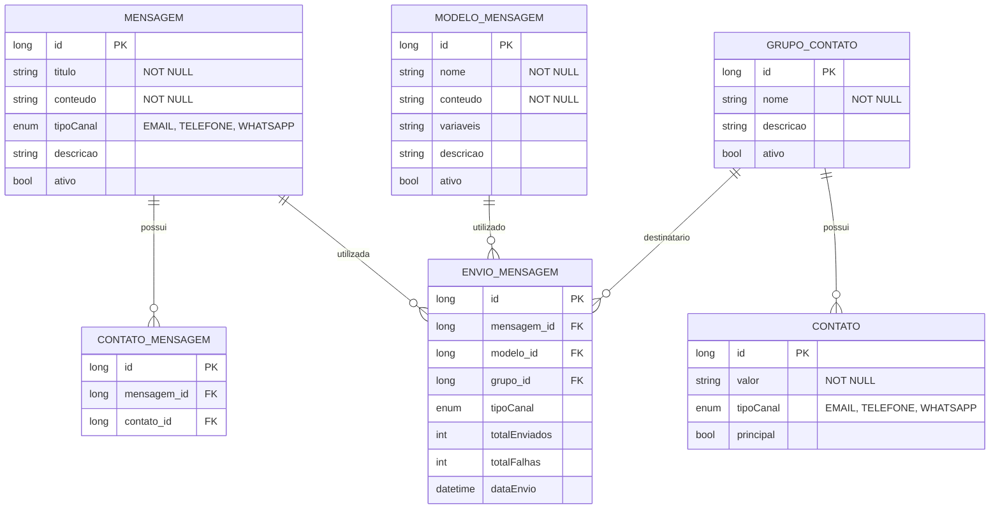

# CDU - Manter Communication

## 1. Metadados
- **Nome do CDU**: Manter Communication
- **Versão**: 1.0
- **Data**: 2025-06-16
- **Autor**: IA Core
- **Status**: Em Revisão

## 2. Descrição do Caso de Uso

### 2.1. Descrição Breve
O caso de uso "Manter Communication" permite o gerenciamento de comunicação no sistema ia-core, incluindo o cadastro de mensagens, modelos de mensagem, grupos de contatos e envio de mensagens através de diferentes canais (EMAIL, TELEFONE, WHATSAPP). Este módulo permite que o sistema envie notificações e comunicações para usuários e grupos de usuários de forma automatizada.

### 2.2. Objetivos
- Cadastrar e gerenciar mensagens de comunicação
- Criar e manter modelos de mensagem reutilizáveis
- Gerenciar grupos de contatos para envio em massa
- Enviar mensagens através de múltiplos canais
- Manter histórico de envios de mensagens

### 2.3. Escopo
**Incluído**:
- Cadastro de mensagens
- Cadastro de modelos de mensagem
- Cadastro de grupos de contatos
- Envio de mensagens (EMAIL, TELEFONE, WHATSAPP)
- Histórico de envios

**Excluído**:
- Integração com provedores externos de SMS/WhatsApp
- Processamento de respostas de mensagens
- Análise de métricas de engajamento

## 3. Atores

| Ator          | Descrição                                    | Tipo |
|---------------|----------------------------------------------|------|
| Administrador | Usuário com acesso total ao sistema          | Primário |
| Comunicador   | Usuário responsável pelo envio de mensagens  | Primário |
| Usuário       | Usuário comum que pode visualizar mensagens   | Secundário |

## 4. Pré-condições

### 4.1. Para Cadastrar Mensagem
- Ator deve estar autenticado
- Ator deve ter permissão para cadastrar mensagens

### 4.2. Para Cadastrar Modelo de Mensagem
- Ator deve estar autenticado
- Ator deve ter permissão para cadastrar modelos

### 4.3. Para Cadastrar Grupo de Contatos
- Ator deve estar autenticado
- Ator deve ter permissão para cadastrar grupos
- Deve haver contatos cadastrados no sistema

### 4.4. Para Enviar Mensagem
- Ator deve estar autenticado
- Ator deve ter permissão para enviar mensagens
- Deve haver mensagens ou modelos cadastrados
- Deve haver destinatários válidos

## 5. Pós-condições

### 5.1. Pós-condição de Sucesso (Cadastrar Mensagem)
- Mensagem é salva no banco de dados
- Mensagem fica disponível para envio
- Sistema exibe mensagem de sucesso

### 5.2. Pós-condição de Sucesso (Cadastrar Modelo)
- Modelo é salvo no banco de dados
- Modelo fica disponível para uso
- Sistema exibe mensagem de sucesso

### 5.3. Pós-condição de Sucesso (Cadastrar Grupo)
- Grupo é salvo no banco de dados
- Contatos são associados ao grupo
- Sistema exibe mensagem de sucesso

### 5.4. Pós-condição de Sucesso (Enviar Mensagem)
- Mensagens são enviadas de forma assíncrona [RN006]
- Histórico de envio é registrado [RN007]
- Sistema exibe relatório de envio

### 5.5. Pós-condição de Falha (Enviar Mensagem)
- Nenhuma mensagem é enviada
- Erros são identificados e reportados
- Sistema exibe lista de falhas

## 6. Fluxo Principal (Basic Flow)

### 6.1. Fluxo: Cadastrar Mensagem

**Trigger**: O caso de uso inicia quando o ator acessa a opção "Cadastrar Mensagem" no menu.

**Passos**:
1. **Dado** ator autenticado com permissão para cadastrar mensagens
2. **Quando** ator acessa "Cadastrar Mensagem" no menu
3. **Então** sistema exibe formulário de cadastro de mensagem
4. **Quando** ator preenche dados obrigatórios (título, conteúdo, tipo de canal) [RN001, RN002, RN003]
5. **Quando** ator preenche dados opcionais (descrição, variáveis)
6. **Quando** ator confirma cadastro
7. **Então** sistema valida dados:
   - Verifica se título já está cadastrado
   - Verifica se conteúdo está dentro dos padrões [RN001, RN002]
8. **Se** validação bem-sucedida
   - **Então** sistema salva mensagem no banco de dados
   - **Então** sistema exibe mensagem de sucesso e dados cadastrados
9. **Se** validação falha
   - **Então** sistema exibe mensagem de erro
   - **Então** fluxo retorna ao passo 4

### 6.2. Fluxo: Cadastrar Modelo de Mensagem

**Trigger**: O caso de uso inicia quando o ator acessa a opção "Cadastrar Modelo" no menu.

**Passos**:
1. **Dado** ator autenticado com permissão para cadastrar modelos
2. **Quando** ator acessa "Cadastrar Modelo" no menu
3. **Então** sistema exibe formulário de cadastro de modelo
4. **Quando** ator preenche dados obrigatórios (nome, conteúdo)
5. **Quando** ator define variáveis do modelo (ex: {{nome}}, {{data}}) [RN005]
6. **Quando** ator confirma cadastro
7. **Então** sistema valida modelo:
   - Verifica se nome já está cadastrado
   - Verifica se variáveis estão corretamente formatadas [RN005]
8. **Se** validação bem-sucedida
   - **Então** sistema salva modelo no banco de dados
   - **Então** sistema exibe mensagem de sucesso
9. **Se** validação falha
   - **Então** sistema exibe mensagem de erro
   - **Então** fluxo retorna ao passo 4

### 6.3. Fluxo: Cadastrar Grupo de Contatos

**Trigger**: O caso de uso inicia quando o ator acessa a opção "Cadastrar Grupo" no menu.

**Passos**:
1. **Dado** ator autenticado com permissão para cadastrar grupos
2. **Dado** há contatos cadastrados no sistema
3. **Quando** ator acessa "Cadastrar Grupo" no menu
4. **Então** sistema exibe formulário de cadastro de grupo
5. **Quando** ator preenche dados obrigatórios (nome)
6. **Quando** ator preenche dados opcionais (descrição)
7. **Quando** ator adiciona contatos ao grupo
8. **Quando** ator confirma cadastro
9. **Então** sistema valida dados:
   - Verifica se nome já está cadastrado
   - Verifica se há pelo menos um contato no grupo [RN004]
10. **Se** validação bem-sucedida
    - **Então** sistema salva grupo no banco de dados
    - **Então** sistema exibe mensagem de sucesso
11. **Se** validação falha
    - **Então** sistema exibe mensagem de erro
    - **Então** fluxo retorna ao passo 5

### 6.4. Fluxo: Enviar Mensagem

**Trigger**: O caso de uso inicia quando o ator acessa a opção "Enviar Mensagem" no menu.

**Passos**:
1. **Dado** ator autenticado com permissão para enviar mensagens
2. **Dado** há mensagens ou modelos cadastrados
3. **Dado** há destinatários válidos
4. **Quando** ator acessa "Enviar Mensagem" no menu
5. **Então** sistema exibe formulário de envio
6. **Quando** ator seleciona tipo de canal (EMAIL, TELEFONE, WHATSAPP) [RN003]
7. **Quando** ator seleciona mensagem ou modelo a ser enviado
8. **Quando** ator define destinatários (individual ou grupo)
9. **Quando** ator preenche variáveis se necessário
10. **Quando** ator confirma envio
11. **Então** sistema valida dados:
    - Verifica se há destinatários válidos
    - Verifica se variáveis foram preenchidas
12. **Se** validação bem-sucedida
    - **Então** sistema envia mensagens de forma assíncrona [RN006]
    - **Então** sistema registra histórico de envio [RN007]
    - **Então** sistema exibe relatório de envio (total enviados, total falhas)
13. **Se** validação falha
    - **Então** sistema exibe mensagem de erro
    - **Então** fluxo retorna ao passo 6

## 7. Fluxos Alternativos

### 7.1. Fluxo Alternativo: Enviar Mensagem com Agendamento

1. **Dado** ator autenticado com permissão para enviar mensagens
2. **Quando** ator seleciona opção "Agendar Envio"
3. **Então** sistema exibe campo de data/hora de agendamento
4. **Quando** ator define data/hora de agendamento
5. **Então** sistema agenda envio para data/hora especificada
6. **Então** sistema exibe confirmação de agendamento

### 7.2. Fluxo Alternativo: Usar Modelo com Variáveis Dinâmicas

1. **Dado** ator autenticado com permissão para enviar mensagens
2. **Quando** ator seleciona modelo de mensagem
3. **Então** sistema exibe lista de variáveis do modelo
4. **Quando** ator preenche variáveis com dados dinâmicos
5. **Então** sistema substitui variáveis no conteúdo
6. **Então** sistema exibe preview da mensagem

## 8. Fluxos de Exceção

### 8.1. Fluxo de Exceção: Mensagem com Título Duplicado

1. **Dado** sistema está validando cadastro de mensagem
2. **Quando** sistema detecta título duplicado
3. **Então** sistema exibe mensagem de erro indicando que título já está cadastrado
4. **Então** sistema impede cadastro
5. **Então** fluxo retorna ao passo de preenchimento

### 8.2. Fluxo de Exceção: Envio com Destinatários Inválidos

1. **Dado** sistema está validando envio de mensagem
2. **Quando** sistema detecta destinatários inválidos
3. **Então** sistema exibe lista de destinatários inválidos
4. **Então** sistema impede envio
5. **Então** ator deve corrigir lista de destinatários antes de enviar

### 8.3. Fluxo de Exceção: Variáveis Não Preenchidas

1. **Dado** sistema está validando envio de mensagem
2. **Quando** sistema detecta variáveis não preenchidas
3. **Então** sistema exibe lista de variáveis obrigatórias
4. **Então** sistema impede envio
5. **Então** ator deve preencher variáveis antes de enviar

### 8.4. Fluxo de Exceção: Grupo sem Contatos

1. **Dado** sistema está validando cadastro de grupo
2. **Quando** sistema detecta que grupo não tem contatos [RN004]
3. **Então** sistema exibe mensagem de erro indicando que grupo deve ter pelo menos um contato
4. **Então** sistema impede cadastro
5. **Então** ator deve adicionar contatos antes de salvar

### 8.5. Fluxo de Exceção: Falha no Envio de Mensagem

1. **Dado** sistema está enviando mensagens
2. **Quando** ocorre falha no envio para um ou mais destinatários
3. **Então** sistema registra falha no histórico [RN007]
4. **Então** sistema incrementa contador de totalFalhas
5. **Então** sistema continua enviando para outros destinatários
6. **Então** sistema exibe relatório com detalhes das falhas

## 9. Fluxos de Navegação (Mestre-Detalhe)

### 9.1. Navegação: Manter Contato de Grupo

1. A partir do formulário de grupo, ator clica em "Adicionar Contato"
2. Sistema exibe diálogo de contato
3. Ator seleciona contato existente ou cadastra novo
4. Ator confirma
5. Sistema adiciona contato à lista de contatos do grupo
6. Ator pode remover contatos da lista
7. Ao salvar grupo, contatos são persistidos

### 9.2. Navegação: Vincular Contato à Mensagem

1. A partir do formulário de mensagem, ator clica em "Adicionar Contato"
2. Sistema exibe diálogo de contato
3. Ator preenche tipo de canal, valor e se é principal
4. Ator confirma
5. Sistema adiciona contato à lista de contatos da mensagem

## 10. Regras de Negócio

| ID | Regra de Negócio | Tipo | Aplicação |
|----|------------------|------|-----------|
| RN001 | O campo título é obrigatório e deve ter entre 3 e 200 caracteres | Validação | Cadastro de mensagem |
| RN002 | O conteúdo da mensagem não pode ser vazio | Validação | Cadastro de mensagem |
| RN003 | O tipo de canal pode ser: EMAIL, TELEFONE, WHATSAPP | Validação | Cadastro de mensagem, envio |
| RN004 | Um grupo deve ter pelo menos um contato | Validação | Cadastro de grupo |
| RN005 | Variáveis de modelo devem seguir o formato {{nome_variavel}} | Validação | Cadastro de modelo |
| RN006 | O envio de mensagens é assíncrono | Validação | Envio de mensagem |
| RN007 | O sistema mantém histórico de envios | Validação | Envio de mensagem |

## 11. Estrutura de Dados

## 12. Contratos de Interface

### 12.1. Interface REST

| Método | Endpoint                          | Descrição                      |
|--------|-----------------------------------|--------------------------------|
| GET    | `/api/${api.version}/communication/mensagens` | Lista mensagens com paginação   |
| GET    | `/api/${api.version}/communication/mensagens/{id}` | Busca mensagem por ID       |
| POST   | `/api/${api.version}/communication/mensagens` | Cadastra nova mensagem         |
| PUT    | `/api/${api.version}/communication/mensagens/{id}` | Atualiza mensagem          |
| DELETE | `/api/${api.version}/communication/mensagens/{id}` | Exclui mensagem            |
| GET    | `/api/${api.version}/communication/modelos`   | Lista modelos com paginação    |
| GET    | `/api/${api.version}/communication/modelos/{id}` | Busca modelo por ID        |
| POST   | `/api/${api.version}/communication/modelos`   | Cadastra novo modelo          |
| PUT    | `/api/${api.version}/communication/modelos/{id}` | Atualiza modelo           |
| DELETE | `/api/${api.version}/communication/modelos/{id}` | Exclui modelo             |
| GET    | `/api/${api.version}/communication/grupos`    | Lista grupos com paginação     |
| GET    | `/api/${api.version}/communication/grupos/{id}` | Busca grupo por ID         |
| POST   | `/api/${api.version}/communication/grupos`    | Cadastra novo grupo           |
| PUT    | `/api/${api.version}/communication/grupos/{id}` | Atualiza grupo            |
| DELETE | `/api/${api.version}/communication/grupos/{id}` | Exclui grupo              |

### 12.2. Endpoints de Envio

| Método | Endpoint                              | Descrição                 |
|--------|---------------------------------------|---------------------------|
| POST   | `/api/${api.version}/communication/envio`         | Envia mensagem            |
| GET    | `/api/${api.version}/communication/envio/{id}`     | Busca envio por ID        |
| GET    | `/api/${api.version}/communication/envio/historico` | Lista histórico de envios |

### 12.3. Endpoints de Relacionamento

| Método | Endpoint                                          | Descrição                 |
|--------|---------------------------------------------------|---------------------------|
| GET    | `/api/${api.version}/communication/grupos/{id}/contatos`     | Lista contatos do grupo   |
| POST   | `/api/${api.version}/communication/grupos/{id}/contatos`     | Adiciona contato ao grupo |
| DELETE | `/api/${api.version}/communication/grupos/{id}/contatos/{contatoId}` | Remove contato do grupo |

## 13. Requisitos Especiais

### 13.1. Segurança
- Envio de mensagens requer permissões específicas
- Validação de destinatários para prevenir spam
- Logs de todas as mensagens enviadas para auditoria

### 13.2. Performance
- Envio de mensagens deve ser assíncrono [RN006]
- Processamento em lote para envio em massa
- Cache de modelos de mensagem para performance

### 13.3. Conformidade
- Histórico completo de envios para auditoria [RN007]
- Validação de formato de contatos por tipo de canal
- Respeito a políticas de privacidade e LGPD

## 14. Pontos de Extensão

### 14.1. Integração com Provedores Externos
- **Extensão 1**: Integração com provedores de SMS/WhatsApp
- **Quando**: Requisito de envio real de mensagens
- **Como**: Configurar APIs de provedores (Twilio, MessageBird, etc)

### 14.2. Processamento de Respostas
- **Extensão 2**: Recebimento e processamento de respostas
- **Quando**: Requisito de comunicação bidirecional
- **Como**: Implementar webhooks para receber respostas

### 14.3. Análise de Métricas
- **Extensão 3**: Análise de métricas de engajamento
- **Quando**: Requisito de análise de eficácia de comunicações
- **Como**: Implementar rastreamento de abertura, cliques e respostas

## 15. Referências

### ADRs Relacionados
- ADR-012: Testing Patterns (Consideração de CDU e Comentários de Método)
- ADR-053: Usar CDU para Documentação de Casos de Uso

### CDUs Relacionados
- Manter Security: Controle de permissões para envio de mensagens
- Manter Scheduler: Agendamento de envios de mensagens
- Manter Report: Relatórios de estatísticas de envio

### Documentação Técnica
- Documentação de API REST do módulo Communication
- Especificação de formatos de contatos por canal
- Configuração de provedores externos |
