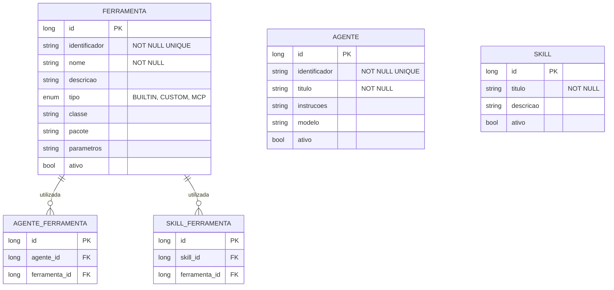

# CDU - Manter Ferramenta

## 1. Metadados
- **Nome do CDU**: Manter Ferramenta
- **Versão**: 1.0
- **Data**: 2025-06-16
- **Autor**: IA Core
- **Status**: Em Revisão

## 2. Descrição do Caso de Uso

### 2.1. Descrição Breve
O caso de uso "Manter Ferramenta" permite o cadastro, consulta, alteração e exclusão de ferramentas no sistema ia-core-llm. Uma ferramenta representa uma função ou capacidade que pode ser invocada por agentes LLM (ex: busca web, processamento de imagem, extração de texto). Este módulo permite a gestão das ferramentas disponíveis para uso pelos agentes, incluindo descoberta automática de ferramentas anotadas com @Tool.

### 2.2. Objetivos
- Cadastrar e gerenciar ferramentas
- Consultar ferramentas disponíveis
- Atualizar configurações de ferramentas
- Excluir ferramentas não utilizadas
- Descobrir automaticamente ferramentas anotadas com @Tool
- Vincular ferramentas a agentes

### 2.3. Escopo
**Incluído**:
- Cadastro e gerenciamento de ferramentas
- Consulta de ferramentas com filtros
- Descoberta automática de ferramentas
- Vinculação de ferramentas a agentes
- Validação de classes Java

**Excluído**:
- Implementação de ferramentas (tratado em código)
- Execução de ferramentas (tratado em CDU separado)
- Gerenciamento de agentes (tratado em CDU separado)

## 3. Atores

| Ator | Descrição | Tipo |
|------|------------|------|
| Administrador | Usuário com acesso total ao sistema | Primário |
| Desenvolvedor | Usuário responsável por criar ferramentas | Primário |
| Usuário | Usuário comum que pode visualizar ferramentas | Secundário |

## 4. Pré-condições

### 4.1. Para Cadastrar Ferramenta
- Ator deve estar autenticado
- Ator deve ter permissão para gerenciar ferramentas

### 4.2. Para Alterar Ferramenta
- Ator deve estar autenticado
- Ator deve ter permissão para gerenciar ferramentas
- Ferramenta deve existir

### 4.3. Para Excluir Ferramenta
- Ator deve estar autenticado
- Ator deve ter permissão para excluir ferramentas
- Ferramenta deve existir

## 5. Pós-condições

### 5.1. Pós-condição de Sucesso (Cadastrar Ferramenta)
- Ferramenta é registrada no sistema
- Sistema exibe mensagem de sucesso

### 5.2. Pós-condição de Sucesso (Alterar Ferramenta)
- Ferramenta é atualizada no sistema
- Sistema exibe mensagem de sucesso

### 5.3. Pós-condição de Sucesso (Excluir Ferramenta)
- Ferramenta é removida do sistema
- Sistema exibe mensagem de sucesso

### 5.4. Pós-condição de Falha (Cadastrar Ferramenta)
- Ferramenta não é registrada
- Erros são identificados e reportados
- Sistema exibe mensagem de erro

## 6. Fluxo Principal (Basic Flow)

### 6.1. Fluxo: Cadastrar Ferramenta

**Trigger**: O caso de uso inicia quando o ator acessa a opção de cadastrar nova ferramenta.

**Passos**:
1. **Dado** ator autenticado com permissão para gerenciar ferramentas
2. **Quando** ator acessa "Cadastrar Ferramenta"
3. **Então** sistema exibe formulário de cadastro
4. **Quando** ator preenche identificador [RN001, RN007]
5. **Quando** ator preenche nome [RN002]
6. **Quando** ator preenche descrição
7. **Quando** ator seleciona tipo de ferramenta [RN003]
8. **Quando** ator preenche classe Java (opcional)
9. **Quando** ator preenche pacote (opcional)
10. **Quando** ator preenche parâmetros (opcional)
11. **Quando** ator confirma cadastro
12. **Então** sistema valida dados
    - Verifica se identificador já está cadastrado [RN001]
    - Verifica se identificador segue o padrão esperado [RN007]
    - Verifica se a classe existe (se fornecida)
13. **Se** validação bem-sucedida
    - **Então** sistema salva ferramenta no banco de dados
    - **Então** sistema exibe mensagem de sucesso
14. **Se** validação falha
    - **Então** sistema exibe mensagem de erro
    - **Então** fluxo retorna ao passo 4

### 6.2. Fluxo: Consultar Ferramenta

**Trigger**: O caso de uso inicia quando o ator acessa a opção de consultar ferramentas.

**Passos**:
1. **Dado** ator autenticado com permissão para visualizar ferramentas
2. **Quando** ator acessa "Consultar Ferramenta"
3. **Então** sistema exibe tela de pesquisa com filtros
4. **Quando** ator informa critérios de pesquisa (identificador, nome, tipo)
5. **Então** sistema retorna lista de ferramentas que atendem aos critérios
6. **Quando** ator seleciona ferramenta da lista
7. **Então** sistema exibe dados detalhados da ferramenta
    - Identificador
    - Nome
    - Descrição
    - Tipo
    - Classe Java
    - Pacote
    - Parâmetros
    - Agentes que utilizam esta ferramenta

### 6.3. Fluxo: Alterar Ferramenta

**Trigger**: O caso de uso inicia quando o ator acessa a opção de editar ferramenta.

**Passos**:
1. **Dado** ator autenticado com permissão para gerenciar ferramentas
2. **Dado** ferramenta existe
3. **Quando** ator acessa "Consultar Ferramenta" e seleciona ferramenta
4. **Quando** ator clica em "Editar"
5. **Então** sistema exibe formulário de alteração com dados preenchidos
6. **Quando** ator modifica dados desejados (descrição, parâmetros)
7. **Quando** ator confirma alteração
8. **Então** sistema valida e salva alterações
9. **Então** sistema exibe mensagem de sucesso

### 6.4. Fluxo: Excluir Ferramenta

**Trigger**: O caso de uso inicia quando o ator acessa a opção de excluir ferramenta.

**Passos**:
1. **Dado** ator autenticado com permissão para excluir ferramentas
2. **Dado** ferramenta existe
3. **Quando** ator acessa "Consultar Ferramenta" e seleciona ferramenta
4. **Quando** ator clica em "Excluir"
5. **Então** sistema solicita confirmação
6. **Quando** ator confirma exclusão
7. **Então** sistema verifica se há dependências [RN004, RN005]
8. **Se** não houver dependências
    - **Então** sistema exclui ferramenta
    - **Então** sistema exibe mensagem de sucesso
9. **Se** houver dependências
    - **Então** sistema exibe mensagem de erro indicando as dependências
    - **Então** fluxo é interrompido

## 7. Fluxos Alternativos

### 7.1. Fluxo Alternativo: Ferramenta com Identificador Duplicado

1. **Dado** sistema está validando cadastro de ferramenta
2. **Quando** sistema detecta identificador duplicado [RN001]
3. **Então** sistema exibe mensagem de erro indicando que identificador já está cadastrado
4. **Então** fluxo retorna ao passo de preenchimento

### 7.2. Fluxo Alternativo: Ferramenta com Dependências

1. **Dado** sistema está validando exclusão de ferramenta
2. **Quando** sistema detecta dependências [RN005]
3. **Então** sistema exibe lista dos agentes que utilizam esta ferramenta
4. **Então** ator deve remover a ferramenta dos agentes antes de excluí-la

### 7.3. Fluxo Alternativo: Classe Não Encontrada

1. **Dado** sistema está validando cadastro de ferramenta
2. **Quando** sistema detecta que a classe fornecida não existe
3. **Então** sistema exibe mensagem de erro indicando que a classe não foi encontrada
4. **Então** fluxo retorna ao passo de preenchimento

## 8. Fluxos de Exceção

### 8.1. Fluxo de Exceção: Identificador Inválido

1. **Dado** sistema está validando cadastro de ferramenta
2. **Quando** sistema detecta identificador inválido [RN001, RN007]
3. **Então** sistema exibe mensagem de erro indicando que identificador deve ser único e seguir o padrão
4. **Então** sistema impede cadastro
5. **Então** ator deve corrigir identificador antes de continuar

### 8.2. Fluxo de Exceção: Nome Vazio

1. **Dado** sistema está validando cadastro de ferramenta
2. **Quando** sistema detecta nome vazio [RN002]
3. **Então** sistema exibe mensagem de erro indicando que nome não pode estar vazio
4. **Então** sistema impede cadastro
5. **Então** ator deve preencher nome antes de continuar

### 8.3. Fluxo de Exceção: Tipo Inválido

1. **Dado** sistema está validando cadastro de ferramenta
2. **Quando** sistema detecta tipo inválido [RN003]
3. **Então** sistema exibe mensagem de erro indicando que tipo deve ser BUILTIN, CUSTOM ou MCP
4. **Então** sistema impede cadastro
5. **Então** ator deve selecionar tipo válido antes de continuar

### 8.4. Fluxo de Exceção: Ferramenta BUILTIN não pode ser Excluída

1. **Dado** sistema está validando exclusão de ferramenta
2. **Quando** sistema detecta que ferramenta é BUILTIN [RN004]
3. **Então** sistema exibe mensagem de erro indicando que ferramentas BUILTIN não podem ser excluídas
4. **Então** sistema impede exclusão
5. **Então** fluxo é interrompido

## 9. Fluxos de Navegação (Mestre-Detalhe)

### 9.1. Navegação: Descobrir Ferramentas Automaticamente

1. A partir da lista de ferramentas, o ator clica em "Descobrir Ferramentas"
2. Sistema executa o FerramentaDiscoveryService para buscar classes anotadas com @Tool [RN006]
3. Sistema exibe lista de ferramentas encontradas
4. Ator seleciona as ferramentas que deseja cadastrar
5. Sistema cadastra as ferramentas selecionadas automaticamente

### 9.2. Navegação: Vincular Ferramenta a Agente

1. A partir da tela de detalhe da ferramenta, o ator clica em "Vincular Agente"
2. Sistema exibe lista de agentes disponíveis
3. Ator seleciona os agentes que podem utilizar esta ferramenta
4. Sistema vincula a ferramenta aos agentes selecionados

### 9.3. Navegação: Visualizar Agentes que Utilizam

1. A partir da tela de detalhe da ferramenta, o ator clica em "Ver Agentes"
2. Sistema exibe lista de agentes que utilizam esta ferramenta

## 10. Regras de Negócio

| ID | Regra de Negócio | Tipo | Aplicação |
|----|------------------|------|-----------|
| RN001 | O identificador é obrigatório e deve ser único | Validação | Cadastro de ferramenta |
| RN002 | O nome é obrigatório e não pode estar vazio | Validação | Cadastro de ferramenta |
| RN003 | O tipo de ferramenta pode ser: BUILTIN, CUSTOM, MCP | Validação | Cadastro de ferramenta |
| RN004 | Ferramentas BUILTIN não podem ser excluídas | Validação | Exclusão de ferramenta |
| RN005 | Ferramentas não podem ser excluídas se estiverem em uso por agentes | Validação | Exclusão de ferramenta |
| RN006 | A descoberta automática busca classes anotadas com @Tool | Validação | Descoberta de ferramentas |
| RN007 | O identificador deve seguir o padrão: modulo.nome_ferramenta | Validação | Cadastro de ferramenta |

## 11. Estrutura de Dados

## 12. Contratos de Interface

### 12.1. Interface REST

| Método | Endpoint                      | Descrição                      |
|--------|-------------------------------|--------------------------------|
| GET    | `/api/${api.version}/llm/ferramentas`     | Lista ferramentas com paginação |
| GET    | `/api/${api.version}/llm/ferramentas/{id}` | Busca ferramenta por ID        |
| POST   | `/api/${api.version}/llm/ferramentas`     | Cadastra nova ferramenta       |
| PUT    | `/api/${api.version}/llm/ferramentas/{id}` | Atualiza ferramenta            |
| DELETE | `/api/${api.version}/llm/ferramentas/{id}` | Exclui ferramenta              |
| GET    | `/api/${api.version}/llm/ferramentas/search` | Pesquisa por critérios     |
| POST   | `/api/${api.version}/llm/ferramentas/discover` | Descobre ferramentas @Tool |

### 12.2. Endpoints de Relacionamento

| Método | Endpoint                              | Descrição                 |
|--------|---------------------------------------|---------------------------|
| GET    | `/api/${api.version}/llm/ferramentas/{id}/agentes` | Lista agentes que utilizam |
| POST   | `/api/${api.version}/llm/ferramentas/{id}/agentes/{agenteId}` | Vincula a agente |
| DELETE | `/api/${api.version}/llm/ferramentas/{id}/agentes/{agenteId}` | Remove de agente |

## 13. Requisitos Especiais

### 13.1. Segurança
- Gerenciamento de ferramentas requer permissões específicas
- Validação de permissões para operações destrutivas
- Logs de todas as operações para auditoria

### 13.2. Performance
- Consulta de ferramentas deve ser otimizada
- Descoberta automática de ferramentas deve ser eficiente
- Validação de classes Java deve ser rápida

### 13.3. Conformidade
- Validação de identificador [RN001, RN007]
- Validação de nome [RN002]
- Validação de tipo [RN003]
- Validação de dependências [RN004, RN005]
- Descoberta automática de ferramentas @Tool [RN006]

## 14. Pontos de Extensão

### 14.1. Integração com MCP
- **Extensão 1**: Suporte a ferramentas MCP (Model Context Protocol)
- **Quando**: Requisito de integração com MCP
- **Como**: Implementar suporte a ferramentas MCP

### 14.2. Validação Avançada de Ferramentas
- **Extensão 2**: Validação avançada de ferramentas customizadas
- **Quando**: Requisito de validação avançada
- **Como**: Implementar validação avançada de parâmetros e classes

### 14.3. Análise de Performance de Ferramentas
- **Extensão 3**: Monitoramento de performance de ferramentas
- **Quando**: Requisito de análise de performance
- **Como**: Implementar coleta de métricas de uso de ferramentas

## 15. Referências

### ADRs Relacionados
- ADR-012: Testing Patterns (Consideração de CDU e Comentários de Método)
- ADR-053: Usar CDU para Documentação de Casos de Uso

### CDUs Relacionados
- Manter Agente: Uma ferramenta pode ser utilizada por agentes
- Manter Skill: Uma ferramenta pode ser utilizada por skills
- Conversacao-Chat: Ferramentas são usadas em conversações com agentes

### Documentação Técnica
- Documentação de ferramentas no ia-core
- Padrões de anotação @Tool
- Configuração de FerramentaDiscoveryService
