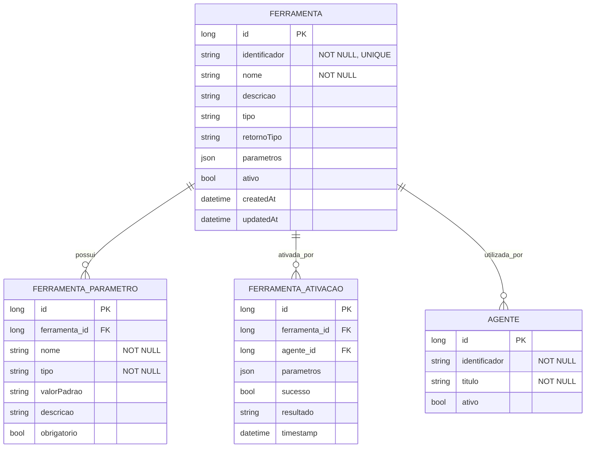

# CDU - Manter Ferramenta LLM

## 1. Metadados
- **Nome do CDU**: Manter Ferramenta LLM
- **Versão**: 1.0
- **Data**: 2025-06-16
- **Autor**: IA Core
- **Status**: Em Revisão

## 2. Descrição do Caso de Uso

### 2.1. Descrição Breve
O caso de uso "Manter Ferramenta LLM" permite o gerenciamento de ferramentas (tools) que podem ser utilizadas por agentes LLM no sistema ia-core, incluindo criação, atualização, consulta e exclusão de ferramentas. Este módulo permite que agentes LLM executem ações específicas através de ferramentas especializadas.

### 2.2. Objetivos
- Cadastrar e gerenciar ferramentas LLM
- Definir parâmetros e tipos de retorno
- Consultar ferramentas disponíveis
- Atualizar configurações de ferramentas
- Excluir ferramentas não utilizadas
- Testar ferramentas antes de uso

### 2.3. Escopo
**Incluído**:
- Cadastro e gerenciamento de ferramentas LLM
- Definição de parâmetros e tipos de retorno
- Consulta de ferramentas com filtros
- Teste de ferramentas
- Histórico de ativações

**Excluído**:
- Implementação de ferramentas (tratado em código)
- Execução de ferramentas por agentes (tratado em CDU separado)
- Gerenciamento de agentes (tratado em CDU separado)

## 3. Atores

| Ator | Descrição | Tipo |
|------|------------|------|
| Administrador | Usuário com acesso total ao sistema | Primário |
| Desenvolvedor | Usuário que desenvolve e configura ferramentas | Primário |

## 4. Pré-condições

### 4.1. Para Cadastrar Ferramenta
- Ator deve estar autenticado
- Ator deve ter permissão para gerenciar ferramentas

### 4.2. Para Alterar Ferramenta
- Ator deve estar autenticado
- Ator deve ter permissão para gerenciar ferramentas
- Ferramenta deve existir

### 4.3. Para Excluir Ferramenta
- Ator deve estar autenticado
- Ator deve ter permissão para excluir ferramentas
- Ferramenta deve existir

## 5. Pós-condições

### 5.1. Pós-condição de Sucesso (Cadastrar Ferramenta)
- Ferramenta é registrada no sistema
- Parâmetros são persistidos
- Sistema exibe mensagem de sucesso

### 5.2. Pós-condição de Sucesso (Alterar Ferramenta)
- Ferramenta é atualizada no sistema
- Parâmetros são atualizados
- Sistema exibe mensagem de sucesso

### 5.3. Pós-condição de Sucesso (Excluir Ferramenta)
- Ferramenta é removida do sistema
- Parâmetros são removidos
- Sistema exibe mensagem de sucesso

### 5.4. Pós-condição de Falha (Cadastrar Ferramenta)
- Ferramenta não é registrada
- Erros são identificados e reportados
- Sistema exibe mensagem de erro

## 6. Fluxo Principal (Basic Flow)

### 6.1. Fluxo: Cadastrar Ferramenta

**Trigger**: O caso de uso inicia quando o ator acessa a opção de cadastrar nova ferramenta.

**Passos**:
1. **Dado** ator autenticado com permissão para gerenciar ferramentas
2. **Quando** ator acessa "Cadastrar Ferramenta"
3. **Então** sistema exibe formulário de cadastro
4. **Quando** ator preenche identificador [RN001]
5. **Quando** ator preenche nome [RN002]
6. **Quando** ator preenche descrição [RN003]
7. **Quando** ator define parâmetros da ferramenta [RN004]
8. **Quando** ator define tipo de retorno
9. **Quando** ator confirma cadastro
10. **Então** sistema valida dados
    - Verifica se identificador já está cadastrado [RN001]
    - Verifica se campos obrigatórios estão preenchidos
    - Valida formato dos parâmetros [RN004]
11. **Se** validação bem-sucedida
    - **Então** sistema salva ferramenta no banco de dados
    - **Então** sistema exibe mensagem de sucesso
12. **Se** validação falha
    - **Então** sistema exibe mensagem de erro
    - **Então** fluxo retorna ao passo 4

### 6.2. Fluxo: Consultar Ferramenta

**Trigger**: O caso de uso inicia quando o ator acessa a opção de consultar ferramentas.

**Passos**:
1. **Dado** ator autenticado com permissão para visualizar ferramentas
2. **Quando** ator acessa "Consultar Ferramentas"
3. **Então** sistema exibe lista de ferramentas com paginação
4. **Quando** ator filtra por identificador, nome, tipo
5. **Então** sistema retorna lista filtrada
6. **Quando** ator clica na ferramenta desejada
7. **Então** sistema exibe detalhes da ferramenta
8. **Então** sistema exibe parâmetros e metadados

### 6.3. Fluxo: Atualizar Ferramenta

**Trigger**: O caso de uso inicia quando o ator acessa a opção de editar ferramenta.

**Passos**:
1. **Dado** ator autenticado com permissão para gerenciar ferramentas
2. **Dado** ferramenta existe
3. **Quando** ator acessa detalhes da ferramenta
4. **Quando** ator clica em "Editar"
5. **Então** sistema exibe formulário preenchido
6. **Quando** ator modifica campos desejados
7. **Quando** ator clica em "Salvar"
8. **Então** sistema valida dados
9. **Então** sistema atualiza ferramenta
10. **Então** sistema exibe mensagem de sucesso

### 6.4. Fluxo: Excluir Ferramenta

**Trigger**: O caso de uso inicia quando o ator acessa a opção de excluir ferramenta.

**Passos**:
1. **Dado** ator autenticado com permissão para excluir ferramentas
2. **Dado** ferramenta existe
3. **Quando** ator acessa detalhes da ferramenta
4. **Quando** ator clica em "Excluir"
5. **Então** sistema solicita confirmação
6. **Quando** ator confirma exclusão
7. **Então** sistema verifica se ferramenta está em uso por agentes [RN005]
8. **Se** não estiver em uso
    - **Então** sistema exclui ferramenta
    - **Então** sistema exibe mensagem de sucesso
9. **Se** estiver em uso
    - **Então** sistema exibe mensagem de erro
    - **Então** fluxo é interrompido

## 7. Fluxos Alternativos

### 7.1. Fluxo Alternativo: Ferramenta com Identificador Duplicado

1. **Dado** sistema está validando cadastro de ferramenta
2. **Quando** sistema detecta identificador duplicado [RN001]
3. **Então** sistema exibe mensagem de erro indicando que identificador já está cadastrado
4. **Então** fluxo retorna ao passo de preenchimento

### 7.2. Fluxo Alternativo: Ferramenta em Uso por Agentes

1. **Dado** sistema está validando exclusão de ferramenta
2. **Quando** sistema detecta que ferramenta está em uso por agentes [RN005]
3. **Então** sistema exibe mensagem de erro indicando que ferramenta não pode ser excluída
4. **Então** sistema exibe lista de agentes que utilizam a ferramenta
5. **Então** fluxo é interrompido

### 7.3. Fluxo Alternativo: Validação de Parâmetros

1. **Dado** sistema está validando cadastro de ferramenta
2. **Quando** sistema detecta parâmetros inválidos [RN004]
3. **Então** sistema exibe lista de parâmetros com erros
4. **Então** ator deve corrigir os parâmetros antes de salvar

## 8. Fluxos de Exceção

### 8.1. Fluxo de Exceção: Identificador Inválido

1. **Dado** sistema está validando cadastro de ferramenta
2. **Quando** sistema detecta identificador inválido [RN001]
3. **Então** sistema exibe mensagem de erro indicando que identificador deve ser único
4. **Então** sistema impede cadastro
5. **Então** ator deve corrigir identificador antes de continuar

### 8.2. Fluxo de Exceção: Nome Inválido

1. **Dado** sistema está validando cadastro de ferramenta
2. **Quando** sistema detecta nome inválido [RN002]
3. **Então** sistema exibe mensagem de erro indicando que nome deve ter entre 2 e 200 caracteres
4. **Então** sistema impede cadastro
5. **Então** ator deve corrigir nome antes de continuar

### 8.3. Fluxo de Exceção: Descrição Inválida

1. **Dado** sistema está validando cadastro de ferramenta
2. **Quando** sistema detecta descrição inválida [RN003]
3. **Então** sistema exibe mensagem de erro indicando que descrição pode ter até 1000 caracteres
4. **Então** sistema impede cadastro
5. **Então** ator deve corrigir descrição antes de continuar

### 8.4. Fluxo de Exceção: Parâmetros Inválidos

1. **Dado** sistema está validando cadastro de ferramenta
2. **Quando** sistema detecta parâmetros inválidos [RN004]
3. **Então** sistema exibe mensagem de erro indicando que parâmetros devem ter tipo definido
4. **Então** sistema impede cadastro
5. **Então** ator deve corrigir parâmetros antes de continuar

## 9. Fluxos de Navegação (Mestre-Detalhe)

### 9.1. Navegação: Manter Parâmetros da Ferramenta

1. A partir do formulário de ferramenta, o ator clica em "Adicionar Parâmetro"
2. Sistema exibe diálogo de parâmetros
3. Ator preenche nome, tipo, valor padrão e descrição
4. Ator confirma
5. Sistema adiciona parâmetro à lista da ferramenta
6. Ator pode remover parâmetros da lista
7. Ao salvar a ferramenta, os parâmetros também são persistidos

### 9.2. Navegação: Testar Ferramenta

1. A partir dos detalhes da ferramenta, o ator clica em "Testar"
2. Sistema exibe interface de teste
3. Ator preenche valores para os parâmetros
4. Ator clica em "Executar"
5. Sistema executa a ferramenta com os parâmetros fornecidos
6. Sistema exibe resultado da execução

## 10. Regras de Negócio

| ID | Regra de Negócio | Tipo | Aplicação |
|----|------------------|------|-----------|
| RN001 | O campo identificador é obrigatório e deve ser único | Validação | Cadastro de ferramenta |
| RN002 | O campo nome é obrigatório e deve ter entre 2 e 200 caracteres | Validação | Cadastro de ferramenta |
| RN003 | O campo descrição pode ter até 1000 caracteres | Validação | Cadastro de ferramenta |
| RN004 | Parâmetros devem ter tipo definido (String, Integer, Boolean, etc.) | Validação | Cadastro de ferramenta |
| RN005 | Ferramentas em uso por agentes não podem ser excluídas | Validação | Exclusão de ferramenta |
| RN006 | O sistema deve manter histórico de ativações de ferramentas | Validação | Ativação de ferramenta |

## 11. Estrutura de Dados

## 12. Contratos de Interface

### 12.1. Interface REST

| Método | Endpoint                          | Descrição                      |
|--------|-----------------------------------|--------------------------------|
| GET    | `/api/${api.version}/llm/ferramentas`        | Lista ferramentas com paginação |
| GET    | `/api/${api.version}/llm/ferramentas/{id}`    | Busca ferramenta por ID         |
| POST   | `/api/${api.version}/llm/ferramentas`        | Cadastra nova ferramenta        |
| PUT    | `/api/${api.version}/llm/ferramentas/{id}`    | Atualiza ferramenta             |
| DELETE | `/api/${api.version}/llm/ferramentas/{id}`    | Exclui ferramenta               |
| GET    | `/api/${api.version}/llm/ferramentas/{id}/parametros` | Lista parâmetros da ferramenta |
| POST   | `/api/${api.version}/llm/ferramentas/{id}/test` | Testa ferramenta              |

### 12.2. Endpoints de Ativação

| Método | Endpoint                              | Descrição                 |
|--------|---------------------------------------|---------------------------|
| POST   | `/api/${api.version}/llm/ferramentas/{id}/ativar` | Ativa ferramenta          |
| GET    | `/api/${api.version}/llm/ferramentas/{id}/ativacoes` | Lista ativações da ferramenta |

## 13. Requisitos Especiais

### 13.1. Segurança
- Gerenciamento de ferramentas requer permissões específicas
- Validação de permissões para operações destrutivas
- Logs de todas as operações para auditoria

### 13.2. Performance
- Consulta de ferramentas deve ser otimizada
- Teste de ferramentas deve ser rápido
- Validação de parâmetros deve ser eficiente

### 13.3. Conformidade
- Validação de identificador [RN001]
- Validação de nome [RN002]
- Validação de descrição [RN003]
- Validação de parâmetros [RN004]
- Validação de dependências [RN005]
- Histórico de ativações [RN006]

## 14. Pontos de Extensão

### 14.1. Integração com MCP
- **Extensão 1**: Suporte a ferramentas MCP (Model Context Protocol)
- **Quando**: Requisito de integração com MCP
- **Como**: Implementar suporte a ferramentas MCP

### 14.2. Validação Avançada de Ferramentas
- **Extensão 2**: Validação avançada de ferramentas customizadas
- **Quando**: Requisito de validação avançada
- **Como**: Implementar validação avançada de parâmetros e tipos

### 14.3. Análise de Performance de Ferramentas
- **Extensão 3**: Monitoramento de performance de ferramentas
- **Quando**: Requisito de análise de performance
- **Como**: Implementar coleta de métricas de uso de ferramentas

## 15. Referências

### ADRs Relacionados
- ADR-012: Testing Patterns (Consideração de CDU e Comentários de Método)
- ADR-053: Usar CDU para Documentação de Casos de Uso

### CDUs Relacionados
- Manter Agente: Gerenciamento de agentes LLM
- Manter Skill: Gerenciamento de habilidades disponíveis

### Documentação Técnica
- Documentação de ferramentas LLM no ia-core
- Padrões de configuração de ferramentas
- Configuração de parâmetros e tipos de retorno
