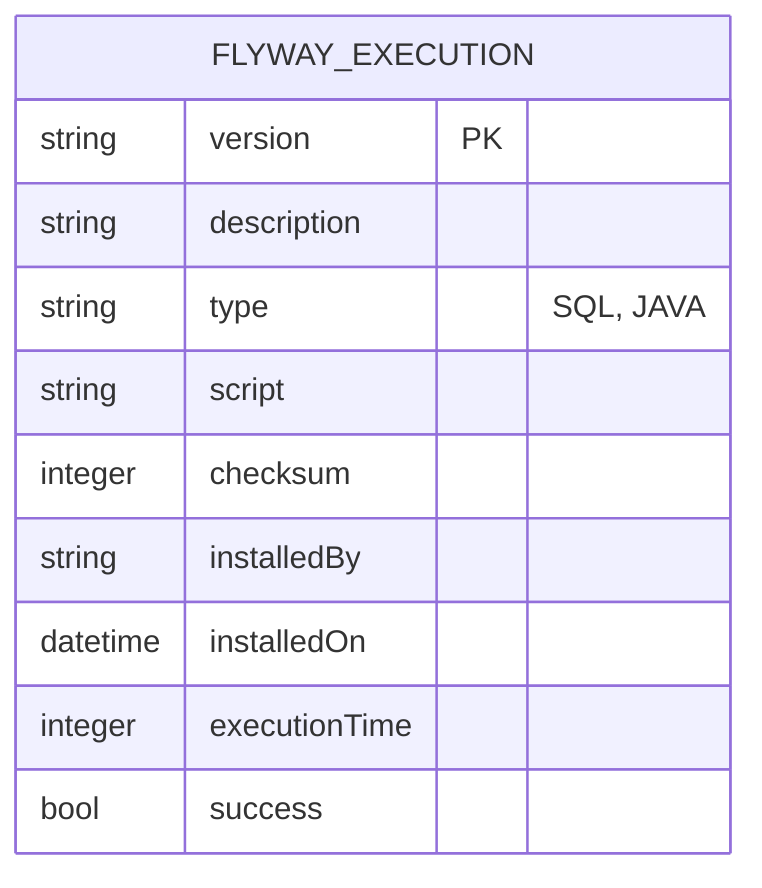

# CDU - Manter Flyway

## 1. Metadados
- **Nome do CDU**: Manter Flyway
- **Versão**: 1.0
- **Data**: 2025-06-16
- **Autor**: IA Core
- **Status**: Em Revisão

## 2. Descrição do Caso de Uso

### 2.1. Descrição Breve
O caso de uso "Manter Flyway" permite o gerenciamento de migrações de banco de dados usando Flyway no sistema ia-core. Este módulo permite que administradores e desenvolvedores monitorem, executem e gerenciem as migrações de banco de dados de forma controlada e segura, garantindo a integridade e consistência do esquema do banco de dados.

### 2.2. Objetivos
- Monitorar status das migrations do banco de dados
- Executar migrations pendentes de forma controlada
- Reparar migrations com problemas de checksum
- Validar integridade do esquema do banco
- Manter histórico completo de execuções

### 2.3. Escopo
**Incluído**:
- Consulta de status de migrations
- Execução de migrations pendentes
- Reparo de migrations
- Validação de integridade
- Limpeza de banco (apenas em ambientes não-produção)
- Histórico de execuções

**Excluído**:
- Criação manual de scripts de migration (feito por desenvolvedores)
- Rollback de migrations (Flyway não suporta rollback nativo)
- Migrações entre bancos de dados diferentes

## 3. Atores

| Ator        | Descrição                                    | Tipo |
|-------------|----------------------------------------------|------|
| Administrador| Usuário com acesso total ao sistema          | Primário |
| DBA         | Administrador de banco de dados              | Primário |
| Desenvolvedor| Usuário responsável por criar migrations     | Secundário |

## 4. Pré-condições

### 4.1. Para Consultar Status das Migrations
- Ator deve estar autenticado
- Ator deve ter permissão para visualizar status do Flyway
- Flyway deve estar configurado no sistema

### 4.2. Para Executar Migrations
- Ator deve estar autenticado
- Ator deve ter permissão para executar migrations
- Deve haver migrations pendentes
- Banco de dados deve estar acessível

### 4.3. Para Reparar Migrations
- Ator deve estar autenticado
- Ator deve ter permissão para reparar migrations
- Deve haver migrations com problemas de checksum
- Banco de dados deve estar acessível

### 4.4. Para Limpar Banco (Clean)
- Ator deve estar autenticado
- Ator deve ter permissão de DBA
- Ambiente não deve ser produção [RN003]
- Banco de dados deve estar acessível

## 5. Pós-condições

### 5.1. Pós-condição de Sucesso (Consultar Status)
- Sistema exibe status atual das migrations
- Lista de migrations é atualizada em tempo real

### 5.2. Pós-condição de Sucesso (Executar Migrations)
- Migrations pendentes são aplicadas
- Histórico de execuções é atualizado
- Versão do banco é atualizada [RN007]

### 5.3. Pós-condição de Sucesso (Reparar Migrations)
- Checksums são recalculados
- Histórico de execuções é atualizado
- Migrations ficam consistentes

### 5.4. Pós-condição de Sucesso (Limpar Banco)
- Todas as tabelas e objetos são removidos
- Histórico do Flyway é removido
- Banco fica vazio

### 5.5. Pós-condição de Falha (Executar Migrations)
- Migrations que falharam são identificadas
- Rollback é executado para migrations aplicadas nesta execução
- Mensagem de erro detalhada é exibida
- Execuções subsequentes são bloqueadas [RN005]

## 6. Fluxo Principal (Basic Flow)

### 6.1. Fluxo: Consultar Status das Migrations

**Trigger**: O caso de uso inicia quando o ator acessa a opção "Status Flyway" no menu.

**Passos**:
1. **Dado** ator autenticado com permissão para visualizar status do Flyway
2. **Quando** ator acessa "Status Flyway" no menu
3. **Então** sistema exibe status atual das migrations:
   - Versão atual do banco
   - Migrations pendentes
   - Migrations aplicadas
   - Status de validação
4. **Quando** ator filtra por versão ou status
5. **Então** sistema atualiza lista em tempo real

### 6.2. Fluxo: Executar Migrations

**Trigger**: O caso de uso inicia quando o ator acessa a opção "Executar Migrations" no menu.

**Passos**:
1. **Dado** ator autenticado com permissão para executar migrations
2. **Dado** há migrations pendentes
3. **Quando** ator acessa "Executar Migrations" no menu
4. **Então** sistema exibe lista de migrations pendentes
5. **Quando** ator revisa migrations a serem aplicadas
6. **Quando** ator confirma execução
7. **Então** sistema valida migrations [RN001, RN002]:
   - Verifica conflitos com migrations já aplicadas
   - Verifica se checksum está correto
8. **Se** validação bem-sucedida
   - **Então** sistema executa migrations em ordem sequencial [RN001]
   - **Então** sistema exibe relatório de execução
   - **Então** sistema atualiza status do banco [RN007]
9. **Se** validação falha
   - **Então** sistema exibe mensagem de erro
   - **Então** fluxo é encerrado

### 6.3. Fluxo: Reparar Migrations

**Trigger**: O caso de uso inicia quando o ator acessa a opção "Reparar Flyway" no menu.

**Passos**:
1. **Dado** ator autenticado com permissão para reparar migrations
2. **Dado** há migrations com problemas de checksum
3. **Quando** ator acessa "Reparar Flyway" no menu
4. **Então** sistema exibe migrations que precisam de reparo
5. **Quando** ator seleciona migrations a serem reparadas
6. **Quando** ator confirma reparo
7. **Então** sistema recalcula checksums das migrations [RN002]
8. **Então** sistema atualiza histórico de execuções [RN006]
9. **Então** sistema exibe mensagem de sucesso

### 6.4. Fluxo: Limpar Banco (Clean)

**Trigger**: O caso de uso inicia quando o ator acessa a opção "Limpar Banco" no menu.

**Passos**:
1. **Dado** ator autenticado com permissão de DBA
2. **Dado** ambiente não é produção [RN003]
3. **Quando** ator acessa "Limpar Banco" no menu
4. **Então** sistema exibe aviso de operação irreversível
5. **Quando** ator confirma operação digitando "CONFIRMAR"
6. **Se** ambiente é staging
   - **Então** sistema solicita confirmação adicional [RN004]
7. **Quando** ator confirma adicionalmente
8. **Então** sistema verifica se ambiente permite operação [RN003]
9. **Se** ambiente permite
   - **Então** sistema remove todas as tabelas e objetos do banco
   - **Então** sistema remove histórico do Flyway
   - **Então** sistema exibe mensagem de sucesso
10. **Se** ambiente não permite
    - **Então** sistema bloqueia operação
    - **Então** sistema exibe mensagem de erro

## 7. Fluxos Alternativos

### 7.1. Fluxo Alternativo: Executar Migrations com Dry Run

1. **Dado** ator autenticado com permissão para executar migrations
2. **Quando** ator seleciona opção "Dry Run"
3. **Então** sistema simula execução de migrations
4. **Então** sistema exibe relatório do que seria executado
5. **Então** nenhuma alteração é aplicada ao banco

### 7.2. Fluxo Alternativo: Executar Migrations com Target

1. **Dado** ator autenticado com permissão para executar migrations
2. **Quando** ator especifica versão alvo (target)
3. **Então** sistema executa apenas migrations até versão especificada
4. **Então** sistema exibe relatório de execução

## 8. Fluxos de Exceção

### 8.1. Fluxo de Exceção: Migration com Checksum Inválido

1. **Dado** sistema está validando migrations
2. **Quando** sistema detecta checksum inválido [RN002]
3. **Então** sistema exibe mensagem de erro indicando qual migration está com problema
4. **Então** sistema interrompe validação
5. **Então** ator deve reparar migration antes de continuar

### 8.2. Fluxo de Exceção: Migration com Falha de Execução

1. **Dado** sistema está executando migrations
2. **Quando** ocorre erro SQL durante execução de migration
3. **Então** sistema interrompe execução
4. **Então** sistema exibe erro SQL detalhado
5. **Então** sistema faz rollback de migrations aplicadas nesta execução
6. **Então** sistema marca migration como falha [RN005]
7. **Então** execuções subsequentes são bloqueadas [RN005]
8. **Então** ator deve corrigir migration e executar novamente

### 8.3. Fluxo de Exceção: Operação de Clean Bloqueada

1. **Dado** ator tenta limpar banco
2. **Quando** sistema detecta ambiente de produção [RN003]
3. **Então** sistema bloqueia operação
4. **Então** sistema exibe mensagem de erro indicando que operação não é permitida em produção
5. **Então** fluxo é encerrado

### 8.4. Fluxo de Exceção: Banco de Dados Inacessível

1. **Dado** ator tenta executar operação do Flyway
2. **Quando** sistema não consegue conectar ao banco de dados
3. **Então** sistema exibe mensagem de erro de conexão
4. **Então** sistema sugere verificar configuração do banco
5. **Então** fluxo é encerrado

## 9. Fluxos de Navegação (Mestre-Detalhe)

### 9.1. Navegação: Visualizar Detalhes de Migration

1. A partir da lista de migrations, ator clica em uma migration
2. Sistema exibe detalhes da migration:
   - Versão
   - Descrição
   - Tipo (SQL, Java)
   - Script completo
   - Checksum
   - Data de instalação
   - Tempo de execução
   - Usuário que instalou
3. Ator pode visualizar script da migration

### 9.2. Navegação: Visualizar Histórico de Execuções

1. A partir da lista de migrations, ator clica em "Histórico"
2. Sistema exibe todas as execuções da migration:
   - Data e hora
   - Sucesso/Falha
   - Tempo de execução
   - Mensagem de erro (se houve falha)

## 10. Regras de Negócio

| ID | Regra de Negócio | Tipo | Aplicação |
|----|------------------|------|-----------|
| RN001 | Migrations devem ser executadas em ordem sequencial por versão | Validação | Execução de migrations |
| RN002 | O checksum de uma migration não pode ser alterado após aplicação | Validação | Execução e reparo de migrations |
| RN003 | A operação de clean é proibida em ambiente de produção | Validação | Limpeza de banco |
| RN004 | A operação de clean requer confirmação dupla em staging | Validação | Limpeza de banco |
| RN005 | Migrations falhadas bloqueiam execuções subsequentes | Validação | Execução de migrations |
| RN006 | O sistema mantém histórico completo de todas as execuções | Validação | Todas as operações |
| RN007 | A versão do banco é determinada pela última migration aplicada | Cálculo | Consulta de status |

## 11. Estrutura de Dados

## 12. Contratos de Interface

### 12.1. Interface REST

| Método | Endpoint                      | Descrição                      |
|--------|-------------------------------|--------------------------------|
| GET    | `/api/${api.version}/flyway/status`      | Status atual das migrations    |
| GET    | `/api/${api.version}/flyway/info`        | Informações detalhadas         |
| GET    | `/api/${api.version}/flyway/validate`    | Valida migrations pendentes    |
| POST   | `/api/${api.version}/flyway/migrate`     | Executa migrations pendentes    |
| POST   | `/api/${api.version}/flyway/repair`      | Repara migrations              |
| POST   | `/api/${api.version}/flyway/clean`       | Limpa o banco de dados         |
| POST   | `/api/${api.version}/flyway/baseline`    | Cria baseline                  |
| GET    | `/api/${api.version}/flyway/executions`  | Lista histórico de execuções   |
| GET    | `/api/${api.version}/flyway/executions/{version}` | Detalhes de execução  |

### 12.2. Endpoints de Informação

| Método | Endpoint                              | Descrição                 |
|--------|---------------------------------------|---------------------------|
| GET    | `/api/${api.version}/flyway/executions/{version}/script` | Script da migration |
| GET    | `/api/${api.version}/flyway/executions/{version}/checksum` | Checksum da migration |

## 13. Requisitos Especiais

### 13.1. Segurança
- Operações de clean e migrate requerem permissões de DBA
- Validação de ambiente antes de operações destrutivas
- Logs de todas as operações executadas

### 13.2. Performance
- Validação de migrations deve ser rápida (< 2 segundos)
- Execução de migrations deve ser otimizada para grandes volumes
- Cache de status de migrations para consultas frequentes

### 13.3. Conformidade
- Histórico completo de execuções para auditoria [RN006]
- Validação de integridade do esquema antes de migrations
- Bloqueio de operações perigosas em produção

## 14. Pontos de Extensão

### 14.1. Agendamento Automático
- **Extensão 1**: Integração com Scheduler para execução automática
- **Quando**: Requisito de automação de migrations
- **Como**: Configurar jobs para executar migrations em horários específicos

### 14.2. Rollback de Migrations
- **Extensão 2**: Implementação de rollback manual
- **Quando**: Necessidade de reverter migrations
- **Como**: Criar migrations de rollback e implementar comando undo

### 14.3. Migrations Multi-Banco
- **Extensão 3**: Suporte a múltiplos bancos de dados
- **Quando**: Sistema usa mais de um banco
- **Como**: Configurar Flyway para cada fonte de dados

## 15. Referências

### ADRs Relacionados
- ADR-012: Testing Patterns (Consideração de CDU e Comentários de Método)
- ADR-053: Usar CDU para Documentação de Casos de Uso

### CDUs Relacionados
- Manter Security: Controle de permissões para operações de DBA
- Manter Report: Relatórios de histórico de migrations
- Manter Scheduler: Agendamento automático de migrations

### Documentação Técnica
- Documentação oficial do Flyway
- Scripts de migration do projeto
- Configuração de banco de dados |
