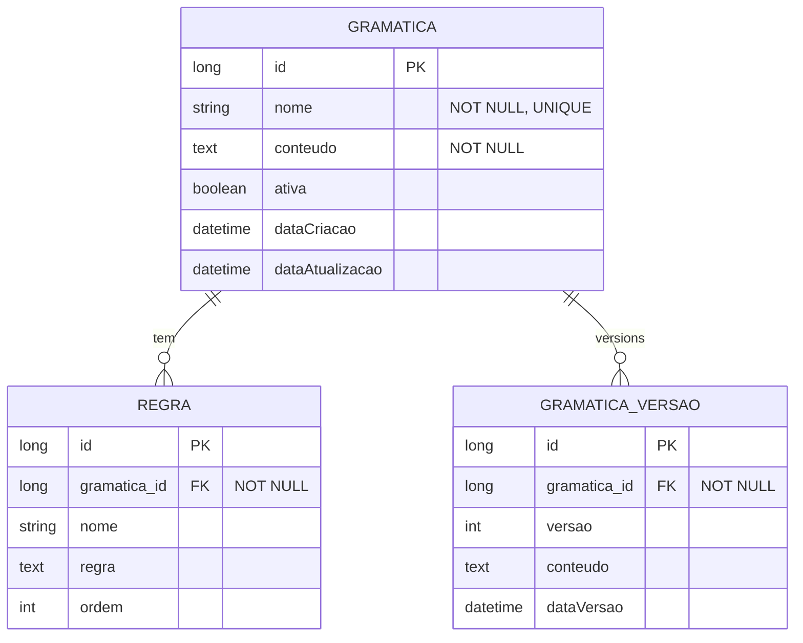

# CDU - Manter Grammar

## 1. Metadados
- **Nome do CDU**: Manter Grammar
- **Versão**: 1.0
- **Data**: 2025-06-16
- **Autor**: IA Core
- **Status**: Em Revisão

## 2. Descrição do Caso de Uso

### 2.1. Descrição Breve
O caso de uso "Manter Grammar" gerencia as gramáticas ANTLR utilizadas para parsing de texto. Permite cadastrar e testar regras gramaticais para processamento de linguagem natural.

### 2.2. Objetivos
- Cadastrar e gerenciar gramáticas ANTLR
- Definir regras gramaticais para parsing
- Compilar gramáticas e gerar parsers
- Testar gramáticas com texto de entrada
- Gerenciar versões de gramáticas
- Visualizar tokens e regras

### 2.3. Escopo
**Incluído**:
- Cadastro e gerenciamento de gramáticas ANTLR
- Definição de regras gramaticais
- Compilação de gramáticas
- Teste de gramáticas com texto
- Gerenciamento de versões
- Visualização de tokens

**Excluído**:
- Implementação de parsers (tratado em código)
- Execução de parsers em produção (tratado em CDU separado)
- Integração com NLP (tratado em CDU separado)

## 3. Atores

| Ator | Descrição | Tipo |
|------|------------|------|
| Desenvolvedor | Cria e mantem gramáticas | Primário |
| Analista | Testa regras gramaticais | Primário |

## 4. Pré-condições

### 4.1. Para Criar Gramática
- Ator deve estar autenticado
- Ator deve ter permissão para gerenciar gramáticas

### 4.2. Para Editar Gramática
- Ator deve estar autenticado
- Ator deve ter permissão para gerenciar gramáticas
- Gramática deve existir

### 4.3. Para Excluir Gramática
- Ator deve estar autenticado
- Ator deve ter permissão para excluir gramáticas
- Gramática deve existir

## 5. Pós-condições

### 5.1. Pós-condição de Sucesso (Criar Gramática)
- Gramática é registrada no sistema
- Sistema compila gramática
- Parser é gerado
- Sistema exibe mensagem de sucesso

### 5.2. Pós-condição de Sucesso (Editar Gramática)
- Gramática é atualizada no sistema
- Sistema recompila gramática
- Parser é atualizado
- Sistema exibe mensagem de sucesso

### 5.3. Pós-condição de Sucesso (Testar Gramática)
- Sistema processa texto com parser
- Sistema exibe resultado (árvore AST)
- Sistema exibe tokens identificados

### 5.4. Pós-condição de Falha (Criar Gramática)
- Gramática não é registrada
- Erros são identificados e reportados
- Sistema exibe mensagem de erro

## 6. Fluxo Principal (Basic Flow)

### 6.1. Fluxo: Criar Gramática

**Trigger**: O caso de uso inicia quando o ator acessa a opção de criar nova gramática.

**Passos**:
1. **Dado** ator autenticado com permissão para gerenciar gramáticas
2. **Quando** ator acessa "Nova Gramática"
3. **Então** sistema exibe editor
4. **Quando** ator define nome [RN001]
5. **Quando** ator escreve regras em formato ANTLR [RN002]
6. **Quando** ator confirma criação
7. **Então** sistema valida sintaxe [RN002]
8. **Se** sintaxe válida
    - **Então** sistema compila gramática [RN003]
    - **Então** sistema gera parser [RN003]
    - **Então** sistema exibe mensagem de sucesso
9. **Se** sintaxe inválida
    - **Então** sistema exibe mensagem de erro
    - **Então** fluxo retorna ao passo 5

### 6.2. Fluxo: Testar Gramática

**Trigger**: O caso de uso inicia quando o ator acessa a opção de testar gramática.

**Passos**:
1. **Dado** ator autenticado com permissão para visualizar gramáticas
2. **Quando** ator seleciona gramática
3. **Quando** ator acessa "Testar"
4. **Então** sistema exibe campo de entrada
5. **Quando** ator informa texto
6. **Então** sistema processa com parser
7. **Então** sistema exibe resultado (árvore AST)
8. **Então** sistema exibe tokens identificados

### 6.3. Fluxo: Editar Gramática

**Trigger**: O caso de uso inicia quando o ator acessa a opção de editar gramática.

**Passos**:
1. **Dado** ator autenticado com permissão para gerenciar gramáticas
2. **Dado** gramática existe
3. **Quando** ator seleciona gramática existente
4. **Quando** ator modifica regras
5. **Quando** ator confirma alteração
6. **Então** sistema valida sintaxe [RN002]
7. **Se** sintaxe válida
    - **Então** sistema recompila gramática [RN003]
    - **Então** sistema atualiza parser [RN003]
    - **Então** sistema exibe mensagem de sucesso
8. **Se** sintaxe inválida
    - **Então** sistema exibe mensagem de erro
    - **Então** fluxo retorna ao passo 4

## 7. Fluxos Alternativos

### 7.1. Fluxo Alternativo: Erro de Sintaxe

1. **Dado** sistema está validando gramática
2. **Quando** sistema detecta erro na gramática
3. **Então** sistema exibe mensagem de erro com linha
4. **Então** ator corrige
5. **Então** fluxo retorna ao passo de edição

### 7.2. Fluxo Alternativo: Gramática Ambígua

1. **Dado** sistema está validando gramática
2. **Quando** sistema detecta ambiguidade
3. **Então** sistema alerta ator
4. **Então** sistema sugere alternativas
5. **Então** ator decide como proceder

## 8. Fluxos de Exceção

### 8.1. Fluxo de Exceção: Nome Duplicado

1. **Dado** sistema está validando cadastro de gramática
2. **Quando** sistema detecta nome duplicado [RN001]
3. **Então** sistema exibe mensagem de erro indicando que nome deve ser único
4. **Então** sistema impede cadastro
5. **Então** ator deve corrigir nome antes de continuar

### 8.2. Fluxo de Exceção: Regras Inválidas

1. **Dado** sistema está validando gramática
2. **Quando** sistema detecta regras inválidas [RN002]
3. **Então** sistema exibe mensagem de erro indicando que regras devem ser válidas em ANTLR
4. **Então** sistema impede cadastro
5. **Então** ator deve corrigir regras antes de continuar

### 8.3. Fluxo de Exceção: Falha na Compilação

1. **Dado** sistema está compilando gramática
2. **Quando** sistema falha na compilação [RN003]
3. **Então** sistema exibe mensagem de erro indicando falha na compilação
4. **Então** sistema impede geração de parser
5. **Então** ator deve corrigir gramática antes de continuar

### 8.4. Fluxo de Exceção: Gramática em Uso

1. **Dado** sistema está validando exclusão de gramática
2. **Quando** sistema detecta que gramática está em uso [RN004]
3. **Então** sistema exibe mensagem de erro indicando que gramática não pode ser excluída
4. **Então** sistema impede exclusão
5. **Então** fluxo é interrompido

## 9. Fluxos de Navegação (Mestre-Detalhe)

### 9.1. Navegação: Gerenciar Regras

1. A partir da gramática, ator acessa "Regras"
2. Sistema exibe lista de regras
3. Ator adiciona/edita/exclui regras
4. Sistema valida cada regra

### 9.2. Navegação: Visualizar Tokens

1. A partir da gramática, ator acessa "Tokens"
2. Sistema exibe tokens definidos
3. Ator pode ajustar

### 9.3. Navegação: Histórico de Versões

1. A partir da gramática, ator acessa "Histórico"
2. Sistema exibe versões anteriores
3. Ator pode restaurar

## 10. Regras de Negócio

| ID | Regra de Negócio | Tipo | Aplicação |
|----|------------------|------|-----------|
| RN001 | Nome é obrigatório e único | Validação | Cadastro de gramática |
| RN002 | Regras devem ser válidas em ANTLR | Validação | Cadastro de gramática |
| RN003 | Compilação gera parser automaticamente | Validação | Compilação de gramática |
| RN004 | Gramática ativa é usada em processamento | Validação | Exclusão de gramática |

## 11. Estrutura de Dados

## 12. Contratos de Interface

### 12.1. Interface REST

| Método | Endpoint | Descrição |
|--------|----------|------------|
| GET | `/api/${api.version}/grammars` | Lista gramáticas |
| POST | `/api/${api.version}/grammars` | Cria gramática |
| GET | `/api/${api.version}/grammars/{id}` | Busca gramática |
| PUT | `/api/${api.version}/grammars/{id}` | Atualiza gramática |
| DELETE | `/api/${api.version}/grammars/{id}` | Exclui gramática |
| POST | `/api/${api.version}/grammars/{id}/compile` | Compila gramática |
| POST | `/api/${api.version}/grammars/{id}/test` | Testa gramática |

### 12.2. Endpoints de Relacionamento

| Método | Endpoint | Descrição |
|--------|----------|------------|
| GET | `/api/${api.version}/grammars/{id}/regras` | Lista regras |
| POST | `/api/${api.version}/grammars/{id}/regras` | Adiciona regra |
| GET | `/api/${api.version}/grammars/{id}/tokens` | Lista tokens |
| GET | `/api/${api.version}/grammars/{id}/historico` | Lista versões |

## 13. Requisitos Especiais

### 13.1. Segurança
- Gerenciamento de gramáticas requer permissões específicas
- Validação de permissões para operações destrutivas
- Logs de todas as operações para auditoria

### 13.2. Performance
- Compilação de gramáticas deve ser rápida
- Teste de gramáticas deve ser eficiente
- Validação de sintaxe deve ser otimizada

### 13.3. Conformidade
- Validação de nome [RN001]
- Validação de regras [RN002]
- Compilação automática [RN003]
- Validação de dependências [RN004]

## 14. Pontos de Extensão

### 14.1. Suporte a Outros Parsers
- **Extensão 1**: Suporte a parsers além de ANTLR
- **Quando**: Requisito de suporte a outros parsers
- **Como**: Implementar suporte a parsers alternativos

### 14.2. Validação Avançada de Gramáticas
- **Extensão 2**: Validação avançada de gramáticas
- **Quando**: Requisito de validação avançada
- **Como**: Implementar validação de ambiguidade e conflitos

### 14.3. Integração com NLP
- **Extensão 3**: Integração com processamento de linguagem natural
- **Quando**: Requisito de integração com NLP
- **Como**: Implementar integração com módulos NLP

## 15. Referências

### ADRs Relacionados
- ADR-012: Testing Patterns (Consideração de CDU e Comentários de Método)
- ADR-053: Usar CDU para Documentação de Casos de Uso

### CDUs Relacionados
- Manter NLP: Processamento de linguagem natural
- Manter OWL: Gerenciamento de ontologias OWL

### Documentação Técnica
- Documentação de gramáticas ANTLR no ia-core
- Padrões de configuração de parsers
- Configuração de tokens e regras
