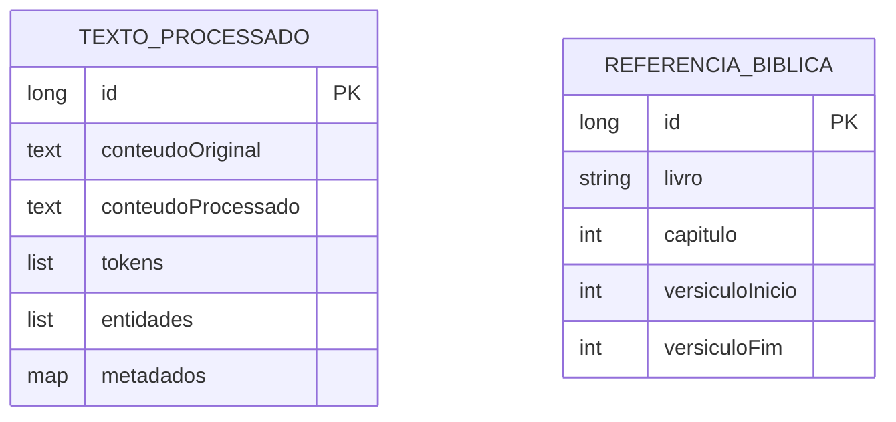

# CDU - Manter NLP

## 1. Metadados
- **Nome do CDU**: Manter NLP
- **Versão**: 1.0
- **Data**: 2025-06-16
- **Autor**: IA Core
- **Status**: Em Revisão

## 2. Descrição do Caso de Uso

### 2.1. Descrição Breve
O caso de uso "Manter NLP" fornece funcionalidades de Processamento de Linguagem Natural, incluindo tokenização, extração de entidades, análise de sentimentos e parsing de textos litúrgicos.

### 2.2. Objetivos
- Tokenizar textos para processamento
- Extrair entidades nomeadas (pessoas, locais, datas, números)
- Processar textos litúrgicos e extrair referências bíblicas
- Analisar sentimentos em textos
- Configurar modelos de NLP
- Gerenciar processamento de textos

### 2.3. Escopo
**Incluído**:
- Tokenização de textos
- Extração de entidades nomeadas
- Processamento de textos litúrgicos
- Análise de sentimentos
- Configuração de modelos NLP
- Parsing de referências bíblicas

**Excluído**:
- Treinamento de modelos NLP (tratado em CDU separado)
- Integração com LLM (tratado em CDU separado)
- Gerenciamento de gramáticas (tratado em CDU separado)

## 3. Atores

| Ator | Descrição | Tipo |
|------|------------|------|
| Sistema | Utiliza automaticamente | Primário |
| Administrador | Configura modelos | Primário |

## 4. Pré-condições

### 4.1. Para Tokenizar Texto
- Modelo NLP deve estar configurado
- Texto deve ser fornecido

### 4.2. Para Extrair Entidades
- Modelo NLP deve estar configurado
- Texto deve ser fornecido

### 4.3. Para Processar Texto Litúrgico
- Gramática de parsing deve estar configurada
- Texto litúrgico deve ser fornecido

## 5. Pós-condições

### 5.1. Pós-condição de Sucesso (Tokenizar Texto)
- Texto é tokenizado
- Lista de tokens é retornada
- Metadados são gerados

### 5.2. Pós-condição de Sucesso (Extrair Entidades)
- Entidades são identificadas
- Lista de entidades é retornada
- Tipos de entidades são classificados

### 5.3. Pós-condição de Sucesso (Processar Texto Litúrgico)
- Texto é parseado
- Referências bíblicas são extraídas
- Estrutura processada é retornada

### 5.4. Pós-condição de Falha (Tokenizar Texto)
- Texto não é processado
- Erros são identificados e reportados
- Sistema exibe mensagem de erro

## 6. Fluxo Principal (Basic Flow)

### 6.1. Fluxo: Tokenizar Texto

**Trigger**: O caso de uso inicia quando o sistema precisa tokenizar texto.

**Passos**:
1. **Dado** modelo NLP configurado
2. **Quando** sistema envia texto para processamento
3. **Então** sistema aplica tokenizer [RN001]
4. **Então** sistema retorna lista de tokens
5. **Então** sistema gera metadados

### 6.2. Fluxo: Extrair Entidades

**Trigger**: O caso de uso inicia quando o sistema precisa extrair entidades.

**Passos**:
1. **Dado** modelo NLP configurado
2. **Quando** sistema envia texto
3. **Então** sistema identifica entidades [RN002]
    - Pessoas
    - Locais
    - Datas
    - Números
4. **Então** sistema retorna entidades identificadas
5. **Então** sistema classifica tipos de entidades

### 6.3. Fluxo: Processar Texto Litúrgico

**Trigger**: O caso de uso inicia quando o sistema precisa processar texto litúrgico.

**Passos**:
1. **Dado** gramática de parsing configurada
2. **Quando** sistema envia texto de leitura
3. **Então** sistema parseia estrutura [RN003]
4. **Então** sistema extrai referências bíblicas
5. **Então** sistema identifica versículos
6. **Então** sistema retorna estrutura processada

## 7. Fluxos Alternativos

### 7.1. Fluxo Alternativo: Texto Vazio

1. **Dado** sistema está processando texto
2. **Quando** sistema detecta texto vazio
3. **Então** sistema exibe mensagem de erro
4. **Então** fluxo é interrompido

### 7.2. Fluxo Alternativo: Modelo Não Configurado

1. **Dado** sistema está processando texto
2. **Quando** sistema detecta modelo não configurado
3. **Então** sistema exibe mensagem de erro
4. **Então** fluxo é interrompido

## 8. Fluxos de Exceção

### 8.1. Fluxo de Exceção: Falha no Tokenizer

1. **Dado** sistema está tokenizando texto
2. **Quando** sistema falha no tokenizer [RN001]
3. **Então** sistema exibe mensagem de erro
4. **Então** sistema retorna lista vazia
5. **Então** fluxo é interrompido

### 8.2. Fluxo de Exceção: Falha na Extração de Entidades

1. **Dado** sistema está extraindo entidades
2. **Quando** sistema falha na extração [RN002]
3. **Então** sistema exibe mensagem de erro
4. **Então** sistema retorna lista vazia
5. **Então** fluxo é interrompido

### 8.3. Fluxo de Exceção: Falha no Parsing

1. **Dado** sistema está parseando texto litúrgico
2. **Quando** sistema falha no parsing [RN003]
3. **Então** sistema exibe mensagem de erro
4. **Então** sistema retorna estrutura vazia
5. **Então** fluxo é interrompido

## 9. Fluxos de Navegação (Mestre-Detalhe)

### 9.1. Navegação: Configurar Modelo NLP

1. A partir da configuração, administrador acessa "Modelos NLP"
2. Sistema exibe lista de modelos disponíveis
3. Administrador seleciona modelo
4. Sistema aplica configuração

### 9.2. Navegação: Visualizar Resultados

1. A partir do processamento, sistema exibe resultados
2. Sistema mostra tokens, entidades ou estrutura
3. Ator pode exportar resultados

## 10. Regras de Negócio

| ID | Regra de Negócio | Tipo | Aplicação |
|----|------------------|------|-----------|
| RN001 | Tokenizer deve processar texto e gerar tokens | Validação | Tokenização |
| RN002 | Extração de entidades deve identificar pessoas, locais, datas e números | Validação | Extração de entidades |
| RN003 | Parsing de texto litúrgico deve extrair referências bíblicas | Validação | Processamento litúrgico |
| RN004 | Modelos NLP devem estar configurados antes do processamento | Validação | Configuração |

## 11. Estrutura de Dados

## 12. Contratos de Interface

### 12.1. Interface REST

| Método | Endpoint | Descrição |
|--------|----------|------------|
| POST | `/api/${api.version}/nlp/tokenizar` | Tokeniza texto |
| POST | `/api/${api.version}/nlp/extrair-entidades` | Extrai entidades |
| POST | `/api/${api.version}/nlp/processar-leitura` | Processa texto litúrgico |

### 12.2. Interface de Serviço

| Método | Descrição |
|--------|------------|
| `tokenizar(texto)` | Retorna tokens |
| `extrairEntidades(texto)` | Retorna entidades |
| `processarLeitura(texto)` | Processa texto litúrgico |

## 13. Requisitos Especiais

### 13.1. Segurança
- Processamento de textos requer permissões específicas
- Validação de permissões para operações de processamento
- Logs de todas as operações para auditoria

### 13.2. Performance
- Tokenização deve ser rápida
- Extração de entidades deve ser eficiente
- Parsing de texto litúrgico deve ser otimizado

### 13.3. Conformidade
- Validação de tokenizer [RN001]
- Validação de extração de entidades [RN002]
- Validação de parsing [RN003]
- Validação de configuração [RN004]

## 14. Pontos de Extensão

### 14.1. Suporte a Outros Modelos NLP
- **Extensão 1**: Suporte a outros modelos de NLP além do padrão
- **Quando**: Requisito de suporte a outros modelos
- **Como**: Implementar suporte a modelos alternativos

### 14.2. Análise de Sentimentos
- **Extensão 2**: Análise de sentimentos em textos
- **Quando**: Requisito de análise de sentimentos
- **Como**: Implementar análise de sentimentos

### 14.3. Tradução Automática
- **Extensão 3**: Tradução automática de textos
- **Quando**: Requisito de tradução automática
- **Como**: Implementar integração com serviços de tradução

## 15. Referências

### ADRs Relacionados
- ADR-012: Testing Patterns (Consideração de CDU e Comentários de Método)
- ADR-053: Usar CDU para Documentação de Casos de Uso

### CDUs Relacionados
- Manter Grammar: Gerenciamento de gramáticas ANTLR
- Manter OWL: Gerenciamento de ontologias OWL

### Documentação Técnica
- Documentação de processamento NLP no ia-core
- Padrões de configuração de modelos NLP
- Configuração de tokenização e extração de entidades
