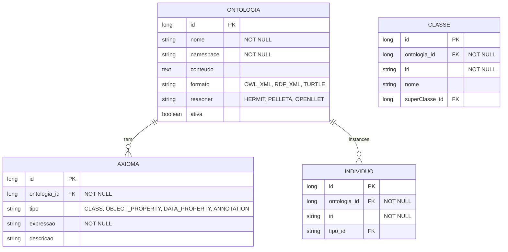

# CDU - Manter OWL

## 1. Metadados
- **Nome do CDU**: Manter OWL
- **Versão**: 1.0
- **Data**: 2025-06-16
- **Autor**: IA Core
- **Status**: Em Revisão

## 2. Descrição do Caso de Uso

### 2.1. Descrição Breve
O caso de uso "Manter OWL" gerencia as ontologias OWL utilizadas para raciocínio lógico e representação de conhecimento. Permite criar, editar e consultar ontologias.

### 2.2. Objetivos
- Cadastrar e gerenciar ontologias OWL
- Definir axiomas e classes
- Configurar reasoners
- Consultar inferências
- Gerenciar hierarquia de classes
- Visualizar indivíduos

### 2.3. Escopo
**Incluído**:
- Cadastro e gerenciamento de ontologias OWL
- Definição de axiomas e classes
- Configuração de reasoners
- Consulta de inferências
- Gerenciamento de propriedades
- Visualização de indivíduos

**Excluído**:
- Treinamento de reasoners (tratado em CDU separado)
- Integração com NLP (tratado em CDU separado)
- Execução de inferências complexas (tratado em CDU separado)

## 3. Atores

| Ator | Descrição | Tipo |
|------|------------|------|
| Desenvolvedor | Cria ontologias | Primário |
| Analista de Conhecimento | Modela conceitos | Primário |
| Usuário | Consulta ontologia | Primário |

## 4. Pré-condições

### 4.1. Para Criar Ontologia
- Ator deve estar autenticado
- Ator deve ter permissão para gerenciar ontologias

### 4.2. Para Adicionar Axioma
- Ator deve estar autenticado
- Ator deve ter permissão para gerenciar ontologias
- Ontologia deve existir

### 4.3. Para Consultar Inferências
- Ator deve estar autenticado
- Ator deve ter permissão para consultar ontologias
- Ontologia deve existir
- Reasoner deve estar configurado

## 5. Pós-condições

### 5.1. Pós-condição de Sucesso (Criar Ontologia)
- Ontologia é registrada no sistema
- Arquivo OWL é parseado
- Sistema exibe mensagem de sucesso

### 5.2. Pós-condição de Sucesso (Adicionar Axioma)
- Axioma é adicionado à ontologia
- Sistema valida sintaxe OWL
- Sistema exibe mensagem de sucesso

### 5.3. Pós-condição de Sucesso (Consultar Inferências)
- Sistema executa reasoner
- Sistema retorna inferências
- Sistema exibe resultados

### 5.4. Pós-condição de Falha (Criar Ontologia)
- Ontologia não é registrada
- Erros são identificados e reportados
- Sistema exibe mensagem de erro

## 6. Fluxo Principal (Basic Flow)

### 6.1. Fluxo: Criar Ontologia

**Trigger**: O caso de uso inicia quando o ator acessa a opção de criar nova ontologia.

**Passos**:
1. **Dado** ator autenticado com permissão para gerenciar ontologias
2. **Quando** ator acessa "Nova Ontologia"
3. **Então** sistema exibe formulário
4. **Quando** ator define nome [RN001]
5. **Quando** ator define namespace [RN002]
6. **Quando** ator carrega arquivo OWL (OWL/XML, RDF/XML, Turtle) [RN003]
7. **Quando** ator confirma criação
8. **Então** sistema parseia ontologia
9. **Se** ontologia válida
    - **Então** sistema salva no repositório
    - **Então** sistema exibe mensagem de sucesso
10. **Se** ontologia inválida
    - **Então** sistema exibe mensagem de erro
    - **Então** fluxo retorna ao passo 6

### 6.2. Fluxo: Adicionar Axioma

**Trigger**: O caso de uso inicia quando o ator acessa a opção de adicionar axioma.

**Passos**:
1. **Dado** ator autenticado com permissão para gerenciar ontologias
2. **Dado** ontologia existe
3. **Quando** ator seleciona ontologia
4. **Quando** ator acessa "Novo Axioma"
5. **Então** sistema exibe editor
6. **Quando** ator define axioma (classe, propriedade, indivíduo) [RN004]
7. **Quando** ator confirma adição
8. **Então** sistema valida sintaxe OWL [RN004]
9. **Se** axioma válido
    - **Então** sistema adiciona axioma
    - **Então** sistema exibe mensagem de sucesso
10. **Se** axioma inválido
    - **Então** sistema exibe mensagem de erro
    - **Então** fluxo retorna ao passo 6

### 6.3. Fluxo: Consultar Inferências

**Trigger**: O caso de uso inicia quando o ator acessa a opção de consultar inferências.

**Passos**:
1. **Dado** ator autenticado com permissão para consultar ontologias
2. **Dado** ontologia existe
3. **Dado** reasoner configurado [RN005]
4. **Quando** ator acessa ontologia
5. **Quando** ator define consulta
6. **Então** sistema executa reasoner
7. **Então** sistema retorna inferências
8. **Então** sistema exibe resultados

## 7. Fluxos Alternativos

### 7.1. Fluxo Alternativo: Ontologia Inválida

1. **Dado** sistema está parseando ontologia
2. **Quando** sistema detecta erro de sintaxe
3. **Então** sistema exibe mensagem com linha
4. **Então** ator corrige
5. **Então** fluxo retorna ao passo de edição

### 7.2. Fluxo Alternativo: Reasoner Inconsistente

1. **Dado** sistema está executando reasoner
2. **Quando** sistema detecta inconsistência
3. **Então** sistema exibe informações
4. **Então** ator resolve conflitos
5. **Então** fluxo retorna ao passo de consulta

## 8. Fluxos de Exceção

### 8.1. Fluxo de Exceção: Nome Inválido

1. **Dado** sistema está validando cadastro de ontologia
2. **Quando** sistema detecta nome inválido [RN001]
3. **Então** sistema exibe mensagem de erro indicando que nome é obrigatório
4. **Então** sistema impede cadastro
5. **Então** ator deve corrigir nome antes de continuar

### 8.2. Fluxo de Exceção: Namespace Inválido

1. **Dado** sistema está validando cadastro de ontologia
2. **Quando** sistema detecta namespace inválido [RN002]
3. **Então** sistema exibe mensagem de erro indicando que namespace deve ser válido
4. **Então** sistema impede cadastro
5. **Então** ator deve corrigir namespace antes de continuar

### 8.3. Fluxo de Exceção: Arquivo Inválido

1. **Dado** sistema está parseando arquivo OWL
2. **Quando** sistema detecta arquivo inválido [RN003]
3. **Então** sistema exibe mensagem de erro indicando que arquivo deve ter formato válido
4. **Então** sistema impede cadastro
5. **Então** ator deve corrigir arquivo antes de continuar

### 8.4. Fluxo de Exceção: Axioma Inválido

1. **Dado** sistema está validando axioma
2. **Quando** sistema detecta axioma inválido [RN004]
3. **Então** sistema exibe mensagem de erro indicando que axiomas devem ser sintaticamente válidos
4. **Então** sistema impede adição
5. **Então** ator deve corrigir axioma antes de continuar

### 8.5. Fluxo de Exceção: Reasoner Não Configurado

1. **Dado** sistema está executando reasoner
2. **Quando** sistema detecta reasoner não configurado [RN005]
3. **Então** sistema exibe mensagem de erro indicando que reasoner deve ser selecionado
4. **Então** sistema impede execução
5. **Então** ator deve configurar reasoner antes de continuar

## 9. Fluxos de Navegação (Mestre-Detalhe)

### 9.1. Navegação: Gerenciar Classes

1. A partir da ontologia, ator acessa "Classes"
2. Sistema exibe hierarquia
3. Ator adiciona/edita classes
4. Sistema valida

### 9.2. Navegação: Gerenciar Propriedades

1. A partir da ontologia, ator acessa "Propriedades"
2. Sistema exibe lista
3. Ator configura relações
4. Sistema atualiza

### 9.3. Navegação: Visualizar Indivíduos

1. A partir da ontologia, ator acessa "Indivíduos"
2. Sistema exibe instâncias
3. Ator consulta detalhes

## 10. Regras de Negócio

| ID | Regra de Negócio | Tipo | Aplicação |
|----|------------------|------|-----------|
| RN001 | Nome é obrigatório | Validação | Cadastro de ontologia |
| RN002 | Namespace deve ser válido | Validação | Cadastro de ontologia |
| RN003 | Arquivo deve ser formato válido | Validação | Cadastro de ontologia |
| RN004 | Axiomas devem ser sintaticamente válidos | Validação | Adição de axioma |
| RN005 | Reasoner deve ser selecionado | Validação | Consulta de inferências |

## 11. Estrutura de Dados

## 12. Contratos de Interface

### 12.1. Interface REST

| Método | Endpoint | Descrição |
|--------|----------|------------|
| GET | `/api/${api.version}/ontologias` | Lista ontologias |
| POST | `/api/${api.version}/ontologias` | Cria ontologia |
| GET | `/api/${api.version}/ontologias/{id}` | Busca ontologia |
| PUT | `/api/${api.version}/ontologias/{id}` | Atualiza ontologia |
| DELETE | `/api/${api.version}/ontologias/{id}` | Exclui ontologia |
| POST | `/api/${api.version}/ontologias/{id}/axioma` | Adiciona axioma |
| POST | `/api/${api.version}/ontologias/{id}/inferir` | Consulta inferências |

### 12.2. Endpoints de Relacionamento

| Método | Endpoint | Descrição |
|--------|----------|------------|
| GET | `/api/${api.version}/ontologias/{id}/classes` | Lista classes |
| GET | `/api/${api.version}/ontologias/{id}/propriedades` | Lista propriedades |
| GET | `/api/${api.version}/ontologias/{id}/individuos` | Lista indivíduos |
| GET | `/api/${api.version}/ontologias/{id}/hierarquia` | Exibe hierarquia |

## 13. Requisitos Especiais

### 13.1. Segurança
- Gerenciamento de ontologias requer permissões específicas
- Validação de permissões para operações destrutivas
- Logs de todas as operações para auditoria

### 13.2. Performance
- Parsing de ontologias deve ser rápido
- Execução de reasoner deve ser eficiente
- Consulta de inferências deve ser otimizada

### 13.3. Conformidade
- Validação de nome [RN001]
- Validação de namespace [RN002]
- Validação de arquivo [RN003]
- Validação de axiomas [RN004]
- Validação de reasoner [RN005]

## 14. Pontos de Extensão

### 14.1. Suporte a Outros Reasoners
- **Extensão 1**: Suporte a outros reasoners além de HERMIT, PELLETA e OPENLLET
- **Quando**: Requisito de suporte a outros reasoners
- **Como**: Implementar suporte a reasoners alternativos

### 14.2. Validação Avançada de Ontologias
- **Extensão 2**: Validação avançada de ontologias
- **Quando**: Requisito de validação avançada
- **Como**: Implementar validação de consistência e completude

### 14.3. Integração com NLP
- **Extensão 3**: Integração com processamento de linguagem natural
- **Quando**: Requisito de integração com NLP
- **Como**: Implementar integração com módulos NLP

## 15. Referências

### ADRs Relacionados
- ADR-012: Testing Patterns (Consideração de CDU e Comentários de Método)
- ADR-053: Usar CDU para Documentação de Casos de Uso

### CDUs Relacionados
- Manter NLP: Processamento de linguagem natural
- Manter Grammar: Gerenciamento de gramáticas ANTLR

### Documentação Técnica
- Documentação de ontologias OWL no ia-core
- Padrões de configuração de reasoners
- Configuração de axiomas e classes
