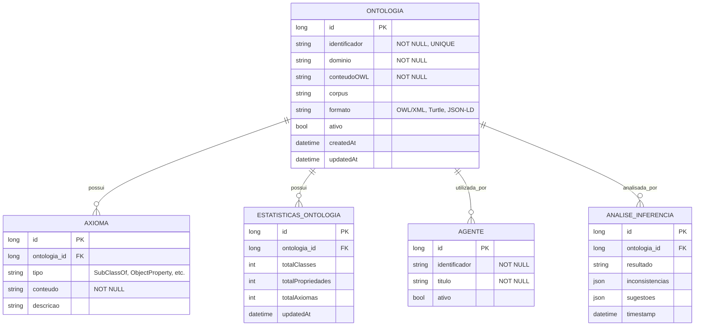

# CDU - Manter Ontologia

## 1. Metadados
- **Nome do CDU**: Manter Ontologia
- **Versão**: 1.0
- **Data**: 2025-06-16
- **Autor**: IA Core
- **Status**: Em Revisão

## 2. Descrição do Caso de Uso

### 2.1. Descrição Breve
O caso de uso "Manter Ontologia" permite o gerenciamento de ontologias OWL no sistema ia-core, incluindo criação, atualização, consulta e análise de ontologias para uso por agentes LLM. Este módulo permite a representação estruturada de conhecimento através de ontologias OWL 2 DL.

### 2.2. Objetivos
- Cadastrar e gerenciar ontologias OWL
- Gerar ontologias a partir de corpus usando LLM
- Consultar e visualizar ontologias
- Refinar ontologias com feedback
- Analisar ontologias com inferência
- Exportar ontologias em diferentes formatos

### 2.3. Escopo
**Incluído**:
- Cadastro e gerenciamento de ontologias OWL
- Geração de ontologias a partir de corpus
- Consulta e visualização de ontologias
- Refinamento de ontologias
- Análise de inferência
- Exportação de ontologias

**Excluído**:
- Treinamento de modelos LLM (tratado em CDU separado)
- Gerenciamento de reasoners (tratado em CDU Manter-OWL)
- Integração com NLP (tratado em CDU separado)

## 3. Atores

| Ator | Descrição | Tipo |
|------|------------|------|
| Administrador | Usuário com acesso total ao sistema | Primário |
| Usuário Final | Usuário que utiliza ontologias | Primário |
| Agente LLM | Sistema que utiliza ontologias para inferência | Secundário |

## 4. Pré-condições

### 4.1. Para Cadastrar Ontologia
- Ator deve estar autenticado
- Ator deve ter permissão para gerenciar ontologias
- Corpus ou texto descritivo deve ser fornecido

### 4.2. Para Consultar Ontologia
- Ator deve estar autenticado
- Ator deve ter permissão para visualizar ontologias

### 4.3. Para Refinar Ontologia
- Ator deve estar autenticado
- Ator deve ter permissão para gerenciar ontologias
- Ontologia deve existir

### 4.4. Para Excluir Ontologia
- Ator deve estar autenticado
- Ator deve ter permissão para excluir ontologias
- Ontologia deve existir

## 5. Pós-condições

### 5.1. Pós-condição de Sucesso (Cadastrar Ontologia)
- Ontologia é gerada e persistida
- Estatísticas são calculadas
- Sistema exibe mensagem de sucesso

### 5.2. Pós-condição de Sucesso (Consultar Ontologia)
- Ontologia é exibida
- Estatísticas são apresentadas
- Sistema exibe detalhes

### 5.3. Pós-condição de Sucesso (Refinar Ontologia)
- Ontologia é atualizada
- Estatísticas são recalculadas
- Sistema exibe resultado atualizado

### 5.4. Pós-condição de Sucesso (Excluir Ontologia)
- Ontologia é removida do sistema
- Sistema exibe mensagem de sucesso

### 5.5. Pós-condição de Falha (Cadastrar Ontologia)
- Ontologia não é gerada
- Erros são identificados e reportados
- Sistema exibe mensagem de erro

## 6. Fluxo Principal (Basic Flow)

### 6.1. Fluxo: Cadastrar Ontologia

**Trigger**: O caso de uso inicia quando o ator acessa a opção de cadastrar nova ontologia.

**Passos**:
1. **Dado** ator autenticado com permissão para gerenciar ontologias
2. **Quando** ator acessa "Cadastrar Ontologia" no menu
3. **Então** sistema exibe formulário de cadastro
4. **Quando** ator fornece corpus ou texto descritivo [RN002]
5. **Quando** ator define domínio da ontologia [RN001]
6. **Quando** ator clica em "Gerar Ontologia"
7. **Então** sistema processa texto com LLM
8. **Então** sistema constrói ontologia OWL
9. **Se** ontologia válida
    - **Então** sistema valida sintaxe OWL [RN005]
    - **Então** sistema persiste ontologia
    - **Então** sistema calcula estatísticas [RN004]
    - **Então** sistema exibe estatísticas e resultado
10. **Se** ontologia inválida
    - **Então** sistema exibe mensagem de erro
    - **Então** fluxo retorna ao passo 4

### 6.2. Fluxo: Consultar Ontologia

**Trigger**: O caso de uso inicia quando o ator acessa a opção de consultar ontologias.

**Passos**:
1. **Dado** ator autenticado com permissão para visualizar ontologias
2. **Quando** ator acessa "Consultar Ontologias" no menu
3. **Então** sistema exibe lista de ontologias com paginação
4. **Quando** ator filtra por domínio, data ou tamanho
5. **Quando** ator clica na ontologia desejada
6. **Então** sistema exibe detalhes da ontologia
7. **Então** sistema exibe estatísticas (classes, propriedades, axiomas) [RN004]

### 6.3. Fluxo: Refinar Ontologia

**Trigger**: O caso de uso inicia quando o ator acessa a opção de refinar ontologia.

**Passos**:
1. **Dado** ator autenticado com permissão para gerenciar ontologias
2. **Dado** ontologia existe
3. **Quando** ator acessa detalhes da ontologia
4. **Quando** ator clica em "Refinar"
5. **Então** sistema exibe editor de refinamento
6. **Quando** ator fornece feedback ou instruções
7. **Quando** ator confirma refinamento
8. **Então** sistema processa feedback com LLM
9. **Então** sistema atualiza ontologia
10. **Então** sistema recalcula estatísticas [RN004]
11. **Então** sistema exibe resultado atualizado

### 6.4. Fluxo: Analisar Ontologia

**Trigger**: O caso de uso inicia quando o ator acessa a opção de analisar ontologia.

**Passos**:
1. **Dado** ator autenticado com permissão para visualizar ontologias
2. **Dado** ontologia existe
3. **Quando** ator acessa detalhes da ontologia
4. **Quando** ator clica em "Analisar"
5. **Então** sistema realiza análise de inferência
6. **Então** sistema exibe resultados da análise
7. **Então** sistema exibe inconsistências ou sugestões

### 6.5. Fluxo: Excluir Ontologia

**Trigger**: O caso de uso inicia quando o ator acessa a opção de excluir ontologia.

**Passos**:
1. **Dado** ator autenticado com permissão para excluir ontologias
2. **Dado** ontologia existe
3. **Quando** ator acessa detalhes da ontologia
4. **Quando** ator clica em "Excluir"
5. **Então** sistema solicita confirmação
6. **Quando** ator confirma exclusão
7. **Então** sistema verifica se ontologia está em uso [RN003]
8. **Se** ontologia não está em uso
    - **Então** sistema exclui ontologia
    - **Então** sistema exibe mensagem de sucesso
9. **Se** ontologia está em uso
    - **Então** sistema exibe mensagem de erro
    - **Então** sistema exibe lista de agentes que utilizam a ontologia
    - **Então** fluxo é interrompido

## 7. Fluxos Alternativos

### 7.1. Fluxo Alternativo: Erro na Geração

1. **Dado** sistema está processando texto
2. **Quando** sistema detecta erro ao processar texto
3. **Então** sistema exibe mensagem de erro
4. **Então** fluxo é interrompido

### 7.2. Fluxo Alternativo: Corpus Muito Grande

1. **Dado** sistema está processando texto
2. **Quando** sistema detecta corpus muito grande
3. **Então** sistema solicita processamento assíncrono
4. **Quando** ator confirma processamento assíncrono
5. **Então** sistema enfileira processo
6. **Então** sistema notifica quando concluído

## 8. Fluxos de Exceção

### 8.1. Fluxo de Exceção: Domínio Inválido

1. **Dado** sistema está validando cadastro de ontologia
2. **Quando** sistema detecta domínio inválido [RN001]
3. **Então** sistema exibe mensagem de erro indicando que domínio é obrigatório
4. **Então** sistema impede cadastro
5. **Então** ator deve corrigir domínio antes de continuar

### 8.2. Fluxo de Exceção: Corpus Vazio

1. **Dado** sistema está validando cadastro de ontologia
2. **Quando** sistema detecta corpus vazio [RN002]
3. **Então** sistema exibe mensagem de erro indicando que corpus não pode ser vazio
4. **Então** sistema impede cadastro
5. **Então** ator deve fornecer corpus antes de continuar

### 8.3. Fluxo de Exceção: Ontologia em Uso

1. **Dado** sistema está verificando exclusão de ontologia
2. **Quando** sistema detecta ontologia em uso [RN003]
3. **Então** sistema exibe mensagem de erro indicando que ontologia não pode ser excluída
4. **Então** sistema exibe lista de agentes que utilizam a ontologia
5. **Então** fluxo é interrompido

### 8.4. Fluxo de Exceção: Análise Falha

1. **Dado** sistema está realizando análise de inferência
2. **Quando** sistema detecta erro ao realizar inferência
3. **Então** sistema exibe mensagem de erro
4. **Então** fluxo é interrompido

### 8.5. Fluxo de Exceção: Tempo de Geração Excedido

1. **Dado** sistema está gerando ontologia
2. **Quando** sistema detecta tempo de geração excedido [RN006]
3. **Então** sistema exibe mensagem de erro indicando que geração demorou mais de 30 segundos
4. **Então** sistema solicita processamento assíncrono
5. **Então** fluxo retorna ao passo de processamento assíncrono

## 9. Fluxos de Navegação (Mestre-Detalhe)

### 9.1. Navegação: Visualizar Axiomas da Ontologia

1. A partir dos detalhes da ontologia, ator clica em "Axiomas"
2. Sistema exibe lista de axiomas organizados por tipo
3. Ator pode filtrar por tipo (SubClassOf, ObjectProperty, etc.)
4. Ator clica em axioma desejado
5. Sistema exibe detalhes do axioma

### 9.2. Navegação: Exportar Ontologia

1. A partir dos detalhes da ontologia, ator clica em "Exportar"
2. Sistema exibe opções de formato (OWL/XML, Turtle, JSON-LD)
3. Ator seleciona formato desejado
4. Sistema gera arquivo de exportação
5. Sistema disponibiliza arquivo para download

## 10. Regras de Negócio

| ID | Regra de Negócio | Tipo | Aplicação |
|----|------------------|------|-----------|
| RN001 | O campo domínio é obrigatório | Validação | Cadastro de ontologia |
| RN002 | O corpus não pode ser vazio | Validação | Geração de ontologia |
| RN003 | Ontologias em uso por agentes não podem ser excluídas | Validação | Exclusão de ontologia |
| RN004 | O sistema deve manter estatísticas atualizadas das ontologias | Validação | Gerenciamento de ontologia |
| RN005 | O sistema deve validar sintaxe OWL antes de persistir | Validação | Geração de ontologia |
| RN006 | Geração de ontologia deve ser realizada em menos de 30 segundos | Performance | Geração de ontologia |

## 11. Estrutura de Dados

## 12. Contratos de Interface

### 12.1. Interface REST

| Método | Endpoint                          | Descrição                      |
|--------|-----------------------------------|--------------------------------|
| GET    | `/api/${api.version}/llm/ontologias`         | Lista ontologias com paginação  |
| GET    | `/api/${api.version}/llm/ontologias/{id}`     | Busca ontologia por ID          |
| POST   | `/api/${api.version}/llm/ontologias`         | Cadastra nova ontologia        |
| PUT    | `/api/${api.version}/llm/ontologias/{id}`     | Atualiza ontologia             |
| DELETE | `/api/${api.version}/llm/ontologias/{id}`     | Exclui ontologia               |
| POST   | `/api/${api.version}/llm/ontologias/{id}/refinar` | Refina ontologia            |
| POST   | `/api/${api.version}/llm/ontologias/{id}/analise` | Analisa ontologia           |
| GET    | `/api/${api.version}/llm/ontologias/{id}/axiomas` | Lista axiomas da ontologia |
| GET    | `/api/${api.version}/llm/ontologias/{id}/estatisticas` | Busca estatísticas da ontologia |
| GET    | `/api/${api.version}/llm/ontologias/{id}/export` | Exporta ontologia          |

### 12.2. Endpoints de Análise

| Método | Endpoint                              | Descrição                 |
|--------|---------------------------------------|---------------------------|
| POST   | `/api/${api.version}/llm/ontologias/{id}/inferencia` | Realiza análise de inferência |

## 13. Requisitos Especiais

### 13.1. Segurança
- Gerenciamento de ontologias requer permissões específicas
- Validação de permissões para operações destrutivas
- Logs de todas as operações para auditoria

### 13.2. Performance
- Geração de ontologia deve ser rápida [RN006]
- Refinamento de ontologia deve ser eficiente
- Análise de inferência deve ser otimizada

### 13.3. Conformidade
- Validação de domínio [RN001]
- Validação de corpus [RN002]
- Validação de ontologia em uso [RN003]
- Validação de estatísticas [RN004]
- Validação de sintaxe OWL [RN005]
- Validação de tempo de geração [RN006]

## 14. Pontos de Extensão

### 14.1. Integração com Manter-OWL
- **Extensão 1**: Integração com gerenciamento de reasoners do Manter-OWL
- **Quando**: Requisito de configuração de reasoners
- **Como**: Delegar configuração de reasoners para CDU Manter-OWL

### 14.2. Geração Avançada de Ontologias
- **Extensão 2**: Geração avançada de ontologias com múltiplos corpus
- **Quando**: Requisito de geração complexa
- **Como**: Implementar geração com múltiplos corpus e fusão

### 14.3. Validação Semântica
- **Extensão 3**: Validação semântica de ontologias
- **Quando**: Requisito de validação semântica
- **Como**: Implementar validação de consistência semântica

## 15. Referências

### ADRs Relacionados
- ADR-012: Testing Patterns (Consideração de CDU e Comentários de Método)
- ADR-053: Usar CDU para Documentação de Casos de Uso

### CDUs Relacionados
- Manter-OWL: Gerenciamento de serviços OWL (reasoners, parsing)
- Manter Agente: Gerenciamento de agentes LLM
- Manter NLP: Processamento de linguagem natural

### Documentação Técnica
- Documentação de ontologias OWL no ia-core
- Padrões de geração de ontologias via LLM
- Configuração de inferência e análise
