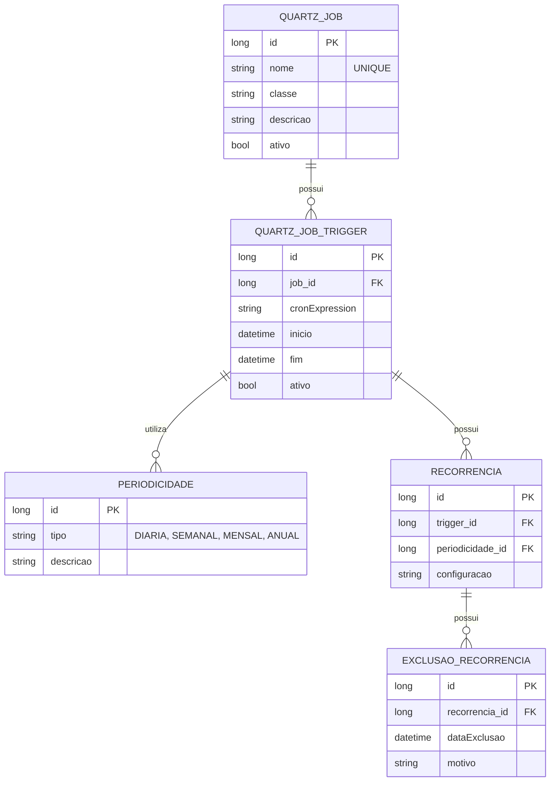

# CDU - Manter Quartz

## 1. Metadados
- **Nome do CDU**: Manter Quartz
- **Versão**: 1.0
- **Data**: 2025-06-16
- **Autor**: IA Core
- **Status**: Em Revisão

## 2. Descrição do Caso de Uso

### 2.1. Descrição Breve
O caso de uso "Manter Quartz" permite o gerenciamento de jobs, triggers, periodicidades e recorrências do Quartz no sistema ia-core. Este módulo permite que administradores e desenvolvedores configurem e gerenciem tarefas agendadas, definindo quando e como devem ser executadas, incluindo suporte a periodicidades complexas e exclusões de datas específicas.

### 2.2. Objetivos
- Gerenciar jobs do Quartz
- Configurar triggers e periodicidades
- Definir recorrências complexas
- Gerenciar exclusões de recorrência
- Monitorar execução de jobs agendados

### 2.3. Escopo
**Incluído**:
- Cadastro e gerenciamento de jobs
- Configuração de triggers
- Definição de periodicidades
- Configuração de recorrências
- Exclusões de datas específicas
- Monitoramento de execução

**Excluído**:
- Execução manual de jobs (tratado em CDU separado)
- Análise de performance de jobs
- Distribuição de jobs em cluster

## 3. Atores

| Ator          | Descrição                                    | Tipo |
|---------------|----------------------------------------------|------|
| Administrador | Usuário com acesso total ao sistema          | Primário |
| Desenvolvedor | Usuário responsável por configurar jobs      | Primário |
| Scheduler     | Sistema responsável por executar jobs        | Sistema |

## 4. Pré-condições

### 4.1. Para Cadastrar Job
- Ator deve estar autenticado
- Ator deve ter permissão para configurar jobs
- Scheduler do Quartz deve estar ativo

### 4.2. Para Configurar Trigger
- Ator deve estar autenticado
- Ator deve ter permissão para configurar triggers
- Job alvo deve existir

### 4.3. Para Definir Recorrência
- Ator deve estar autenticado
- Ator deve ter permissão para configurar recorrências
- Trigger deve existir

## 5. Pós-condições

### 5.1. Pós-condição de Sucesso (Cadastrar Job)
- Job é registrado no Quartz
- Job fica disponível para agendamento
- Sistema exibe mensagem de sucesso

### 5.2. Pós-condição de Sucesso (Configurar Trigger)
- Trigger é associado ao job
- Trigger é agendado no Quartz
- Sistema exibe mensagem de sucesso

### 5.3. Pós-condição de Sucesso (Definir Recorrência)
- Recorrência é configurada
- Exclusões são aplicadas
- Sistema exibe mensagem de sucesso

### 5.4. Pós-condição de Falha (Configurar Trigger)
- Trigger não é agendado
- Erros são identificados e reportados
- Sistema exibe mensagem de erro

## 6. Fluxo Principal (Basic Flow)

### 6.1. Fluxo: Cadastrar Job

**Trigger**: O caso de uso inicia quando o ator acessa a opção de cadastrar job no Quartz.

**Passos**:
1. **Dado** ator autenticado com permissão para configurar jobs
2. **Dado** scheduler do Quartz está ativo
3. **Quando** ator acessa "Cadastrar Job"
4. **Então** sistema exibe formulário de cadastro de job
5. **Quando** ator preenche dados do job (nome, classe, descrição)
6. **Quando** ator confirma cadastro
7. **Então** sistema valida dados do job
8. **Se** validação bem-sucedida
   - **Então** sistema registra job no Quartz
   - **Então** sistema exibe mensagem de sucesso
9. **Se** validação falha
   - **Então** sistema exibe mensagem de erro
   - **Então** fluxo retorna ao passo 5

### 6.2. Fluxo: Configurar Trigger

**Trigger**: O caso de uso inicia quando o ator acessa a opção de configurar trigger para um job.

**Passos**:
1. **Dado** ator autenticado com permissão para configurar triggers
2. **Dado** job alvo existe
3. **Quando** ator acessa "Configurar Trigger" para um job
4. **Então** sistema exibe formulário de configuração de trigger
5. **Quando** ator seleciona tipo de periodicidade
6. **Quando** ator define parâmetros do trigger (cron expression, intervalo, etc)
7. **Quando** ator confirma configuração
8. **Então** sistema valida configuração do trigger
9. **Se** validação bem-sucedida
   - **Então** sistema associa trigger ao job
   - **Então** sistema agenda trigger no Quartz
   - **Então** sistema exibe mensagem de sucesso
10. **Se** validação falha
    - **Então** sistema exibe mensagem de erro
    - **Então** fluxo retorna ao passo 5

### 6.3. Fluxo: Definir Recorrência

**Trigger**: O caso de uso inicia quando o ator acessa a opção de definir recorrência para um trigger.

**Passos**:
1. **Dado** ator autenticado com permissão para configurar recorrências
2. **Dado** trigger existe
3. **Quando** ator acessa "Definir Recorrência" para um trigger
4. **Então** sistema exibe formulário de recorrência
5. **Quando** ator define periodicidade (diária, semanal, mensal, etc)
6. **Quando** ator adiciona exclusões de datas específicas
7. **Quando** ator confirma configuração
8. **Então** sistema valida recorrência
9. **Se** validação bem-sucedida
   - **Então** sistema configura recorrência no Quartz
   - **Então** sistema aplica exclusões
   - **Então** sistema exibe mensagem de sucesso
10. **Se** validação falha
    - **Então** sistema exibe mensagem de erro
    - **Então** fluxo retorna ao passo 5

## 7. Fluxos Alternativos

### 7.1. Fluxo Alternativo: Job com Parâmetros Dinâmicos

1. **Dado** ator autenticado com permissão para configurar jobs
2. **Quando** ator seleciona opção "Adicionar Parâmetros"
3. **Então** sistema exibe formulário de parâmetros
4. **Quando** ator define parâmetros dinâmicos (chave, valor, tipo)
5. **Então** sistema valida parâmetros
6. **Então** sistema associa parâmetros ao job

### 7.2. Fluxo Alternativo: Trigger com Múltiplas Recorrências

1. **Dado** ator autenticado com permissão para configurar triggers
2. **Quando** ator seleciona opção "Adicionar Recorrência Adicional"
3. **Então** sistema exibe formulário de recorrência adicional
4. **Quando** ator define nova recorrência
5. **Então** sistema combina recorrências
6. **Então** sistema exibe preview de execuções

## 8. Fluxos de Exceção

### 8.1. Fluxo de Exceção: Job com Nome Duplicado

1. **Dado** sistema está validando cadastro de job
2. **Quando** sistema detecta nome de job duplicado
3. **Então** sistema exibe mensagem de erro indicando que nome já existe
4. **Então** sistema impede cadastro
5. **Então** fluxo retorna ao passo de preenchimento

### 8.2. Fluxo de Exceção: Cron Expression Inválida

1. **Dado** sistema está validando configuração de trigger
2. **Quando** sistema detecta cron expression inválida
3. **Então** sistema exibe mensagem de erro indicando problema na expressão
4. **Então** sistema impede configuração
5. **Então** ator deve corrigir expressão antes de continuar

### 8.3. Fluxo de Exceção: Scheduler Inativo

1. **Dado** ator tenta configurar job ou trigger
2. **Quando** sistema detecta que scheduler está inativo
3. **Então** sistema exibe mensagem de erro indicando que scheduler está inativo
4. **Então** sistema impede operação
5. **Então** ator deve ativar scheduler antes de continuar

### 8.4. Fluxo de Exceção: Exclusão de Data Inválida

1. **Dado** sistema está validando exclusão de recorrência
2. **Quando** sistema detecta data de exclusão inválida
3. **Então** sistema exibe mensagem de erro indicando problema na data
4. **Então** sistema impede exclusão
5. **Então** ator deve corrigir data antes de continuar

## 9. Fluxos de Navegação (Mestre-Detalhe)

### 9.1. Navegação: Visualizar Execuções de Job

1. A partir da lista de jobs, ator clica em um job
2. Sistema exibe detalhes do job
3. Ator clica em "Execuções"
4. Sistema exibe histórico de execuções do job

### 9.2. Navegação: Gerenciar Parâmetros de Job

1. A partir do formulário de job, ator clica em "Parâmetros"
2. Sistema exibe lista de parâmetros
3. Ator pode adicionar, editar ou remover parâmetros
4. Ao salvar job, parâmetros são persistidos

## 10. Regras de Negócio

| ID | Regra de Negócio | Tipo | Aplicação |
|----|------------------|------|-----------|
| RN001 | Nome de job deve ser único | Validação | Cadastro de job |
| RN002 | Cron expression deve ser válida | Validação | Configuração de trigger |
| RN003 | Scheduler deve estar ativo para operações | Validação | Todas as operações |
| RN004 | Exclusões de recorrência devem ter datas válidas | Validação | Configuração de recorrência |
| RN005 | Jobs não podem ser deletados se tiverem triggers ativos | Validação | Exclusão de job |

## 11. Estrutura de Dados

## 12. Contratos de Interface

### 12.1. Interface REST

| Método | Endpoint                          | Descrição                      |
|--------|-----------------------------------|--------------------------------|
| GET    | `/api/${api.version}/quartz/jobs`           | Lista jobs com paginação        |
| GET    | `/api/${api.version}/quartz/jobs/{id}`       | Busca job por ID               |
| POST   | `/api/${api.version}/quartz/jobs`           | Cadastra novo job              |
| PUT    | `/api/${api.version}/quartz/jobs/{id}`       | Atualiza job                   |
| DELETE | `/api/${api.version}/quartz/jobs/{id}`       | Exclui job                     |
| GET    | `/api/${api.version}/quartz/triggers`        | Lista triggers com paginação     |
| GET    | `/api/${api.version}/quartz/triggers/{id}`    | Busca trigger por ID            |
| POST   | `/api/${api.version}/quartz/triggers`        | Cadastra novo trigger           |
| PUT    | `/api/${api.version}/quartz/triggers/{id}`    | Atualiza trigger                |
| DELETE | `/api/${api.version}/quartz/triggers/{id}`    | Exclui trigger                  |

### 12.2. Endpoints de Recorrência

| Método | Endpoint                              | Descrição                 |
|--------|---------------------------------------|---------------------------|
| GET    | `/api/${api.version}/quartz/recorrencias`        | Lista recorrências         |
| GET    | `/api/${api.version}/quartz/recorrencias/{id}`    | Busca recorrência por ID   |
| POST   | `/api/${api.version}/quartz/recorrencias`        | Cadastra nova recorrência   |
| PUT    | `/api/${api.version}/quartz/recorrencias/{id}`    | Atualiza recorrência        |
| DELETE | `/api/${api.version}/quartz/recorrencias/{id}`    | Exclui recorrência          |
| GET    | `/api/${api.version}/quartz/exclusoes`           | Lista exclusões             |
| POST   | `/api/${api.version}/quartz/exclusoes`           | Cadastra nova exclusão      |
| DELETE | `/api/${api.version}/quartz/exclusoes/{id}`       | Exclui exclusão             |

## 13. Requisitos Especiais

### 13.1. Segurança
- Configuração de jobs requer permissões específicas
- Validação de permissões para operações destrutivas
- Logs de todas as configurações para auditoria

### 13.2. Performance
- Scheduler deve ser otimizado para grande volume de jobs
- Cache de configurações de jobs para performance
- Processamento assíncrono de execuções

### 13.3. Conformidade
- Histórico completo de execuções para auditoria
- Validação de cron expressions antes de agendamento
- Respeito a limites de recursos do sistema

## 14. Pontos de Extensão

### 14.1. Execução Manual de Jobs
- **Extensão 1**: Capacidade de executar jobs manualmente
- **Quando**: Requisito de execução on-demand
- **Como**: Implementar endpoint para execução manual de job

### 14.2. Análise de Performance de Jobs
- **Extensão 2**: Monitoramento de performance de jobs
- **Quando**: Requisito de análise de performance
- **Como**: Implementar coleta de métricas de execução

### 14.3. Distribuição em Cluster
- **Extensão 3**: Suporte a distribuição de jobs em cluster
- **Quando**: Requisito de alta disponibilidade
- **Como**: Configurar Quartz com clustering

## 15. Referências

### ADRs Relacionados
- ADR-012: Testing Patterns (Consideração de CDU e Comentários de Método)
- ADR-050: Diretrizes Gerais de Padronização
- ADR-052: MADR e Linguagem Normativa
- ADR-053: Usar CDU para Documentação de Casos de Uso

### Documentação Técnica
- Documentação oficial do Quartz Scheduler
- Especificação de cron expressions
- Configuração de scheduler no ia-core
