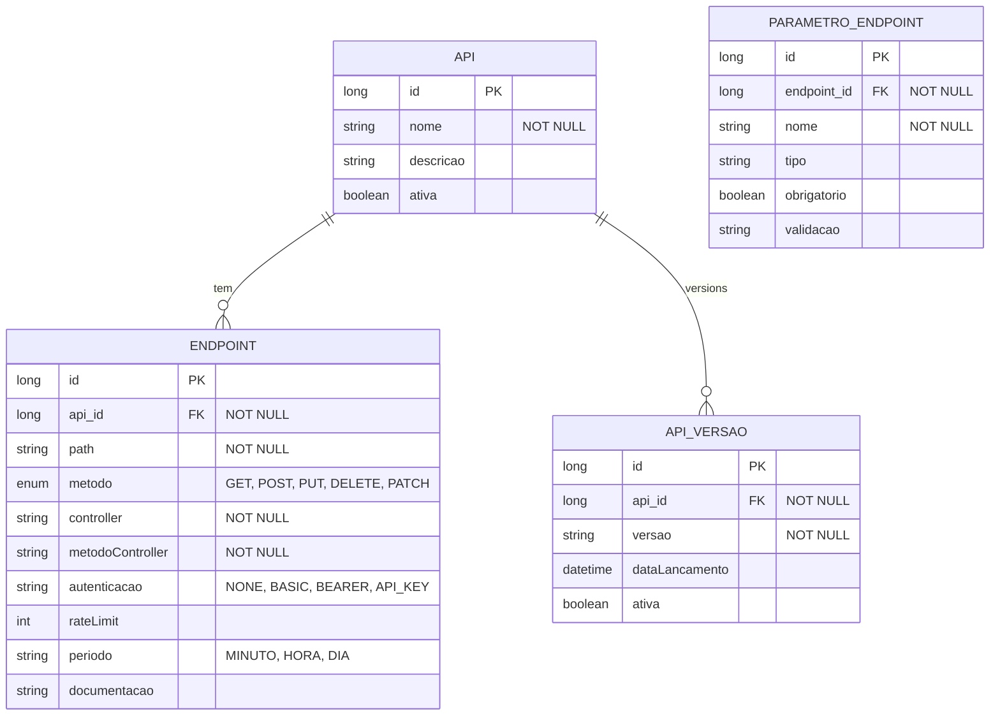

# CDU - Manter REST

## 1. Metadados
- **Nome do CDU**: Manter REST
- **Versão**: 1.0
- **Data**: 2025-06-16
- **Autor**: IA Core
- **Status**: Em Revisão

## 2. Descrição do Caso de Uso

### 2.1. Descrição Breve
O caso de uso "Manter REST" gerencia as APIs REST expostas pelo sistema ia-core. Permite configurar endpoints, versionamento, documentação e políticas de acesso. Este módulo permite que desenvolvedores e administradores configurem e gerenciem APIs REST, definindo endpoints, métodos, autenticação, rate limiting e documentação OpenAPI.

### 2.2. Objetivos
- Criar e gerenciar APIs REST
- Configurar endpoints e métodos
- Implementar versionamento de APIs
- Gerar documentação OpenAPI
- Configurar autenticação e autorização
- Implementar rate limiting

### 2.3. Escopo
**Incluído**:
- Cadastro e gerenciamento de APIs
- Configuração de endpoints
- Versionamento de APIs
- Documentação OpenAPI
- Configuração de autenticação
- Rate limiting

**Excluído**:
- Execução de endpoints (tratado em CDU separado)
- Monitoramento de performance de APIs
- Análise de logs de requisições

## 3. Atores

| Ator | Descrição | Tipo |
|------|------------|------|
| Desenvolvedor | Cria e mantém APIs | Primário |
| Administrador | Configura acesso | Primário |
| Consumidor | Consome APIs | Secundário |

## 4. Pré-condições

### 4.1. Para Criar Endpoint
- Ator deve estar autenticado
- Ator deve ter permissão para configurar APIs
- API alvo deve existir

### 4.2. Para Versionar API
- Ator deve estar autenticado
- Ator deve ter permissão para versionar APIs
- API deve existir

### 4.3. Para Documentar Endpoint
- Ator deve estar autenticado
- Ator deve ter permissão para documentar APIs
- Endpoint deve existir

## 5. Pós-condições

### 5.1. Pós-condição de Sucesso (Criar Endpoint)
- Endpoint é registrado no sistema
- Endpoint fica disponível para uso
- Sistema exibe mensagem de sucesso

### 5.2. Pós-condição de Sucesso (Versionar API)
- Nova versão é criada
- Versões anteriores são mantidas
- Sistema exibe mensagem de sucesso

### 5.3. Pós-condição de Sucesso (Documentar Endpoint)
- Documentação é atualizada
- OpenAPI é regerado
- Sistema exibe mensagem de sucesso

### 5.4. Pós-condição de Falha (Criar Endpoint)
- Endpoint não é registrado
- Erros são identificados e reportados
- Sistema exibe mensagem de erro

## 6. Fluxo Principal (Basic Flow)

### 6.1. Fluxo: Criar Endpoint

**Trigger**: O caso de uso inicia quando o ator acessa a opção de criar novo endpoint.

**Passos**:
1. **Dado** ator autenticado com permissão para configurar APIs
2. **Dado** API alvo existe
3. **Quando** ator acessa "Novo Endpoint"
4. **Então** sistema exibe formulário de cadastro de endpoint
5. **Quando** ator define path [RN001]
6. **Quando** ator seleciona método (GET, POST, PUT, DELETE) [RN002]
7. **Quando** ator define controller e método [RN003]
8. **Quando** ator define parâmetros
9. **Quando** ator confirma cadastro
10. **Então** sistema valida dados do endpoint
11. **Se** validação bem-sucedida
    - **Então** sistema registra endpoint
    - **Então** sistema exibe mensagem de sucesso
12. **Se** validação falha
    - **Então** sistema exibe mensagem de erro
    - **Então** fluxo retorna ao passo 5

### 6.2. Fluxo: Versionar API

**Trigger**: O caso de uso inicia quando o ator acessa a opção de criar nova versão de API.

**Passos**:
1. **Dado** ator autenticado com permissão para versionar APIs
2. **Dado** API existe
3. **Quando** ator acessa API
4. **Quando** ator clica em "Nova Versão"
5. **Então** sistema cria versão
6. **Quando** ator configura diferenças da versão
7. **Quando** ator define número da versão [RN004]
8. **Quando** ator confirma versão
9. **Então** sistema mantém versões paralelas
10. **Então** sistema exibe mensagem de sucesso

### 6.3. Fluxo: Documentar Endpoint

**Trigger**: O caso de uso inicia quando o ator acessa a opção de documentar endpoint.

**Passos**:
1. **Dado** ator autenticado com permissão para documentar APIs
2. **Dado** endpoint existe
3. **Quando** ator acessa endpoint
4. **Quando** ator acessa "Documentação"
5. **Então** sistema exibe formulário de documentação
6. **Quando** ator escreve descrição
7. **Quando** ator define exemplos
8. **Quando** ator confirma documentação
9. **Então** sistema gera OpenAPI [RN005]
10. **Então** sistema exibe mensagem de sucesso

## 7. Fluxos Alternativos

### 7.1. Fluxo Alternativo: Endpoint com Múltiplos Métodos

1. **Dado** ator autenticado com permissão para configurar APIs
2. **Quando** ator acessa "Novo Endpoint"
3. **Quando** ator define path
4. **Quando** ator seleciona múltiplos métodos (GET, POST, PUT, DELETE)
5. **Então** sistema cria múltiplos endpoints com mesmo path
6. **Então** sistema exibe confirmação

### 7.2. Fluxo Alternativo: Documentação com Exemplos Automáticos

1. **Dado** ator autenticado com permissão para documentar APIs
2. **Quando** ator acessa "Documentação"
3. **Quando** ator seleciona opção "Gerar Exemplos Automáticos"
4. **Então** sistema gera exemplos baseados em parâmetros
5. **Então** sistema exibe preview dos exemplos

## 8. Fluxos de Exceção

### 8.1. Fluxo de Exceção: Conflito de Path

1. **Dado** sistema está validando cadastro de endpoint
2. **Quando** sistema detecta path duplicado [RN001]
3. **Então** sistema exibe mensagem de erro indicando que path já existe
4. **Então** sistema impede cadastro
5. **Então** fluxo retorna ao passo de preenchimento

### 8.2. Fluxo de Exceção: Método Não Encontrado

1. **Dado** sistema está validando configuração de endpoint
2. **Quando** sistema não encontra método no controller [RN003]
3. **Então** sistema exibe erro de configuração
4. **Então** sistema impede cadastro
5. **Então** ator deve corrigir mapeamento antes de continuar

### 8.3. Fluxo de Exceção: Versão Inválida

1. **Dado** sistema está validando versão de API
2. **Quando** sistema detecta versão inválida [RN004]
3. **Então** sistema exibe mensagem de erro indicando problema na versão
4. **Então** sistema impede versionamento
5. **Então** ator deve corrigir versão antes de continuar

## 9. Fluxos de Navegação (Mestre-Detalhe)

### 9.1. Navegação: Gerenciar Parâmetros

1. A partir do endpoint, ator acessa "Parâmetros"
2. Sistema exibe lista de parâmetros
3. Ator configura validações
4. Sistema registra configurações

### 9.2. Navegação: Configurar Autenticação

1. A partir do endpoint, ator acessa "Autenticação"
2. Define tipo (NONE, BASIC, BEARER, API_KEY)
3. Sistema aplica configuração

### 9.3. Navegação: Rate Limiting

1. A partir do endpoint, ator acessa "Limites"
2. Define número de requisições
3. Define período
4. Sistema aplica limits

## 10. Regras de Negócio

| ID | Regra de Negócio | Tipo | Aplicação |
|----|------------------|------|-----------|
| RN001 | Path deve ser único | Validação | Cadastro de endpoint |
| RN002 | Método é obrigatório | Validação | Cadastro de endpoint |
| RN003 | Controller e método são obrigatórios | Validação | Cadastro de endpoint |
| RN004 | Versão deve seguir formato semântico | Validação | Versionamento de API |
| RN005 | Documentação é opcional | Validação | Documentação de endpoint |

## 11. Estrutura de Dados

## 12. Contratos de Interface

### 12.1. Interface REST

| Método | Endpoint | Descrição |
|--------|----------|------------|
| GET | `/api/${api.version}/apis` | Lista APIs |
| POST | `/api/${api.version}/apis` | Cria API |
| GET | `/api/${api.version}/apis/{id}` | Busca API |
| PUT | `/api/${api.version}/apis/{id}` | Atualiza API |
| DELETE | `/api/${api.version}/apis/{id}` | Exclui API |
| GET | `/api/${api.version}/apis/{id}/openapi` | Gera OpenAPI |

### 12.2. Endpoints de Relacionamento

| Método | Endpoint | Descrição |
|--------|----------|------------|
| GET | `/api/${api.version}/apis/{id}/endpoints` | Lista endpoints |
| POST | `/api/${api.version}/apis/{id}/endpoints` | Adiciona endpoint |
| GET | `/api/${api.version}/apis/{id}/versoes` | Lista versões |
| POST | `/api/${api.version}/apis/{id}/versoes` | Cria versão |

## 13. Requisitos Especiais

### 13.1. Segurança
- Configuração de APIs requer permissões específicas
- Validação de autenticação e autorização para endpoints
- Logs de todas as configurações para auditoria

### 13.2. Performance
- Cache de documentação OpenAPI para performance
- Rate limiting para prevenir abuso de APIs
- Otimização de geração de documentação

### 13.3. Conformidade
- Histórico completo de versões para auditoria
- Validação de formato semântico de versões
- Respeito a padrões RESTful e OpenAPI

## 14. Pontos de Extensão

### 14.1. Monitoramento de Performance de APIs
- **Extensão 1**: Monitoramento de performance de APIs
- **Quando**: Requisito de análise de performance
- **Como**: Implementar coleta de métricas de requisições

### 14.2. Análise de Logs de Requisições
- **Extensão 2**: Análise de logs de requisições
- **Quando**: Requisito de análise de uso de APIs
- **Como**: Implementar coleta e análise de logs

### 14.3. Testes Automatizados de APIs
- **Extensão 3**: Testes automatizados de APIs
- **Quando**: Requisito de validação de APIs
- **Como**: Implementar testes automatizados baseados em OpenAPI

## 15. Referências

### ADRs Relacionados
- ADR-012: Testing Patterns (Consideração de CDU e Comentários de Método)
- ADR-053: Usar CDU para Documentação de Casos de Uso

### Documentação Técnica
- Especificação OpenAPI
- Padrões RESTful
- Documentação de APIs REST do ia-core
