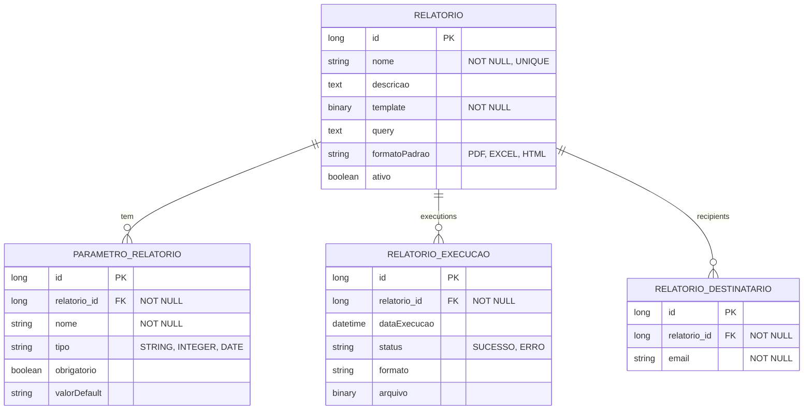

# CDU - Manter Report

## 1. Metadados
- **Nome do CDU**: Manter Report
- **Versão**: 1.0
- **Data**: 2025-06-16
- **Autor**: IA Core
- **Status**: Em Revisão

## 2. Descrição do Caso de Uso

### 2.1. Descrição Breve
O caso de uso "Manter Report" gerencia os relatórios do sistema ia-core. Permite criar, editar e executar relatórios utilizando JasperReports ou similar. Este módulo permite que administradores e desenvolvedores configurem e gerenciem relatórios, definindo templates, parâmetros, queries SQL, agendamentos e destinatários para envio automático.

### 2.2. Objetivos
- Criar e gerenciar relatórios
- Configurar templates JasperReports
- Definir parâmetros de relatórios
- Executar relatórios em diferentes formatos
- Agendar execução automática de relatórios
- Gerenciar destinatários para envio

### 2.3. Escopo
**Incluído**:
- Cadastro e gerenciamento de relatórios
- Configuração de templates (.jrxml)
- Definição de parâmetros
- Execução de relatórios (PDF, EXCEL, HTML)
- Agendamento de relatórios
- Histórico de execuções

**Excluído**:
- Criação visual de templates (requer ferramenta externa)
- Análise avançada de performance de relatórios
- Distribuição de relatórios em cluster

## 3. Atores

| Ator | Descrição | Tipo |
|------|------------|------|
| Administrador | Gerencia relatórios | Primário |
| Desenvolvedor | Cria templates | Primário |
| Usuário | Executa relatórios | Secundário |

## 4. Pré-condições

### 4.1. Para Criar Relatório
- Ator deve estar autenticado
- Ator deve ter permissão para gerenciar relatórios
- Template (.jrxml) deve estar disponível

### 4.2. Para Executar Relatório
- Ator deve estar autenticado
- Ator deve ter permissão para executar relatórios
- Relatório deve existir e estar ativo

### 4.3. Para Agendar Relatório
- Ator deve estar autenticado
- Ator deve ter permissão para agendar relatórios
- Relatório deve existir
- Scheduler do Quartz deve estar ativo

## 5. Pós-condições

### 5.1. Pós-condição de Sucesso (Criar Relatório)
- Relatório é registrado no sistema
- Template é compilado
- Sistema exibe mensagem de sucesso

### 5.2. Pós-condição de Sucesso (Executar Relatório)
- Relatório é gerado
- Arquivo é retornado ao ator
- Sistema registra execução no histórico

### 5.3. Pós-condição de Sucesso (Agendar Relatório)
- Agendamento é configurado no Quartz
- Destinatários são configurados
- Sistema exibe mensagem de sucesso

### 5.4. Pós-condição de Falha (Executar Relatório)
- Relatório não é gerado
- Erros são identificados e reportados
- Sistema exibe mensagem de erro

## 6. Fluxo Principal (Basic Flow)

### 6.1. Fluxo: Criar Relatório

**Trigger**: O caso de uso inicia quando o ator acessa a opção de criar novo relatório.

**Passos**:
1. **Dado** ator autenticado com permissão para gerenciar relatórios
2. **Dado** template (.jrxml) está disponível
3. **Quando** ator acessa "Novo Relatório"
4. **Então** sistema exibe formulário de cadastro de relatório
5. **Quando** ator define nome [RN001]
6. **Quando** ator carrega arquivo de template (.jrxml) [RN002]
7. **Quando** ator define parâmetros
8. **Quando** ator define query SQL [RN003]
9. **Quando** ator confirma cadastro
10. **Então** sistema compila relatório
11. **Se** compilação bem-sucedida
    - **Então** sistema salva relatório
    - **Então** sistema exibe mensagem de sucesso
12. **Se** compilação falha
    - **Então** sistema exibe mensagem de erro
    - **Então** fluxo retorna ao passo 5

### 6.2. Fluxo: Executar Relatório

**Trigger**: O caso de uso inicia quando o ator acessa a opção de executar relatório.

**Passos**:
1. **Dado** ator autenticado com permissão para executar relatórios
2. **Dado** relatório existe e está ativo
3. **Quando** ator acessa lista de relatórios
4. **Quando** ator seleciona relatório
5. **Então** sistema exibe parâmetros do relatório
6. **Quando** ator preenche parâmetros [RN004]
7. **Quando** ator seleciona formato (PDF, EXCEL, HTML) [RN005]
8. **Quando** ator confirma execução
9. **Então** sistema gera relatório
10. **Então** sistema retorna arquivo
11. **Então** sistema registra execução no histórico

### 6.3. Fluxo: Agendar Relatório

**Trigger**: O caso de uso inicia quando o ator acessa a opção de agendar relatório.

**Passos**:
1. **Dado** ator autenticado com permissão para agendar relatórios
2. **Dado** relatório existe
3. **Dado** scheduler do Quartz está ativo
4. **Quando** ator acessa relatório
5. **Quando** ator clica em "Agendar"
6. **Então** sistema exibe configurações de agendamento
7. **Quando** ator define periodicidade
8. **Quando** ator define destinatários
9. **Quando** ator confirma agendamento
10. **Então** sistema agenda execução no Quartz
11. **Então** sistema configura destinatários
12. **Então** sistema exibe mensagem de sucesso

## 7. Fluxos Alternativos

### 7.1. Fluxo Alternativo: Relatório com Múltiplos Formatos

1. **Dado** ator autenticado com permissão para executar relatórios
2. **Quando** ator seleciona opção "Gerar Múltiplos Formatos"
3. **Então** sistema exibe opções de formato
4. **Quando** ator seleciona múltiplos formatos (PDF, EXCEL, HTML)
5. **Então** sistema gera relatórios em todos os formatos selecionados
6. **Então** sistema retorna arquivos compactados

### 7.2. Fluxo Alternativo: Agendamento com Condições Especiais

1. **Dado** ator autenticado com permissão para agendar relatórios
2. **Quando** ator acessa "Agendar"
3. **Quando** ator seleciona opção "Condições Especiais"
4. **Então** sistema exibe formulário de condições
5. **Quando** ator define condições (ex: apenas se houver dados)
6. **Então** sistema aplica condições ao agendamento

## 8. Fluxos de Exceção

### 8.1. Fluxo de Exceção: Erro na Query

1. **Dado** sistema está validando query SQL
2. **Quando** sistema detecta erro na query [RN003]
3. **Então** sistema exibe mensagem de erro indicando problema na query
4. **Então** sistema impede cadastro
5. **Então** fluxo retorna ao passo de preenchimento

### 8.2. Fluxo de Exceção: Parâmetro Obrigatório

1. **Dado** sistema está validando execução de relatório
2. **Quando** ator tenta executar sem parâmetro obrigatório [RN004]
3. **Então** sistema exibe erro indicando parâmetro obrigatório
4. **Então** sistema impede execução
5. **Então** ator deve informar valor antes de continuar

### 8.3. Fluxo de Exceção: Template Inválido

1. **Dado** sistema está compilando template
2. **Quando** sistema detecta template inválido [RN002]
3. **Então** sistema exibe mensagem de erro indicando problema no template
4. **Então** sistema impede cadastro
5. **Então** ator deve corrigir template antes de continuar

## 9. Fluxos de Navegação (Mestre-Detalhe)

### 9.1. Navegação: Gerenciar Parâmetros

1. A partir do relatório, ator acessa "Parâmetros"
2. Sistema exibe lista de parâmetros
3. Ator adiciona/edita parâmetros
4. Sistema valida parâmetros

### 9.2. Navegação: Visualizar Histórico

1. A partir do relatório, ator acessa "Histórico"
2. Sistema exibe execuções anteriores
3. Ator pode baixar relatórios gerados

### 9.3. Navegação: Configurar Destinatários

1. A partir do relatório, ator acessa "Destinatários"
2. Sistema exibe lista de emails
3. Ator adiciona destinatários
4. Sistema salva configurações

## 10. Regras de Negócio

| ID | Regra de Negócio | Tipo | Aplicação |
|----|------------------|------|-----------|
| RN001 | Nome é obrigatório e único | Validação | Cadastro de relatório |
| RN002 | Template é obrigatório | Validação | Cadastro de relatório |
| RN003 | Query deve ser válida | Validação | Cadastro de relatório |
| RN004 | Parâmetros podem ser obrigatórios ou opcionais | Validação | Execução de relatório |
| RN005 | Formato padrão pode ser definido | Validação | Configuração de relatório |

## 11. Estrutura de Dados

## 12. Contratos de Interface

### 12.1. Interface REST

| Método | Endpoint | Descrição |
|--------|----------|------------|
| GET | `/api/${api.version}/reports` | Lista relatórios |
| POST | `/api/${api.version}/reports` | Cria relatório |
| GET | `/api/${api.version}/reports/{id}` | Busca relatório |
| PUT | `/api/${api.version}/reports/{id}` | Atualiza relatório |
| DELETE | `/api/${api.version}/reports/{id}` | Exclui relatório |
| POST | `/api/${api.version}/reports/{id}/execute` | Executa relatório |
| POST | `/api/${api.version}/reports/{id}/schedule` | Agenda relatório |

### 12.2. Endpoints de Relacionamento

| Método | Endpoint | Descrição |
|--------|----------|------------|
| GET | `/api/${api.version}/reports/{id}/parametros` | Lista parâmetros |
| POST | `/api/${api.version}/reports/{id}/parametros` | Adiciona parâmetro |
| GET | `/api/${api.version}/reports/{id}/execucoes` | Lista execuções |
| GET | `/api/${api.version}/reports/{id}/download/{execucaoId}` | Baixa execução |

## 13. Requisitos Especiais

### 13.1. Segurança
- Configuração de relatórios requer permissões específicas
- Validação de permissões para operações destrutivas
- Logs de todas as execuções para auditoria

### 13.2. Performance
- Compilação de templates deve ser otimizada
- Cache de relatórios compilados para performance
- Processamento assíncrono de relatórios grandes

### 13.3. Conformidade
- Histórico completo de execuções para auditoria
- Validação de queries SQL antes de execução
- Respeito a limites de recursos do sistema

## 14. Pontos de Extensão

### 14.1. Criação Visual de Templates
- **Extensão 1**: Criação visual de templates JasperReports
- **Quando**: Requisito de criação visual de relatórios
- **Como**: Integrar ferramenta visual como Jaspersoft Studio

### 14.2. Análise de Performance de Relatórios
- **Extensão 2**: Monitoramento de performance de relatórios
- **Quando**: Requisito de análise de performance
- **Como**: Implementar coleta de métricas de execução

### 14.3. Distribuição em Cluster
- **Extensão 3**: Distribuição de relatórios em cluster
- **Quando**: Requisito de alta disponibilidade
- **Como**: Configurar distribuição de jobs em cluster

## 15. Referências

### ADRs Relacionados
- ADR-012: Testing Patterns (Consideração de CDU e Comentários de Método)
- ADR-053: Usar CDU para Documentação de Casos de Uso

### CDUs Relacionados
- Manter Quartz: Agendamento de relatórios
- Manter Communication: Envio de relatórios por email

### Documentação Técnica
- Documentação oficial do JasperReports
- Especificação de templates .jrxml
- Configuração de relatórios no ia-core
