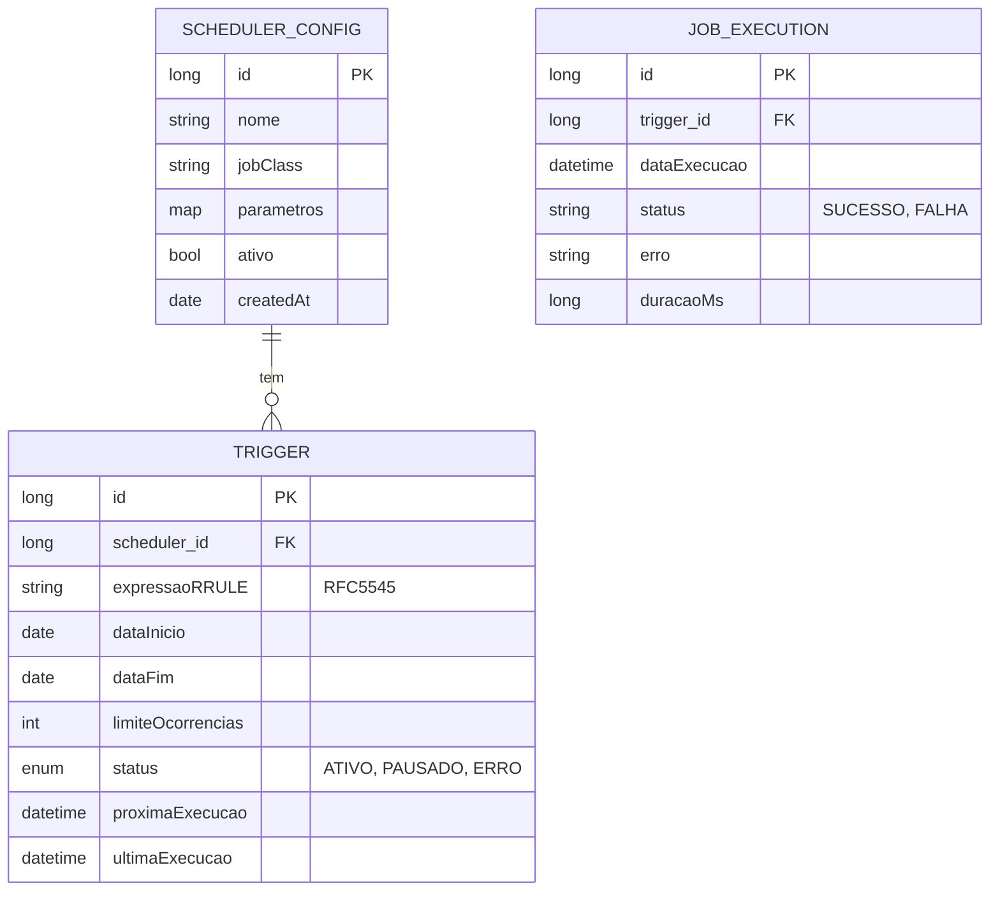

# CDU - Manter Scheduler

## 1. Metadados
- **Nome do CDU**: Manter Scheduler
- **Versão**: 1.0
- **Data**: 2025-06-16
- **Autor**: IA Core
- **Status**: Em Revisão

## 2. Descrição do Caso de Uso

### 2.1. Descrição Breve
O caso de uso "Manter Scheduler" permite o agendamento e execução de tarefas periódicas no sistema ia-core. Utiliza o padrão RFC5545 para definição de periodicidades e gerencia a execução de jobs. Este módulo permite que administradores e desenvolvedores configurem e gerenciem agendamentos, definindo jobs, triggers, periodicidades, parâmetros e exceções.

### 2.2. Objetivos
- Criar e gerenciar agendamentos de jobs
- Configurar periodicidades usando RFC5545
- Definir triggers e parâmetros de jobs
- Pausar e retomar agendamentos
- Monitorar execuções de jobs
- Gerenciar exceções de periodicidade

### 2.3. Escopo
**Incluído**:
- Cadastro e gerenciamento de schedulers
- Configuração de triggers com RFC5545
- Definição de parâmetros de jobs
- Pausa e retomada de agendamentos
- Histórico de execuções
- Exceções de periodicidade

**Excluído**:
- Implementação de jobs (tratado em CDU separado)
- Análise avançada de performance de jobs
- Distribuição de jobs em cluster

## 3. Atores

| Ator | Descrição | Tipo |
|------|------------|------|
| Administrador | Configura agendamentos | Primário |
| Desenvolvedor | Cria jobs | Primário |
| Scheduler | Sistema responsável por executar jobs | Sistema |

## 4. Pré-condições

### 4.1. Para Criar Agendamento
- Ator deve estar autenticado
- Ator deve ter permissão para configurar agendamentos
- Job deve estar implementado no sistema

### 4.2. Para Pausar/Retomar Agendamento
- Ator deve estar autenticado
- Ator deve ter permissão para gerenciar agendamentos
- Agendamento deve existir

### 4.3. Para Excluir Agendamento
- Ator deve estar autenticado
- Ator deve ter permissão para excluir agendamentos
- Agendamento deve existir

## 5. Pós-condições

### 5.1. Pós-condição de Sucesso (Criar Agendamento)
- Scheduler é registrado no sistema
- Trigger é configurado com RFC5545
- Sistema agenda execução
- Sistema exibe mensagem de sucesso

### 5.2. Pós-condição de Sucesso (Pausar/Retomar Agendamento)
- Status do agendamento é atualizado
- Sistema recalcula próximas execuções
- Sistema exibe mensagem de sucesso

### 5.3. Pós-condição de Sucesso (Excluir Agendamento)
- Agendamento é removido do sistema
- Execuções futuras são canceladas
- Sistema exibe mensagem de sucesso

### 5.4. Pós-condição de Falha (Criar Agendamento)
- Scheduler não é registrado
- Erros são identificados e reportados
- Sistema exibe mensagem de erro

## 6. Fluxo Principal (Basic Flow)

### 6.1. Fluxo: Criar Agendamento

**Trigger**: O caso de uso inicia quando o ator acessa a opção de criar novo agendamento.

**Passos**:
1. **Dado** ator autenticado com permissão para configurar agendamentos
2. **Dado** job está implementado no sistema [RN003]
3. **Quando** administrador acessa "Novo Agendamento"
4. **Então** sistema exibe formulário de cadastro
5. **Quando** administrador seleciona job a executar
6. **Quando** administrador define periodicidade [RN001]
   - Frequência (diária, semanal, mensal, anual)
   - Intervalo
   - Dias da semana
   - Data início e fim [RN002]
7. **Quando** administrador define parâmetros do job
8. **Quando** administrador confirma cadastro
9. **Então** sistema valida periodicidade RFC5545 [RN001]
10. **Se** validação bem-sucedida
    - **Então** sistema cria scheduler
    - **Então** sistema agenda execução
    - **Então** sistema exibe mensagem de sucesso
11. **Se** validação falha
    - **Então** sistema exibe mensagem de erro
    - **Então** fluxo retorna ao passo 6

### 6.2. Fluxo: Listar Agendamentos

**Trigger**: O caso de uso inicia quando o ator acessa a lista de agendamentos.

**Passos**:
1. **Dado** ator autenticado com permissão para visualizar agendamentos
2. **Quando** administrador acessa lista de agendamentos
3. **Então** sistema exibe todos os schedulers
4. **Então** sistema mostra próxima execução de cada um
5. **Então** sistema mostra status (ativo, pausado, erro)

### 6.3. Fluxo: Pausar/Retomar Agendamento

**Trigger**: O caso de uso inicia quando o ator acessa a opção de pausar/retomar agendamento.

**Passos**:
1. **Dado** ator autenticado com permissão para gerenciar agendamentos
2. **Dado** agendamento existe
3. **Quando** administrador seleciona agendamento
4. **Quando** administrador clica em pausar/retomar
5. **Então** sistema atualiza status
6. **Então** sistema recalcula próximas execuções
7. **Então** sistema exibe mensagem de sucesso

### 6.4. Fluxo: Excluir Agendamento

**Trigger**: O caso de uso inicia quando o ator acessa a opção de excluir agendamento.

**Passos**:
1. **Dado** ator autenticado com permissão para excluir agendamentos
2. **Dado** agendamento existe
3. **Quando** administrador seleciona agendamento
4. **Quando** administrador clica em excluir
5. **Então** sistema solicita confirmação
6. **Quando** administrador confirma exclusão
7. **Então** sistema remove agendamento
8. **Então** sistema cancela execuções futuras
9. **Então** sistema exibe mensagem de sucesso

## 7. Fluxos Alternativos

### 7.1. Fluxo Alternativo: Agendamento com Múltiplos Triggers

1. **Dado** ator autenticado com permissão para configurar agendamentos
2. **Quando** ator acessa "Novo Agendamento"
3. **Quando** ator seleciona opção "Múltiplos Triggers"
4. **Então** sistema exibe formulário para múltiplos triggers
5. **Quando** ator define múltiplas periodicidades
6. **Então** sistema cria scheduler com múltiplos triggers
7. **Então** sistema exibe confirmação

### 7.2. Fluxo Alternativo: Agendamento com Exceções

1. **Dado** ator autenticado com permissão para configurar agendamentos
2. **Quando** ator acessa "Novo Agendamento"
3. **Quando** ator seleciona opção "Adicionar Exceções"
4. **Então** sistema exibe formulário de exceções
5. **Quando** ator define datas de exceção
6. **Então** sistema aplica exceções ao agendamento
7. **Então** sistema recalcula execuções

## 8. Fluxos de Exceção

### 8.1. Fluxo de Exceção: Erro na Execução

1. **Dado** sistema está executando job
2. **Quando** job falha durante execução [RN004]
3. **Então** sistema registra erro
4. **Então** sistema notifica administrador
5. **Então** scheduler permanece ativo (para próximas tentativas)

### 8.2. Fluxo de Exceção: Periodicidade Inválida

1. **Dado** sistema está validando periodicidade
2. **Quando** administrador define periodicidade inválida [RN001]
3. **Então** sistema exibe erro de validação
4. **Então** sistema impede cadastro
5. **Então** fluxo retorna ao formulário

### 8.3. Fluxo de Exceção: Job Não Implementado

1. **Dado** sistema está validando job
2. **Quando** job não está implementado no sistema [RN003]
3. **Então** sistema exibe erro indicando job não encontrado
4. **Então** sistema impede cadastro
5. **Então** ator deve selecionar job válido antes de continuar

## 9. Fluxos de Navegação (Mestre-Detalhe)

### 9.1. Navegação: Configurar Trigger

1. A partir do formulário de scheduler, o ator acessa "Trigger"
2. Sistema exibe configurações de trigger
3. Ator define: frequência, intervalo, dias, início, fim
4. Sistema valida RFC5545
5. Sistema salva trigger

### 9.2. Navegação: Visualizar Execuções

1. A partir da lista de agendamentos, ator seleciona um
2. Acessa "Histórico de Execuções"
3. Sistema exibe lista de execuções
4. Mostra data, status, duração, erro (se houver)
5. Ator pode filtrar por status e período

### 9.3. Navegação: Configurar Parâmetros do Job

1. A partir do formulário, ator acessa "Parâmetros"
2. Sistema exibe campos de parâmetros
3. Ator define: chave-valor para o job
4. Sistema salva parâmetros
5. Parâmetros são passados ao job na execução

### 9.4. Navegação: Gerenciar Exceções

1. A partir do scheduler, ator acessa "Exceções"
2. Sistema exibe datas excluídas
3. Ator adiciona data de exceção
4. Sistema adiciona à lista
5. Execuções são recalculadas

## 10. Regras de Negócio

| ID | Regra de Negócio | Tipo | Aplicação |
|----|------------------|------|-----------|
| RN001 | Periodicidade segue padrão RFC5545 | Validação | Cadastro de agendamento |
| RN002 | Data de início é obrigatória | Validação | Cadastro de agendamento |
| RN003 | Job deve estar implementado no sistema | Validação | Cadastro de agendamento |
| RN004 | Execuções falhadas são registradas | Validação | Execução de job |
| RN005 | Agendamentos podem ter até 1000 execuções futuras | Validação | Configuração de agendamento |

## 11. Estrutura de Dados

## 12. Contratos de Interface

### 12.1. Interface REST

| Método | Endpoint | Descrição |
|--------|----------|------------|
| GET | `/api/${api.version}/schedulers` | Lista agendamentos |
| POST | `/api/${api.version}/schedulers` | Cria agendamento |
| GET | `/api/${api.version}/schedulers/{id}` | Busca agendamento |
| PUT | `/api/${api.version}/schedulers/{id}` | Atualiza agendamento |
| DELETE | `/api/${api.version}/schedulers/{id}` | Exclui agendamento |
| PUT | `/api/${api.version}/schedulers/{id}/pausar` | Pausa agendamento |
| PUT | `/api/${api.version}/schedulers/{id}/retomar` | Retoma agendamento |

### 12.2. Endpoints de Relacionamento

| Método | Endpoint | Descrição |
|--------|----------|------------|
| GET | `/api/${api.version}/schedulers/{id}/trigger` | Busca trigger |
| PUT | `/api/${api.version}/schedulers/{id}/trigger` | Atualiza trigger |
| GET | `/api/${api.version}/schedulers/{id}/execucoes` | Lista execuções |
| GET | `/api/${api.version}/schedulers/{id}/parametros` | Busca parâmetros |
| PUT | `/api/${api.version}/schedulers/{id}/parametros` | Atualiza parâmetros |

## 13. Requisitos Especiais

### 13.1. Segurança
- Configuração de agendamentos requer permissões específicas
- Validação de permissões para operações destrutivas
- Logs de todas as execuções para auditoria

### 13.2. Performance
- Validação de RFC5545 deve ser otimizada
- Cache de cálculos de periodicidade para performance
- Processamento assíncrono de jobs longos

### 13.3. Conformidade
- Histórico completo de execuções para auditoria
- Validação de RFC5545 antes de agendamento
- Respeito a limites de execuções futuras [RN005]

## 14. Pontos de Extensão

### 14.1. Implementação de Jobs
- **Extensão 1**: Implementação de jobs customizados
- **Quando**: Requisito de implementação de jobs específicos
- **Como**: Criar classes de job seguindo padrão do scheduler

### 14.2. Análise de Performance de Jobs
- **Extensão 2**: Monitoramento de performance de jobs
- **Quando**: Requisito de análise de performance
- **Como**: Implementar coleta de métricas de execução

### 14.3. Distribuição em Cluster
- **Extensão 3**: Distribuição de jobs em cluster
- **Quando**: Requisito de alta disponibilidade
- **Como**: Configurar distribuição de jobs em cluster

## 15. Referências

### ADRs Relacionados
- ADR-012: Testing Patterns (Consideração de CDU e Comentários de Método)
- ADR-053: Usar CDU para Documentação de Casos de Uso

### CDUs Relacionados
- Manter Quartz: Agendamento de jobs com Quartz

### Documentação Técnica
- Padrão RFC5545 para periodicidades
- Documentação de schedulers no ia-core
- Configuração de triggers e jobs
