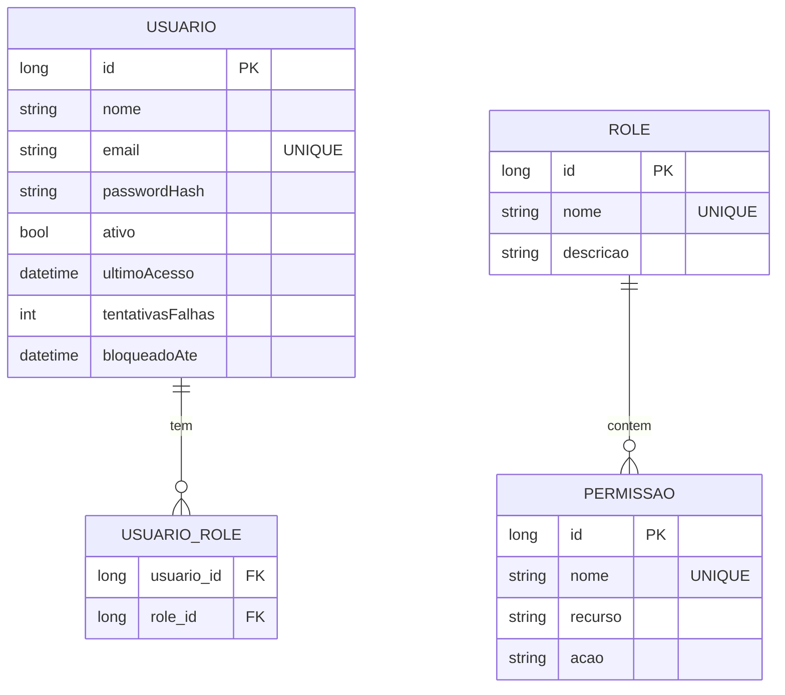

# CDU - Gerenciar Segurança

## 1. Metadados
- **Nome do CDU**: Gerenciar Segurança
- **Versão**: 1.0
- **Data**: 2025-06-16
- **Autor**: IA Core
- **Status**: Em Revisão

## 2. Descrição do Caso de Uso

### 2.1. Descrição Breve
O caso de uso "Gerenciar Segurança" fornece funcionalidades de autenticação, autorização e gerenciamento de usuários e permissões no sistema, permitindo controle de acesso seguro e gerenciamento centralizado de identidades.

### 2.2. Objetivos
- Permitir autenticação segura de usuários
- Gerenciar usuários e suas credenciais
- Controlar acesso através de roles e permissões
- Implementar políticas de segurança (bloqueio, expiração de sessão)
- Recuperar senhas de forma segura

### 2.3. Escopo
**Incluído**:
- Autenticação de usuários
- Registro de novos usuários
- Atribuição de roles e permissões
- Recuperação de senha
- Gerenciamento de sessões

**Excluído**:
- Autenticação via redes sociais
- Autenticação multifator (MFA)
- Auditoria de acessos (será tratado em CDU separado)

## 3. Atores

| Ator | Descrição | Tipo |
|------|------------|------|
| Administrador | Gerencia usuários e permissões | Primário |
| Usuário | Acessa o sistema | Primário |

## 4. Pré-condições

### 4.1. Para Autenticação de Usuário
- Usuário deve ter cadastro no sistema
- Usuário não deve estar bloqueado
- Sistema deve estar disponível

### 4.2. Para Registro de Novo Usuário
- Administrador deve estar autenticado
- Administrador deve ter permissão para criar usuários
- Email fornecido não deve existir no sistema

### 4.3. Para Atribuição de Permissões
- Administrador deve estar autenticado
- Administrador deve ter permissão para gerenciar roles
- Usuário alvo deve existir

### 4.4. Para Recuperação de Senha
- Email fornecido deve existir no sistema
- Usuário não deve estar bloqueado

## 5. Pós-condições

### 5.1. Pós-condição de Sucesso (Autenticação)
- Sessão do usuário é criada
- Usuário é redirecionado para página principal
- Último acesso do usuário é atualizado

### 5.2. Pós-condição de Sucesso (Registro)
- Novo usuário é criado no sistema
- Senha é criptografada e armazenada
- Email é confirmado como único

### 5.3. Pós-condição de Sucesso (Atribuição de Permissões)
- Roles são associadas ao usuário
- Permissões são herdadas das roles
- Alterações são aplicadas imediatamente

### 5.4. Pós-condição de Sucesso (Recuperação de Senha)
- Token de reset é enviado ao email do usuário
- Token tem validade temporária
- Usuário pode definir nova senha

### 5.5. Pós-condição de Falha (Autenticação)
- Contador de tentativas falhas é incrementado
- Se atingir limite, usuário é bloqueado temporariamente
- Mensagem de erro é exibida

## 6. Fluxo Principal (Basic Flow)

### 6.1. Fluxo: Autenticar Usuário

**Trigger**: O caso de uso inicia quando o usuário acessa a tela de login e fornece suas credenciais.

**Passos**:
1. **Dado** usuário tem cadastro no sistema e não está bloqueado
2. **Quando** usuário acessa tela de login
3. **Então** sistema exibe formulário de autenticação
4. **Quando** usuário fornece email e senha
5. **Então** sistema valida credenciais [RN001, RN002]
6. **Se** credenciais válidas [RN003]
   - **Então** sistema cria sessão
   - **Então** sistema atualiza último acesso
   - **Então** sistema redireciona para página principal
7. **Se** credenciais inválidas
   - **Então** sistema incrementa tentativas falhas [RN004]
   - **Então** sistema exibe mensagem de erro
   - **Se** tentativas >= 5
     - **Então** sistema bloqueia usuário temporariamente [RN004]

### 6.2. Fluxo: Registrar Novo Usuário

**Trigger**: O caso de uso inicia quando o administrador acessa a opção de criar novo usuário.

**Passos**:
1. **Dado** administrador autenticado com permissão de criar usuários
2. **Quando** administrador acessa "Novo Usuário"
3. **Então** sistema exibe formulário de cadastro
4. **Quando** administrador preenche nome, email e senha
5. **Então** sistema valida email único [RN002]
6. **Se** email já existe
   - **Então** sistema exibe mensagem de erro
7. **Se** email único
   - **Então** sistema valida senha [RN001]
   - **Então** sistema criptografa senha
   - **Então** sistema cria usuário
   - **Então** sistema exibe mensagem de sucesso

### 6.3. Fluxo: Atribuir Permissões

**Trigger**: O caso de uso inicia quando o administrador seleciona um usuário e acessa a opção de permissões.

**Passos**:
1. **Dado** administrador autenticado com permissão de gerenciar roles
2. **Quando** administrador seleciona usuário
3. **Então** sistema exibe detalhes do usuário
4. **Quando** administrador acessa "Permissões"
5. **Então** sistema exibe lista de roles disponíveis
6. **Quando** administrador seleciona roles
7. **Então** sistema associa roles ao usuário
8. **Então** usuário herda permissões das roles [RN005, RN006]

### 6.4. Fluxo: Recuperar Senha

**Trigger**: O caso de uso inicia quando o usuário acessa a opção "Esqueci minha senha".

**Passos**:
1. **Dado** usuário tem email cadastrado no sistema
2. **Quando** usuário acessa "Esqueci minha senha"
3. **Então** sistema exibe formulário de recuperação
4. **Quando** usuário fornece email
5. **Então** sistema verifica se email existe
6. **Se** email existe
   - **Então** sistema gera token de reset
   - **Então** sistema envia token por email
   - **Então** sistema exibe mensagem de confirmação
7. **Quando** usuário recebe token e acessa link
8. **Então** sistema valida token
9. **Se** token válido
   - **Então** sistema exibe formulário de nova senha
   - **Quando** usuário define nova senha
   - **Então** sistema valida senha [RN001]
   - **Então** sistema criptografa nova senha
   - **Então** sistema atualiza senha do usuário
   - **Então** sistema invalida token

## 7. Fluxos Alternativos

### 7.1. Fluxo Alternativo: Autenticação com Lembrar Credenciais

1. **Dado** usuário está na tela de login
2. **Quando** usuário marca opção "Lembrar credenciais"
3. **Então** sistema armazena token de sessão persistente
4. **Então** sistema mantém sessão ativa por período estendido

### 7.2. Fluxo Alternativo: Registro com Role Padrão

1. **Dado** administrador está criando novo usuário
2. **Quando** administrador não seleciona role específica
3. **Então** sistema atribui role padrão "USER"
4. **Então** usuário é criado com permissões básicas

## 8. Fluxos de Exceção

### 8.1. Fluxo de Exceção: Credenciais Inválidas

1. **Dado** usuário fornece credenciais incorretas
2. **Quando** sistema valida credenciais
3. **Então** sistema detecta credenciais inválidas
4. **Então** sistema incrementa contador de tentativas falhas [RN004]
5. **Se** tentativas < 5
   - **Então** sistema exibe mensagem "Credenciais inválidas"
6. **Se** tentativas >= 5
   - **Então** sistema bloqueia usuário por 15 minutos [RN004]
   - **Então** sistema exibe mensagem "Conta bloqueada temporariamente"

### 8.2. Fluxo de Exceção: Token Expirado

1. **Dado** usuário acessa link de reset de senha
2. **Quando** sistema valida token
3. **Se** token expirou
   - **Então** sistema exibe mensagem "Token expirado"
   - **Então** sistema oferece opção de solicitar novo token

### 8.3. Fluxo de Exceção: Email Não Encontrado

1. **Dado** usuário solicita recuperação de senha
2. **Quando** sistema verifica email
3. **Se** email não existe no sistema
   - **Então** sistema exibe mensagem genérica (por segurança)
   - **Então** sistema não confirma se email existe

### 8.4. Fluxo de Exceção: Sessão Expirada

1. **Dado** usuário está autenticado
2. **Quando** período de inatividade excede 30 minutos [RN003]
3. **Então** sistema invalida sessão
4. **Então** sistema redireciona para tela de login
5. **Então** sistema exibe mensagem "Sessão expirada"

### 8.5. Fluxo de Exceção: Usuário Bloqueado

1. **Dado** usuário tenta autenticar
2. **Quando** sistema verifica status do usuário
3. **Se** usuário está bloqueado
   - **Então** sistema exibe mensagem "Conta bloqueada"
   - **Então** sistema informa tempo restante de bloqueio
   - **Então** sistema oferece opção de contatar suporte

## 9. Fluxos de Navegação (Mestre-Detalhe)

### 9.1. Navegação: Gerenciar Roles do Usuário

1. A partir do formulário de usuário, ator acessa "Roles"
2. Sistema exibe lista de roles disponíveis
3. Ator seleciona roles
4. Sistema vincula roles ao usuário
5. Ator pode remover roles

### 9.2. Navegação: Gerenciar Permissões de Role

1. A partir da lista de roles, ator seleciona uma role
2. Acessa "Permissões"
3. Sistema exibe lista de permissões disponíveis
4. Ator seleciona permissões (criar, ler, atualizar, excluir)
5. Sistema vincula permissões à role

### 9.3. Navegação: Gerenciar Usuários por Role

1. A partir de uma role, ator acessa "Usuários"
2. Sistema exibe usuários com essa role
3. Ator pode adicionar ou remover usuários

### 9.4. Navegação: Configurar Sessão

1. A partir do formulário de usuário, ator acessa "Configurações de Sessão"
2. Sistema exibe: tempo de expiração, IP permitido, etc
3. Ator ajusta configurações
4. Sistema salva

## 10. Regras de Negócio

| ID | Regra de Negócio | Tipo | Aplicação |
|----|------------------|------|-----------|
| RN001 | Senha deve ter mínimo 8 caracteres | Validação | Registro de usuário, recuperação de senha |
| RN002 | Email deve ser único | Validação | Registro de usuário |
| RN003 | Sessão expira após 30 minutos de inatividade | Validação | Autenticação, gerenciamento de sessão |
| RN004 | Após 5 tentativas falhas, bloqueio por 15 minutos | Validação | Autenticação |
| RN005 | Roles podem ser hierárquicas | Validação | Atribuição de permissões |
| RN006 | Permissões seguem padrão RBAC | Validação | Atribuição de permissões |

## 11. Estrutura de Dados

## 12. Contratos de Interface

### 12.1. Interface REST - Autenticação

| Método | Endpoint | Descrição |
|--------|----------|------------|
| POST | `/api/${api.version}/auth/login` | Autentica usuário |
| POST | `/api/${api.version}/auth/logout` | Encerra sessão |
| POST | `/api/${api.version}/auth/esqueci-senha` | Solicita reset |
| POST | `/api/${api.version}/auth/resetar-senha` | Reseta senha |

### 12.2. Interface REST - Usuários

| Método | Endpoint | Descrição |
|--------|----------|------------|
| GET | `/api/${api.version}/usuarios` | Lista usuários |
| POST | `/api/${api.version}/usuarios` | Cria usuário |
| GET | `/api/${api.version}/usuarios/{id}` | Busca usuário |
| PUT | `/api/${api.version}/usuarios/{id}` | Atualiza usuário |
| DELETE | `/api/${api.version}/usuarios/{id}` | Remove usuário |
| PUT | `/api/${api.version}/usuarios/{id}/ativar` | Ativa usuário |
| PUT | `/api/${api.version}/usuarios/{id}/bloquear` | Bloqueia usuário |

### 12.3. Interface REST - Roles

| Método | Endpoint | Descrição |
|--------|----------|------------|
| GET | `/api/${api.version}/roles` | Lista roles |
| POST | `/api/${api.version}/roles` | Cria role |
| GET | `/api/${api.version}/roles/{id}` | Busca role |
| PUT | `/api/${api.version}/roles/{id}` | Atualiza role |
| DELETE | `/api/${api.version}/roles/{id}` | Remove role |

### 12.4. Endpoints de Relacionamento

| Método | Endpoint | Descrição |
|--------|----------|------------|
| GET | `/api/${api.version}/usuarios/{id}/roles` | Lista roles do usuário |
| POST | `/api/${api.version}/usuarios/{id}/roles` | Adiciona role |
| DELETE | `/api/${api.version}/usuarios/{id}/roles/{roleId}` | Remove role |
| GET | `/api/${api.version}/roles/{id}/permissoes` | Lista permissões da role |
| POST | `/api/${api.version}/roles/{id}/permissoes` | Adiciona permissão |
| DELETE | `/api/${api.version}/roles/{id}/permissoes/{permId}` | Remove permissão |
| GET | `/api/${api.version}/roles/{id}/usuarios` | Lista usuários da role

## 13. Requisitos Especiais

### 13.1. Segurança
- Senhas devem ser criptografadas usando algoritmo seguro (BCrypt, Argon2)
- Tokens de sessão devem ser assinados e validados
- Comunicação deve usar HTTPS
- Logs de autenticação devem ser registrados para auditoria

### 13.2. Performance
- Validação de credenciais deve ser rápida (< 500ms)
- Consulta de permissões deve ser cacheada
- Limite de requisições por IP para prevenir ataques de força bruta

### 13.3. Usabilidade
- Mensagens de erro devem ser genéricas para não revelar informações sensíveis
- Interface de recuperação de senha deve ser intuitiva
- Feedback claro sobre status de autenticação

## 14. Pontos de Extensão

### 14.1. Autenticação Multifator (MFA)
- **Extensão 1**: Integração com Google Authenticator ou similar
- **Quando**: Requisito de segurança adicional for necessário
- **Como**: Adicionar passo de verificação de código após autenticação

### 14.2. Autenticação Social
- **Extensão 2**: Integração com OAuth 2.0 (Google, Facebook, etc)
- **Quando**: Usuários preferirem usar contas sociais
- **Como**: Adicionar botões de login social e fluxo de OAuth

### 14.3. Auditoria de Acessos
- **Extensão 3**: Registro detalhado de todas as ações de usuários
- **Quando**: Requisitos de conformidade ou segurança
- **Como**: Implementar sistema de logs e relatórios de auditoria

## 15. Referências

### ADRs Relacionados
- ADR-012: Testing Patterns (Consideração de CDU e Comentários de Método)
- ADR-018: Use Business Rule Chain Pattern
- ADR-053: Usar CDU para Documentação de Casos de Uso

### Documentação Técnica
- Especificação de segurança do sistema
- Documentação de API REST
- Diagramas de arquitetura de segurança |
