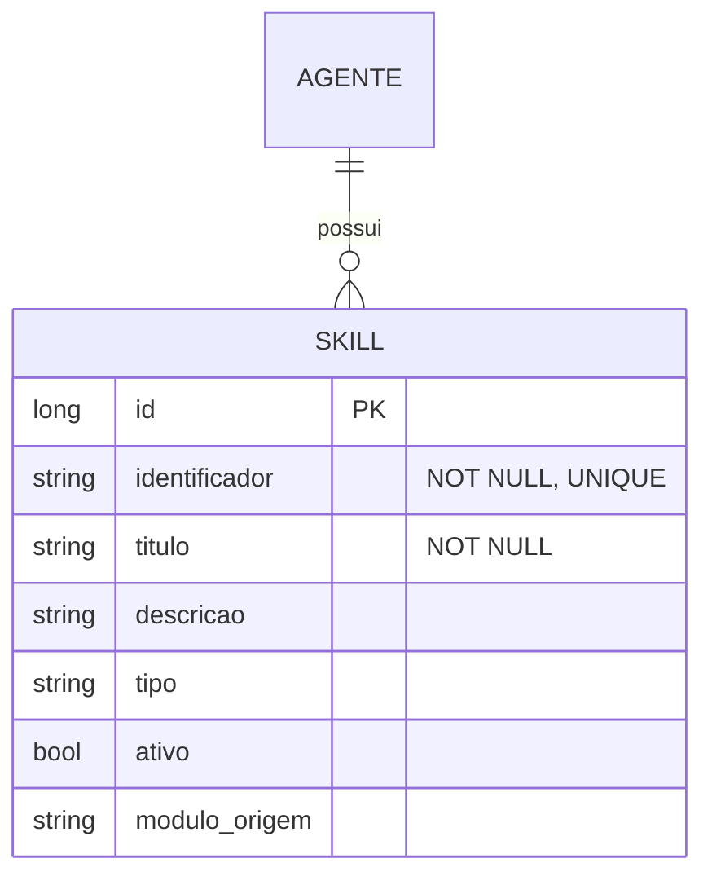

# CDU - Manter Skill

## 1. Metadados
- **Nome do CDU**: Manter Skill
- **Versão**: 1.0
- **Data**: 2025-06-16
- **Autor**: IA Core
- **Status**: Em Revisão

## 2. Descrição do Caso de Uso

### 2.1. Descrição Breve
O caso de uso "Manter Skill" permite cadastrar, consultar, atualizar e associar habilidades especializadas a agentes LLM. Skills complementam ferramentas, representando capacidades comportamentais ou de domínio que podem ser invocadas durante uma conversação.

### 2.2. Objetivos
- Cadastrar e gerenciar habilidades especializadas
- Associar skills a agentes LLM
- Consultar skills disponíveis no catálogo
- Validar identificador e título de skills
- Gerenciar status ativo/inativo de skills

### 2.3. Escopo
**Incluído**:
- Cadastro e gerenciamento de skills
- Associação de skills a agentes
- Consulta de skills com filtros
- Validação de identificador e título
- Gerenciamento de status ativo/inativo

**Excluído**:
- Implementação de agentes LLM (tratado em CDU separado)
- Execução de skills durante conversação (tratado em CDU separado)
- Análise avançada de performance de skills

## 3. Atores

| Ator | Descrição | Tipo |
|------|------------|------|
| Administrador | Gerencia habilidades disponíveis no catálogo | Primário |
| Agente LLM | Utiliza skills associadas para ampliar capacidades | Sistema |
| Usuário Final | Interage com agente que pode usar skills | Secundário |

## 4. Pré-condições

### 4.1. Para Cadastrar Skill
- Ator deve estar autenticado
- Ator deve ter permissão para gerenciar skills

### 4.2. Para Associar Skill ao Agente
- Ator deve estar autenticado
- Ator deve ter permissão para gerenciar agentes
- Agente deve existir
- Skill deve existir e estar ativa

### 4.3. Para Consultar Skill
- Ator deve estar autenticado
- Ator deve ter permissão para visualizar skills

## 5. Pós-condições

### 5.1. Pós-condição de Sucesso (Cadastrar Skill)
- Skill é registrada no sistema
- Sistema exibe mensagem de sucesso

### 5.2. Pós-condição de Sucesso (Associar Skill ao Agente)
- Skill é associada ao agente
- Sistema exibe mensagem de sucesso

### 5.3. Pós-condição de Sucesso (Consultar Skill)
- Sistema lista skills compatíveis
- Sistema exibe detalhes das skills

### 5.4. Pós-condição de Falha (Cadastrar Skill)
- Skill não é registrada
- Erros são identificados e reportados
- Sistema exibe mensagem de erro

## 6. Fluxo Principal (Basic Flow)

### 6.1. Fluxo: Cadastrar Skill

**Trigger**: O caso de uso inicia quando o administrador acessa a opção de cadastrar nova skill.

**Passos**:
1. **Dado** administrador autenticado com permissão para gerenciar skills
2. **Quando** administrador abre catálogo de skills
3. **Quando** administrador informa identificador [RN001]
4. **Quando** administrador informa título [RN002]
5. **Quando** administrador informa descrição [RN003]
6. **Quando** administrador informa tipo
7. **Quando** administrador informa módulo de origem [RN005]
8. **Quando** administrador confirma cadastro
9. **Então** sistema valida identificador e título
10. **Se** validação bem-sucedida
    - **Então** sistema salva skill
    - **Então** sistema retorna skill cadastrada
11. **Se** validação falha
    - **Então** sistema exibe mensagem de erro
    - **Então** fluxo retorna ao passo 3

### 6.2. Fluxo: Associar Skill ao Agente

**Trigger**: O caso de uso inicia quando o administrador acessa a opção de associar skill ao agente.

**Passos**:
1. **Dado** administrador autenticado com permissão para gerenciar agentes
2. **Dado** agente existe
3. **Dado** skill existe e está ativa
4. **Quando** administrador abre detalhes do agente
5. **Quando** administrador seleciona habilidades disponíveis
6. **Quando** administrador confirma associação
7. **Então** sistema valida duplicidade e status ativo
8. **Se** validação bem-sucedida
    - **Então** sistema associa skill ao agente
    - **Então** sistema exibe mensagem de sucesso
9. **Se** validação falha
    - **Então** sistema exibe mensagem de erro
    - **Então** fluxo retorna ao passo 5

### 6.3. Fluxo: Consultar Skill

**Trigger**: O caso de uso inicia quando o ator acessa a opção de consultar skills.

**Passos**:
1. **Dado** ator autenticado com permissão para visualizar skills
2. **Quando** ator solicita lista de skills
3. **Quando** ator aplica filtros por identificador, título, tipo e ativo
4. **Então** sistema aplica filtros
5. **Então** sistema retorna skills compatíveis

## 7. Fluxos Alternativos

### 7.1. Fluxo Alternativo: Skill com Identificador Duplicado

1. **Dado** sistema está validando cadastro de skill
2. **Quando** sistema detecta identificador duplicado [RN001]
3. **Então** sistema exibe mensagem de erro indicando que identificador já está cadastrado
4. **Então** fluxo retorna ao passo de preenchimento

### 7.2. Fluxo Alternativo: Skill Inativa

1. **Dado** administrador está associando skill ao agente
2. **Quando** sistema detecta skill inativa [RN004]
3. **Então** sistema solicita confirmação para associar skill inativa
4. **Quando** administrador confirma
5. **Então** sistema associa skill ao agente
6. **Quando** administrador cancela
7. **Então** sistema cancela associação

### 7.3. Fluxo Alternativo: Associação Já Existente

1. **Dado** sistema está validando associação de skill
2. **Quando** sistema detecta associação já existente
3. **Então** sistema exibe mensagem de erro indicando que associação já existe
4. **Então** fluxo é interrompido

## 8. Fluxos de Exceção

### 8.1. Fluxo de Exceção: Identificador Inválido

1. **Dado** sistema está validando cadastro de skill
2. **Quando** sistema detecta identificador inválido [RN001]
3. **Então** sistema exibe mensagem de erro indicando que identificador deve ter entre 2 e 100 caracteres
4. **Então** sistema impede cadastro
5. **Então** ator deve corrigir identificador antes de continuar

### 8.2. Fluxo de Exceção: Título Inválido

1. **Dado** sistema está validando cadastro de skill
2. **Quando** sistema detecta título inválido [RN002]
3. **Então** sistema exibe mensagem de erro indicando que título deve ter entre 2 e 200 caracteres
4. **Então** sistema impede cadastro
5. **Então** ator deve corrigir título antes de continuar

### 8.3. Fluxo de Exceção: Descrição Excedida

1. **Dado** sistema está validando cadastro de skill
2. **Quando** sistema detecta descrição excedida [RN003]
3. **Então** sistema exibe mensagem de erro indicando que descrição deve ter no máximo 1000 caracteres
4. **Então** sistema impede cadastro
5. **Então** ator deve corrigir descrição antes de continuar

## 9. Fluxos de Navegação (Mestre-Detalhe)

### 9.1. Navegação: Visualizar Skills do Agente

1. A partir dos detalhes do agente, o administrador clica em "Skills"
2. Sistema exibe lista de skills associadas ao agente
3. Administrador pode adicionar ou remover skills
4. Sistema atualiza lista após cada operação

### 9.2. Navegação: Consultar Catálogo de Skills

1. A partir do menu principal, o administrador clica em "Catálogo de Skills"
2. Sistema exibe lista de skills disponíveis
3. Administrador pode filtrar por identificador, título, tipo e ativo
4. Sistema atualiza lista com filtros aplicados

## 10. Regras de Negócio

| ID | Regra de Negócio | Tipo | Aplicação |
|----|------------------|------|-----------|
| RN001 | Identificador da skill é obrigatório e deve ter entre 2 e 100 caracteres | Validação | Cadastro de skill |
| RN002 | Título da skill é obrigatório e deve ter entre 2 e 200 caracteres | Validação | Cadastro de skill |
| RN003 | Descrição deve ter no máximo 1000 caracteres | Validação | Cadastro de skill |
| RN004 | Skill inativa não deve ser usada por agente ativo sem confirmação | Validação | Associação de skill |
| RN005 | Módulo de origem deve ter no máximo 200 caracteres | Validação | Cadastro de skill |

## 11. Estrutura de Dados

## 12. Contratos de Interface

### 12.1. Interface REST

| Método | Endpoint | Descrição |
|--------|----------|-----------|
| GET | `/api/${api.version}/llm/agentes/{id}/skills` | Lista skills do agente |
| POST | `/api/${api.version}/llm/agentes/{id}/skills` | Associa skill ao agente |
| DELETE | `/api/${api.version}/llm/agentes/{id}/skills/{skillId}` | Remove associação |

### 12.2. Endpoints de Skills

| Método | Endpoint | Descrição |
|--------|----------|-----------|
| GET | `/api/${api.version}/llm/skills` | Lista skills com paginação |
| GET | `/api/${api.version}/llm/skills/{id}` | Busca skill por ID |
| POST | `/api/${api.version}/llm/skills` | Cadastra nova skill |
| PUT | `/api/${api.version}/llm/skills/{id}` | Atualiza skill |
| DELETE | `/api/${api.version}/llm/skills/{id}` | Exclui skill |

## 13. Requisitos Especiais

### 13.1. Segurança
- Configuração de skills requer permissões específicas
- Validação de permissões para operações destrutivas
- Logs de todas as operações para auditoria

### 13.2. Performance
- Consulta de skills deve ser otimizada
- Cache de skills para performance
- Validação de associações deve ser eficiente

### 13.3. Conformidade
- Validação de identificador [RN001]
- Validação de título [RN002]
- Validação de descrição [RN003]
- Validação de módulo de origem [RN005]

## 14. Pontos de Extensão

### 14.1. Implementação de Skills Avançadas
- **Extensão 1**: Skills com parâmetros configuráveis
- **Quando**: Requisito de skills com parâmetros
- **Como**: Implementar suporte a parâmetros em skills

### 14.2. Análise de Performance de Skills
- **Extensão 2**: Monitoramento de performance de skills
- **Quando**: Requisito de análise de performance
- **Como**: Implementar coleta de métricas de uso de skills

### 14.3. Integração com Ferramentas
- **Extensão 3**: Integração direta com ferramentas
- **Quando**: Requisito de skills que usam ferramentas
- **Como**: Integrar skills com ferramentas disponíveis

## 15. Referências

### ADRs Relacionados
- ADR-012: Testing Patterns (Consideração de CDU e Comentários de Método)
- ADR-053: Usar CDU para Documentação de Casos de Uso

### CDUs Relacionados
- Manter Agente: Gerenciamento de agentes LLM
- Manter Ferramenta: Gerenciamento de ferramentas

### Documentação Técnica
- Documentação de skills no ia-core
- Padrões de habilidades especializadas
- Configuração de skills e ferramentas
