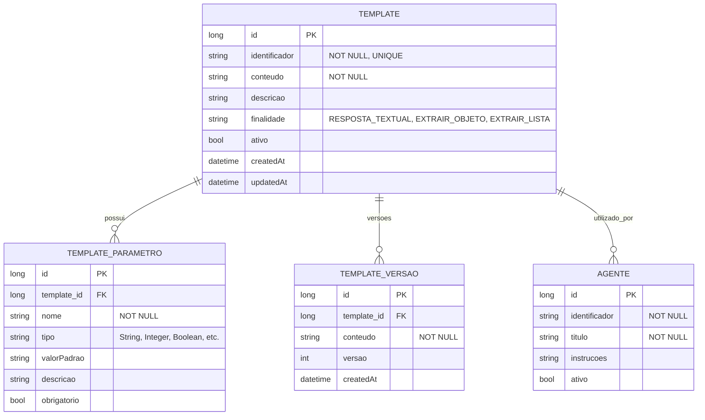

# CDU - Manter Template

## 1. Metadados
- **Nome do CDU**: Manter Template
- **Versão**: 1.0
- **Data**: 2025-06-16
- **Autor**: IA Core
- **Status**: Em Revisão

## 2. Descrição do Caso de Uso

### 2.1. Descrição Breve
O caso de uso "Manter Template" permite o gerenciamento de templates de prompt utilizados por modelos de linguagem no sistema ia-core, incluindo criação, atualização, consulta e exclusão de templates. Este módulo permite a padronização e reutilização de prompts através de templates parametrizáveis.

### 2.2. Objetivos
- Criar e gerenciar templates de prompt
- Definir parâmetros parametrizáveis
- Processar templates com valores de parâmetros
- Manter histórico de versões de templates
- Validar formatos de parâmetros
- Gerenciar finalidades de templates

### 2.3. Escopo
**Incluído**:
- Cadastro e gerenciamento de templates
- Definição de parâmetros parametrizáveis
- Processamento de templates
- Histórico de versões
- Validação de formatos

**Excluído**:
- Implementação de agentes LLM (tratado em CDU separado)
- Execução de modelos de linguagem (tratado em CDU separado)
- Análise avançada de performance de templates

## 3. Atores

| Ator | Descrição | Tipo |
|------|------------|------|
| Administrador | Usuário com acesso total ao sistema | Primário |
| Desenvolvedor | Usuário que desenvolve e configura templates | Primário |

## 4. Pré-condições

### 4.1. Para Cadastrar Template
- Ator deve estar autenticado
- Ator deve ter permissão para gerenciar templates

### 4.2. Para Processar Template
- Ator deve estar autenticado
- Ator deve ter permissão para processar templates
- Template deve existir e estar ativo

### 4.3. Para Excluir Template
- Ator deve estar autenticado
- Ator deve ter permissão para excluir templates
- Template deve existir

## 5. Pós-condições

### 5.1. Pós-condição de Sucesso (Cadastrar Template)
- Template é registrado no sistema
- Parâmetros são persistidos
- Sistema exibe mensagem de sucesso

### 5.2. Pós-condição de Sucesso (Processar Template)
- Template é processado com parâmetros
- Sistema retorna template processado
- Sistema registra processamento no histórico

### 5.3. Pós-condição de Sucesso (Excluir Template)
- Template é removido do sistema
- Parâmetros são removidos
- Sistema exibe mensagem de sucesso

### 5.4. Pós-condição de Falha (Cadastrar Template)
- Template não é registrado
- Erros são identificados e reportados
- Sistema exibe mensagem de erro

## 6. Fluxo Principal (Basic Flow)

### 6.1. Fluxo: Cadastrar Template

**Trigger**: O caso de uso inicia quando o ator acessa a opção de cadastrar novo template.

**Passos**:
1. **Dado** ator autenticado com permissão para gerenciar templates
2. **Quando** ator acessa "Cadastrar Template"
3. **Então** sistema exibe formulário de cadastro
4. **Quando** ator preenche identificador [RN001]
5. **Quando** ator preenche conteúdo [RN002]
6. **Quando** ator define parâmetros do template
7. **Quando** ator define finalidade do template [RN006]
8. **Quando** ator confirma cadastro
9. **Então** sistema valida dados
    - Verifica se identificador já está cadastrado [RN001]
    - Verifica se campos obrigatórios estão preenchidos
    - Valida formato dos parâmetros [RN003]
10. **Se** validação bem-sucedida
    - **Então** sistema salva template no banco de dados
    - **Então** sistema exibe mensagem de sucesso
11. **Se** validação falha
    - **Então** sistema exibe mensagem de erro
    - **Então** fluxo retorna ao passo 4

### 6.2. Fluxo: Consultar Template

**Trigger**: O caso de uso inicia quando o ator acessa a opção de consultar templates.

**Passos**:
1. **Dado** ator autenticado com permissão para visualizar templates
2. **Quando** ator acessa "Consultar Templates"
3. **Então** sistema exibe lista de templates com paginação
4. **Quando** ator filtra por identificador, finalidade, tipo
5. **Então** sistema atualiza lista com filtros aplicados
6. **Quando** ator clica no template desejado
7. **Então** sistema exibe detalhes do template
8. **Então** sistema exibe parâmetros e conteúdo

### 6.3. Fluxo: Processar Template

**Trigger**: O caso de uso inicia quando o ator acessa a opção de processar template.

**Passos**:
1. **Dado** ator autenticado com permissão para processar templates
2. **Dado** template existe e está ativo
3. **Quando** ator seleciona template
4. **Quando** ator fornece valores para parâmetros
5. **Então** sistema substitui parâmetros no conteúdo [RN003]
6. **Então** sistema retorna template processado
7. **Então** ator pode visualizar resultado

### 6.4. Fluxo: Atualizar Template

**Trigger**: O caso de uso inicia quando o ator acessa a opção de editar template.

**Passos**:
1. **Dado** ator autenticado com permissão para gerenciar templates
2. **Dado** template existe
3. **Quando** ator acessa detalhes do template
4. **Quando** ator clica em "Editar"
5. **Então** sistema exibe formulário preenchido
6. **Quando** ator modifica campos desejados
7. **Quando** ator clica em "Salvar"
8. **Então** sistema valida dados
9. **Então** sistema atualiza template
10. **Então** sistema exibe mensagem de sucesso

### 6.5. Fluxo: Excluir Template

**Trigger**: O caso de uso inicia quando o ator acessa a opção de excluir template.

**Passos**:
1. **Dado** ator autenticado com permissão para excluir templates
2. **Dado** template existe
3. **Quando** ator acessa detalhes do template
4. **Quando** ator clica em "Excluir"
5. **Então** sistema solicita confirmação
6. **Quando** ator confirma exclusão
7. **Então** sistema verifica se template está em uso [RN004]
8. **Se** template não está em uso
    - **Então** sistema exclui template
    - **Então** sistema exibe mensagem de sucesso
9. **Se** template está em uso
    - **Então** sistema exibe mensagem de erro
    - **Então** sistema exibe lista de agentes que utilizam o template

## 7. Fluxos Alternativos

### 7.1. Fluxo Alternativo: Template com Identificador Duplicado

1. **Dado** sistema está validando cadastro de template
2. **Quando** sistema detecta identificador duplicado [RN001]
3. **Então** sistema exibe mensagem de erro indicando que identificador já está cadastrado
4. **Então** fluxo retorna ao passo de preenchimento

### 7.2. Fluxo Alternativo: Parâmetros Não Fornecidos

1. **Dado** ator está processando template
2. **Quando** ator não fornece valores para parâmetros
3. **Então** sistema usa valores padrão definidos no template
4. **Então** sistema processa template com valores padrão

### 7.3. Fluxo Alternativo: Template com Múltiplos Parâmetros

1. **Dado** ator autenticado com permissão para gerenciar templates
2. **Quando** ator acessa "Cadastrar Template"
3. **Quando** ator define múltiplos parâmetros
4. **Então** sistema lista todos os parâmetros
5. **Então** sistema valida formato de cada parâmetro [RN003]

## 8. Fluxos de Exceção

### 8.1. Fluxo de Exceção: Template em Uso

1. **Dado** sistema está validando exclusão de template
2. **Quando** sistema detecta que template está em uso [RN004]
3. **Então** sistema exibe mensagem de erro indicando que template não pode ser excluído
4. **Então** sistema exibe lista de agentes que utilizam o template
5. **Então** fluxo é interrompido

### 8.2. Fluxo de Exceção: Erro de Processamento

1. **Dado** sistema está processando template
2. **Quando** sistema detecta erro ao substituir parâmetros [RN003]
3. **Então** sistema exibe mensagem de erro indicando parâmetros inválidos ou não fornecidos
4. **Então** ator deve corrigir parâmetros antes de processar novamente

### 8.3. Fluxo de Exceção: Conteúdo Vazio

1. **Dado** sistema está validando cadastro de template
2. **Quando** sistema detecta conteúdo vazio [RN002]
3. **Então** sistema exibe mensagem de erro indicando que conteúdo é obrigatório
4. **Então** sistema impede cadastro
5. **Então** ator deve informar conteúdo antes de continuar

## 9. Fluxos de Navegação (Mestre-Detalhe)

### 9.1. Navegação: Manter Parâmetros do Template

1. A partir do formulário de template, o ator clica em "Adicionar Parâmetro"
2. Sistema exibe diálogo de parâmetros
3. Ator preenche nome, tipo, valor padrão e descrição
4. Ator confirma
5. Sistema adiciona parâmetro à lista do template
6. Ator pode remover parâmetros da lista
7. Ao salvar o template, os parâmetros também são persistidos

### 9.2. Navegação: Visualizar Versões do Template

1. A partir dos detalhes do template, o ator clica em "Histórico de Versões"
2. Sistema exibe lista de versões anteriores
3. Ator seleciona versão desejada
4. Sistema exibe conteúdo da versão selecionada
5. Ator pode restaurar versão anterior

## 10. Regras de Negócio

| ID | Regra de Negócio | Tipo | Aplicação |
|----|------------------|------|-----------|
| RN001 | O campo identificador é obrigatório e deve ser único | Validação | Cadastro de template |
| RN002 | O campo conteúdo é obrigatório e não pode ser vazio | Validação | Cadastro de template |
| RN003 | Parâmetros devem seguir o formato {{nome_parametro}} | Validação | Processamento de template |
| RN004 | Templates em uso por agentes não podem ser excluídos | Validação | Exclusão de template |
| RN005 | O sistema deve manter histórico de versões de templates | Validação | Atualização de template |
| RN006 | A finalidade do template deve ser uma das opções válidas (RESPOSTA_TEXTUAL, EXTRAIR_OBJETO, EXTRAIR_LISTA) | Validação | Cadastro de template |

## 11. Estrutura de Dados

## 12. Contratos de Interface

### 12.1. Interface REST

| Método | Endpoint                          | Descrição                      |
|--------|-----------------------------------|--------------------------------|
| GET    | `/api/${api.version}/llm/templates`          | Lista templates com paginação   |
| GET    | `/api/${api.version}/llm/templates/{id}`      | Busca template por ID           |
| POST   | `/api/${api.version}/llm/templates`          | Cadastra novo template          |
| PUT    | `/api/${api.version}/llm/templates/{id}`      | Atualiza template               |
| DELETE | `/api/${api.version}/llm/templates/{id}`      | Exclui template                 |
| POST   | `/api/${api.version}/llm/templates/{id}/processar` | Processa template com parâmetros |
| GET    | `/api/${api.version}/llm/templates/{id}/parametros` | Lista parâmetros do template |
| GET    | `/api/${api.version}/llm/templates/{id}/versoes` | Lista versões do template |

### 12.2. Endpoints de Versão

| Método | Endpoint                              | Descrição                 |
|--------|---------------------------------------|---------------------------|
| POST   | `/api/${api.version}/llm/templates/{id}/versoes` | Cria nova versão         |
| POST   | `/api/${api.version}/llm/templates/{id}/versoes/{versaoId}/restaurar` | Restaura versão |

## 13. Requisitos Especiais

### 13.1. Segurança
- Configuração de templates requer permissões específicas
- Validação de permissões para operações destrutivas
- Logs de todas as operações para auditoria

### 13.2. Performance
- Processamento de templates deve ser otimizado
- Cache de templates processados para performance
- Validação de parâmetros deve ser eficiente

### 13.3. Conformidade
- Histórico completo de versões para auditoria [RN005]
- Validação de formato de parâmetros [RN003]
- Respeito a limites de tamanho de templates

## 14. Pontos de Extensão

### 14.1. Implementação de Templates Avançados
- **Extensão 1**: Templates com lógica condicional
- **Quando**: Requisito de templates com condicionais
- **Como**: Implementar suporte a if/else em templates

### 14.2. Análise de Performance de Templates
- **Extensão 2**: Monitoramento de performance de templates
- **Quando**: Requisito de análise de performance
- **Como**: Implementar coleta de métricas de processamento

### 14.3. Integração com Modelos de Linguagem
- **Extensão 3**: Integração direta com modelos de linguagem
- **Quando**: Requisito de processamento com LLM
- **Como**: Integrar com APIs de modelos de linguagem

## 15. Referências

### ADRs Relacionados
- ADR-012: Testing Patterns (Consideração de CDU e Comentários de Método)
- ADR-053: Usar CDU para Documentação de Casos de Uso

### CDUs Relacionados
- Manter Agente: Gerenciamento de agentes LLM
- Conversação-Chat: Conversação com agentes LLM

### Documentação Técnica
- Documentação de templates no ia-core
- Padrões de prompts parametrizáveis
- Configuração de parâmetros de templates
