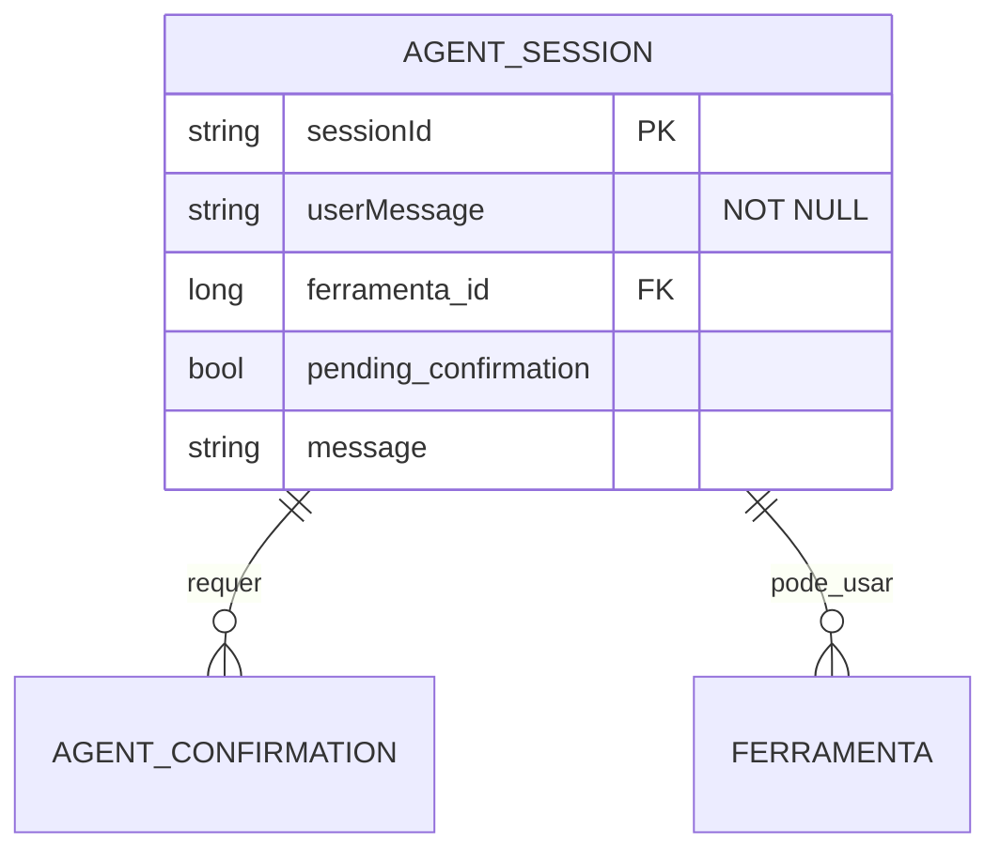

# CDU - Orquestrar Sessão de Agentes

## 1. Metadados
- **Nome do CDU**: Orquestrar Sessão de Agentes
- **Versão**: 1.0
- **Data**: 2025-06-16
- **Autor**: IA Core
- **Status**: Em Revisão

## 2. Descrição do Caso de Uso

### 2.1. Descrição Breve
O caso de uso "Orquestrar Sessão de Agentes" permite executar mensagens do usuário em uma sessão multi-agente, selecionar ferramentas disponíveis e solicitar confirmação explícita quando a ação exigir aprovação.

### 2.2. Objetivos
- Executar mensagens do usuário em sessão multi-agente
- Selecionar ferramentas disponíveis para execução
- Solicitar confirmação explícita para ações sensíveis
- Gerenciar contexto de sessão entre agentes
- Orquestrar fluxo de execução de ferramentas

### 2.3. Escopo
**Incluído**:
- Execução de sessão multi-agente
- Seleção de ferramentas disponíveis
- Confirmação de ações pendentes
- Gerenciamento de contexto de sessão
- Orquestração de fluxo de execução

**Excluído**:
- Gerenciamento de agentes LLM (tratado em CDU Manter-Agente)
- Gerenciamento de ferramentas (tratado em CDU Manter-Ferramenta)
- Execução de ferramentas específicas (tratado em CDUs específicos)

## 3. Atores

| Ator | Descrição | Tipo |
|------|------------|------|
| Usuário Final | Envia mensagem e confirma ações pendentes | Primário |
| Sistema | Orquestra agentes, ferramentas e sessão | Secundário |
| Agente LLM | Processa mensagem e propõe ações | Secundário |

## 4. Pré-condições

### 4.1. Para Executar Sessão
- Usuário deve estar autenticado
- Usuário deve ter permissão para executar sessões
- Mensagem não pode estar vazia [RN001]

### 4.2. Para Confirmar Ação
- Sessão deve existir
- Ação deve estar pendente de confirmação
- Usuário deve ter permissão para confirmar ações

### 4.3. Para Listar Ferramentas
- Usuário deve estar autenticado
- Usuário deve ter permissão para visualizar ferramentas

## 5. Pós-condições

### 5.1. Pós-condição de Sucesso (Executar Sessão)
- Sessão é criada ou atualizada
- Mensagem é processada por agentes
- Resposta é retornada com sessionId [RN002]
- Ações sensíveis ficam pendentes de confirmação [RN003]

### 5.2. Pós-condição de Sucesso (Confirmar Ação)
- Ação é executada ou cancelada
- Resposta final é retornada
- Sessão é atualizada

### 5.3. Pós-condição de Falha (Executar Sessão)
- Sessão não é criada
- Erros são identificados e reportados [RN005]
- Sistema exibe mensagem de erro

### 5.4. Pós-condição de Falha (Confirmar Ação)
- Ação não é executada
- Erros são identificados e reportados [RN005]
- Sistema exibe mensagem de erro

## 6. Fluxo Principal (Basic Flow)

### 6.1. Fluxo: Executar Sessão

**Trigger**: O caso de uso inicia quando o usuário envia uma mensagem para execução em sessão multi-agente.

**Passos**:
1. **Dado** usuário autenticado com permissão para executar sessões
2. **Quando** usuário envia mensagem com `sessionId` opcional
3. **Então** sistema valida mensagem não vazia [RN001]
4. **Se** mensagem válida
    - **Então** sistema identifica ferramenta solicitada, quando presente
    - **Então** sistema executa orquestração [RN004]
    - **Então** sistema retorna resposta com `sessionId` [RN002]
    - **Se** ação sensível detectada
        - **Então** sistema retorna resposta com `pendingConfirmation` [RN003]
    - **Se** ação não sensível
        - **Então** sistema executa ação
        - **Então** sistema retorna resposta final
5. **Se** mensagem inválida
    - **Então** sistema exibe mensagem de erro
    - **Então** fluxo é interrompido

### 6.2. Fluxo: Confirmar Ação

**Trigger**: O caso de uso inicia quando o usuário confirma uma ação pendente.

**Passos**:
1. **Dado** sessão existe com ação pendente
2. **Dado** usuário autenticado com permissão para confirmar ações
3. **Quando** usuário envia confirmação
4. **Então** sistema valida `sessionId` e `confirmed`
5. **Se** confirmação válida
    - **Se** `confirmed` é true
        - **Então** sistema executa ação
        - **Então** sistema retorna resposta final
        - **Então** sistema atualiza sessão
    - **Se** `confirmed` é false
        - **Então** sistema cancela ação
        - **Então** sistema retorna resposta de cancelamento
        - **Então** sistema atualiza sessão
6. **Se** confirmação inválida
    - **Então** sistema exibe mensagem de erro
    - **Então** fluxo é interrompido

### 6.3. Fluxo: Listar Ferramentas

**Trigger**: O caso de uso inicia quando o usuário solicita lista de ferramentas disponíveis.

**Passos**:
1. **Dado** usuário autenticado com permissão para visualizar ferramentas
2. **Quando** usuário solicita lista de ferramentas
3. **Então** sistema lista ferramentas disponíveis
4. **Então** sistema retorna lista de ferramentas

## 7. Fluxos Alternativos

### 7.1. Fluxo Alternativo: Mensagem Vazia

1. **Dado** sistema está validando mensagem
2. **Quando** sistema detecta mensagem vazia [RN001]
3. **Então** sistema rejeita mensagem
4. **Então** sistema exibe mensagem de erro
5. **Então** fluxo é interrompido

### 7.2. Fluxo Alternativo: Ferramenta Inexistente

1. **Dado** sistema está identificando ferramenta
2. **Quando** sistema detecta ferramenta inexistente
3. **Então** sistema gera erro estruturado
4. **Então** sistema exibe mensagem de erro
5. **Então** fluxo é interrompido

### 7.3. Fluxo Alternativo: Sessão Inexistente

1. **Dado** sistema está validando sessão
2. **Quando** sistema detecta sessão inexistente
3. **Então** sistema retorna 404 ou equivalente seguro
4. **Então** sistema exibe mensagem de erro
5. **Então** fluxo é interrompido

### 7.4. Fluxo Alternativo: Falha de Modelo LLM

1. **Dado** sistema está executando orquestração
2. **Quando** sistema detecta falha de modelo LLM
3. **Então** sistema mapeia para erro controlado
4. **Então** sistema exibe mensagem de erro
5. **Então** fluxo é interrompido

## 8. Fluxos de Exceção

### 8.1. Fluxo de Exceção: Mensagem Inválida

1. **Dado** sistema está validando mensagem
2. **Quando** sistema detecta mensagem inválida [RN001]
3. **Então** sistema exibe mensagem de erro indicando que mensagem é obrigatória
4. **Então** sistema impede execução
5. **Então** usuário deve fornecer mensagem válida antes de continuar

### 8.2. Fluxo de Exceção: Sessão Inválida

1. **Dado** sistema está validando sessão
2. **Quando** sistema detecta sessão inválida
3. **Então** sistema exibe mensagem de erro indicando que sessão não existe
4. **Então** sistema impede execução
5. **Então** usuário deve fornecer sessionId válido antes de continuar

### 8.3. Fluxo de Exceção: Permissão Negada

1. **Dado** sistema está validando permissões
2. **Quando** sistema detecta permissão negada
3. **Então** sistema exibe mensagem de erro indicando que usuário não tem permissão
4. **Então** sistema impede execução
5. **Então** usuário deve ter permissão antes de continuar

### 8.4. Fluxo de Exceção: Erro de Orquestração

1. **Dado** sistema está executando orquestração
2. **Quando** sistema detecta erro de orquestração
3. **Então** sistema exibe mensagem de erro [RN005]
4. **Então** sistema impede execução
5. **Então** fluxo é interrompido

## 9. Fluxos de Navegação (Mestre-Detalhe)

### 9.1. Navegação: Visualizar Histórico de Sessão

1. A partir da sessão, usuário acessa "Histórico"
2. Sistema exibe histórico de mensagens e ações
3. Usuário pode filtrar por período
4. Usuário pode visualizar detalhes de cada ação

### 9.2. Navegação: Gerenciar Contexto de Sessão

1. A partir da sessão, usuário acessa "Contexto"
2. Sistema exibe contexto atual da sessão
3. Usuário pode modificar contexto
4. Sistema atualiza contexto

## 10. Regras de Negócio

| ID | Regra de Negócio | Tipo | Aplicação |
|----|------------------|------|-----------|
| RN001 | `userMessage` é obrigatório e não pode estar em branco | Validação | Execução de sessão |
| RN002 | `sessionId` deve ser preservado na resposta | Validação | Execução de sessão |
| RN003 | Ações sensíveis devem exigir confirmação explícita | Validação | Execução de sessão |
| RN004 | A camada de sessão não deve executar regras de negócio de domínio | Validação | Orquestração |
| RN005 | Falhas devem ser rastreáveis sem expor dados sensíveis | Validação | Tratamento de erros |

## 11. Estrutura de Dados

## 12. Contratos de Interface

### 12.1. Interface REST

| Método | Endpoint | Descrição |
|--------|----------|-----------|
| POST | `/api/${api.version}/llm/agente/sessao/run` | Executa sessão multi-agente |
| POST | `/api/${api.version}/llm/agente/sessao/confirm` | Confirma ação pendente |
| GET | `/api/${api.version}/llm/agente/sessao/ferramentas` | Lista ferramentas disponíveis |

### 12.2. Endpoints de Sessão

| Método | Endpoint | Descrição |
|--------|----------|-----------|
| GET | `/api/${api.version}/llm/agente/sessao/{sessionId}` | Busca sessão por ID |
| DELETE | `/api/${api.version}/llm/agente/sessao/{sessionId}` | Exclui sessão |
| GET | `/api/${api.version}/llm/agente/sessao/{sessionId}/historico` | Lista histórico de sessão |

## 13. Requisitos Especiais

### 13.1. Segurança
- Execução de sessões requer permissões específicas
- Validação de permissões para ações sensíveis
- Logs de todas as operações para auditoria
- Tratamento de erros sem expor dados sensíveis [RN005]

### 13.2. Performance
- Orquestração de sessões deve ser rápida
- Execução de ferramentas deve ser eficiente
- Gerenciamento de contexto deve ser otimizado

### 13.3. Conformidade
- Validação de mensagem [RN001]
- Preservação de sessionId [RN002]
- Confirmação de ações sensíveis [RN003]
- Separação de responsabilidades [RN004]
- Rastreabilidade de falhas [RN005]

## 14. Pontos de Extensão

### 14.1. Suporte a Múltiplos Agentes
- **Extensão 1**: Suporte a múltiplos agentes simultâneos
- **Quando**: Requisito de orquestração complexa
- **Como**: Implementar orquestração de múltiplos agentes

### 14.2. Integração com Ferramentas Externas
- **Extensão 2**: Integração com ferramentas externas
- **Quando**: Requisito de integração com serviços externos
- **Como**: Implementar integração via APIs externas

### 14.3. Persistência de Contexto
- **Extensão 3**: Persistência de contexto de sessão
- **Quando**: Requisito de persistência de contexto
- **Como**: Implementar persistência de contexto em banco de dados

## 15. Referências

### ADRs Relacionados
- ADR-012: Testing Patterns (Consideração de CDU e Comentários de Método)
- ADR-053: Usar CDU para Documentação de Casos de Uso
- ADR-010: Padrões de Nomenclatura
- ADR-051: RFC 9110 HTTP Semantics
- ADR-052: MADR e Linguagem Normativa

### CDUs Relacionados
- Manter Agente: Gerenciamento de agentes LLM
- Manter Ferramenta: Gerenciamento de ferramentas
- Conversacao Chat: Gerenciamento de conversações

### Documentação Técnica
- Documentação de orquestração de agentes no ia-core
- Padrões de execução de sessões multi-agente
- Configuração de ferramentas e permissões
