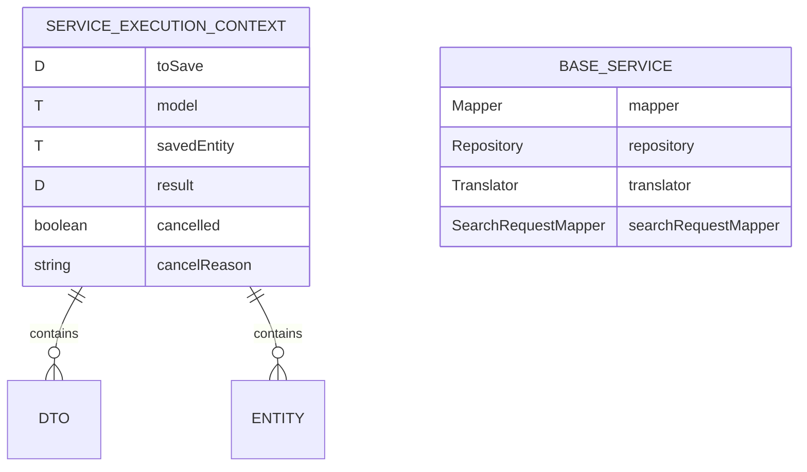

# CDU001: Operações CRUD de Serviço

## Metadados
- **Nome do CDU**: CDU001-OperacoesCRUDServico
- **Versão**: 1.0
- **Data**: 2025-06-18
- **Autor**: IA Core
- **Status**: Em Revisão

## Descrição do Caso de Uso

### Descrição Breve
Este caso de uso descreve as operações CRUD padrão implementadas pelo CrudBaseService, incluindo criação, leitura, atualização e exclusão de entidades com validação e publicação de eventos.

### Objetivos
- Fornecer operações CRUD padronizadas para serviços
- Validar dados antes de persistência
- Publicar eventos de domínio após operações
- Suportar transações configuráveis

### Escopo
- **Incluído**: Operações CRUD, validação, publicação de eventos, transações
- **Excluído**: Implementação específica de validadores customizados

## Atores

| Ator | Descrição | Tipo |
|------|------------|------|
| Aplicação Cliente | Aplicação que consome os serviços | Primário |
| Sistema | Aplicação Spring Boot que processa operações | Secundário |

## Pré-condições
- **Precondição 1**: O módulo ia-core-service deve estar configurado no classpath
- **Precondição 2**: O CrudBaseService deve estar configurado com repository, mapper e validators
- **Precondição 3**: O Translator deve estar configurado para internacionalização

## Pós-condições
- **Pós-condição de Sucesso**: A operação CRUD é executada e o evento de domínio é publicado
- **Pós-condição de Falha**: A operação é revertida e ServiceException é lançada

## Fluxo Principal (Basic Flow)

**Trigger**: O cliente solicita uma operação CRUD

**Passos**:
1. **Dado** uma requisição para operação CRUD
2. **Quando** o CrudBaseService recebe a requisição
3. **Então** o sistema valida o DTO [RN001]
4. **Quando** a validação falha
5. **Então** o sistema lança ServiceException com erros
6. **Quando** a validação passa
7. **Então** o sistema converte DTO para modelo
8. **E** o sistema executa a operação no repository
9. **E** o sistema converte modelo para DTO de resposta
10. **E** o sistema publica evento de domínio [RN002]
11. **E** o sistema retorna o DTO de resposta

## Fluxos Alternativos

**Fluxo Alternativo 1**: Operação de criação
1. **Dado** um DTO sem ID
2. **Quando** o CrudBaseService executa save
3. **Então** o sistema cria nova entidade
4. **E** o sistema publica evento CREATED

**Fluxo Alternativo 2**: Operação de atualização
1. **Dado** um DTO com ID
2. **Quando** o CrudBaseService executa update
3. **Então** o sistema atualiza entidade existente
4. **E** o sistema publica evento UPDATED

**Fluxo Alternativo 3**: Operação de exclusão
1. **Dado** um ID de entidade
2. **Quando** o CrudBaseService executa delete
3. **Então** o sistema exclui a entidade
4. **E** o sistema publica evento DELETED

## Fluxos de Exceção

**Fluxo de Exceção 1**: Entidade não encontrada
1. **Dado** um ID de entidade inexistente
2. **Quando** o CrudBaseService tenta buscar
3. **Então** o sistema lança ServiceException com código ENTITY_NOT_FOUND

**Fluxo de Exceção 2**: Violação de integridade de dados
1. **Dado** uma operação que viola restrições do banco
2. **Quando** o CrudBaseService executa a operação
3. **Então** o sistema lança ServiceException com código DATA_INTEGRITY_VIOLATION

## Regras de Negócio

| ID | Regra de Negócio | Tipo | Aplicação |
|----|------------------|------|-----------|
| RN001 | Validação deve ser executada antes de persistência | Validação | Operações CRUD |
| RN002 | Eventos de domínio devem ser publicados após operações de escrita | Validação | Publicação de eventos |
| RN003 | Operações de leitura devem ser read-only | Validação | Transações |
| RN004 | Operações de escrita devem ser transacionais | Validação | Transações |

## Estrutura de Dados

## Contratos de Interface

**Interface CrudService**:

| Método | Parâmetros | Retorno | Descrição |
|--------|------------|---------|------------|
| save | D dto | D | Cria nova entidade |
| update | D dto | D | Atualiza entidade existente |
| delete | Long id | void | Exclui entidade |
| findById | Long id | D | Busca entidade por ID |
| findAll | SearchRequest request | Page<D> | Lista entidades paginadas |
| count | SearchRequest request | Long | Conta entidades |

## Requisitos Especiais
- **Performance**: Operações CRUD devem ser eficientes (< 100ms para operações simples)
- **Segurança**: Validação deve prevenir injeção de dados maliciosos
- **Usabilidade**: Mensagens de erro devem ser internacionalizadas
- **Conformidade**: Deve seguir ADR-011 para Exception Handling

## Pontos de Extensão
- **Extensão 1**: Adicionar validadores customizados
- **Extensão 2**: Implementar eventos de domínio customizados
- **Extensão 3**: Adicionar hooks before/after nas operações

## Referências
- ADR-011: Exception Handling Patterns
- ADR-053: Usar CDU para Documentação de Casos de Uso
