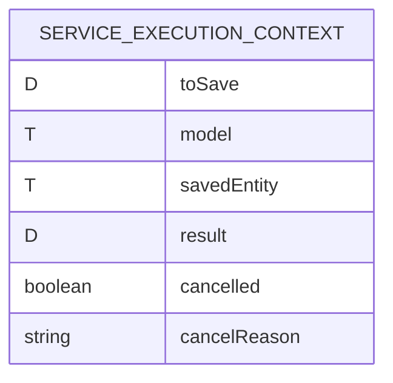

# CDU002: Contexto de Execução de Serviço

## Metadados
- **Nome do CDU**: CDU002-ContextoExecucaoServico
- **Versão**: 1.0
- **Data**: 2025-06-18
- **Autor**: IA Core
- **Status**: Em Revisão

## Descrição do Caso de Uso

### Descrição Breve
Este caso de uso descreve o uso do ServiceExecutionContext para gerenciar o estado durante a execução de operações de serviço, permitindo passagem de dados através da cadeia de execução.

### Objetivos
- Encapsular o estado durante operações de serviço
- Permitir passagem de dados entre métodos
- Suportar cancelamento de operações
- Fornecer contexto para validação e transformações

### Escopo
- **Incluído**: Criação de contexto, gerenciamento de estado, cancelamento
- **Excluído**: Implementação específica de validadores

## Atores

| Ator | Descrição | Tipo |
|------|------------|------|
| Serviço | Serviço que usa o contexto | Primário |
| Validador | Validador que acessa o contexto | Secundário |

## Pré-condições
- **Precondição 1**: O módulo ia-core-service deve estar configurado no classpath
- **Precondição 2**: O DTO a ser processado deve ser fornecido

## Pós-condições
- **Pós-condição de Sucesso**: O contexto contém todos os dados da operação
- **Pós-condição de Falha**: O contexto é marcado como cancelado com motivo

## Fluxo Principal (Basic Flow)

**Trigger**: Um serviço inicia uma operação CRUD

**Passos**:
1. **Dado** um DTO para operação
2. **Quando** o serviço cria ServiceExecutionContext
3. **Então** o contexto inicializa com toSave
4. **E** o serviço converte DTO para modelo
5. **E** o serviço define model no contexto
6. **E** o serviço executa validação
7. **Quando** a validação falha
8. **Então** o validador cancela o contexto com motivo
9. **Quando** a validação passa
10. **Então** o serviço persiste a entidade
11. **E** o serviço define savedEntity no contexto
12. **E** o serviço converte para DTO de resposta
13. **E** o serviço define result no contexto
14. **E** o serviço verifica se foi cancelado
15. **Quando** não foi cancelado
16. **Então** a operação prossegue
17. **Quando** foi cancelado
18. **Então** a operação é abortada

## Fluxos Alternativos

**Fluxo Alternativo 1**: Operação de atualização
1. **Dado** um DTO com ID
2. **Quando** o contexto é criado
3. **Então** isUpdate() retorna true
4. **E** o serviço busca entidade existente

**Fluxo Alternativo 2**: Operação de criação
1. **Dado** um DTO sem ID
2. **Quando** o contexto é criado
3. **Então** isUpdate() retorna false
4. **E** o serviço cria nova entidade

## Fluxos de Exceção

**Fluxo de Exceção 1**: Cancelamento sem motivo
1. **Dado** um contexto em execução
2. **Quando** o validador cancela sem motivo
3. **Então** cancelReason é null
4. **E**: isCancelled() retorna true

## Regras de Negócio

| ID | Regra de Negócio | Tipo | Aplicação |
|----|------------------|------|-----------|
| RN001 | Contexto deve ser imutável após persistência | Validação | Gerenciamento de estado |
| RN002 | Cancelamento deve impedir persistência | Validação | Cancelamento |
| RN003 | isUpdate() deve verificar ID do modelo | Validação | Detecção de operação |

## Estrutura de Dados

## Contratos de Interface

**Interface ServiceExecutionContext**:

| Método | Parâmetros | Retorno | Descrição |
|--------|------------|---------|------------|
| getToSave | - | D | Retorna DTO original |
| setModel | T model | ServiceExecutionContext | Define modelo |
| getModel | - | T | Retorna modelo |
| setSavedEntity | T savedEntity | ServiceExecutionContext | Define entidade salva |
| getSavedEntity | - | T | Retorna entidade salva |
| setResult | D result | ServiceExecutionContext | Define resultado |
| getResult | - | D | Retorna resultado |
| cancel | String cancelReason | void | Cancela operação |
| isCancelled | - | boolean | Verifica se cancelado |
| getCancelReason | - | String | Retorna motivo do cancelamento |
| isUpdate | - | boolean | Verifica se é atualização |

## Requisitos Especiais
- **Performance**: Criação de contexto deve ser rápida (< 1ms)
- **Segurança**: Contexto não deve expor dados sensíveis
- **Usabilidade**: Métodos fluentes para encadeamento

## Pontos de Extensão
- **Extensão 1**: Adicionar metadados customizados ao contexto
- **Extensão 2**: Adicionar hooks de ciclo de vida

## Referências
- ADR-053: Usar CDU para Documentação de Casos de Uso
