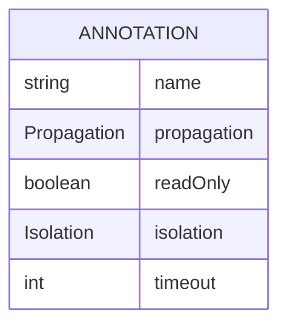

# CDU003: Anotações Transacionais

## Metadados
- **Nome do CDU**: CDU003-AnotacoesTransacionais
- **Versão**: 1.0
- **Data**: 2025-06-18
- **Autor**: IA Core
- **Status**: Em Revisão

## Descrição do Caso de Uso

### Descrição Breve
Este caso de uso descreve o uso de anotações transacionais customizadas para controlar o comportamento de transações em métodos de serviço, fornecendo configurações predefinidas para diferentes cenários.

### Objetivos
- Simplificar configuração de transações
- Fornecer configurações predefinidas para cenários comuns
- Garantir consistência no uso de transações
- Reduzir erros de configuração

### Escopo
- **Incluído**: Anotações transacionais customizadas, configurações predefinidas
- **Excluído**: Implementação interna do Spring Transaction Management

## Atores

| Ator | Descrição | Tipo |
|------|------------|------|
| Desenvolvedor | Desenvolvedor que usa as anotações | Primário |
| Sistema | Spring Boot que processa as anotações | Secundário |

## Pré-condições
- **Precondição 1**: O módulo ia-core-service deve estar configurado no classpath
- **Precondição 2**: O Spring Transaction Management deve estar configurado

## Pós-condições
- **Pós-condição de Sucesso**: O método é executado com a configuração transacional apropriada
- **Pós-condição de Falha**: A transação é revertida em caso de erro

## Fluxo Principal (Basic Flow)

**Trigger**: Um método anotado é invocado

**Passos**:
1. **Dado** um método anotado com @TransactionalWrite
2. **Quando** o método é invocado
3. **Então** o Spring intercepta a chamada
4. **E** o sistema inicia transação REQUIRED [RN001]
5. **E** o sistema executa o método
6. **Quando** o método executa sem erro
7. **Então** o sistema commita a transação
8. **Quando** o método lança exceção
9. **Então** o sistema rollback a transação

## Fluxos Alternativos

**Fluxo Alternativo 1**: @TransactionalReadOnly
1. **Dado** um método anotado com @TransactionalReadOnly
2. **Quando** o método é invocado
3. **Então** o sistema inicia transação read-only
4. **E**: readOnly = true é configurado

**Fluxo Alternativo 2**: @TransactionalMandatory
1. **Dado** um método anotado com @TransactionalMandatory
2. **Quando** o método é invocado
3. **Então** o sistema exige transação existente
4. **E**: propagation = MANDATORY é configurado

**Fluxo Alternativo 3**: @TransactionalNested
1. **Dado** um método anotado com @TransactionalNested
2. **Quando** o método é invocado
3. **Então** o sistema cria transação aninhada
4. **E**: propagation = NESTED é configurado

**Fluxo Alternativo 4**: @NonTransactional
1. **Dado** um método anotado com @NonTransactional
2. **Quando** o método é invocado
3. **Então** o método executa sem transação
4. **E**: propagation = NOT_SUPPORTED é configurado

## Fluxos de Exceção

**Fluxo de Exceção 1**: Timeout de transação
1. **Dado** um método anotado com @TransactionalWrite
2. **Quando** o método executa por mais de 30 segundos
3. **Então** o sistema rollback a transação
4. **E**: lança TransactionTimedOutException

## Regras de Negócio

| ID | Regra de Negócio | Tipo | Aplicação |
|----|------------------|------|-----------|
| RN001 | @TransactionalWrite deve usar propagation REQUIRED | Validação | Configuração de transação |
| RN002 | @TransactionalReadOnly deve usar readOnly = true | Validação | Configuração de transação |
| RN003 | @TransactionalMandatory deve exigir transação existente | Validação | Configuração de transação |
| RN004 | @NonTransactional deve suspender transação existente | Validação | Configuração de transação |

## Estrutura de Dados

## Contratos de Interface

**Anotações Disponíveis**:
| Anotação | Propagation | ReadOnly | Timeout | Descrição |
|----------|-------------|----------|---------|------------|
| @TransactionalWrite | REQUIRED | false | 30s | Operações de escrita |
| @TransactionalReadOnly | REQUIRED | true | 30s | Operações de leitura |
| @TransactionalMandatory | MANDATORY | false | 30s | Exige transação |
| @TransactionalNested | NESTED | false | 30s | Transação aninhada |
| @TransactionalWriteIndependent | REQUIRES_NEW | false | 30s | Transação independente |
| @TransactionalReadOnlyOptional | SUPPORTS | true | 30s | Transação opcional |
| @NonTransactional | NOT_SUPPORTED | false | 30s | Sem transação |

## Requisitos Especiais
- **Performance**: Configuração de transação deve ser rápida (< 1ms)
- **Segurança**: Transações devem ser configuradas corretamente
- **Usabilidade**: Anotações devem ser intuitivas

## Pontos de Extensão
- **Extensão 1**: Adicionar novas anotações transacionais customizadas
- **Extensão 2**: Adicionar configurações de isolation customizadas

## Referências
- ADR-053: Usar CDU para Documentação de Casos de Uso
- Spring Transaction Management Documentation
