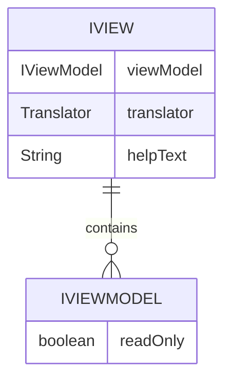

# CDU001: Gerenciamento de Views

## Metadados
- **Nome do CDU**: CDU001-GerenciamentoViews
- **Versão**: 1.0
- **Data**: 2025-06-18
- **Autor**: IA Core
- **Status**: Em Revisão

## Descrição do Caso de Uso

### Descrição Breve
Este caso de uso descreve o gerenciamento de views no ia-core-view, incluindo a criação, configuração e interação com componentes de interface do usuário usando Vaadin.

### Objetivos
- Fornecer interfaces base para views e view models
- Padronizar a criação de componentes de UI
- Facilitar a internacionalização e tratamento de erros
- Suportar validação de formulários

### Escopo
- **Incluído**: Interfaces IView e IViewModel, validação de formulários, tratamento de erros
- **Excluído**: Implementação específica de views customizadas

## Atores

| Ator | Descrição | Tipo |
|------|------------|------|
| Usuário | Usuário que interage com a aplicação | Primário |
| Sistema | Aplicação Vaadin que processa interações | Secundário |

## Pré-condições
- **Precondição 1**: O módulo ia-core-view deve estar configurado no classpath
- **Precondição 2**: O Vaadin deve estar configurado na aplicação
- **Precondição 3**: O Translator deve estar configurado para internacionalização

## Pós-condições
- **Pós-condição de Sucesso**: A view é renderizada e interage corretamente com o usuário
- **Pós-condição de Falha**: Erros são tratados e exibidos ao usuário

## Fluxo Principal (Basic Flow)

**Trigger**: O usuário acessa uma view da aplicação

**Passos**:
1. **Dado** uma view configurada
2. **Quando** o usuário acessa a view
3. **Então** o sistema inicializa o ViewModel
4. **E** o sistema configura o estado de leitura/escrita
5. **E** o sistema aplica validadores
6. **Quando** o usuário interage com a view
7. **Então** o sistema processa a interação
8. **E** o sistema atualiza o ViewModel
9. **Quando** ocorre um erro
10. **Então** o sistema trata o erro através de HasErrorHandle
11. **E** o sistema exibe mensagem internacionalizada

## Fluxos Alternativos

**Fluxo Alternativo 1**: View somente leitura
1. **Dado** uma view configurada como somente leitura
2. **Quando** o usuário acessa a view
3. **Então** isReadOnly() retorna true
4. **E**: os componentes são desabilitados

**Fluxo Alternativo 2**: View com help text
1. **Dado** uma view configurada com help text
2. **Quando** o usuário acessa a view
3. **Então** o help text é exibido
4. **E**: o help text é internacionalizado

## Fluxos de Exceção

**Fluxo de Exceção 1**: Erro de validação
1. **Dado** uma view com validadores configurados
2. **Quando** o usuário submete dados inválidos
3. **Então** o sistema exibe mensagens de erro
4. **E**: o sistema impede a submissão

## Regras de Negócio

| ID | Regra de Negócio | Tipo | Aplicação |
|----|------------------|------|-----------|
| RN001 | Views devem implementar IView | Validação | Criação de views |
| RN002 | ViewModels devem implementar IViewModel | Validação | Criação de view models |
| RN003 | Mensagens de erro devem ser internacionalizadas | Validação | Tratamento de erros |
| RN004 | Help text deve ser internacionalizado | Validação | Exibição de help |

## Estrutura de Dados

## Contratos de Interface

**Interface IView**:
| Método | Parâmetros | Retorno | Descrição |
|--------|------------|---------|------------|
| getViewModel | - | IViewModel<T> | Retorna o ViewModel |

**Interface IViewModel**:
| Método | Parâmetros | Retorno | Descrição |
|--------|------------|---------|------------|
| isReadOnly | - | boolean | Verifica se é somente leitura |
| setReadOnly | boolean readOnly | void | Define o estado de leitura |

## Requisitos Especiais
- **Performance**: Views devem ser renderizadas rapidamente (< 200ms)
- **Segurança**: Validação deve prevenir injeção de dados maliciosos
- **Usabilidade**: Mensagens devem ser internacionalizadas
- **Conformidade**: Deve seguir ADR-039 para testes Vaadin

## Pontos de Extensão
- **Extensão 1**: Adicionar validadores customizados
- **Extensão 2**: Adicionar componentes customizados
- **Extensão 3**: Adicionar hooks de ciclo de vida

## Referências
- ADR-039: Vaadin TestBench para testes E2E
- ADR-053: Usar CDU para Documentação de Casos de Uso
