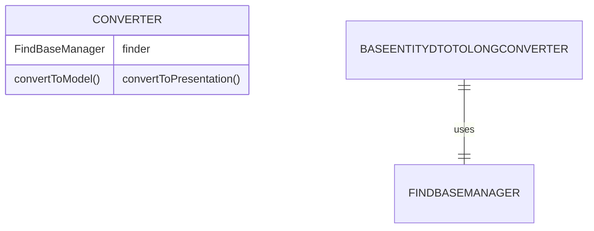

# CDU002: Conversores de Dados

## Metadados
- **Nome do CDU**: CDU002-ConversoresDados
- **Versão**: 1.0
- **Data**: 2025-06-18
- **Autor**: IA Core
- **Status**: Em Revisão

## Descrição do Caso de Uso

### Descrição Breve
Este caso de uso descreve o uso de conversores de dados no ia-core-view para transformar dados entre diferentes formatos, especialmente entre DTOs e IDs, e entre strings e tipos numéricos.

### Objetivos
- Fornecer conversores padronizados para dados de UI
- Facilitar a conversão entre DTOs e IDs
- Converter strings para tipos numéricos
- Tratar valores nulos de forma consistente

### Escopo
- **Incluído**: Conversores BaseEntityDTOToLong, StringToInteger, StringToLong, StringToBigDecimal
- **Excluído**: Implementação de conversores customizados

## Atores

| Ator | Descrição | Tipo |
|------|------------|------|
| Usuário | Usuário que insere dados em formulários | Primário |
| Sistema | Aplicação Vaadin que processa conversões | Secundário |

## Pré-condições
- **Precondição 1**: O módulo ia-core-view deve estar configurado no classpath
- **Precondição 2**: O Vaadin Binder deve estar configurado
- **Precondição 3**: O FindBaseManager deve estar disponível para conversores de DTO

## Pós-condições
- **Pós-condição de Sucesso**: Os dados são convertidos corretamente entre formatos
- **Pós-condição de Falha**: Erros de conversão são tratados e exibidos ao usuário

## Fluxo Principal (Basic Flow)

**Trigger**: O usuário insere dados em um campo de formulário

**Passos**:
1. **Dado** um campo de formulário com conversor configurado
2. **Quando** o usuário insere um valor
3. **Então** o conversor converte o valor para o modelo
4. **E** o sistema valida o valor convertido
5. **Quando** o valor é exibido
6. **Então** o conversor converte o valor para apresentação
7. **E** o sistema exibe o valor formatado

## Fluxos Alternativos

**Fluxo Alternativo 1**: Conversão de DTO para Long
1. **Dado** um BaseEntityDTO selecionado
2. **Quando** o conversor converte para modelo
3. **Então** o ID do DTO é extraído
4. **E**: o ID é retornado como Long

**Fluxo Alternativo 2**: Conversão de Long para DTO
1. **Dado** um Long ID
2. **Quando** o conversor converte para apresentação
3. **Então** o FindBaseManager busca o DTO
4. **E**: o DTO é retornado

**Fluxo Alternativo 3**: Conversão de String para Integer
1. **Dado** uma string numérica
2. **Quando** o conversor converte para modelo
3. **Então** a string é parseada para Integer
4. **E**: o Integer é retornado

## Fluxos de Exceção

**Fluxo de Exceção 1**: Valor nulo
1. **Dado** um valor nulo
2. **Quando** o conversor processa o valor
3. **Então** o conversor retorna null
4. **E**: nenhum erro é lançado

**Fluxo de Exceção 2**: Valor inválido
1. **Dado** uma string não numérica
2. **Quando** o conversor tenta converter
3. **Então** um erro de conversão é lançado
4. **E**: o erro é tratado pelo Vaadin Binder

## Regras de Negócio

| ID | Regra de Negócio | Tipo | Aplicação |
|----|------------------|------|-----------|
| RN001 | Conversores devem tratar valores nulos | Validação | Todos os conversores |
| RN002 | Conversores de DTO devem usar FindBaseManager | Validação | Conversores de DTO |
| RN003 | Conversores de string devem validar formato | Validação | Conversores de string |

## Estrutura de Dados

## Contratos de Interface

**Interface Converter (Vaadin)**:
| Método | Parâmetros | Retorno | Descrição |
|--------|------------|---------|------------|
| convertToModel | T value, ValueContext context | Result<R> | Converte valor para modelo |
| convertToPresentation | R value, ValueContext context | T | Converte valor para apresentação |

## Requisitos Especiais
- **Performance**: Conversões devem ser rápidas (< 10ms)
- **Segurança**: Validação deve prevenir injeção de dados maliciosos
- **Usabilidade**: Mensagens de erro devem ser claras

## Pontos de Extensão
- **Extensão 1**: Adicionar conversores customizados
- **Extensão 2**: Adicionar formatação customizada
- **Extensão 3**: Adicionar validação customizada

## Referências
- ADR-053: Usar CDU para Documentação de Casos de Uso
