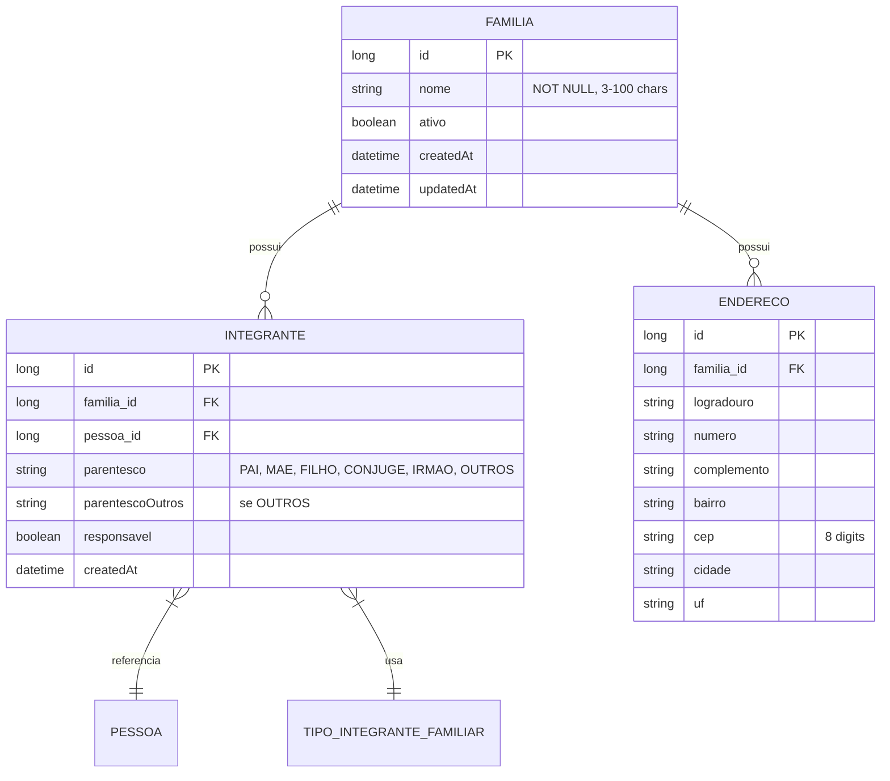

# CDU - Manter Família

## 1. Metadados
- **Nome do CDU**: Manter Família
- **Versão**: 1.0
- **Data**: 2026-06-19
- **Autor**: Kilo Code
- **Status**: Aprovado

## 2. Descrição do Caso de Uso

### 2.1. Descrição Breve
O caso de uso "Manter Família" permite o gerenciamento de famílias no sistema Biblia/gestor-igreja, incluindo cadastro, atualização, exclusão e consulta de famílias, além do gerenciamento de membros/vinculados e seus relacionamentos familiares.

### 2.2. Objetivos
- Cadastrar novas famílias
- Atualizar dados de famílias existentes
- Excluir famílias (com validações de dependência)
- Consultar famílias cadastradas
- Gerenciar vínculos de pessoas a famílias
- Controlar parentescos entre membros

### 2.3. Escopo
**Incluído**:
- CRUD de famílias
- Vinculação de pessoas a famílias
- Definição de parentesco
- Validação de responsáveis
- Consulta de membros

**Excluído**:
- Gestão financeira da família (tratado em módulo separado)
- Controle de frequência em eventos (tratado em Escala)

## 3. Atores

| Ator | Descrição | Tipo |
|------|------------|------|
| Usuário Administrador | Gerencia famílias e vínculos | Primário |
| Sistema | Aplica regras de validação | Sistema |

## 4. Pré-condições

### 4.1. Para Cadastrar Família
- Ator deve estar autenticado
- Nome da família deve ser fornecido

### 4.2. Para Vincular Pessoa
- Família deve existir
- Pessoa deve existir no sistema
- Parentesco deve ser informado

### 4.3. Para Excluir Família
- Família deve existir
- Não deve ter membros vinculados (ou deve desvincular primeiro)

## 5. Pós-condições

### 5.1. Pós-condição de Sucesso (Cadastrar)
- Família é criada no sistema
- Sistema retorna família criada

### 5.2. Pós-condição de Sucesso (Vincular Pessoa)
- Pessoa é vinculada à família
- Parentesco é registrado

### 5.3. Pós-condição de Falha
- Operação não é realizada
- Erros são identificados e reportados

## 6. Fluxo Principal (Basic Flow)

### 6.1. Fluxo: Cadastrar Família

**Trigger**: O caso de uso inicia quando o ator solicita cadastro de nova família.

**Passos**:
1. **Dado** ator autenticado
2. **Quando** ator acessa formulário de cadastro de família
3. **Quando** ator preenche nome da família [RN001]
4. **Quando** ator informa endereço (opcional) [RN004]
5. **Então** sistema valida nome obrigatório [FAM_001]
6. **Então** sistema valida formato do endereço se informado [FAM_004]
7. **Então** sistema cria família
8. **Então** sistema retorna família criada

### 6.2. Fluxo: Vincular Pessoa à Família

**Trigger**: O caso de uso inicia quando o ator adiciona membro a uma família.

**Passos**:
1. **Dado** ator autenticado
2. **Dado** família existe
3. **Dado** pessoa existe no sistema
4. **Quando** ator seleciona pessoa para vincular
5. **Quando** ator informa parentesco [RN003]
6. **Então** sistema valida se pessoa já está em outra família [FAM_002]
7. **Então** sistema valida parentesco informado [FAM_003]
8. **Então** sistema cria vínculo
9. **Então** sistema retorna vínculo criado

### 6.3. Fluxo: Excluir Família

**Trigger**: O caso de uso inicia quando o ator solicita exclusão de família.

**Passos**:
1. **Dado** ator autenticado
2. **Dado** família existe
3. **Quando** ator solicita exclusão
4. **Então** sistema verifica se há membros vinculados [FAM_005]
5. **Se** não há membros
    - **Então** sistema exclui família
6. **Se** há membros
    - **Então** sistema exibe mensagem de erro
    - **Então** sistema oferece opção de desvincular membros primeiro

## 7. Fluxos Alternativos

### 7.1. Fluxo Alternativo: Pessoa Já Vinculada

1. **Dado** sistema está vinculando pessoa à família
2. **Quando** sistema detecta que pessoa já está em outra família ativa [FAM_002]
3. **Então** sistema exibe mensagem informando vínculo existente
4. **Então** sistema oferece opção de transferência (desativar vínculo anterior)
5. **Então** ator confirma transferência
6. **Então** sistema desativa vínculo anterior e cria novo vínculo

### 7.2. Fluxo Alternativo: Atualizar Família

1. **Dado** ator autenticado
2. **Dado** família existe
3. **Quando** ator modifica dados da família
4. **Então** sistema valida alterações [FAM_001, FAM_004]
5. **Então** sistema atualiza família
6. **Então** sistema retorna família atualizada

## 8. Fluxos de Exceção

### 8.1. Fluxo de Exceção: Nome Inválido

1. **Dado** sistema está validando cadastro de família
2. **Quando** sistema detecta nome nulo, vazio ou com tamanho inválido [FAM_001]
3. **Então** sistema exibe mensagem de erro
4. **Então** sistema impede cadastro
5. **Então** ator deve corrigir nome antes de continuar

### 8.2. Fluxo de Exceção: Endereço Inválido

1. **Dado** sistema está validando endereço da família
2. **Quando** sistema detecta CEP com formato inválido [FAM_004]
3. **Então** sistema exibe aviso
4. **Então** sistema permite continuar (severidade AVISO)

### 8.3. Fluxo de Exceção: Exclusão com Membros

1. **Dado** sistema está processando exclusão de família
2. **Quando** sistema detecta membros vinculados [FAM_005]
3. **Então** sistema exibe mensagem de erro
4. **Então** sistema impede exclusão
5. **Então** ator deve desvincular membros antes de continuar

## 9. Fluxos de Navegação (Mestre-Detalhe)

### 9.1. Navegação: Visualizar Membros da Família

1. A partir da lista de famílias, ator seleciona uma família
2. Sistema exibe detalhes da família
3. Sistema exibe lista de membros vinculados
4. Ator pode adicionar/remover membros

### 9.2. Navegação: Buscar Pessoa para Vincular

1. A partir do formulário de vínculo, ator clica em buscar pessoa
2. Sistema exibe modal de busca de pessoas
3. Ator seleciona pessoa desejada
4. Sistema retorna pessoa selecionada para o formulário

## 10. Regras de Negócio

| ID | Regra de Negócio | Tipo | Aplicação |
|----|------------------|------|-----------|
| RN001 | Nome da família é obrigatório | Validação | Cadastro/Atualização |
| RN002 | Uma pessoa pode pertencer a apenas uma família ativa | Integridade | Vinculação |
| RN003 | Parentesco deve ser definido ao vincular pessoa | Validação | Vinculação |
| RN004 | Endereço é opcional, mas se informado deve ter formato válido | Validação | Cadastro/Atualização |
| RN005 | Família não pode ser excluída se tiver membros | Integridade | Exclusão |
| RN006 | Família deve ter pelo menos um responsável | Comportamental | Cadastro/Atualização |

## 11. Estrutura de Dados

## 12. Contratos de Interface

### 12.1. Interface REST

| Método | Endpoint | Descrição |
|--------|----------|------------|
| POST | `/api/${api.version}/familia` | Cadastra nova família |
| GET | `/api/${api.version}/familia` | Lista famílias |
| GET | `/api/${api.version}/familia/{id}` | Busca família por ID |
| PUT | `/api/${api.version}/familia/{id}` | Atualiza família |
| DELETE | `/api/${api.version}/familia/{id}` | Exclui família |
| POST | `/api/${api.version}/familia/{id}/membros` | Adiciona membro à família |
| DELETE | `/api/${api.version}/familia/{id}/membros/{pessoaId}` | Remove membro da família |
| GET | `/api/${api.version}/familia/{id}/membros` | Lista membros da família |

## 13. Requisitos Especiais

### 13.1. Segurança
- Apenas usuários autenticados podem gerenciar famílias
- Log de todas as operações de criação/atualização/exclusão

### 13.2. Performance
- Consulta de famílias deve suportar paginação
- Busca por nome deve ser indexada

### 13.3. Conformidade
- Validação de CPF quando pessoa é vinculada
- Registro de auditoria para alterações

## 14. Pontos de Extensão

### 14.1. Integração com Eventos
- **Extensão 1**: Registrar presença de família em eventos
- **Quando**: Necessário controle de participação familiar
- **Como**: Integrar com módulo de Escala/Evento

### 14.2. Gestão de Documentos
- **Extensão 2**: Anexar documentos à família
- **Quando**: Necessário armazenar comprovantes
- **Como**: Integrar com módulo de Arquivo

## 15. Referências

### ADRs Relacionados
- ADR-010: Padrões de Nomenclatura
- ADR-011: Exception Handling Patterns
- ADR-012: Testing Patterns
- ADR-018: Business Rule Chain Pattern
- ADR-019: Service Validator Pattern
- ADR-053: Usar CDU para Documentação de Casos de Uso
- ADR-054: Usar RN para Documentação de Regras de Negócio

### CDUs Relacionados
- CDU031-Manter-Pessoa: Gerenciamento de pessoas
- CDU032-Manter-Evento: Gerenciamento de eventos
- CDU033-Manter-Escala: Gerenciamento de escalas

### Documentação Técnica
- `biblia-model/src/main/java/com/ia/biblia/model/familia/Familia.java`
- `biblia-service/src/main/java/com/ia/biblia/service/familia/FamiliaService.java`
- `biblia-rest/src/main/java/com/ia/biblia/rest/familia/FamiliaController.java`
