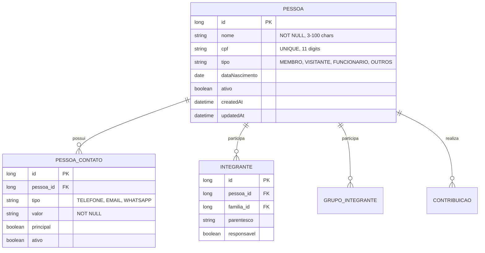

# CDU - Manter Pessoa

## 1. Metadados
- **Nome do CDU**: Manter Pessoa
- **Versão**: 1.0
- **Data**: 2026-06-19
- **Autor**: Kilo Code
- **Status**: Aprovado

## 2. Descrição do Caso de Uso

### 2.1. Descrição Breve
O caso de uso "Manter Pessoa" permite o gerenciamento completo de pessoas no sistema Biblia/gestor-igreja, incluindo cadastro, atualização, exclusão e consulta de membros, visitantes e funcionários da igreja, com controle de contatos e vínculos familiares.

### 2.2. Objetivos
- Cadastrar novas pessoas (membros, visitantes, funcionários)
- Atualizar dados pessoais
- Gerenciar múltiplos contatos por pessoa
- Controlar vínculos familiares
- Validar CPF único
- Consultar pessoas cadastradas

### 2.3. Escopo
**Incluído**:
- CRUD de pessoas
- Gestão de contatos (telefone, email, whatsapp)
- Validação de CPF
- Controle de tipo de pessoa
- Vinculação a famílias

**Excluído**:
- Gestão de grupos (tratado em módulo separado)
- Controle de frequência (tratado em Escala)

## 3. Atores

| Ator | Descrição | Tipo |
|------|------------|------|
| Usuário Administrador | Gerencia cadastro de pessoas | Primário |
| Sistema | Aplica validações de CPF e contatos | Sistema |

## 4. Pré-condições

### 4.1. Para Cadastrar Pessoa
- Ator deve estar autenticado
- Nome deve ser fornecido
- Tipo de pessoa deve ser informado

### 4.2. Para Vincular a Família
- Pessoa deve existir
- Família deve existir
- Parentesco deve ser informado

### 4.3. Para Excluir Pessoa
- Pessoa deve existir
- Não deve ter dependências (grupos, contribuições)

## 5. Pós-condições

### 5.1. Pós-condição de Sucesso (Cadastrar)
- Pessoa é criada no sistema
- Contatos são registrados
- Sistema retorna pessoa criada

### 5.2. Pós-condição de Sucesso (Atualizar)
- Dados são atualizados
- Contatos são atualizados
- Sistema retorna pessoa atualizada

### 5.3. Pós-condição de Falha
- Operação não é realizada
- Erros de validação são reportados

## 6. Fluxo Principal (Basic Flow)

### 6.1. Fluxo: Cadastrar Pessoa

**Trigger**: O caso de uso inicia quando o ator solicita cadastro de nova pessoa.

**Passos**:
1. **Dado** ator autenticado
2. **Quando** ator acessa formulário de cadastro de pessoa
3. **Quando** ator preenche nome [RN001]
4. **Quando** ator informa CPF (opcional) [RN002]
5. **Quando** ator seleciona tipo de pessoa [RN004]
6. **Quando** ator informa data de nascimento (opcional) [RN007]
7. **Quando** ator adiciona contatos [RN005]
8. **Então** sistema valida nome obrigatório [PESS_001]
9. **Então** sistema valida CPF se informado [PESS_002, PESS_003]
10. **Então** sistema valida tipo de pessoa [PESS_004]
11. **Então** sistema valida data de nascimento não futura [PESS_007]
12. **Então** sistema valida contatos [PESS_005, PESS_009]
13. **Então** sistema cria pessoa
14. **Então** sistema retorna pessoa criada

### 6.2. Fluxo: Atualizar Pessoa

**Trigger**: O caso de uso inicia quando o ator modifica dados de pessoa existente.

**Passos**:
1. **Dado** ator autenticado
2. **Dado** pessoa existe
3. **Quando** ator modifica dados
4. **Então** sistema valida alterações [PESS_001 a PESS_007]
5. **Então** sistema atualiza pessoa
6. **Então** sistema retorna pessoa atualizada

### 6.3. Fluxo: Adicionar Contato

**Trigger**: O caso de uso inicia quando o ator adiciona contato à pessoa.

**Passos**:
1. **Dado** ator autenticado
2. **Dado** pessoa existe
3. **Quando** ator informa tipo de contato (telefone, email, whatsapp)
4. **Quando** ator informa valor do contato
5. **Quando** ator marca como principal (opcional)
6. **Então** sistema valida contato [PESS_005]
7. **Então** sistema valida contato principal [PESS_009]
8. **Então** sistema adiciona contato
9. **Então** sistema retorna pessoa com novo contato

## 7. Fluxos Alternativos

### 7.1. Fluxo Alternativo: CPF Já Cadastrado

1. **Dado** sistema está validando CPF
2. **Quando** sistema detecta CPF já existente [PESS_003]
3. **Então** sistema exibe mensagem de erro
4. **Então** sistema impede cadastro
5. **Então** ator deve informar CPF diferente ou deixar vazio

### 7.2. Fluxo Alternativo: Transferir Família

1. **Dado** pessoa está vinculada a uma família
2. **Quando** ator solicita vinculação a outra família
3. **Então** sistema desativa vínculo anterior [PESS_006]
4. **Então** sistema cria novo vínculo
5. **Então** sistema retorna pessoa com novo vínculo

## 8. Fluxos de Exceção

### 8.1. Fluxo de Exceção: Nome Inválido

1. **Dado** sistema está validando cadastro de pessoa
2. **Quando** sistema detecta nome nulo, vazio ou com tamanho inválido [PESS_001]
3. **Então** sistema exibe mensagem de erro
4. **Então** sistema impede cadastro
5. **Então** ator deve corrigir nome antes de continuar

### 8.2. Fluxo de Exceção: CPF Inválido

1. **Dado** sistema está validando CPF
2. **Quando** sistema detecta CPF com dígito verificador inválido [PESS_002]
3. **Então** sistema exibe mensagem de erro
4. **Então** sistema impede cadastro
5. **Então** ator deve corrigir CPF antes de continuar

### 8.3. Fluxo de Exceção: Data de Nascimento Futura

1. **Dado** sistema está validando data de nascimento
2. **Quando** sistema detecta data futura [PESS_007]
3. **Então** sistema exibe mensagem de erro
4. **Então** sistema impede cadastro
5. **Então** ator deve corrigir data antes de continuar

### 8.4. Fluxo de Exceção: Exclusão com Dependências

1. **Dado** sistema está processando exclusão de pessoa
2. **Quando** sistema detecta dependências (grupos, famílias, contribuições) [PESS_008]
3. **Então** sistema exibe mensagem de erro com lista de dependências
4. **Então** sistema impede exclusão
5. **Então** ator deve resolver dependências antes de continuar

## 9. Fluxos de Navegação (Mestre-Detalhe)

### 9.1. Navegação: Visualizar Contatos da Pessoa

1. A partir da lista de pessoas, ator seleciona uma pessoa
2. Sistema exibe detalhes da pessoa
3. Sistema exibe lista de contatos
4. Ator pode adicionar/remover/editar contatos

### 9.2. Navegação: Visualizar Vínculos Familiares

1. A partir dos detalhes da pessoa, ator acessa aba "Famílias"
2. Sistema exibe lista de famílias que a pessoa pertence
3. Ator pode adicionar/remover vínculos

## 10. Regras de Negócio

| ID | Regra de Negócio | Tipo | Aplicação |
|----|------------------|------|-----------|
| RN001 | Nome é obrigatório (3-100 caracteres) | Validação | Cadastro/Atualização |
| RN002 | CPF deve ter dígito verificador válido | Validação | Cadastro/Atualização |
| RN003 | CPF deve ser único no sistema | Integridade | Cadastro/Atualização |
| RN004 | Tipo de pessoa deve ser válido (MEMBRO, VISITANTE, FUNCIONARIO, OUTROS) | Validação | Cadastro/Atualização |
| RN005 | Pessoa pode ter múltiplos contatos | Comportamental | Gestão de contatos |
| RN006 | Pessoa pode pertencer a múltiplas famílias | Comportamental | Vinculação familiar |
| RN007 | Data de nascimento não pode ser futura | Validação | Cadastro/Atualização |
| RN008 | Não permite exclusão se possui dependências | Integridade | Exclusão |
| RN009 | Deve existir exatamente um contato principal | Validação | Gestão de contatos |

## 11. Estrutura de Dados

## 12. Contratos de Interface

### 12.1. Interface REST

| Método | Endpoint | Descrição |
|--------|----------|------------|
| POST | `/api/${api.version}/pessoa` | Cadastra nova pessoa |
| GET | `/api/${api.version}/pessoa` | Lista pessoas |
| GET | `/api/${api.version}/pessoa/{id}` | Busca pessoa por ID |
| PUT | `/api/${api.version}/pessoa/{id}` | Atualiza pessoa |
| DELETE | `/api/${api.version}/pessoa/{id}` | Exclui pessoa |
| POST | `/api/${api.version}/pessoa/{id}/contatos` | Adiciona contato |
| PUT | `/api/${api.version}/pessoa/{id}/contatos/{contatoId}` | Atualiza contato |
| DELETE | `/api/${api.version}/pessoa/{id}/contatos/{contatoId}` | Remove contato |
| GET | `/api/${api.version}/pessoa/{id}/contatos` | Lista contatos |
| GET | `/api/${api.version}/pessoa/{id}/familias` | Lista famílias da pessoa |

## 13. Requisitos Especiais

### 13.1. Segurança
- Apenas usuários autenticados podem gerenciar pessoas
- CPF é armazenado de forma segura
- Log de todas as operações

### 13.2. Performance
- Busca por nome deve ser indexada
- Consulta de contatos deve ser otimizada

### 13.3. Conformidade
- Validação de CPF conforme algoritmo oficial
- Registro de auditoria para alterações de dados sensíveis

## 14. Pontos de Extensão

### 14.1. Integração com Grupos
- **Extensão 1**: Gerenciamento de grupos de pessoas
- **Quando**: Necessário agrupar pessoas por interesses/funções
- **Como**: Integrar com módulo de Grupos

### 14.2. Histórico de Mudanças
- **Extensão 2**: Registro de histórico de alterações
- **Quando**: Necessário auditoria completa
- **Como**: Implementar entity com @HasVersion

## 15. Referências

### ADRs Relacionados
- ADR-010: Padrões de Nomenclatura
- ADR-011: Exception Handling Patterns
- ADR-012: Testing Patterns
- ADR-015: Usar TSID para Identidade
- ADR-018: Business Rule Chain Pattern
- ADR-019: Service Validator Pattern
- ADR-053: Usar CDU para Documentação de Casos de Uso
- ADR-054: Usar RN para Documentação de Regras de Negócio

### CDUs Relacionados
- CDU030-Manter-Familia: Gerenciamento de famílias
- CDU032-Manter-Evento: Gerenciamento de eventos
- CDU033-Manter-Escala: Gerenciamento de escalas

### Documentação Técnica
- `biblia-model/src/main/java/com/ia/biblia/model/pessoa/Pessoa.java`
- `biblia-service/src/main/java/com/ia/biblia/service/pessoa/PessoaService.java`
- `biblia-rest/src/main/java/com/ia/biblia/rest/pessoa/PessoaController.java`
