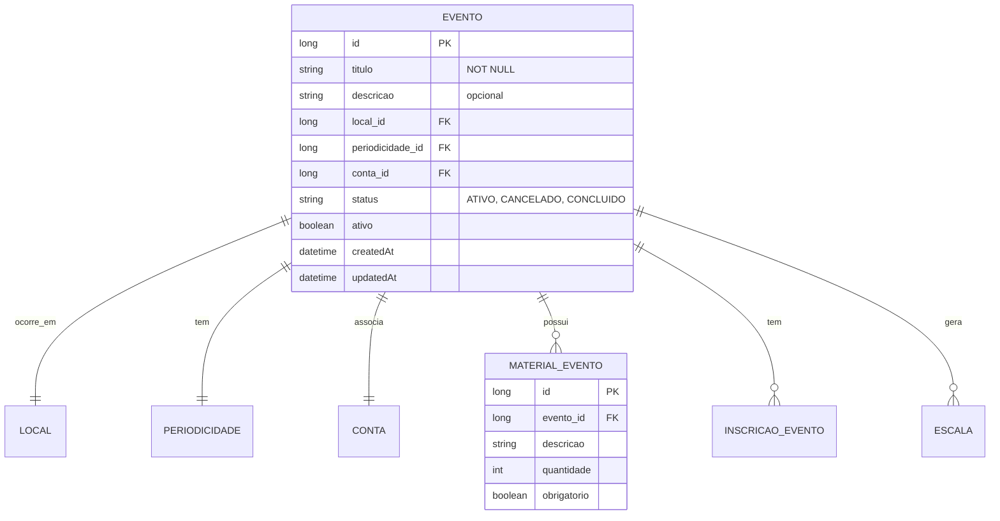

# CDU - Manter Evento

## 1. Metadados
- **Nome do CDU**: Manter Evento
- **Versão**: 1.0
- **Data**: 2026-06-19
- **Autor**: Kilo Code
- **Status**: Aprovado

## 2. Descrição do Caso de Uso

### 2.1. Descrição Breve
O caso de uso "Manter Evento" permite o gerenciamento de eventos da igreja, incluindo criação, atualização, consulta e exclusão de eventos, com definição de local, periodicidade, conta financeira associada e materiais necessários.

### 2.2. Objetivos
- Cadastrar novos eventos
- Definir periodicidade de eventos
- Associar local e conta financeira
- Gerenciar materiais de evento
- Controlar status de eventos
- Consultar eventos cadastrados

### 2.3. Escopo
**Incluído**:
- CRUD de eventos
- Definição de periodicidade
- Associação com local
- Associação com conta financeira
- Gestão de materiais

**Excluído**:
- Gestão de inscrições (tratado em módulo separado)
- Controle de escalas de voluntários (tratado em Escala)

## 3. Atores

| Ator | Descrição | Tipo |
|------|------------|------|
| Usuário Administrador | Gerencia eventos da igreja | Primário |
| Sistema | Aplica validações de regras de negócio | Sistema |

## 4. Pré-condições

### 4.1. Para Cadastrar Evento
- Ator deve estar autenticado
- Título deve ser fornecido
- Local deve existir no sistema
- Periodicidade deve ser informada
- Conta financeira deve existir

### 4.2. Para Atualizar Evento
- Evento deve existir
- Ator deve estar autenticado

### 4.3. Para Excluir Evento
- Evento deve existir
- Evento não pode ter inscrições pendentes

## 5. Pós-condições

### 5.1. Pós-condição de Sucesso (Cadastrar)
- Evento é criado no sistema
- Periodicidade é registrada
- Sistema retorna evento criado

### 5.2. Pós-condição de Sucesso (Atualizar)
- Dados do evento são atualizados
- Sistema retorna evento atualizado

### 5.3. Pós-condição de Falha
- Operação não é realizada
- Erros de validação são reportados

## 6. Fluxo Principal (Basic Flow)

### 6.1. Fluxo: Cadastrar Evento

**Trigger**: O caso de uso inicia quando o ator solicita cadastro de novo evento.

**Passos**:
1. **Dado** ator autenticado
2. **Quando** ator acessa formulário de cadastro de evento
3. **Quando** ator preenche título [RN001]
4. **Quando** ator seleciona local [RN002]
5. **Quando** ator define periodicidade [RN003]
6. **Quando** ator associa conta financeira [RN004]
7. **Quando** ator informa descrição (opcional) [RN005]
8. **Então** sistema valida título obrigatório [EVE_001]
9. **Então** sistema valida local obrigatório [EVE_002]
10. **Então** sistema valida periodicidade obrigatória [EVE_003]
11. **Então** sistema valida conta obrigatória [EVE_004]
12. **Então** sistema valida descrição se informada [EVE_005]
13. **Então** sistema cria evento
14. **Então** sistema retorna evento criado

### 6.2. Fluxo: Atualizar Evento

**Trigger**: O caso de uso inicia quando o ator modifica dados de evento existente.

**Passos**:
1. **Dado** ator autenticado
2. **Dado** evento existe
3. **Quando** ator modifica dados do evento
4. **Então** sistema valida alterações [EVE_001 a EVE_005]
5. **Então** sistema atualiza evento
6. **Então** sistema retorna evento atualizado

### 6.3. Fluxo: Consultar Eventos

**Trigger**: O caso de uso inicia quando o ator busca eventos.

**Passos**:
1. **Dado** ator autenticado
2. **Quando** ator acessa lista de eventos
3. **Quando** ator aplica filtros (período, local, status)
4. **Então** sistema retorna lista de eventos filtrada

## 7. Fluxos Alternativos

### 7.1. Fluxo Alternativo: Evento com Inscrições

1. **Dado** evento possui inscrições
2. **Quando** ator tenta alterar dados que afetam inscrições
3. **Então** sistema exibe aviso sobre impacto nas inscrições
4. **Então** ator confirma alteração
5. **Então** sistema atualiza evento e notifica inscritos

## 8. Fluxos de Exceção

### 8.1. Fluxo de Exceção: Título Inválido

1. **Dado** sistema está validando cadastro de evento
2. **Quando** sistema detecta título nulo, vazio ou apenas espaços [EVE_001]
3. **Então** sistema exibe mensagem de erro
4. **Então** sistema impede cadastro
5. **Então** ator deve corrigir título antes de continuar

### 8.2. Fluxo de Exceção: Local Inválido

1. **Dado** sistema está validando cadastro de evento
2. **Quando** sistema detecta local não informado ou inexistente [EVE_002]
3. **Então** sistema exibe mensagem de erro
4. **Então** sistema impede cadastro
5. **Então** ator deve selecionar local válido

### 8.3. Fluxo de Exceção: Periodicidade Inválida

1. **Dado** sistema está validando cadastro de evento
2. **Quando** sistema detecta periodicidade inválida [EVE_003]
3. **Então** sistema exibe mensagem de erro
4. **Então** sistema impede cadastro
5. **Então** ator deve corrigir periodicidade

### 8.4. Fluxo de Exceção: Conta Inválida

1. **Dado** sistema está validando cadastro de evento
2. **Quando** sistema detecta conta não informada ou inexistente [EVE_004]
3. **Então** sistema exibe mensagem de erro
4. **Então** sistema impede cadastro
5. **Então** ator deve selecionar conta válida

## 9. Fluxos de Navegação (Mestre-Detalhe)

### 9.1. Navegação: Visualizar Inscrições do Evento

1. A partir dos detalhes do evento, ator clica em "Inscrições"
2. Sistema exibe lista de inscritos no evento
3. Ator pode gerenciar inscrições

### 9.2. Navegação: Visualizar Escalas do Evento

1. A partir dos detalhes do evento, ator clica em "Escalas"
2. Sistema exibe escalas associadas ao evento
3. Ator pode gerenciar escalas

## 10. Regras de Negócio

| ID | Regra de Negócio | Tipo | Aplicação |
|----|------------------|------|-----------|
| RN001 | Título do evento é obrigatório | Validação | Cadastro/Atualização |
| RN002 | Local do evento é obrigatório e deve existir | Validação | Cadastro/Atualização |
| RN003 | Periodicidade é obrigatória com data de início válida | Validação | Cadastro/Atualização |
| RN004 | Conta financeira é obrigatória e deve existir | Validação | Cadastro/Atualização |
| RN005 | Descrição é opcional, mas se informada não pode ser apenas espaços | Validação | Cadastro/Atualização |

## 11. Estrutura de Dados

## 12. Contratos de Interface

### 12.1. Interface REST

| Método | Endpoint | Descrição |
|--------|----------|------------|
| POST | `/api/${api.version}/evento` | Cadastra novo evento |
| GET | `/api/${api.version}/evento` | Lista eventos |
| GET | `/api/${api.version}/evento/{id}` | Busca evento por ID |
| PUT | `/api/${api.version}/evento/{id}` | Atualiza evento |
| DELETE | `/api/${api.version}/evento/{id}` | Exclui evento |
| GET | `/api/${api.version}/evento/{id}/inscricoes` | Lista inscrições do evento |
| GET | `/api/${api.version}/evento/{id}/escalas` | Lista escalas do evento |
| POST | `/api/${api.version}/evento/{id}/materiais` | Adiciona material ao evento |

## 13. Requisitos Especiais

### 13.1. Segurança
- Apenas usuários autenticados podem gerenciar eventos
- Log de todas as operações

### 13.2. Performance
- Consulta de eventos deve suportar paginação
- Filtros por período devem ser otimizados

### 13.3. Conformidade
- Validação de dados obrigatórios
- Registro de auditoria

## 14. Pontos de Extensão

### 14.1. Notificações de Evento
- **Extensão 1**: Envio de notificações sobre eventos
- **Quando**: Necessário avisar membros sobre eventos
- **Como**: Integrar com módulo de Comunicação

### 14.2. Check-in de Evento
- **Extensão 2**: Controle de presença em eventos
- **Quando**: Necessário registrar frequência
- **Como**: Integrar com módulo de Escala

## 15. Referências

### ADRs Relacionados
- ADR-010: Padrões de Nomenclatura
- ADR-011: Exception Handling Patterns
- ADR-012: Testing Patterns
- ADR-018: Business Rule Chain Pattern
- ADR-019: Service Validator Pattern
- ADR-045: Usar iCalendar/iTIP para Agendamento
- ADR-053: Usar CDU para Documentação de Casos de Uso
- ADR-054: Usar RN para Documentação de Regras de Negócio

### CDUs Relacionados
- CDU033-Manter-Escala: Gerenciamento de escalas de voluntários
- CDU039-Manter-Inscricao: Gerenciamento de inscrições em eventos
- CDU038-Manter-Calendario: Gerenciamento de calendário

### Documentação Técnica
- `biblia-model/src/main/java/com/ia/biblia/model/evento/Evento.java`
- `biblia-service/src/main/java/com/ia/biblia/service/evento/EventoService.java`
- `biblia-rest/src/main/java/com/ia/biblia/rest/evento/EventoController.java`
