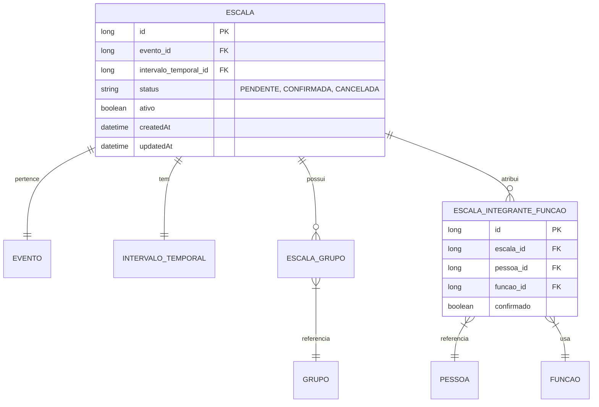

# CDU - Manter Escala

## 1. Metadados
- **Nome do CDU**: Manter Escala
- **Versão**: 1.0
- **Data**: 2026-06-19
- **Autor**: Kilo Code
- **Status**: Aprovado

## 2. Descrição do Caso de Uso

### 2.1. Descrição Breve
O caso de uso "Manter Escala" permite o gerenciamento de escalas de voluntários para eventos da igreja, incluindo criação, atualização, consulta e exclusão de escalas, com definição de grupos, integrantes, funções e intervalos temporais.

### 2.2. Objetivos
- Cadastrar escalas para eventos
- Definir grupos participantes
- Atribuir funções a integrantes
- Controlar status de escalas
- Gerenciar intervalos temporais
- Consultar escalas cadastradas

### 2.3. Escopo
**Incluído**:
- CRUD de escalas
- Associação com eventos
- Definição de grupos participantes
- Atribuição de funções a integrantes
- Controle de status (PENDENTE, CONFIRMADA, CANCELADA)

**Excluído**:
- Gestão de eventos (tratado em CDU separado)
- Gestão de grupos (tratado em módulo separado)

## 3. Atores

| Ator | Descrição | Tipo |
|------|------------|------|
| Usuário Administrador | Gerencia escalas de voluntários | Primário |
| Sistema | Aplica validações de regras de negócio | Sistema |

## 4. Pré-condições

### 4.1. Para Cadastrar Escala
- Ator deve estar autenticado
- Evento deve existir
- Intervalo temporal deve ser informado
- Pelo menos um grupo deve ser selecionado

### 4.2. Para Atribuir Função
- Escala deve existir
- Pessoa deve existir
- Função deve existir

### 4.3. Para Excluir Escala
- Escala deve existir
- Escala não pode ter integrantes confirmados

## 5. Pós-condições

### 5.1. Pós-condição de Sucesso (Cadastrar)
- Escala é criada no sistema
- Status padrão é PENDENTE
- Sistema retorna escala criada

### 5.2. Pós-condição de Sucesso (Atribuir Função)
- Função é atribuída ao integrante
- Sistema retorna escala atualizada

### 5.3. Pós-condição de Falha
- Operação não é realizada
- Erros de validação são reportados

## 6. Fluxo Principal (Basic Flow)

### 6.1. Fluxo: Cadastrar Escala

**Trigger**: O caso de uso inicia quando o ator solicita criação de escala para um evento.

**Passos**:
1. **Dado** ator autenticado
2. **Dado** evento existe
3. **Quando** ator acessa formulário de criação de escala
4. **Quando** ator seleciona evento [RN002]
5. **Quando** ator define intervalo temporal [RN001]
6. **Quando** ator seleciona grupos participantes [RN004]
7. **Quando** ator adiciona integrantes com funções (opcional) [RN005]
8. **Então** sistema valida intervalo temporal obrigatório [ESC_001]
9. **Então** sistema valida evento obrigatório [ESC_002]
10. **Então** sistema define status padrão PENDENTE [ESC_003]
11. **Então** sistema valida pelo menos um grupo [ESC_004]
12. **Então** sistema valida funções dos integrantes se informados [ESC_005]
13. **Então** sistema cria escala
14. **Então** sistema retorna escala criada

### 6.2. Fluxo: Atribuir Função a Integrante

**Trigger**: O caso de uso inicia quando o ator adiciona integrante com função à escala.

**Passos**:
1. **Dado** ator autenticado
2. **Dado** escala existe
3. **Quando** ator seleciona pessoa para integrante
4. **Quando** ator seleciona função para o integrante
5. **Então** sistema valida pessoa existe
6. **Então** sistema valida função existe
7. **Então** sistema adiciona integrante com função
8. **Então** sistema retorna escala atualizada

### 6.3. Fluxo: Consultar Escalas

**Trigger**: O caso de uso inicia quando o ator busca escalas.

**Passos**:
1. **Dado** ator autenticado
2. **Quando** ator acessa lista de escalas
3. **Quando** ator aplica filtros (evento, período, status, grupo)
4. **Então** sistema retorna lista de escalas filtrada

## 7. Fluxos Alternativos

### 7.1. Fluxo Alternativo: Escala com Múltiplos Grupos

1. **Dado** escala pode ter múltiplos grupos
2. **Quando** ator adiciona mais de um grupo
3. **Então** sistema associa todos os grupos à escala
4. **Então** sistema retorna escala com todos os grupos

## 8. Fluxos de Exceção

### 8.1. Fluxo de Exceção: Intervalo Temporal Inválido

1. **Dado** sistema está validando cadastro de escala
2. **Quando** sistema detecta intervalo temporal inválido [ESC_001]
3. **Então** sistema exibe mensagem de erro
4. **Então** sistema impede cadastro
5. **Então** ator deve corrigir intervalo antes de continuar

### 8.2. Fluxo de Exceção: Evento Inválido

1. **Dado** sistema está validando cadastro de escala
2. **Quando** sistema detecta evento não informado ou inexistente [ESC_002]
3. **Então** sistema exibe mensagem de erro
4. **Então** sistema impede cadastro
5. **Então** ator deve selecionar evento válido

### 8.3. Fluxo de Exceção: Nenhum Grupo Selecionado

1. **Dado** sistema está validando cadastro de escala
2. **Quando** sistema detecta nenhum grupo selecionado [ESC_004]
3. **Então** sistema exibe mensagem de erro
4. **Então** sistema impede cadastro
5. **Então** ator deve selecionar pelo menos um grupo

## 9. Fluxos de Navegação (Mestre-Detalhe)

### 9.1. Navegação: Visualizar Integrantes da Escala

1. A partir da lista de escalas, ator seleciona uma escala
2. Sistema exibe detalhes da escala
3. Sistema exibe lista de integrantes com funções
4. Ator pode adicionar/remover integrantes

### 9.2. Navegação: Visualizar Evento da Escala

1. A partir dos detalhes da escala, ator clica no nome do evento
2. Sistema exibe detalhes do evento associado
3. Ator pode consultar informações do evento

## 10. Regras de Negócio

| ID | Regra de Negócio | Tipo | Aplicação |
|----|------------------|------|-----------|
| RN001 | Intervalo temporal é obrigatório com data de início válida | Validação | Cadastro |
| RN002 | Evento é obrigatório e deve existir | Validação | Cadastro |
| RN003 | Status padrão é PENDENTE ao criar escala | Comportamental | Cadastro |
| RN004 | Pelo menos um grupo deve ser selecionado | Validação | Cadastro |
| RN005 | Integrantes com funções são opcionais, mas se informados devem ter função válida | Validação | Cadastro |

## 11. Estrutura de Dados

## 12. Contratos de Interface

### 12.1. Interface REST

| Método | Endpoint | Descrição |
|--------|----------|------------|
| POST | `/api/${api.version}/escala` | Cadastra nova escala |
| GET | `/api/${api.version}/escala` | Lista escalas |
| GET | `/api/${api.version}/escala/{id}` | Busca escala por ID |
| PUT | `/api/${api.version}/escala/{id}` | Atualiza escala |
| DELETE | `/api/${api.version}/escala/{id}` | Exclui escala |
| POST | `/api/${api.version}/escala/{id}/grupos` | Adiciona grupo à escala |
| DELETE | `/api/${api.version}/escala/{id}/grupos/{grupoId}` | Remove grupo da escala |
| POST | `/api/${api.version}/escala/{id}/integrantes` | Adiciona integrante com função |
| PUT | `/api/${api.version}/escala/{id}/integrantes/{pessoaId}` | Atualiza função do integrante |
| DELETE | `/api/${api.version}/escala/{id}/integrantes/{pessoaId}` | Remove integrante |
| GET | `/api/${api.version}/escala/{id}/integrantes` | Lista integrantes da escala |

## 13. Requisitos Especiais

### 13.1. Segurança
- Apenas usuários autenticados podem gerenciar escalas
- Log de todas as operações

### 13.2. Performance
- Consulta de escalas deve suportar paginação
- Filtros por evento e período devem ser otimizados

### 13.3. Conformidade
- Validação de dados obrigatórios
- Registro de auditoria

## 14. Pontos de Extensão

### 14.1. Notificações de Escala
- **Extensão 1**: Envio de notificações para integrantes
- **Quando**: Necessário avisar voluntários sobre escalas
- **Como**: Integrar com módulo de Comunicação

### 14.2. Confirmação de Presença
- **Extensão 2**: Sistema de confirmação de presença
- **Quando**: Necessário confirmar participação
- **Como**: Implementar fluxo de confirmação

## 15. Referências

### ADRs Relacionados
- ADR-010: Padrões de Nomenclatura
- ADR-011: Exception Handling Patterns
- ADR-012: Testing Patterns
- ADR-018: Business Rule Chain Pattern
- ADR-019: Service Validator Pattern
- ADR-053: Usar CDU para Documentação de Casos de Uso
- ADR-054: Usar RN para Documentação de Regras de Negócio

### CDUs Relacionados
- CDU032-Manter-Evento: Gerenciamento de eventos
- CDU030-Manter-Familia: Gerenciamento de famílias
- CDU031-Manter-Pessoa: Gerenciamento de pessoas

### Documentação Técnica
- `biblia-model/src/main/java/com/ia/biblia/model/escala/Escala.java`
- `biblia-service/src/main/java/com/ia/biblia/service/escala/EscalaService.java`
- `biblia-rest/src/main/java/com/ia/biblia/rest/escala/EscalaController.java`
