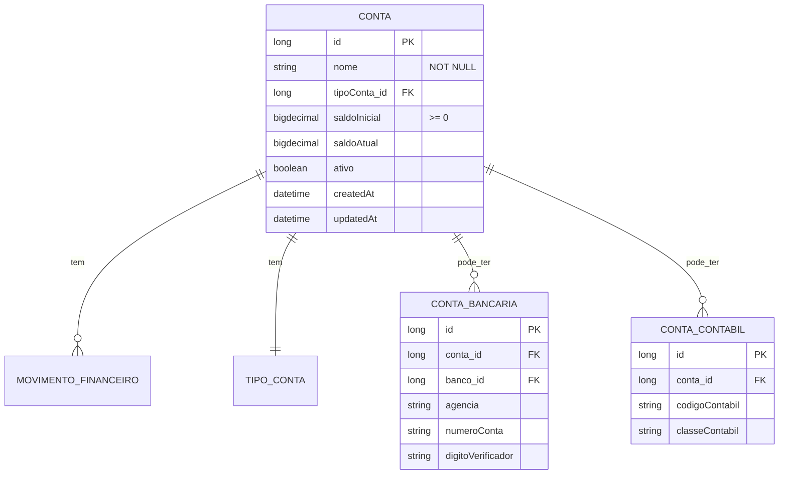

# CDU - Manter Conta

## 1. Metadados
- **Nome do CDU**: Manter Conta
- **Versão**: 1.0
- **Data**: 2026-06-19
- **Autor**: Kilo Code
- **Status**: Aprovado

## 2. Descrição do Caso de Uso

### 2.1. Descrição Breve
O caso de uso "Manter Conta" permite o gerenciamento de contas financeiras no sistema Biblia/gestor-igreja, incluindo cadastro, atualização, consulta e exclusão de contas bancárias e contábeis, com controle de saldos e tipos de conta.

### 2.2. Objetivos
- Cadastrar contas bancárias e contábeis
- Controlar saldos iniciais
- Gerenciar tipos de conta
- Consultar contas cadastradas
- Manter histórico de movimentações

### 2.3. Escopo
**Incluído**:
- CRUD de contas
- Definição de tipo de conta (BANCARIA, CONTABIL)
- Controle de saldo inicial
- Associação com banco e agência
- Consulta de extrato

**Excluído**:
- Gestão de movimentações (tratado em módulo separado)
- Conciliação bancária (tratado em módulo separado)

## 3. Atores

| Ator | Descrição | Tipo |
|------|------------|------|
| Usuário Administrador | Gerencia contas financeiras | Primário |
| Sistema | Aplica validações de saldo e tipo | Sistema |

## 4. Pré-condições

### 4.1. Para Cadastrar Conta
- Ator deve estar autenticado
- Nome deve ser fornecido
- Tipo de conta deve ser informado

### 4.2. Para Excluir Conta
- Conta deve existir
- Conta não pode ter movimentações

## 5. Pós-condições

### 5.1. Pós-condição de Sucesso (Cadastrar)
- Conta é criada no sistema
- Saldo inicial é registrado
- Sistema retorna conta criada

### 5.2. Pós-condição de Sucesso (Atualizar)
- Dados da conta são atualizados
- Sistema retorna conta atualizada

### 5.3. Pós-condição de Falha
- Operação não é realizada
- Erros de validação são reportados

## 6. Fluxo Principal (Basic Flow)

### 6.1. Fluxo: Cadastrar Conta

**Trigger**: O caso de uso inicia quando o ator solicita cadastro de nova conta.

**Passos**:
1. **Dado** ator autenticado
2. **Quando** ator acessa formulário de cadastro de conta
3. **Quando** ator preenche nome da conta [RN001]
4. **Quando** ator seleciona tipo de conta [RN003]
5. **Quando** ator informa saldo inicial [RN002]
6. **Quando** ator associa banco/agência (opcional para contas bancárias)
7. **Então** sistema valida nome obrigatório [CON_001]
8. **Então** sistema valida saldo inicial >= 0 [CON_002]
9. **Então** sistema valida tipo de conta obrigatório [CON_003]
10. **Então** sistema cria conta
11. **Então** sistema retorna conta criada

### 6.2. Fluxo: Atualizar Conta

**Trigger**: O caso de uso inicia quando o ator modifica dados de conta existente.

**Passos**:
1. **Dado** ator autenticado
2. **Dado** conta existe
3. **Quando** ator modifica dados da conta
4. **Então** sistema valida alterações [CON_001, CON_003]
5. **Então** sistema atualiza conta
6. **Então** sistema retorna conta atualizada

### 6.3. Fluxo: Consultar Contas

**Trigger**: O caso de uso inicia quando o ator busca contas.

**Passos**:
1. **Dado** ator autenticado
2. **Quando** ator acessa lista de contas
3. **Quando** ator aplica filtros (tipo, status)
4. **Então** sistema retorna lista de contas filtrada

## 7. Fluxos Alternativos

### 7.1. Fluxo Alternativo: Conta Contábil

1. **Dado** tipo de conta é CONTABIL
2. **Quando** ator cadastra conta contábil
3. **Então** sistema não exige banco/agência
4. **Então** sistema cria conta contábil

## 8. Fluxos de Exceção

### 8.1. Fluxo de Exceção: Nome Inválido

1. **Dado** sistema está validando cadastro de conta
2. **Quando** sistema detecta nome nulo ou vazio [CON_001]
3. **Então** sistema exibe mensagem de erro
4. **Então** sistema impede cadastro
5. **Então** ator deve corrigir nome antes de continuar

### 8.2. Fluxo de Exceção: Saldo Inválido

1. **Dado** sistema está validando cadastro de conta
2. **Quando** sistema detecta saldo inicial negativo [CON_002]
3. **Então** sistema exibe mensagem de erro
4. **Então** sistema impede cadastro
5. **Então** ator deve corrigir saldo antes de continuar

### 8.3. Fluxo de Exceção: Tipo Inválido

1. **Dado** sistema está validando cadastro de conta
2. **Quando** sistema detecta tipo de conta inválido [CON_003]
3. **Então** sistema exibe mensagem de erro
4. **Então** sistema impede cadastro
5. **Então** ator deve selecionar tipo válido

## 9. Fluxos de Navegação (Mestre-Detalhe)

### 9.1. Navegação: Visualizar Extrato da Conta

1. A partir da lista de contas, ator seleciona uma conta
2. Sistema exibe detalhes da conta
3. Ator clica em "Ver Extrato"
4. Sistema exibe extrato de movimentações da conta

## 10. Regras de Negócio

| ID | Regra de Negócio | Tipo | Aplicação |
|----|------------------|------|-----------|
| RN001 | Nome da conta é obrigatório | Validação | Cadastro/Atualização |
| RN002 | Saldo inicial deve ser >= 0 | Validação | Cadastro |
| RN003 | Tipo de conta é obrigatório (BANCARIA ou CONTABIL) | Validação | Cadastro/Atualização |

## 11. Estrutura de Dados

## 12. Contratos de Interface

### 12.1. Interface REST

| Método | Endpoint | Descrição |
|--------|----------|------------|
| POST | `/api/${api.version}/conta` | Cadastra nova conta |
| GET | `/api/${api.version}/conta` | Lista contas |
| GET | `/api/${api.version}/conta/{id}` | Busca conta por ID |
| PUT | `/api/${api.version}/conta/{id}` | Atualiza conta |
| DELETE | `/api/${api.version}/conta/{id}` | Exclui conta |
| GET | `/api/${api.version}/conta/{id}/extrato` | Obtém extrato da conta |
| GET | `/api/${api.version}/conta/{id}/saldo` | Obtém saldo atual |

## 13. Requisitos Especiais

### 13.1. Segurança
- Apenas usuários autenticados podem gerenciar contas
- Log de todas as operações financeiras

### 13.2. Performance
- Consulta de extrato deve ser otimizada para grandes volumes
- Índices em data de movimentação

### 13.3. Conformidade
- Validação de dados bancários
- Registro de auditoria para operações financeiras

## 14. Pontos de Extensão

### 14.1. Integração com Bancos
- **Extensão 1**: Importação de extratos bancários
- **Quando**: Necessário conciliação automática
- **Como**: Integrar com APIs de bancos ou arquivos OFX

### 14.2. Contas Compartilhadas
- **Extensão 2**: Suporte a contas compartilhadas
- **Quando**: Necessário controle de múltiplos responsáveis
- **Como**: Implementar entidade de permissões

## 15. Referências

### ADRs Relacionados
- ADR-010: Padrões de Nomenclatura
- ADR-011: Exception Handling Patterns
- ADR-012: Testing Patterns
- ADR-018: Business Rule Chain Pattern
- ADR-019: Service Validator Pattern
- ADR-053: Usar CDU para Documentação de Casos de Uso
- ADR-054: Usar RN para Documentação de Regras de Negócio

### CDUs Relacionados
- CDU035-Manter-Despesa: Gerenciamento de despesas
- CDU036-Manter-Receita: Gerenciamento de receitas
- CDU032-Manter-Evento: Gerenciamento de eventos

### Documentação Técnica
- `biblia-model/src/main/java/com/ia/biblia/model/conta/Conta.java`
- `biblia-service/src/main/java/com/ia/biblia/service/conta/ContaService.java`
- `biblia-rest/src/main/java/com/ia/biblia/rest/conta/ContaController.java`
