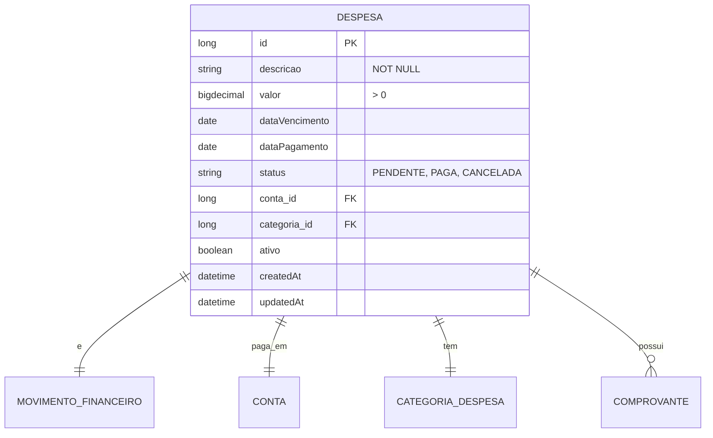

# CDU - Manter Despesa

## 1. Metadados
- **Nome do CDU**: Manter Despesa
- **Versão**: 1.0
- **Data**: 2026-06-19
- **Autor**: Kilo Code
- **Status**: Aprovado

## 2. Descrição do Caso de Uso

### 2.1. Descrição Breve
O caso de uso "Manter Despesa" permite o gerenciamento de despesas financeiras no sistema Biblia/gestor-igreja, incluindo registro, atualização, consulta e exclusão de despesas, com associação a contas financeiras e categorias.

### 2.2. Objetivos
- Registrar despesas da igreja
- Categorizar gastos
- Associar despesas a contas financeiras
- Controlar valores e datas de pagamento
- Consultar histórico de despesas

### 2.3. Escopo
**Incluído**:
- CRUD de despesas
- Associação com conta financeira
- Definição de categoria de despesa
- Controle de data de vencimento/pagamento
- Upload de comprovantes

**Excluído**:
- Gestão de contas (tratado em CDU separado)
- Aprovação de despesas (tratado em fluxo separado)

## 3. Atores

| Ator | Descrição | Tipo |
|------|------------|------|
| Usuário Administrador | Registra e gerencia despesas | Primário |
| Sistema | Aplica validações de valor e conta | Sistema |

## 4. Pré-condições

### 4.1. Para Registrar Despesa
- Ator deve estar autenticado
- Descrição deve ser fornecida
- Valor deve ser maior que zero
- Conta financeira deve existir

### 4.2. Para Excluir Despesa
- Despesa deve existir
- Despesa não pode estar paga

## 5. Pós-condições

### 5.1. Pós-condição de Sucesso (Registrar)
- Despesa é registrada no sistema
- Movimento financeiro é criado
- Sistema retorna despesa criada

### 5.2. Pós-condição de Sucesso (Marcar como Paga)
- Despesa é atualizada como paga
- Saldo da conta é atualizado
- Sistema retorna despesa atualizada

### 5.3. Pós-condição de Falha
- Operação não é realizada
- Erros de validação são reportados

## 6. Fluxo Principal (Basic Flow)

### 6.1. Fluxo: Registrar Despesa

**Trigger**: O caso de uso inicia quando o ator registra nova despesa.

**Passos**:
1. **Dado** ator autenticado
2. **Quando** ator acessa formulário de registro de despesa
3. **Quando** ator preenche descrição [RN001]
4. **Quando** ator informa valor da despesa [RN002]
5. **Quando** ator seleciona conta financeira [RN004]
6. **Quando** ator informa data de vencimento
7. **Quando** ator anexa comprovante (opcional)
8. **Então** sistema valida descrição obrigatória [DES_001]
9. **Então** sistema valida valor > 0 [DES_002]
10. **Então** sistema define tipo movimento como DEBITO [DES_003]
11. **Então** sistema valida conta obrigatória [DES_004]
12. **Então** sistema cria despesa
13. **Então** sistema retorna despesa criada

### 6.2. Fluxo: Marcar Despesa como Paga

**Trigger**: O caso de uso inicia quando o ator confirma pagamento de despesa.

**Passos**:
1. **Dado** ator autenticado
2. **Dado** despesa existe e está pendente
3. **Quando** ator confirma pagamento
4. **Quando** ator informa data de pagamento
5. **Então** sistema atualiza status para paga
6. **Então** sistema atualiza saldo da conta
7. **Então** sistema retorna despesa atualizada

### 6.3. Fluxo: Consultar Despesas

**Trigger**: O caso de uso inicia quando o ator busca despesas.

**Passos**:
1. **Dado** ator autenticado
2. **Quando** ator acessa lista de despesas
3. **Quando** ator aplica filtros (período, conta, categoria, status)
4. **Então** sistema retorna lista de despesas filtrada

## 7. Fluxos Alternativos

### 7.1. Fluxo Alternativo: Despesa Parcelada

1. **Dado** despesa pode ser parcelada
2. **Quando** ator informa número de parcelas
3. **Então** sistema cria múltiplas despesas (uma por parcela)
4. **Então** sistema retorna lista de despesas criadas

## 8. Fluxos de Exceção

### 8.1. Fluxo de Exceção: Descrição Inválida

1. **Dado** sistema está validando registro de despesa
2. **Quando** sistema detecta descrição nula, vazia ou apenas espaços [DES_001]
3. **Então** sistema exibe mensagem de erro
4. **Então** sistema impede registro
5. **Então** ator deve corrigir descrição antes de continuar

### 8.2. Fluxo de Exceção: Valor Inválido

1. **Dado** sistema está validando registro de despesa
2. **Quando** sistema detecta valor <= 0 [DES_002]
3. **Então** sistema exibe mensagem de erro
4. **Então** sistema impede registro
5. **Então** ator deve corrigir valor antes de continuar

### 8.3. Fluxo de Exceção: Conta Inválida

1. **Dado** sistema está validando registro de despesa
2. **Quando** sistema detecta conta não informada ou inexistente [DES_004]
3. **Então** sistema exibe mensagem de erro
4. **Então** sistema impede registro
5. **Então** ator deve selecionar conta válida

## 9. Fluxos de Navegação (Mestre-Detalhe)

### 9.1. Navegação: Visualizar Comprovante

1. A partir da lista de despesas, ator seleciona uma despesa
2. Sistema exibe detalhes da despesa
3. Ator clica em "Ver Comprovante"
4. Sistema exibe comprovante anexado

## 10. Regras de Negócio

| ID | Regra de Negócio | Tipo | Aplicação |
|----|------------------|------|-----------|
| RN001 | Descrição é obrigatória | Validação | Registro |
| RN002 | Valor deve ser maior que zero | Validação | Registro |
| RN003 | Tipo de movimento é DEBITO por padrão | Comportamental | Registro |
| RN004 | Conta financeira é obrigatória e deve existir | Validação | Registro |

## 11. Estrutura de Dados

## 12. Contratos de Interface

### 12.1. Interface REST

| Método | Endpoint | Descrição |
|--------|----------|------------|
| POST | `/api/${api.version}/despesa` | Registra nova despesa |
| GET | `/api/${api.version}/despesa` | Lista despesas |
| GET | `/api/${api.version}/despesa/{id}` | Busca despesa por ID |
| PUT | `/api/${api.version}/despesa/{id}` | Atualiza despesa |
| DELETE | `/api/${api.version}/despesa/{id}` | Exclui despesa |
| POST | `/api/${api.version}/despesa/{id}/pagar` | Marca despesa como paga |
| GET | `/api/${api.version}/despesa/{id}/comprovante` | Obtém comprovante |
| POST | `/api/${api.version}/despesa/{id}/comprovante` | Anexa comprovante |

## 13. Requisitos Especiais

### 13.1. Segurança
- Apenas usuários autenticados podem gerenciar despesas
- Log de todas as operações financeiras

### 13.2. Performance
- Consulta de despesas deve suportar paginação
- Filtros por período devem ser otimizados

### 13.3. Conformidade
- Validação de valores positivos
- Registro de auditoria para operações financeiras

## 14. Pontos de Extensão

### 14.1. Aprovação de Despesas
- **Extensão 1**: Fluxo de aprovação de despesas
- **Quando**: Necessário controle de aprovação
- **Como**: Implementar workflow de aprovação

### 14.2. Integração com Fornecedores
- **Extensão 2**: Cadastro de fornecedores
- **Quando**: Necessário controlar fornecedores
- **Como**: Integrar com módulo de fornecedores

## 15. Referências

### ADRs Relacionados
- ADR-010: Padrões de Nomenclatura
- ADR-011: Exception Handling Patterns
- ADR-012: Testing Patterns
- ADR-018: Business Rule Chain Pattern
- ADR-019: Service Validator Pattern
- ADR-053: Usar CDU para Documentação de Casos de Uso
- ADR-054: Usar RN para Documentação de Regras de Negócio

### CDUs Relacionados
- CDU034-Manter-Conta: Gerenciamento de contas financeiras
- CDU036-Manter-Receita: Gerenciamento de receitas
- CDU032-Manter-Evento: Gerenciamento de eventos

### Documentação Técnica
- `biblia-model/src/main/java/com/ia/biblia/model/despesa/Despesa.java`
- `biblia-service/src/main/java/com/ia/biblia/service/despesa/DespesaService.java`
- `biblia-rest/src/main/java/com/ia/biblia/rest/prestacao/PrestacaoContasController.java`
