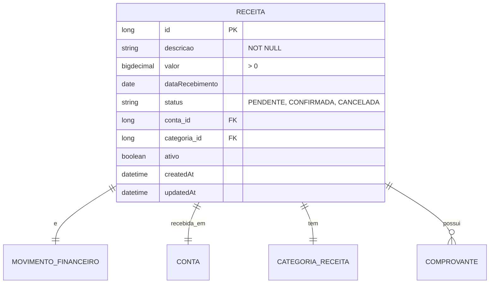

# CDU - Manter Receita

## 1. Metadados
- **Nome do CDU**: Manter Receita
- **Versão**: 1.0
- **Data**: 2026-06-19
- **Autor**: Kilo Code
- **Status**: Aprovado

## 2. Descrição do Caso de Uso

### 2.1. Descrição Breve
O caso de uso "Manter Receita" permite o gerenciamento de receitas financeiras no sistema Biblia/gestor-igreja, incluindo registro, atualização, consulta e exclusão de receitas (dízimos, ofertas, doações), com associação a contas financeiras e categorias.

### 2.2. Objetivos
- Registrar receitas da igreja
- Categorizar entradas
- Associar receitas a contas financeiras
- Controlar valores e datas de recebimento
- Consultar histórico de receitas

### 2.3. Escopo
**Incluído**:
- CRUD de receitas
- Associação com conta financeira
- Definição de categoria de receita
- Controle de data de recebimento
- Upload de comprovantes

**Excluído**:
- Gestão de contas (tratado em CDU separado)
- Emissão de recibos (tratado em módulo separado)

## 3. Atores

| Ator | Descrição | Tipo |
|------|------------|------|
| Usuário Administrador | Registra e gerencia receitas | Primário |
| Sistema | Aplica validações de valor e conta | Sistema |

## 4. Pré-condições

### 4.1. Para Registrar Receita
- Ator deve estar autenticado
- Descrição deve ser fornecida
- Valor deve ser maior que zero
- Conta financeira deve existir

### 4.2. Para Excluir Receita
- Receita deve existir
- Receita não pode estar confirmada

## 5. Pós-condições

### 5.1. Pós-condição de Sucesso (Registrar)
- Receita é registrada no sistema
- Movimento financeiro é criado
- Sistema retorna receita criada

### 5.2. Pós-condição de Sucesso (Confirmar Recebimento)
- Receita é atualizada como confirmada
- Saldo da conta é atualizado
- Sistema retorna receita atualizada

### 5.3. Pós-condição de Falha
- Operação não é realizada
- Erros de validação são reportados

## 6. Fluxo Principal (Basic Flow)

### 6.1. Fluxo: Registrar Receita

**Trigger**: O caso de uso inicia quando o ator registra nova receita.

**Passos**:
1. **Dado** ator autenticado
2. **Quando** ator acessa formulário de registro de receita
3. **Quando** ator preenche descrição [RN001]
4. **Quando** ator informa valor da receita [RN002]
5. **Quando** ator seleciona conta financeira [RN004]
6. **Quando** ator informa data de recebimento
7. **Quando** ator anexa comprovante (opcional)
8. **Então** sistema valida descrição obrigatória [REC_001]
9. **Então** sistema valida valor > 0 [REC_002]
10. **Então** sistema define tipo movimento como CREDITO [REC_003]
11. **Então** sistema valida conta obrigatória [REC_004]
12. **Então** sistema cria receita
13. **Então** sistema retorna receita criada

### 6.2. Fluxo: Confirmar Recebimento

**Trigger**: O caso de uso inicia quando o ator confirma recebimento de receita.

**Passos**:
1. **Dado** ator autenticado
2. **Dado** receita existe e está pendente
3. **Quando** ator confirma recebimento
4. **Quando** ator informa data de recebimento
5. **Então** sistema atualiza status para confirmada
6. **Então** sistema atualiza saldo da conta
7. **Então** sistema retorna receita atualizada

### 6.3. Fluxo: Consultar Receitas

**Trigger**: O caso de uso inicia quando o ator busca receitas.

**Passos**:
1. **Dado** ator autenticado
2. **Quando** ator acessa lista de receitas
3. **Quando** ator aplica filtros (período, conta, categoria, tipo)
4. **Então** sistema retorna lista de receitas filtrada

## 7. Fluxos Alternativos

### 7.1. Fluxo Alternativo: Receita Recorrente

1. **Dado** receita pode ser recorrente
2. **Quando** ator informa periodicidade
3. **Então** sistema cria múltiplas receitas conforme periodicidade
4. **Então** sistema retorna lista de receitas criadas

## 8. Fluxos de Exceção

### 8.1. Fluxo de Exceção: Descrição Inválida

1. **Dado** sistema está validando registro de receita
2. **Quando** sistema detecta descrição nula, vazia ou apenas espaços [REC_001]
3. **Então** sistema exibe mensagem de erro
4. **Então** sistema impede registro
5. **Então** ator deve corrigir descrição antes de continuar

### 8.2. Fluxo de Exceção: Valor Inválido

1. **Dado** sistema está validando registro de receita
2. **Quando** sistema detecta valor <= 0 [REC_002]
3. **Então** sistema exibe mensagem de erro
4. **Então** sistema impede registro
5. **Então** ator deve corrigir valor antes de continuar

### 8.3. Fluxo de Exceção: Conta Inválida

1. **Dado** sistema está validando registro de receita
2. **Quando** sistema detecta conta não informada ou inexistente [REC_004]
3. **Então** sistema exibe mensagem de erro
4. **Então** sistema impede registro
5. **Então** ator deve selecionar conta válida

## 9. Fluxos de Navegação (Mestre-Detalhe)

### 9.1. Navegação: Visualizar Comprovante

1. A partir da lista de receitas, ator seleciona uma receita
2. Sistema exibe detalhes da receita
3. Ator clica em "Ver Comprovante"
4. Sistema exibe comprovante anexado

## 10. Regras de Negócio

| ID | Regra de Negócio | Tipo | Aplicação |
|----|------------------|------|-----------|
| RN001 | Descrição é obrigatória | Validação | Registro |
| RN002 | Valor deve ser maior que zero | Validação | Registro |
| RN003 | Tipo de movimento é CREDITO por padrão | Comportamental | Registro |
| RN004 | Conta financeira é obrigatória e deve existir | Validação | Registro |

## 11. Estrutura de Dados

## 12. Contratos de Interface

### 12.1. Interface REST

| Método | Endpoint | Descrição |
|--------|----------|------------|
| POST | `/api/${api.version}/receita` | Registra nova receita |
| GET | `/api/${api.version}/receita` | Lista receitas |
| GET | `/api/${api.version}/receita/{id}` | Busca receita por ID |
| PUT | `/api/${api.version}/receita/{id}` | Atualiza receita |
| DELETE | `/api/${api.version}/receita/{id}` | Exclui receita |
| POST | `/api/${api.version}/receita/{id}/confirmar` | Confirma recebimento |
| GET | `/api/${api.version}/receita/{id}/comprovante` | Obtém comprovante |
| POST | `/api/${api.version}/receita/{id}/comprovante` | Anexa comprovante |

## 13. Requisitos Especiais

### 13.1. Segurança
- Apenas usuários autenticados podem gerenciar receitas
- Log de todas as operações financeiras

### 13.2. Performance
- Consulta de receitas deve suportar paginação
- Filtros por período devem ser otimizados

### 13.3. Conformidade
- Validação de valores positivos
- Registro de auditoria para operações financeiras

## 14. Pontos de Extensão

### 14.1. Emissão de Recibos
- **Extensão 1**: Geração automática de recibos
- **Quando**: Necessário comprovar recebimento
- **Como**: Integrar com módulo de documentos

### 14.2. Integração com Gateway de Pagamento
- **Extensão 2**: Recebimento online
- **Quando**: Necessário receber doações online
- **Como**: Integrar com gateway de pagamento

## 15. Referências

### ADRs Relacionados
- ADR-010: Padrões de Nomenclatura
- ADR-011: Exception Handling Patterns
- ADR-012: Testing Patterns
- ADR-018: Business Rule Chain Pattern
- ADR-019: Service Validator Pattern
- ADR-053: Usar CDU para Documentação de Casos de Uso
- ADR-054: Usar RN para Documentação de Regras de Negócio

### CDUs Relacionados
- CDU034-Manter-Conta: Gerenciamento de contas financeiras
- CDU035-Manter-Despesa: Gerenciamento de despesas
- CDU032-Manter-Evento: Gerenciamento de eventos

### Documentação Técnica
- `biblia-model/src/main/java/com/ia/biblia/model/receita/Receita.java`
- `biblia-service/src/main/java/com/ia/biblia/service/receita/ReceitaService.java`
- `biblia-rest/src/main/java/com/ia/biblia/rest/receita/ReceitaController.java`
