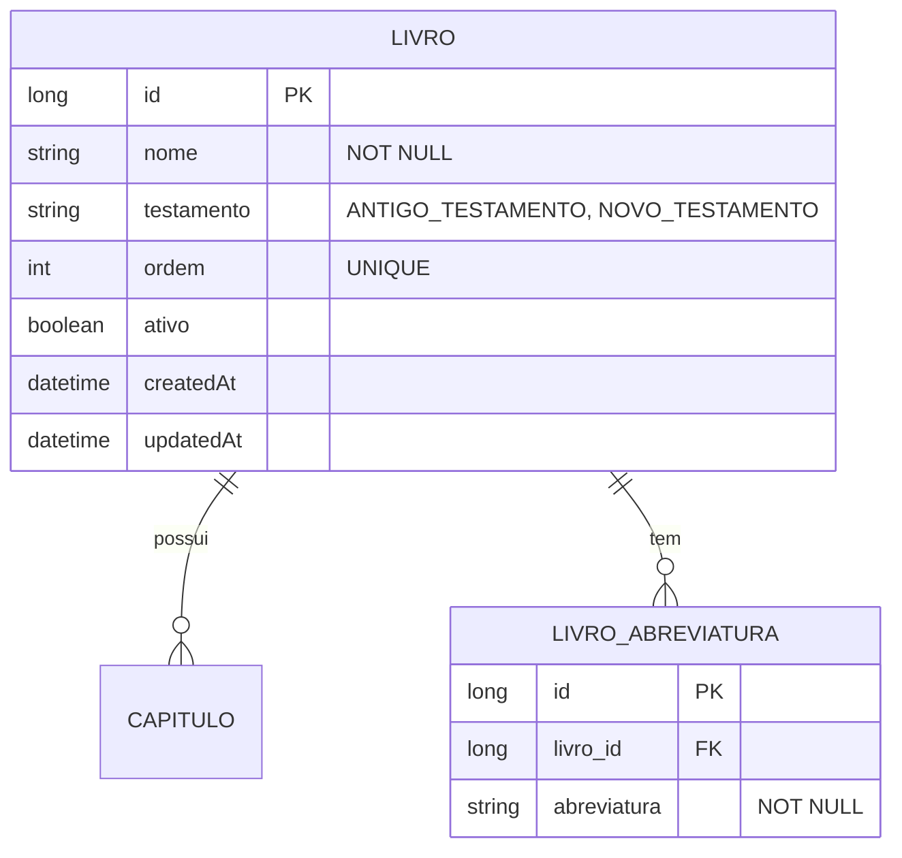

# CDU - Manter Livro

## 1. Metadados
- **Nome do CDU**: Manter Livro
- **Versão**: 1.0
- **Data**: 2026-06-19
- **Autor**: Kilo Code
- **Status**: Aprovado

## 2. Descrição do Caso de Uso

### 2.1. Descrição Breve
O caso de uso "Manter Livro" permite o gerenciamento de livros bíblicos no sistema Biblia, incluindo cadastro, atualização, consulta e exclusão de livros, com controle de testamentos, ordem e abreviaturas.

### 2.2. Objetivos
- Cadastrar livros bíblicos
- Controlar testamentos (Antigo/Novo)
- Definir ordem dos livros
- Gerenciar abreviaturas
- Consultar livros cadastrados

### 2.3. Escopo
**Incluído**:
- CRUD de livros bíblicos
- Definição de testamento (ANTIGO_TESTAMENTO, NOVO_TESTAMENTO)
- Controle de ordem sequencial
- Gestão de abreviaturas
- Associação com capítulos e versículos

**Excluído**:
- Gestão de capítulos (tratado em módulo separado)
- Gestão de versículos (tratado em módulo separado)

## 3. Atores

| Ator | Descrição | Tipo |
|------|------------|------|
| Usuário Administrador | Gerencia livros bíblicos | Primário |
| Sistema | Aplica validações de dados | Sistema |

## 4. Pré-condições

### 4.1. Para Cadastrar Livro
- Ator deve estar autenticado
- Nome do livro deve ser fornecido
- Testamento deve ser informado
- Ordem deve ser informada

### 4.2. Para Excluir Livro
- Livro deve existir
- Livro não pode ter capítulos/versículos associados

## 5. Pós-condições

### 5.1. Pós-condição de Sucesso (Cadastrar)
- Livro é criado no sistema
- Sistema retorna livro criado

### 5.2. Pós-condição de Sucesso (Atualizar)
- Dados do livro são atualizados
- Sistema retorna livro atualizado

### 5.3. Pós-condição de Falha
- Operação não é realizada
- Erros de validação são reportados

## 6. Fluxo Principal (Basic Flow)

### 6.1. Fluxo: Cadastrar Livro

**Trigger**: O caso de uso inicia quando o ator solicita cadastro de novo livro.

**Passos**:
1. **Dado** ator autenticado
2. **Quando** ator acessa formulário de cadastro de livro
3. **Quando** ator preenche nome do livro [RN001]
4. **Quando** ator seleciona testamento [RN002]
5. **Quando** ator informa ordem do livro [RN003]
6. **Quando** ator informa abreviaturas
7. **Então** sistema valida nome obrigatório [LIV_001]
8. **Então** sistema valida testamento válido [LIV_002]
9. **Então** sistema valida ordem única [LIV_003]
10. **Então** sistema cria livro
11. **Então** sistema retorna livro criado

### 6.2. Fluxo: Atualizar Livro

**Trigger**: O caso de uso inicia quando o ator modifica dados de livro existente.

**Passos**:
1. **Dado** ator autenticado
2. **Dado** livro existe
3. **Quando** ator modifica dados do livro
4. **Então** sistema valida alterações [LIV_001 a LIV_003]
5. **Então** sistema atualiza livro
6. **Então** sistema retorna livro atualizado

### 6.3. Fluxo: Consultar Livros

**Trigger**: O caso de uso inicia quando o ator busca livros.

**Passos**:
1. **Dado** ator autenticado
2. **Quando** ator acessa lista de livros
3. **Quando** ator aplica filtros (testamento, ordem)
4. **Então** sistema retorna lista de livros filtrada

## 7. Fluxos Alternativos

### 7.1. Fluxo Alternativo: Múltiplas Abreviaturas

1. **Dado** livro pode ter múltiplas abreviaturas
2. **Quando** ator adiciona mais de uma abreviatura
3. **Então** sistema associa todas as abreviaturas ao livro
4. **Então** sistema retorna livro com todas as abreviaturas

## 8. Fluxos de Exceção

### 8.1. Fluxo de Exceção: Nome Inválido

1. **Dado** sistema está validando cadastro de livro
2. **Quando** sistema detecta nome nulo ou vazio [LIV_001]
3. **Então** sistema exibe mensagem de erro
4. **Então** sistema impede cadastro
5. **Então** ator deve corrigir nome antes de continuar

### 8.2. Fluxo de Exceção: Testamento Inválido

1. **Dado** sistema está validando cadastro de livro
2. **Quando** sistema detecta testamento inválido [LIV_002]
3. **Então** sistema exibe mensagem de erro
4. **Então** sistema impede cadastro
5. **Então** ator deve selecionar testamento válido

### 8.3. Fluxo de Exceção: Ordem Duplicada

1. **Dado** sistema está validando cadastro de livro
2. **Quando** sistema detecta ordem já utilizada [LIV_003]
3. **Então** sistema exibe mensagem de erro
4. **Então** sistema impede cadastro
5. **Então** ator deve informar ordem diferente

## 9. Fluxos de Navegação (Mestre-Detalhe)

### 9.1. Navegação: Visualizar Capítulos do Livro

1. A partir da lista de livros, ator seleciona um livro
2. Sistema exibe detalhes do livro
3. Ator clica em "Ver Capítulos"
4. Sistema exibe lista de capítulos do livro

## 10. Regras de Negócio

| ID | Regra de Negócio | Tipo | Aplicação |
|----|------------------|------|-----------|
| RN001 | Nome do livro é obrigatório | Validação | Cadastro/Atualização |
| RN002 | Testamento deve ser válido (ANTIGO_TESTAMENTO ou NOVO_TESTAMENTO) | Validação | Cadastro/Atualização |
| RN003 | Ordem do livro deve ser única | Integridade | Cadastro/Atualização |

## 11. Estrutura de Dados

## 12. Contratos de Interface

### 12.1. Interface REST

| Método | Endpoint | Descrição |
|--------|----------|------------|
| POST | `/api/${api.version}/livro` | Cadastra novo livro |
| GET | `/api/${api.version}/livro` | Lista livros |
| GET | `/api/${api.version}/livro/{id}` | Busca livro por ID |
| PUT | `/api/${api.version}/livro/{id}` | Atualiza livro |
| DELETE | `/api/${api.version}/livro/{id}` | Exclui livro |
| GET | `/api/${api.version}/livro/{id}/capitulos` | Lista capítulos do livro |
| POST | `/api/${api.version}/livro/{id}/abreviaturas` | Adiciona abreviatura |
| DELETE | `/api/${api.version}/livro/{id}/abreviaturas/{abreviaturaId}` | Remove abreviatura |

## 13. Requisitos Especiais

### 13.1. Segurança
- Apenas usuários autenticados podem gerenciar livros
- Log de todas as operações

### 13.2. Performance
- Consulta de livros deve ser otimizada
- Ordenação por ordem deve ser indexada

### 13.3. Conformidade
- Validação de dados obrigatórios
- Registro de auditoria

## 14. Pontos de Extensão

### 14.1. Importação de Bíblias
- **Extensão 1**: Importação em massa de livros bíblicos
- **Quando**: Necessário cadastrar múltiplos livros
- **Como**: Implementar importação via arquivo

## 15. Referências

### ADRs Relacionados
- ADR-010: Padrões de Nomenclatura
- ADR-011: Exception Handling Patterns
- ADR-012: Testing Patterns
- ADR-015: Usar TSID para Identidade
- ADR-018: Business Rule Chain Pattern
- ADR-019: Service Validator Pattern
- ADR-053: Usar CDU para Documentação de Casos de Uso
- ADR-054: Usar RN para Documentação de Regras de Negócio

### CDUs Relacionados
- CDU042-Manter-Livro-Biblia: Gerenciamento de conteúdo bíblico
- CDU043-Manter-Grammar: Gerenciamento de gramática de leitura

### Documentação Técnica
- `biblia-model/src/main/java/com/ia/biblia/model/livro/Livro.java`
- `biblia-service/src/main/java/com/ia/biblia/service/livro/LivroService.java`
- `biblia-rest/src/main/java/com/ia/biblia/rest/livro/LivroController.java`
