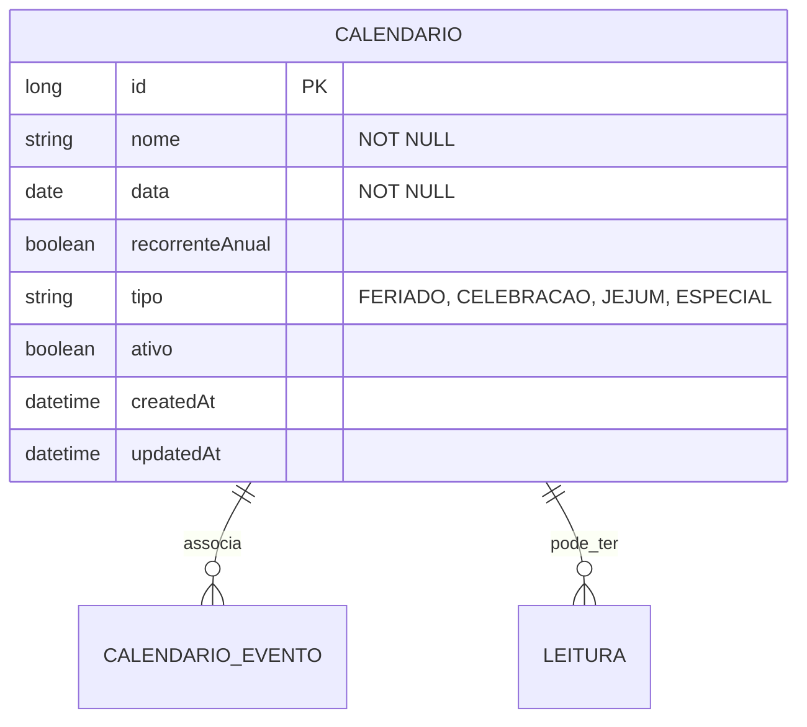

# CDU - Manter Calendário

## 1. Metadados
- **Nome do CDU**: Manter Calendário
- **Versão**: 1.0
- **Data**: 2026-06-19
- **Autor**: Kilo Code
- **Status**: Aprovado

## 2. Descrição do Caso de Uso

### 2.1. Descrição Breve
O caso de uso "Manter Calendário" permite o gerenciamento de calendários e datas especiais no sistema Biblia/gestor-igreja, incluindo cadastro de feriados, datas comemorativas, períodos de jejum e eventos recorrentes, com integração com eventos e leituras bíblicas.

### 2.2. Objetivos
- Cadastrar datas especiais e feriados
- Definir períodos de jejum/celebração
- Associar calendários a eventos
- Controlar recorrências anuais
- Consultar calendários cadastrados

### 2.3. Escopo
**Incluído**:
- CRUD de calendários
- Definição de datas especiais
- Controle de recorrência anual
- Associação com eventos
- Integração com leituras bíblicas

**Excluído**:
- Gestão de eventos (tratado em CDU separado)
- Gestão de leituras (tratado em módulo separado)

## 3. Atores

| Ator | Descrição | Tipo |
|------|------------|------|
| Usuário Administrador | Gerencia calendários e datas especiais | Primário |
| Sistema | Aplica validações de datas | Sistema |

## 4. Pré-condições

### 4.1. Para Cadastrar Calendário
- Ator deve estar autenticado
- Nome deve ser fornecido
- Data deve ser informada

### 4.2. Para Associar a Evento
- Calendário deve existir
- Evento deve existir

## 5. Pós-condições

### 5.1. Pós-condição de Sucesso (Cadastrar)
- Calendário é criado no sistema
- Sistema retorna calendário criado

### 5.2. Pós-condição de Sucesso (Associar Evento)
- Evento é associado ao calendário
- Sistema retorna calendário atualizado

### 5.3. Pós-condição de Falha
- Operação não é realizada
- Erros de validação são reportados

## 6. Fluxo Principal (Basic Flow)

### 6.1. Fluxo: Cadastrar Data Especial

**Trigger**: O caso de uso inicia quando o ator cadastra nova data especial.

**Passos**:
1. **Dado** ator autenticado
2. **Quando** ator acessa formulário de cadastro de calendário
3. **Quando** ator preenche nome da data [RN001]
4. **Quando** ator informa data [RN002]
5. **Quando** ator define se é recorrente anualmente [RN003]
6. **Quando** ator associa eventos (opcional)
7. **Então** sistema valida nome obrigatório [CAL_001]
8. **Então** sistema valida data válida [CAL_002]
9. **Então** sistema define recorrência [CAL_003]
10. **Então** sistema cria calendário
11. **Então** sistema retorna calendário criado

### 6.2. Fluxo: Consultar Calendário

**Trigger**: O caso de uso inicia quando o ator busca datas do calendário.

**Passos**:
1. **Dado** ator autenticado
2. **Quando** ator acessa visualização de calendário
3. **Quando** ator seleciona período (mês/ano)
4. **Então** sistema retorna datas do período

## 7. Fluxos Alternativos

### 7.1. Fluxo Alternativo: Período de Jejum

1. **Dado** data especial representa período de jejum
2. **Quando** ator informa data início e fim
3. **Então** sistema cria registro de período
4. **Então** sistema retorna calendário com período

## 8. Fluxos de Exceção

### 8.1. Fluxo de Exceção: Nome Inválido

1. **Dado** sistema está validando cadastro de calendário
2. **Quando** sistema detecta nome nulo ou vazio [CAL_001]
3. **Então** sistema exibe mensagem de erro
4. **Então** sistema impede cadastro
5. **Então** ator deve corrigir nome antes de continuar

### 8.2. Fluxo de Exceção: Data Inválida

1. **Dado** sistema está validando cadastro de calendário
2. **Quando** sistema detecta data inválida [CAL_002]
3. **Então** sistema exibe mensagem de erro
4. **Então** sistema impede cadastro
5. **Então** ator deve corrigir data antes de continuar

## 9. Fluxos de Navegação (Mestre-Detalhe)

### 9.1. Navegação: Visualizar Eventos da Data

1. A partir do calendário, ator clica em uma data
2. Sistema exibe detalhes da data
3. Sistema exibe eventos associados à data
4. Ator pode gerenciar eventos

## 10. Regras de Negócio

| ID | Regra de Negócio | Tipo | Aplicação |
|----|------------------|------|-----------|
| RN001 | Nome da data é obrigatório | Validação | Cadastro |
| RN002 | Data deve ser válida | Validação | Cadastro |
| RN003 | Recorrência anual é opcional | Comportamental | Cadastro |

## 11. Estrutura de Dados

## 12. Contratos de Interface

### 12.1. Interface REST

| Método | Endpoint | Descrição |
|--------|----------|------------|
| POST | `/api/${api.version}/calendario` | Cadastra nova data |
| GET | `/api/${api.version}/calendario` | Lista datas |
| GET | `/api/${api.version}/calendario/{id}` | Busca data por ID |
| PUT | `/api/${api.version}/calendario/{id}` | Atualiza data |
| DELETE | `/api/${api.version}/calendario/{id}` | Exclui data |
| GET | `/api/${api.version}/calendario/periodo` | Lista datas por período |
| POST | `/api/${api.version}/calendario/{id}/eventos` | Associa evento |
| DELETE | `/api/${api.version}/calendario/{id}/eventos/{eventoId}` | Remove associação |

## 13. Requisitos Especiais

### 13.1. Segurança
- Apenas usuários autenticados podem gerenciar calendários
- Log de todas as operações

### 13.2. Performance
- Consulta por período deve ser otimizada
- Recorrências devem ser pré-calculadas

### 13.3. Conformidade
- Validação de datas
- Registro de auditoria

## 14. Pontos de Extensão

### 14.1. Integração com Leituras Bíblicas
- **Extensão 1**: Associação de leituras a datas
- **Quando**: Necessário plano de leitura diária
- **Como**: Integrar com módulo de leituras

## 15. Referências

### ADRs Relacionados
- ADR-010: Padrões de Nomenclatura
- ADR-011: Exception Handling Patterns
- ADR-012: Testing Patterns
- ADR-015: Usar TSID para Identidade
- ADR-018: Business Rule Chain Pattern
- ADR-019: Service Validator Pattern
- ADR-045: Usar iCalendar/iTIP para Agendamento
- ADR-053: Usar CDU para Documentação de Casos de Uso
- ADR-054: Usar RN para Documentação de Regras de Negócio

### CDUs Relacionados
- CDU032-Manter-Evento: Gerenciamento de eventos
- CDU042-Manter-Livro-Biblia: Gerenciamento de conteúdo bíblico

### Documentação Técnica
- `biblia-model/src/main/java/com/ia/biblia/model/calendario/Calendario.java`
- `biblia-service/src/main/java/com/ia/biblia/service/calendario/CalendarioService.java`
- `biblia-rest/src/main/java/com/ia/biblia/rest/calendario/CalendarioController.java`
