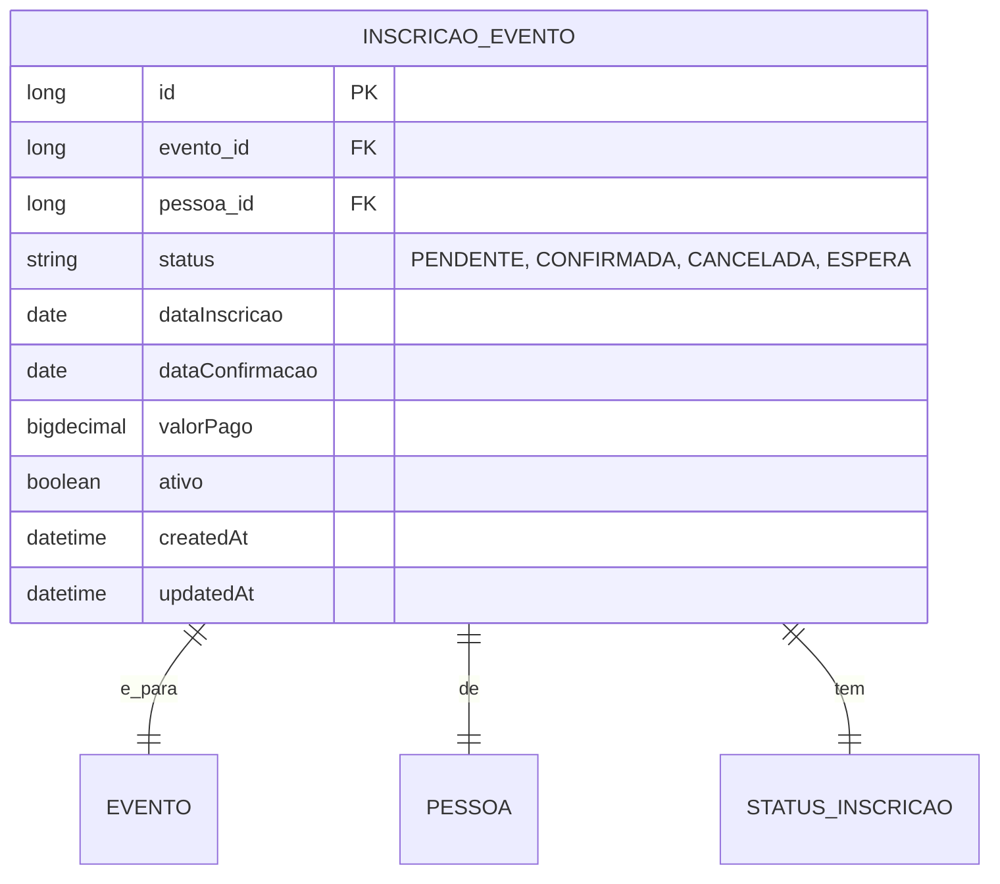

# CDU - Manter Inscrição

## 1. Metadados
- **Nome do CDU**: Manter Inscrição
- **Versão**: 1.0
- **Data**: 2026-06-19
- **Autor**: Kilo Code
- **Status**: Aprovado

## 2. Descrição do Caso de Uso

### 2.1. Descrição Breve
O caso de uso "Manter Inscrição" permite o gerenciamento de inscrições em eventos no sistema Biblia/gestor-igreja, incluindo criação, atualização, consulta e cancelamento de inscrições, com controle de vagas, valores e status de confirmação.

### 2.2. Objetivos
- Inscrever pessoas em eventos
- Controlar vagas disponíveis
- Gerenciar valores de inscrição
- Controlar status de confirmação
- Consultar inscrições

### 2.3. Escopo
**Incluído**:
- CRUD de inscrições
- Controle de vagas por evento
- Definição de valores de inscrição
- Status de confirmação/pagamento
- Cancelamento de inscrições

**Excluído**:
- Gestão de eventos (tratado em CDU separado)
- Gestão de pagamentos (tratado em módulo financeiro)

## 3. Atores

| Ator | Descrição | Tipo |
|------|------------|------|
| Usuário Administrador | Gerencia inscrições | Primário |
| Membro | Inscreve-se em eventos | Primário |
| Sistema | Controla vagas e validações | Sistema |

## 4. Pré-condições

### 4.1. Para Inscrever-se
- Ator deve estar autenticado
- Evento deve existir e estar ativo
- Evento deve ter vagas disponíveis
- Pessoa deve existir no sistema

### 4.2. Para Cancelar Inscrição
- Inscrição deve existir
- Evento não pode ter ocorrido

## 5. Pós-condições

### 5.1. Pós-condição de Sucesso (Inscrever)
- Inscrição é criada no sistema
- Vaga é reservada
- Sistema retorna inscrição criada

### 5.2. Pós-condição de Sucesso (Confirmar)
- Inscrição é confirmada
- Vaga é efetivada
- Sistema retorna inscrição confirmada

### 5.3. Pós-condição de Falha
- Operação não é realizada
- Erros de validação são reportados

## 6. Fluxo Principal (Basic Flow)

### 6.1. Fluxo: Inscrever-se em Evento

**Trigger**: O caso de uso inicia quando o ator solicita inscrição em evento.

**Passos**:
1. **Dado** ator autenticado
2. **Dado** evento existe e está ativo
3. **Quando** ator acessa página do evento
4. **Quando** ator clica em "Inscrever-se"
5. **Quando** ator confirma inscrição
6. **Então** sistema verifica vagas disponíveis [INS_001]
7. **Então** sistema valida se já está inscrito [INS_002]
8. **Então** sistema cria inscrição
9. **Então** sistema reserva vaga
10. **Então** sistema retorna inscrição criada

### 6.2. Fluxo: Confirmar Inscrição

**Trigger**: O caso de uso inicia quando o ator confirma inscrição.

**Passos**:
1. **Dado** ator autenticado
2. **Dado** inscrição existe e está pendente
3. **Quando** ator confirma inscrição
4. **Quando** ator informa forma de pagamento (se necessário)
5. **Então** sistema atualiza status para confirmada
6. **Então** sistema efetiva vaga
7. **Então** sistema retorna inscrição confirmada

### 6.3. Fluxo: Cancelar Inscrição

**Trigger**: O caso de uso inicia quando o ator cancela inscrição.

**Passos**:
1. **Dado** ator autenticado
2. **Dado** inscrição existe
3. **Quando** ator solicita cancelamento
4. **Então** sistema verifica se evento já ocorreu
5. **Então** sistema atualiza status para cancelada
6. **Então** sistema libera vaga
7. **Então** sistema retorna inscrição cancelada

## 7. Fluxos Alternativos

### 7.1. Fluxo Alternativo: Lista de Espera

1. **Dado** evento não tem vagas disponíveis
2. **Quando** ator tenta se inscrever
3. **Então** sistema oferece lista de espera
4. **Se** ator aceita lista de espera
    - **Então** sistema cria inscrição em espera
    - **Então** sistema notifica quando houver vaga

## 8. Fluxos de Exceção

### 8.1. Fluxo de Exceção: Sem Vagas

1. **Dado** sistema está processando inscrição
2. **Quando** sistema detecta que não há vagas disponíveis [INS_001]
3. **Então** sistema exibe mensagem informando falta de vagas
4. **Então** sistema oferece lista de espera
5. **Então** ator decide se quer entrar na lista de espera

### 8.2. Fluxo de Exceção: Já Inscrito

1. **Dado** sistema está processando inscrição
2. **Quando** sistema detecta que pessoa já está inscrita [INS_002]
3. **Então** sistema exibe mensagem informando inscrição existente
4. **Então** sistema impede nova inscrição
5. **Então** ator pode visualizar inscrição existente

### 8.3. Fluxo de Exceção: Evento Encerrado

1. **Dado** sistema está processando inscrição
2. **Quando** sistema detecta que evento já encerrou [INS_003]
3. **Então** sistema exibe mensagem de erro
4. **Então** sistema impede inscrição
5. **Então** ator não pode se inscrever em evento encerrado

## 9. Fluxos de Navegação (Mestre-Detalhe)

### 9.1. Navegação: Visualizar Inscrições do Evento

1. A partir dos detalhes do evento, ator clica em "Inscrições"
2. Sistema exibe lista de inscritos
3. Ator pode gerenciar inscrições

## 10. Regras de Negócio

| ID | Regra de Negócio | Tipo | Aplicação |
|----|------------------|------|-----------|
| RN001 | Evento deve ter vagas disponíveis para nova inscrição | Validação | Inscrição |
| RN002 | Pessoa não pode se inscrever mais de uma vez no mesmo evento | Integridade | Inscrição |
| RN003 | Não permite inscrição em eventos encerrados | Validação | Inscrição |

## 11. Estrutura de Dados

## 12. Contratos de Interface

### 12.1. Interface REST

| Método | Endpoint | Descrição |
|--------|----------|------------|
| POST | `/api/${api.version}/inscricao/evento` | Cria nova inscrição |
| GET | `/api/${api.version}/inscricao/evento` | Lista inscrições |
| GET | `/api/${api.version}/inscricao/evento/{id}` | Busca inscrição por ID |
| PUT | `/api/${api.version}/inscricao/evento/{id}` | Atualiza inscrição |
| DELETE | `/api/${api.version}/inscricao/evento/{id}` | Cancela inscrição |
| POST | `/api/${api.version}/inscricao/evento/{id}/confirmar` | Confirma inscrição |
| GET | `/api/${api.version}/inscricao/evento/evento/{eventoId}` | Lista inscrições do evento |
| GET | `/api/${api.version}/inscricao/evento/pessoa/{pessoaId}` | Lista inscrições da pessoa |

## 13. Requisitos Especiais

### 13.1. Segurança
- Apenas usuários autenticados podem gerenciar inscrições
- Pessoa só pode cancelar própria inscrição

### 13.2. Performance
- Consulta de inscrições deve suportar paginação
- Controle de vagas deve ser otimizado

### 13.3. Conformidade
- Validação de regras de negócio
- Registro de auditoria

## 14. Pontos de Extensão

### 14.1. Notificações de Inscrição
- **Extensão 1**: Envio de confirmação por email/SMS
- **Quando**: Necessário confirmar inscrição
- **Como**: Integrar com módulo de Comunicação

## 15. Referências

### ADRs Relacionados
- ADR-010: Padrões de Nomenclatura
- ADR-011: Exception Handling Patterns
- ADR-012: Testing Patterns
- ADR-015: Usar TSID para Identidade
- ADR-018: Business Rule Chain Pattern
- ADR-019: Service Validator Pattern
- ADR-053: Usar CDU para Documentação de Casos de Uso
- ADR-054: Usar RN para Documentação de Regras de Negócio

### CDUs Relacionados
- CDU032-Manter-Evento: Gerenciamento de eventos
- CDU031-Manter-Pessoa: Gerenciamento de pessoas

### Documentação Técnica
- `biblia-model/src/main/java/com/ia/biblia/model/inscricao/InscricaoEvento.java`
- `biblia-service/src/main/java/com/ia/biblia/service/inscricao/InscricaoEventoService.java`
- `biblia-rest/src/main/java/com/ia/biblia/rest/inscricao/evento/InscricaoEventoController.java`
