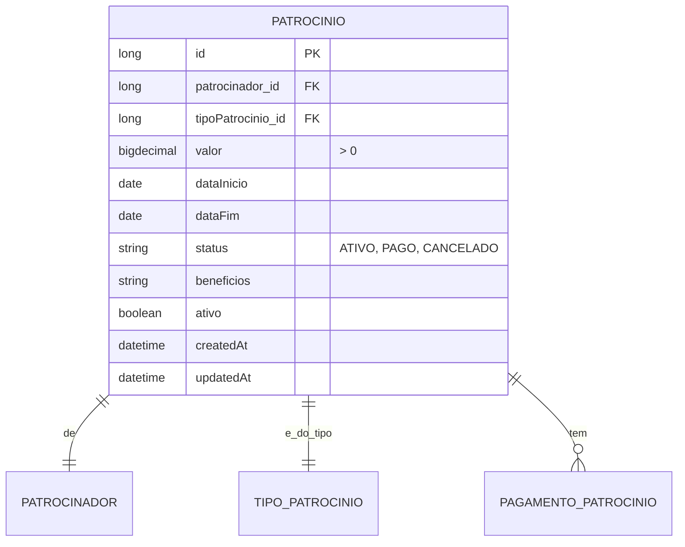

# CDU - Manter Patrocínio

## 1. Metadados
- **Nome do CDU**: Manter Patrocínio
- **Versão**: 1.0
- **Data**: 2026-06-19
- **Autor**: Kilo Code
- **Status**: Aprovado

## 2. Descrição do Caso de Uso

### 2.1. Descrição Breve
O caso de uso "Manter Patrocínio" permite o gerenciamento de patrocínios e apoios financeiros no sistema Biblia/gestor-igreja, incluindo cadastro de patrocinadores, tipos de patrocínio, valores, benefícios e acompanhamento de pagamentos.

### 2.2. Objetivos
- Cadastrar patrocinadores
- Definir tipos de patrocínio
- Gerenciar valores e benefícios
- Controlar status de pagamento
- Acompanhar patrocínios ativos

### 2.3. Escopo
**Incluído**:
- CRUD de patrocínios
- Cadastro de patrocinadores
- Definição de tipos de patrocínio
- Controle de valores e benefícios
- Status de pagamento

**Excluído**:
- Gestão de contratos (tratado em módulo separado)
- Emissão de notas fiscais (tratado em módulo financeiro)

## 3. Atores

| Ator | Descrição | Tipo |
|------|------------|------|
| Usuário Administrador | Gerencia patrocínios | Primário |
| Sistema | Aplica validações de regras | Sistema |

## 4. Pré-condições

### 4.1. Para Cadastrar Patrocínio
- Ator deve estar autenticado
- Patrocinador deve existir
- Tipo de patrocínio deve existir
- Valor deve ser informado

### 4.2. Para Excluir Patrocínio
- Patrocínio deve existir
- Patrocínio não pode ter pagamentos confirmados

## 5. Pós-condições

### 5.1. Pós-condição de Sucesso (Cadastrar)
- Patrocínio é criado no sistema
- Sistema retorna patrocínio criado

### 5.2. Pós-condição de Sucesso (Registrar Pagamento)
- Pagamento é registrado
- Status é atualizado
- Sistema retorna patrocínio atualizado

### 5.3. Pós-condição de Falha
- Operação não é realizada
- Erros de validação são reportados

## 6. Fluxo Principal (Basic Flow)

### 6.1. Fluxo: Cadastrar Patrocínio

**Trigger**: O caso de uso inicia quando o ator cadastra novo patrocínio.

**Passos**:
1. **Dado** ator autenticado
2. **Quando** ator acessa formulário de cadastro de patrocínio
3. **Quando** ator seleciona patrocinador [RN001]
4. **Quando** ator seleciona tipo de patrocínio [RN002]
5. **Quando** ator informa valor do patrocínio [RN003]
6. **Quando** ator define benefícios
7. **Quando** ator informa data de início e fim
8. **Então** sistema valida patrocinador obrigatório [PAT_001]
9. **Então** sistema valida tipo de patrocínio obrigatório [PAT_002]
10. **Então** sistema valida valor > 0 [PAT_003]
11. **Então** sistema cria patrocínio
12. **Então** sistema retorna patrocínio criado

### 6.2. Fluxo: Registrar Pagamento

**Trigger**: O caso de uso inicia quando o ator registra pagamento de patrocínio.

**Passos**:
1. **Dado** ator autenticado
2. **Dado** patrocínio existe
3. **Quando** ator registra pagamento
4. **Quando** ator informa valor pago
5. **Quando** ator anexa comprovante
6. **Então** sistema atualiza status do patrocínio
7. **Então** sistema registra movimento financeiro
8. **Então** sistema retorna patrocínio atualizado

### 6.3. Fluxo: Consultar Patrocínios

**Trigger**: O caso de uso inicia quando o ator busca patrocínios.

**Passos**:
1. **Dado** ator autenticado
2. **Quando** ator acessa lista de patrocínios
3. **Quando** ator aplica filtros (patrocinador, tipo, período, status)
4. **Então** sistema retorna lista de patrocínios filtrada

## 7. Fluxos Alternativos

### 7.1. Fluxo Alternativo: Patrocínio Recorrente

1. **Dado** patrocínio pode ser recorrente
2. **Quando** ator informa periodicidade
3. **Então** sistema cria múltiplos patrocínios conforme periodicidade
4. **Então** sistema retorna lista de patrocínios criados

## 8. Fluxos de Exceção

### 8.1. Fluxo de Exceção: Patrocinador Inválido

1. **Dado** sistema está validando cadastro de patrocínio
2. **Quando** sistema detecta patrocinador não informado ou inexistente [PAT_001]
3. **Então** sistema exibe mensagem de erro
4. **Então** sistema impede cadastro
5. **Então** ator deve selecionar patrocinador válido

### 8.2. Fluxo de Exceção: Tipo Inválido

1. **Dado** sistema está validando cadastro de patrocínio
2. **Quando** sistema detecta tipo não informado ou inexistente [PAT_002]
3. **Então** sistema exibe mensagem de erro
4. **Então** sistema impede cadastro
5. **Então** ator deve selecionar tipo válido

### 8.3. Fluxo de Exceção: Valor Inválido

1. **Dado** sistema está validando cadastro de patrocínio
2. **Quando** sistema detecta valor <= 0 [PAT_003]
3. **Então** sistema exibe mensagem de erro
4. **Então** sistema impede cadastro
5. **Então** ator deve corrigir valor antes de continuar

## 9. Fluxos de Navegação (Mestre-Detalhe)

### 9.1. Navegação: Visualizar Pagamentos do Patrocínio

1. A partir da lista de patrocínios, ator seleciona um patrocínio
2. Sistema exibe detalhes do patrocínio
3. Ator clica em "Ver Pagamentos"
4. Sistema exibe histórico de pagamentos

## 10. Regras de Negócio

| ID | Regra de Negócio | Tipo | Aplicação |
|----|------------------|------|-----------|
| RN001 | Patrocinador é obrigatório | Validação | Cadastro |
| RN002 | Tipo de patrocínio é obrigatório | Validação | Cadastro |
| RN003 | Valor do patrocínio deve ser maior que zero | Validação | Cadastro |

## 11. Estrutura de Dados

## 12. Contratos de Interface

### 12.1. Interface REST

| Método | Endpoint | Descrição |
|--------|----------|------------|
| POST | `/api/${api.version}/patrocinio` | Cadastra novo patrocínio |
| GET | `/api/${api.version}/patrocinio` | Lista patrocínios |
| GET | `/api/${api.version}/patrocinio/{id}` | Busca patrocínio por ID |
| PUT | `/api/${api.version}/patrocinio/{id}` | Atualiza patrocínio |
| DELETE | `/api/${api.version}/patrocinio/{id}` | Exclui patrocínio |
| POST | `/api/${api.version}/patrocinio/{id}/pagamento` | Registra pagamento |
| GET | `/api/${api.version}/patrocinio/{id}/pagamentos` | Lista pagamentos |

## 13. Requisitos Especiais

### 13.1. Segurança
- Apenas usuários autenticados podem gerenciar patrocínios
- Log de todas as operações

### 13.2. Performance
- Consulta de patrocínios deve suportar paginação
- Filtros por período devem ser otimizados

### 13.3. Conformidade
- Validação de valores
- Registro de auditoria

## 14. Pontos de Extensão

### 14.1. Emissão de Certificados
- **Extensão 1**: Geração de certificados para patrocinadores
- **Quando**: Necessário comprovar patrocínio
- **Como**: Integrar com módulo de documentos

## 15. Referências

### ADRs Relacionados
- ADR-010: Padrões de Nomenclatura
- ADR-011: Exception Handling Patterns
- ADR-012: Testing Patterns
- ADR-015: Usar TSID para Identidade
- ADR-018: Business Rule Chain Pattern
- ADR-019: Service Validator Pattern
- ADR-053: Usar CDU para Documentação de Casos de Uso
- ADR-054: Usar RN para Documentação de Regras de Negócio

### CDUs Relacionados
- CDU036-Manter-Receita: Gerenciamento de receitas
- CDU034-Manter-Conta: Gerenciamento de contas financeiras

### Documentação Técnica
- `biblia-model/src/main/java/com/ia/biblia/model/patrocinio/Patrocinio.java`
- `biblia-service/src/main/java/com/ia/biblia/service/patrocinio/PatrocinioService.java`
- `biblia-rest/src/main/java/com/ia/biblia/rest/patrocinio/PatrocinioController.java`
