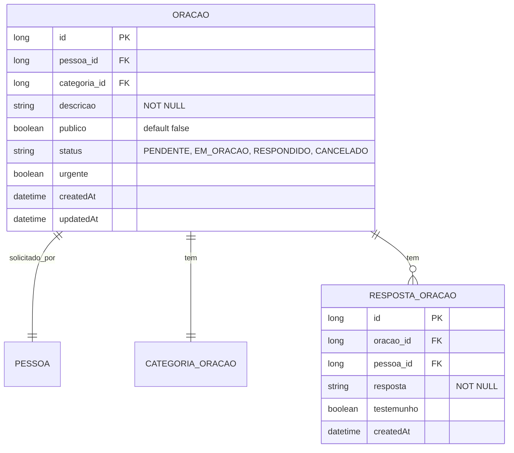

# CDU - Manter Oração

## 1. Metadados
- **Nome do CDU**: Manter Oração
- **Versão**: 1.0
- **Data**: 2026-06-19
- **Autor**: Kilo Code
- **Status**: Aprovado

## 2. Descrição do Caso de Uso

### 2.1. Descrição Breve
O caso de uso "Manter Oração" permite o gerenciamento de pedidos de oração no sistema Biblia/gestor-igreja, incluindo registro, atualização, consulta e acompanhamento de pedidos de oração, com controle de privacidade e categorias.

### 2.2. Objetivos
- Registrar pedidos de oração
- Categorizar pedidos (saúde, família, trabalho, etc.)
- Controlar privacidade (público/privado)
- Acompanhar status de oração
- Gerenciar testemunhos

### 2.3. Escopo
**Incluído**:
- CRUD de pedidos de oração
- Definição de categorias
- Controle de privacidade
- Acompanhamento de status
- Registro de testemunhos

**Excluído**:
- Gestão de membros (tratado em CDU separado)
- Envio de notificações (tratado em módulo de comunicação)

## 3. Atores

| Ator | Descrição | Tipo |
|------|------------|------|
| Usuário Registrado | Registra pedidos de oração | Primário |
| Usuário Administrador | Gerencia pedidos e categorias | Primário |
| Sistema | Aplica validações de privacidade | Sistema |

## 4. Pré-condições

### 4.1. Para Registrar Pedido
- Ator deve estar autenticado
- Descrição do pedido deve ser fornecida
- Categoria deve ser informada

### 4.2. Para Responder Pedido
- Pedido deve existir
- Ator deve estar autenticado

## 5. Pós-condições

### 5.1. Pós-condição de Sucesso (Registrar)
- Pedido de oração é registrado
- Sistema retorna pedido criado

### 5.2. Pós-condição de Sucesso (Responder)
- Resposta é registrada
- Status é atualizado
- Sistema retorna pedido atualizado

### 5.3. Pós-condição de Falha
- Operação não é realizada
- Erros de validação são reportados

## 6. Fluxo Principal (Basic Flow)

### 6.1. Fluxo: Registrar Pedido de Oração

**Trigger**: O caso de uso inicia quando o ator registra novo pedido de oração.

**Passos**:
1. **Dado** ator autenticado
2. **Quando** ator acessa formulário de pedido de oração
3. **Quando** ator preenche descrição do pedido [RN001]
4. **Quando** ator seleciona categoria [RN002]
5. **Quando** ator define privacidade (público/privado) [RN003]
6. **Quando** ator informa se é urgente (opcional)
7. **Então** sistema valida descrição obrigatória [ORA_001]
8. **Então** sistema valida categoria obrigatória [ORA_002]
9. **Então** sistema define privacidade padrão como privado [ORA_003]
10. **Então** sistema cria pedido de oração
11. **Então** sistema retorna pedido criado

### 6.2. Fluxo: Responder Pedido

**Trigger**: O caso de uso inicia quando o ator responde a pedido de oração.

**Passos**:
1. **Dado** ator autenticado
2. **Dado** pedido de oração existe
3. **Quando** ator acessa pedido
4. **Quando** ator escreve resposta/testemunho
5. **Quando** ator marca como respondido
6. **Então** sistema registra resposta
7. **Então** sistema atualiza status
8. **Então** sistema retorna pedido atualizado

### 6.3. Fluxo: Consultar Pedidos

**Trigger**: O caso de uso inicia quando o ator busca pedidos de oração.

**Passos**:
1. **Dado** ator autenticado
2. **Quando** ator acessa lista de pedidos
3. **Quando** ator aplica filtros (categoria, status, período, privacidade)
4. **Então** sistema retorna lista de pedidos filtrada (respeitando privacidade)

## 7. Fluxos Alternativos

### 7.1. Fluxo Alternativo: Pedido Público

1. **Dado** pedido é público
2. **Quando** ator visualiza lista de pedidos
3. **Então** sistema exibe pedido público
4. **Então** outros usuários podem ver e orar pelo pedido

## 8. Fluxos de Exceção

### 8.1. Fluxo de Exceção: Descrição Inválida

1. **Dado** sistema está validando pedido de oração
2. **Quando** sistema detecta descrição nula ou vazia [ORA_001]
3. **Então** sistema exibe mensagem de erro
4. **Então** sistema impede registro
5. **Então** ator deve corrigir descrição antes de continuar

### 8.2. Fluxo de Exceção: Categoria Inválida

1. **Dado** sistema está validando pedido de oração
2. **Quando** sistema detecta categoria não informada ou inválida [ORA_002]
3. **Então** sistema exibe mensagem de erro
4. **Então** sistema impede registro
5. **Então** ator deve selecionar categoria válida

## 9. Fluxos de Navegação (Mestre-Detalhe)

### 9.1. Navegação: Visualizar Respostas

1. A partir da lista de pedidos, ator seleciona um pedido
2. Sistema exibe detalhes do pedido
3. Sistema exibe respostas/testemunhos
4. Ator pode adicionar nova resposta

## 10. Regras de Negócio

| ID | Regra de Negócio | Tipo | Aplicação |
|----|------------------|------|-----------|
| RN001 | Descrição do pedido é obrigatória | Validação | Registro |
| RN002 | Categoria é obrigatória | Validação | Registro |
| RN003 | Privacidade padrão é privado | Comportamental | Registro |

## 11. Estrutura de Dados

## 12. Contratos de Interface

### 12.1. Interface REST

| Método | Endpoint | Descrição |
|--------|----------|------------|
| POST | `/api/${api.version}/oracao` | Registra novo pedido |
| GET | `/api/${api.version}/oracao` | Lista pedidos |
| GET | `/api/${api.version}/oracao/{id}` | Busca pedido por ID |
| PUT | `/api/${api.version}/oracao/{id}` | Atualiza pedido |
| DELETE | `/api/${api.version}/oracao/{id}` | Cancela pedido |
| POST | `/api/${api.version}/oracao/{id}/resposta` | Adiciona resposta |
| GET | `/api/${api.version}/oracao/{id}/respostas` | Lista respostas |
| GET | `/api/${api.version}/oracao/publicos` | Lista pedidos públicos |

## 13. Requisitos Especiais

### 13.1. Segurança
- Apenas usuários autenticados podem registrar pedidos
- Respeito à privacidade definida pelo solicitante
- Log de todas as operações

### 13.2. Performance
- Consulta de pedidos deve suportar paginação
- Filtros por categoria devem ser otimizados

### 13.3. Conformidade
- Validação de dados obrigatórios
- Registro de auditoria

## 14. Pontos de Extensão

### 14.1. Notificações de Oração
- **Extensão 1**: Envio de lembretes de oração
- **Quando**: Necessário engajar membros em oração
- **Como**: Integrar com módulo de Comunicação

## 15. Referências

### ADRs Relacionados
- ADR-010: Padrões de Nomenclatura
- ADR-011: Exception Handling Patterns
- ADR-012: Testing Patterns
- ADR-015: Usar TSID para Identidade
- ADR-018: Business Rule Chain Pattern
- ADR-019: Service Validator Pattern
- ADR-053: Usar CDU para Documentação de Casos de Uso
- ADR-054: Usar RN para Documentação de Regras de Negócio

### CDUs Relacionados
- CDU031-Manter-Pessoa: Gerenciamento de pessoas

### Documentação Técnica
- `biblia-model/src/main/java/com/ia/biblia/model/oracao/Oracao.java`
- `biblia-service/src/main/java/com/ia/biblia/service/oracao/OracaoService.java`
- `biblia-rest/src/main/java/com/ia/biblia/rest/oracao/OracaoController.java`
