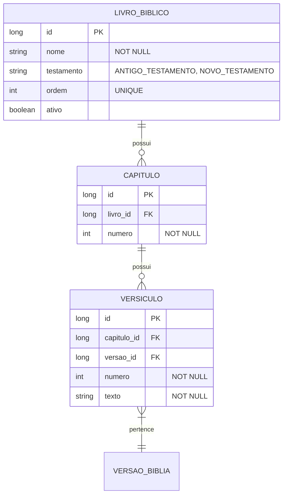

# CDU - Manter Livro Bíblia

## 1. Metadados
- **Nome do CDU**: Manter Livro Bíblia
- **Versão**: 1.0
- **Data**: 2026-06-19
- **Autor**: Kilo Code
- **Status**: Aprovado

## 2. Descrição do Caso de Uso

### 2.1. Descrição Breve
O caso de uso "Manter Livro Bíblia" permite o gerenciamento do conteúdo bíblico no sistema Biblia, incluindo cadastro de livros, capítulos, versículos e textos bíblicos, com suporte a múltiplas versões e traduções.

### 2.2. Objetivos
- Gerenciar livros bíblicos
- Cadastrar capítulos e versículos
- Suportar múltiplas versões/traduções
- Permitir busca por referência
- Manter integridade do texto bíblico

### 2.3. Escopo
**Incluído**:
- CRUD de livros bíblicos
- Gestão de capítulos
- Gestão de versículos
- Suporte a múltiplas versões
- Busca por referência bíblica

**Excluído**:
- Análise de texto (tratado em módulo NLP)
- Gramática de leitura (tratado em módulo separado)

## 3. Atores

| Ator | Descrição | Tipo |
|------|------------|------|
| Usuário Administrador | Gerencia conteúdo bíblico | Primário |
| Sistema | Aplica validações de estrutura | Sistema |

## 4. Pré-condições

### 4.1. Para Cadastrar Livro
- Ator deve estar autenticado
- Nome do livro deve ser fornecido
- Testamento deve ser informado

### 4.2. Para Cadastrar Versículo
- Livro deve existir
- Capítulo deve existir
- Número do versículo deve ser informado

## 5. Pós-condições

### 5.1. Pós-condição de Sucesso (Cadastrar)
- Conteúdo bíblico é cadastrado
- Sistema retorna conteúdo criado

### 5.2. Pós-condição de Sucesso (Buscar)
- Sistema retorna referência bíblica
- Texto é exibido corretamente

### 5.3. Pós-condição de Falha
- Operação não é realizada
- Erros de validação são reportados

## 6. Fluxo Principal (Basic Flow)

### 6.1. Fluxo: Cadastrar Versículo

**Trigger**: O caso de uso inicia quando o ator cadastra novo versículo.

**Passos**:
1. **Dado** ator autenticado
2. **Dado** livro e capítulo existem
3. **Quando** ator acessa formulário de versículo
4. **Quando** ator informa número do versículo [RN001]
5. **Quando** ator preenche texto do versículo [RN002]
6. **Quando** ator seleciona versão/tradução
7. **Então** sistema valida número do versículo [LIV_004]
8. **Então** sistema valida texto obrigatório [LIV_005]
9. **Então** sistema cria versículo
10. **Então** sistema retorna versículo criado

### 6.2. Fluxo: Buscar por Referência

**Trigger**: O caso de uso inicia quando o ator busca passagem bíblica.

**Passos**:
1. **Dado** ator autenticado
2. **Quando** ator informa referência (ex: "João 3:16")
3. **Quando** ator seleciona versão
4. **Então** sistema parseia referência
5. **Então** sistema busca livro, capítulo e versículo
6. **Então** sistema retorna texto do versículo

## 7. Fluxos Alternativos

### 7.1. Fluxo Alternativo: Múltiplos Versículos

1. **Dado** referência inclui múltiplos versículos (ex: "João 3:16-18")
2. **Quando** sistema parseia referência
3. **Então** sistema busca intervalo de versículos
4. **Então** sistema retorna todos os versículos do intervalo

## 8. Fluxos de Exceção

### 8.1. Fluxo de Exceção: Referência Inválida

1. **Dado** sistema está buscando referência bíblica
2. **Quando** sistema não consegue parsear referência
3. **Então** sistema exibe mensagem de erro
4. **Então** sistema retorna resultado vazio
5. **Então** ator deve corrigir referência

## 9. Fluxos de Navegação (Mestre-Detalhe)

### 9.1. Navegação: Visualizar Capítulos do Livro

1. A partir da lista de livros, ator seleciona um livro
2. Sistema exibe detalhes do livro
3. Ator clica em "Ver Capítulos"
4. Sistema exibe lista de capítulos

## 10. Regras de Negócio

| ID | Regra de Negócio | Tipo | Aplicação |
|----|------------------|------|-----------|
| RN001 | Número do versículo deve ser positivo | Validação | Cadastro |
| RN002 | Texto do versículo é obrigatório | Validação | Cadastro |

## 11. Estrutura de Dados

## 12. Contratos de Interface

### 12.1. Interface REST

| Método | Endpoint | Descrição |
|--------|----------|------------|
| POST | `/api/${api.version}/livro-biblia` | Cadastra novo livro |
| GET | `/api/${api.version}/livro-biblia` | Lista livros |
| GET | `/api/${api.version}/livro-biblia/{id}` | Busca livro por ID |
| POST | `/api/${api.version}/livro-biblia/{id}/capitulos` | Adiciona capítulo |
| POST | `/api/${api.version}/livro-biblia/{id}/capitulos/{capNum}/versiculos` | Adiciona versículo |
| GET | `/api/${api.version}/biblia/ref` | Busca por referência |
| GET | `/api/${api.version}/biblia/ref/{ref}/versiculos` | Busca versículos por referência |

## 13. Requisitos Especiais

### 13.1. Segurança
- Apenas usuários autenticados podem gerenciar conteúdo
- Log de todas as operações

### 13.2. Performance
- Busca por referência deve ser otimizada
- Cache de textos bíblicos frequentes

### 13.3. Conformidade
- Validação de estrutura bíblica
- Registro de auditoria

## 14. Pontos de Extensão

### 14.1. Múltiplas Versões
- **Extensão 1**: Suporte a múltiplas traduções
- **Quando**: Necessário comparar versões
- **Como**: Implementar entidade de versão

## 15. Referências

### ADRs Relacionados
- ADR-010: Padrões de Nomenclatura
- ADR-011: Exception Handling Patterns
- ADR-012: Testing Patterns
- ADR-015: Usar TSID para Identidade
- ADR-018: Business Rule Chain Pattern
- ADR-019: Service Validator Pattern
- ADR-053: Usar CDU para Documentação de Casos de Uso
- ADR-054: Usar RN para Documentação de Regras de Negócio

### CDUs Relacionados
- CDU037-Manter-Livro: Gerenciamento de livros
- CDU043-Manter-Grammar: Gerenciamento de gramática de leitura

### Documentação Técnica
- `biblia-model/src/main/java/com/ia/biblia/model/livro/Livro.java`
- `biblia-service/src/main/java/com/ia/biblia/service/livro/LivroService.java`
- `biblia-rest/src/main/java/com/ia/biblia/rest/livro/LivroController.java`
