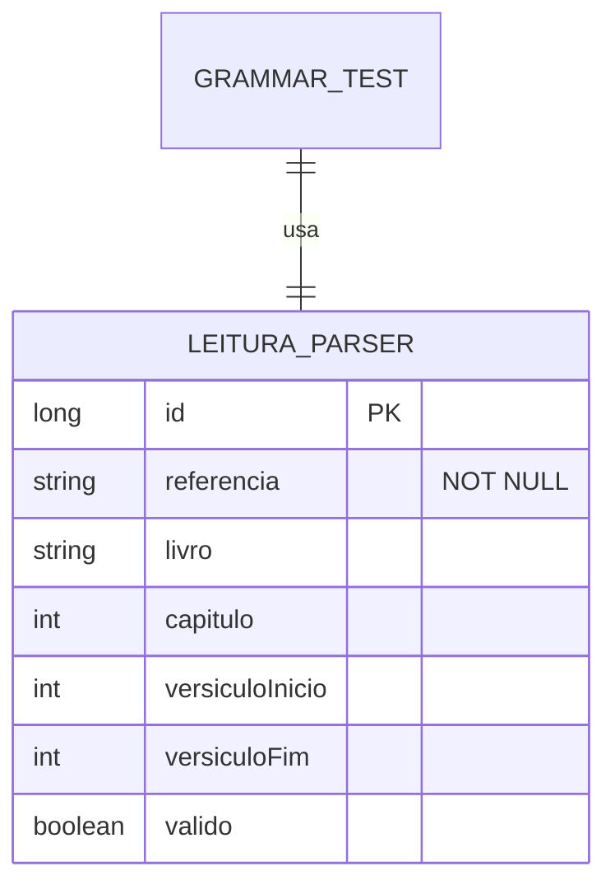

# CDU - Manter Grammar

## 1. Metadados
- **Nome do CDU**: Manter Grammar
- **Versão**: 1.0
- **Data**: 2026-06-19
- **Autor**: Kilo Code
- **Status**: Aprovado

## 2. Descrição do Caso de Uso

### 2.1. Descrição Breve
O caso de uso "Manter Grammar" permite o gerenciamento da gramática ANTLR utilizada para parsing de referências bíblicas no sistema Biblia, incluindo manutenção das regras léxicas e sintáticas, testes de parsing e evolução da gramática.

### 2.2. Objetivos
- Manter gramática ANTLR para referências bíblicas
- Suportar parsing de referências como "João 3:16", "Romanos 8:28-30"
- Garantir compatibilidade com novas versões da gramática
- Testar parsing com entradas reais

### 2.3. Escopo
**Incluído**:
- Manutenção da gramática ANTLR
- Geração de lexer/parser
- Testes de parsing
- Suporte a referências bíblicas

**Excluído**:
- Processamento NLP avançado (tratado em módulo separado)
- Análise semântica (tratado em módulo NLP)

## 3. Atores

| Ator | Descrição | Tipo |
|------|------------|------|
| Desenvolvedor | Mantém e evolui gramática | Primário |
| Sistema | Utiliza gramática para parsing | Sistema |

## 4. Pré-condições

### 4.1. Para Modificar Gramática
- Ator deve ter conhecimento de ANTLR
- Alterações devem ser validadas com testes

## 5. Pós-condições

### 5.1. Pós-condição de Sucesso (Atualizar)
- Gramática é atualizada
- Lexer/Parser são regenerados
- Testes passam

### 5.2. Pós-condição de Falha
- Operação não é realizada
- Erros de compilação da gramática são reportados

## 6. Fluxo Principal (Basic Flow)

### 6.1. Fluxo: Atualizar Gramática

**Trigger**: O caso de uso inicia quando o desenvolvedor modifica a gramática.

**Passos**:
1. **Dado** desenvolvedor com acesso ao código
2. **Quando** desenvolvedor modifica arquivo `.g4`
3. **Quando** desenvolvedor executa build
4. **Então** sistema gera novo Lexer/Parser
5. **Então** sistema executa testes de parsing
6. **Então** sistema valida compatibilidade

### 6.2. Fluxo: Testar Parsing

**Trigger**: O caso de uso inicia quando o desenvolvedor testa parsing de referência.

**Passos**:
1. **Dado** gramática compilada
2. **Quando** desenvolvedor informa referência bíblica
3. **Quando** desenvolvedor executa teste
4. **Então** sistema parseia referência
5. **Então** sistema retorna estrutura parseada
6. **Então** sistema valida resultado

## 7. Fluxos Alternativos

### 7.1. Fluxo Alternativo: Referência com Intervalo

1. **Dado** referência inclui intervalo (ex: "Romanos 8:28-30")
2. **Quando** sistema parseia referência
3. **Então** sistema identifica versículo inicial e final
4. **Então** sistema retorna intervalo

## 8. Fluxos de Exceção

### 8.1. Fluxo de Exceção: Referência Inválida

1. **Dado** sistema está parseando referência
2. **Quando** sistema detecta formato inválido
3. **Então** sistema exibe erro de parsing
4. **Então** sistema retorna null/vazio

## 9. Fluxos de Navegação (Mestre-Detalhe)

### 9.1. Navegação: Visualizar Árvore de Parsing

1. A partir do teste, desenvolvedor solicita visualização
2. Sistema exibe árvore de parsing (parse tree)
3. Desenvolvedor analisa estrutura

## 10. Regras de Negócio

| ID | Regra de Negócio | Tipo | Aplicação |
|----|------------------|------|-----------|
| RN001 | Gramática deve suportar formato "Livro Capítulo:Versículo" | Validação | Parsing |
| RN002 | Gramática deve suportar intervalos de versículos | Validação | Parsing |

## 11. Estrutura de Dados

## 12. Contratos de Interface

### 12.1. Interface REST

| Método | Endpoint | Descrição |
|--------|----------|------------|
| POST | `/api/${api.version}/grammar/parse` | Parseia referência bíblica |
| GET | `/api/${api.version}/grammar/test` | Executa teste de parsing |

## 13. Requisitos Especiais

### 13.1. Segurança
- N/A (módulo de infraestrutura)

### 13.2. Performance
- Parsing deve ser rápido (< 100ms)
- Cache de resultados frequentes

### 13.3. Conformidade
- Seguir especificação ANTLR
- Testes cobrem casos de uso principais

## 14. Pontos de Extensão

### 14.1. Suporte a Múltiplos Idiomas
- **Extensão 1**: Gramáticas para diferentes idiomas
- **Quando**: Necessário suporte a outras línguas
- **Como**: Criar gramáticas específicas por idioma

## 15. Referências

### ADRs Relacionados
- ADR-010: Padrões de Nomenclatura
- ADR-012: Testing Patterns
- ADR-047: Usar UTF-8, Tags de Idioma e Web Linking para NLP
- ADR-053: Usar CDU para Documentação de Casos de Uso
- ADR-054: Usar RN para Documentação de Regras de Negócio

### CDUs Relacionados
- CDU044-Manter-NLP: Gerenciamento de processamento de linguagem natural
- CDU037-Manter-Livro: Gerenciamento de livros

### Documentação Técnica
- `biblia-grammar/src/main/antlr4/Leitura.g4`
- `biblia-grammar/src/test/java/com/ia/biblia/grammar/LeituraParserTest.java`
