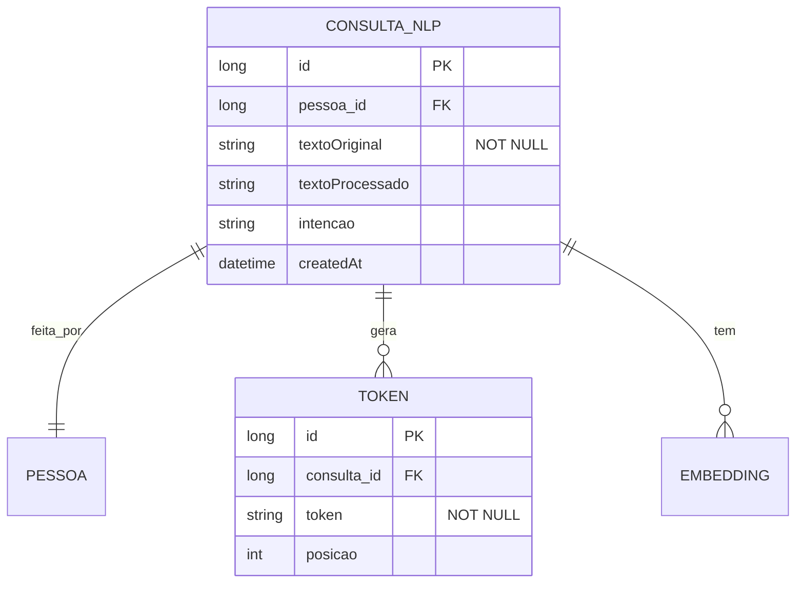

# CDU - Manter NLP

## 1. Metadados
- **Nome do CDU**: Manter NLP
- **Versão**: 1.0
- **Data**: 2026-06-19
- **Autor**: Kilo Code
- **Status**: Aprovado

## 2. Descrição do Caso de Uso

### 2.1. Descrição Breve
O caso de uso "Manter NLP" permite o gerenciamento de componentes de Processamento de Linguagem Natural no sistema Biblia, incluindo tokenização, análise de texto bíblico, embeddings e integração com modelos LLM para interpretação de consultas.

### 2.2. Objetivos
- Tokenizar texto bíblico
- Analisar consultas de usuários
- Gerar embeddings para busca semântica
- Integrar com modelos LLM
- Suportar múltiplos idiomas

### 2.3. Escopo
**Incluído**:
- Tokenização de texto
- Análise de consultas
- Geração de embeddings
- Integração com LLM
- Suporte a UTF-8 e BCP 47

**Excluído**:
- Treinamento de modelos (tratado em infraestrutura separada)
- Análise teológica (tratado em módulo especializado)

## 3. Atores

| Ator | Descrição | Tipo |
|------|------------|------|
| Usuário Final | Realiza consultas em linguagem natural | Primário |
| Sistema | Processa texto e gera respostas | Sistema |
| LLM | Modelo de linguagem para interpretação | Sistema |

## 4. Pré-condições

### 4.1. Para Processar Consulta
- Ator deve estar autenticado
- Consulta deve ser fornecida
- Modelo LLM deve estar disponível

## 5. Pós-condições

### 5.1. Pós-condição de Sucesso (Processar)
- Consulta é processada
- Resposta é gerada
- Sistema retorna resultado

### 5.2. Pós-condição de Falha
- Operação não é realizada
- Erros são reportados

## 6. Fluxo Principal (Basic Flow)

### 6.1. Fluxo: Processar Consulta NLP

**Trigger**: O caso de uso inicia quando o usuário envia consulta em linguagem natural.

**Passos**:
1. **Dado** ator autenticado
2. **Dado** modelo LLM disponível
3. **Quando** ator envia consulta textual
4. **Quando** sistema recebe consulta
5. **Então** sistema tokeniza consulta [RN001]
6. **Então** sistema identifica intenção
7. **Então** sistema gera embedding
8. **Então** sistema consulta base de conhecimento
9. **Então** sistema constrói prompt para LLM
10. **Então** sistema envia para LLM
11. **Então** sistema recebe resposta
12. **Então** sistema retorna resposta ao ator

### 6.2. Fluxo: Tokenizar Texto

**Trigger**: O caso de uso inicia quando o sistema precisa tokenizar texto.

**Passos**:
1. **Dado** texto de entrada
2. **Quando** sistema invoca tokenizer
3. **Então** sistema divide texto em tokens
4. **Então** sistema retorna lista de tokens

## 7. Fluxos Alternativos

### 7.1. Fluxo Alternativo: Busca Semântica

1. **Dado** consulta do usuário
2. **Quando** sistema gera embedding da consulta
3. **Quando** sistema busca vetores similares
4. **Então** sistema retorna resultados relevantes

## 8. Fluxos de Exceção

### 8.1. Fluxo de Exceção: Modelo Indisponível

1. **Dado** sistema está processando consulta
2. **Quando** sistema detecta modelo LLM indisponível
3. **Então** sistema exibe mensagem de erro
4. **Então** sistema oferece alternativa (busca textual)

## 9. Fluxos de Navegação (Mestre-Detalhe)

### 9.1. Navegação: Visualizar Tokens

1. A partir do processamento, desenvolvedor solicita visualização
2. Sistema exibe tokens gerados
3. Desenvolvedor analisa tokenização

## 10. Regras de Negócio

| ID | Regra de Negócio | Tipo | Aplicação |
|----|------------------|------|-----------|
| RN001 | Texto deve ser tokenizado em UTF-8 | Validação | Processamento |
| RN002 | Consultas devem ser processadas em até 10 segundos | Performance | Processamento |

## 11. Estrutura de Dados

## 12. Contratos de Interface

### 12.1. Interface REST

| Método | Endpoint | Descrição |
|--------|----------|------------|
| POST | `/api/${api.version}/nlp/consulta` | Processa consulta NLP |
| POST | `/api/${api.version}/nlp/tokenizar` | Tokeniza texto |
| POST | `/api/${api.version}/nlp/embedding` | Gera embedding |
| GET | `/api/${api.version}/nlp/modelo/status` | Verifica status do modelo |

## 13. Requisitos Especiais

### 13.1. Segurança
- Validação de entrada para prevenir injection
- Sanitização de texto

### 13.2. Performance
- Timeout de 10 segundos para consultas LLM
- Cache de embeddings frequentes

### 13.3. Conformidade
- UTF-8 obrigatório
- Suporte a BCP 47 para idiomas
- Registro de auditoria

## 14. Pontos de Extensão

### 14.1. Múltiplos Modelos
- **Extensão 1**: Suporte a múltiplos modelos LLM
- **Quando**: Necessário comparar respostas
- **Como**: Implementar roteamento de modelos

## 15. Referências

### ADRs Relacionados
- ADR-010: Padrões de Nomenclatura
- ADR-011: Exception Handling Patterns
- ADR-012: Testing Patterns
- ADR-015: Usar TSID para Identidade
- ADR-018: Business Rule Chain Pattern
- ADR-019: Service Validator Pattern
- ADR-047: Usar UTF-8, Tags de Idioma e Web Linking para NLP
- ADR-053: Usar CDU para Documentação de Casos de Uso
- ADR-054: Usar RN para Documentação de Regras de Negócio

### CDUs Relacionados
- CDU001-Conversacao-Chat: Gerenciamento de conversas com LLM
- CDU043-Manter-Grammar: Gerenciamento de gramática de parsing

### Documentação Técnica
- `biblia-nlp/src/main/java/com/ia/biblia/nlp/BibliaTokenizerService.java`
- `biblia-service/src/main/java/com/ia/biblia/service/llm/chat/BibliaChatService.java`
