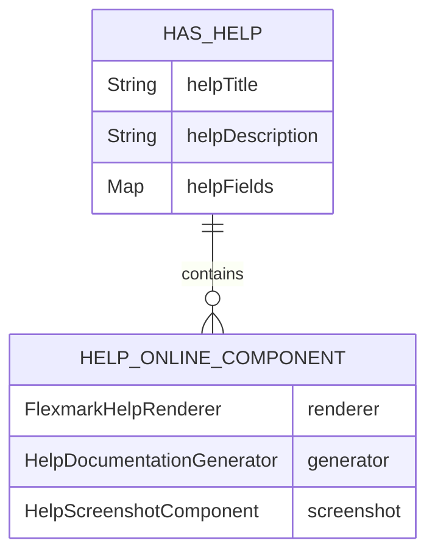

# CDU045: Apresentar Ajuda Online

## Metadados
- **Nome do CDU**: CDU045-Apresentar-Ajuda-Online
- **Versão**: 1.0
- **Data**: 2026-07-02
- **Autor**: IA Core
- **Status**: Em Revisão

## Descrição do Caso de Uso

### Descrição Breve
Este caso de uso descreve a apresentação de ajuda online contextual em componentes Vaadin, incluindo a exibição de diálogos com conteúdo Markdown renderizado, captura de screenshots e interação com componentes de ajuda.

### Objetivos
- Fornecer ajuda contextual a componentes Vaadin
- Renderizar conteúdo Markdown de forma segura
- Capturar screenshots de componentes para documentação visual
- Exibir diálogos com conteúdo formatado

### Escopo
- **Incluído**: HelpOnlineComponent, FlexmarkHelpRenderer, HelpDialogViewFactory, HelpScreenshotComponent
- **Excluído**: Integração com sistemas externos de ajuda

## Atores

| Ator | Descrição | Tipo |
|------|------------|------|
| Usuário | Usuário que interage com a aplicação | Primário |
| Sistema | Aplicação Vaadin que processa interações | Secundário |

## Pré-condições
- **Precondição 1**: O módulo ia-core-view deve estar configurado no classpath
- **Precondição 2**: O Vaadin deve estar configurado na aplicação
- **Precondição 3**: O componente deve implementar a interface HasHelp

## Pós-condições
- **Pós-condição de Sucesso**: O diálogo de ajuda é exibido com conteúdo formatado
- **Pós-condição de Falha**: Erros são tratados e exibidos ao usuário

## Fluxo Principal (Basic Flow)

**Trigger**: O usuário clica no botão de ajuda (?) ou passa o mouse sobre o componente

**Passos**:
1. **Dado** um componente que implementa HasHelp
2. **Quando** o usuário clica no botão de ajuda
3. **Então** o sistema coleta recursivamente todos os componentes HasHelp
4. **E** o sistema captura screenshots de cada componente
5. **E** o sistema gera Markdown com conteúdo e screenshots
6. **E** o sistema renderiza o Markdown para HTML seguro
7. **E** o sistema exibe o diálogo com o conteúdo

## Fluxos Alternativos

**Fluxo Alternativo 1**: Mouse over
1. **Dado** um componente com ajuda configurada
2. **Quando** o usuário passa o mouse sobre o botão de ajuda
3. **Então** o sistema exibe os componentes de ajuda via setVisible(true)

**Fluxo Alternativo 2**: Mouse out
1. **Dado** um componente com ajuda exibida
2. **Quando** o usuário remove o mouse do botão de ajuda
3. **Então** o sistema oculta os componentes de ajuda via setVisible(false)

## Fluxos de Exceção

**Fluxo de Exceção 1**: Erro na renderização Markdown
1. **Dado** conteúdo Markdown inválido
2. **Quando** o sistema tenta renderizar
3. **Então** o sistema escapa o conteúdo como texto seguro
4. **E**: o conteúdo é exibido sem formatação

**Fluxo de Exceção 2**: Falha na captura de screenshot
1. **Dado** um componente que não pode ser capturado
2. **Quando** o sistema tenta capturar o screenshot
3. **Então** o sistema continua sem a imagem
4. **E**: o conteúdo é exibido sem screenshot

## Fluxos de Navegação (Mestre-Detalhe)

Este caso de uso **não possui fluxos de navegação** pois trata-se de um componente de interface autônomo que não navega entre entidades relacionadas.

## Regras de Negócio

Este caso de uso **não possui regras de negócio** pois trata-se de um mecanismo de interface para apresentação de ajuda. As validações e comportamentos são tratados como requisitos não-funcionais (RNF) relacionados a usabilidade, acessibilidade e segurança.

## Estrutura de Dados

## Contratos de Interface

**Interface HasHelp**:
| Método | Parâmetros | Retorno | Descrição |
|--------|------------|---------|------------|
| getHelpTitle | - | String | Retorna o título da ajuda |
| getHelpDescription | - | String | Retorna a descrição detalhada |
| getHelpFields | - | Map<Component, Component> | Retorna os campos com ajuda |
| setHelp | Component, Component | void | Configura ajuda para um componente |

## Requisitos Funcionais e Não Funcionais

### Requisitos Funcionais

| ID | Requisito | Tipo | Aplicação |
|----|-----------|------|-----------|
| RF001 | Help text deve ser internacionalizado | Usabilidade | Exibição de ajuda |
| RF002 | Screenshots devem ser embutidas em base64 no Markdown | Funcional | Geração de documentação |
| RF003 | Captura recursiva de screenshots de componentes HasHelp | Funcional | Geração de documentação |
| RF004 | Exibição de componentes de ajuda via eventos de mouse | Funcional | Interação com usuário |

### Requisitos Não Funcionais

| ID | Requisito | Tipo | Aplicação |
|----|-----------|------|-----------|
| RNF001 | HTML gerado deve ser sanitizado contra XSS (OWASP) | Segurança | Renderização de conteúdo |
| RNF002 | Diálogo deve ser maximizável com tamanho padrão 980px x 75vh | Usabilidade | Exibição de ajuda |
| RNF003 | Acessibilidade WCAG 2.2 (aria-label, aria-expanded, role="dialog") | Acessibilidade | Interface |

## Requisitos Especiais
- **Performance**: Renderização Markdown < 10ms
- **Segurança**: Sanitização OWASP contra XSS
- **Usabilidade**: Acessibilidade WCAG via role="dialog"
- **Conformidade**: Deve seguir ADR-055 para Help Content Pattern

## Pontos de Extensão
- **Extensão 1**: Adicionar templates de ajuda customizados
- **Extensão 2**: Adicionar exportação para PDF
- **Extensão 3**: Adicionar integração com sistema de tutoriais

## Referências
- ADR-055: Help Content Pattern
- ADR-012: Testing Patterns
- ADR-014: Javadoc Standards
