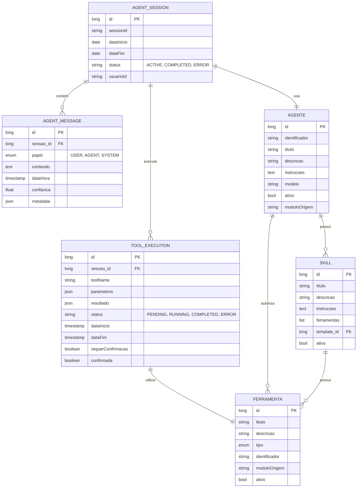

# CDU - Interface Agente Conversacional

## 1. Descrição do Caso de Uso

O caso de uso "Interface Agente Conversacional" permite que usuários interajam com o sistema através de linguagem natural, digitando comandos em um campo de texto que são processados por agentes de IA. Os agentes analisam a intenção do usuário, selecionam as ferramentas apropriadas e executam ações no sistema, com confirmação humana quando necessário. Esta interface representa uma evolução dos chatbots tradicionais para sistemas de agentes autônomos capazes de realizar ações complexas através de ferramentas.

**Padrão ia-core vs spring-ai-agent-utils original:**

O sistema adapta o padrão do spring-ai-agent-utils para usar banco de dados em vez de arquivos YAML:

| Aspecto | spring-ai-agent-utils (padrão) | ia-core-llm (adaptação) |
|---------|-------------------------------|------------------------|
| Configuração de sub-agentes | Arquivos `.md` com YAML frontmatter | Entidade `Agente` em banco de dados |
| Configuração de skills | Arquivos `.md` com YAML frontmatter | Entidade `Skill` em banco de dados |
| Configuração de ferramentas | Arquivos `.md` com YAML frontmatter | Entidade `Ferramenta` em banco de dados |
| Multi-model routing | Configuração YAML | Configuração via propriedades do `Agente` |
| Built-in tools | FileSystemTools, ShellTools, GrepTool, GlobTool | Apenas `WebSearchTool` (busca na internet via BraveWebSearchTool) |
| A2A protocol | Opcional | **Implementado** |

**Arquitetura de encapsulamento:**

O `AgentOrchestratorService` delega toda operação de chat ao `ChatApplicationService`, que encapsula a implementação do `spring-ai-agent-utils`. Isso permite trocar por outra biblioteca/framework se necessário.

## 2. Atores

| Ator | Descrição |
|------|------------|
| Usuário Final | Digita comandos em linguagem natural e interage com agentes |
| Agente de IA | Processa comandos, seleciona ferramentas e executa ações |
| Sistema de Ferramentas | Fornece capacidades funcionais para execução de ações |
| Administrador | Configura habilidades, ferramentas e permissões dos agentes |

## 3. Fluxo Principal

### 3.1. Fluxo: Iniciar Sessão de Agente

1. Usuário acessa interface de agente conversacional.
2. Sistema exibe campo de texto com exemplos de capacidades (capability transparency).
3. Sistema lista ferramentas e habilidades disponíveis.
4. Usuário digita comando em linguagem natural.
5. Sistema envia comando para o agente.
6. Agente analisa intenção e contexto.
7. Agente seleciona ferramentas apropriadas.
8. Sistema exibe plano de ação proposto com nível de confiança.
9. Usuário confirma execução (para ações críticas).
10. Agente executa ações através das ferramentas.
11. Sistema exibe resultado com detalhes das ações realizadas.
12. Sistema mantém histórico da conversação.

### 3.2. Fluxo: Execução de Ação Simples

1. Usuário digita: "Crie um novo livro chamado 'Gênesis' com autor 'Moisés'".
2. Agente identifica intenção: criação de livro.
3. Agente seleciona ferramenta: LivroService.create().
4. Sistema exibe: "Vou criar o livro 'Gênesis' com autor 'Moisés'. Confirmar?".
5. Usuário confirma.
6. Agente executa ação.
7. Sistema exibe: "Livro criado com sucesso. ID: 123".

### 3.3. Fluxo: Execução de Ação Complexa

1. Usuário digita: "Liste todos os livros do Antigo Testamento e crie um resumo".
2. Agente identifica múltiplas ações: listar livros, filtrar por testamento, gerar resumo.
3. Agente seleciona ferramentas: LivroService.list(), LLMService.generateSummary().
4. Sistema exibe plano: "1. Listar livros, 2. Filtrar Antigo Testamento, 3. Gerar resumo".
5. Sistema exibe confiança: Alta (95%).
6. Usuário confirma.
7. Agente executa ações sequencialmente.
8. Sistema exibe progresso de cada etapa.
9. Sistema exibe resultado final.

### 3.4. Fluxo: Recuperação de Erro

1. Usuário digita comando ambíguo.
2. Agente detecta baixa confiança (40%).
3. Sistema exibe: "Não entendi completamente. Você quer: a) criar livro, b) editar livro, c) listar livros?".
4. Usuário seleciona opção.
5. Agente prossegue com ação esclarecida.

### 3.5. Fluxo: Busca na Internet via Agente

1. Usuário digita: "Pesquise informações atualizadas sobre o livro de Gênesis".
2. Agente identifica necessidade de busca na internet.
3. Agente seleciona WebSearchTool (built-in tool).
4. Sistema usa BraveWebSearchTool do spring-ai-agent-utils.
5. Sistema executa busca via Brave Search API.
6. Sistema extrai resultados relevantes.
7. Agente processa resultados e retorna resumo ao usuário.

### 3.6. Fluxo: Orquestração Multi-Agente com A2A

1. Usuário digita: "Analise o livro de Gênesis e crie um estudo bíblico completo".
2. Agente principal identifica necessidade de especialização.
3. Sistema delega tarefas a sub-agentes via protocolo A2A.
4. Sub-agente especialista em análise bíblica processa conteúdo.
5. Sub-agente especialista em criação de estudos gera estrutura.
6. Sistema agrega resultados dos sub-agentes.
7. Agente principal retorna resposta consolidada ao usuário.

## 4. Fluxos Alternativos

### 4.1. Ação Requer Confirmação

1. Agente identifica ação sensível (ex: exclusão de dados).
2. Sistema exibe aviso de segurança.
3. Sistema solicita confirmação explícita.
4. Usuário confirma ou cancela.
5. Se confirmado, agente executa ação.
6. Se cancelado, sistema retorna ao estado anterior.

### 4.2. Ferramenta Indisponível

1. Agente tenta usar ferramenta que está indisponível.
2. Sistema detecta erro de disponibilidade.
3. Sistema exibe: "Ferramenta X temporariamente indisponível. Alternativa: Y".
4. Usuário escolhe alternativa ou cancela.
5. Se alternativa, agente usa ferramenta substituta.

### 4.3. Timeout de Resposta

1. Agente não responde dentro do tempo limite.
2. Sistema exibe: "Processamento demorando mais que o esperado".
3. Sistema oferece opções: "Continuar aguardando", "Cancelar", "Ver status".
4. Usuário seleciona opção.

### 4.4. Contexto Insuficiente

1. Usuário diga: "Edite o livro" (sem especificar qual).
2. Agente detecta ambiguidade.
3. Sistema exibe: "Qual livro você deseja editar?".
4. Sistema lista livros recentes.
5. Usuário seleciona livro.
6. Agente prossegue com ação.

### 4.5. Erro na Busca na Internet

1. Agente tenta usar WebSearchTool.
2. Sistema detecta erro ao navegar ou extrair resultados.
3. Sistema exibe mensagem de erro específica (timeout, bloqueio, etc).
4. Sistema sugere alternativas (usar dados locais, tentar novamente).
5. Usuário escolhe alternativa.

### 4.6. Falha na Comunicação A2A

1. Sistema tenta delegar tarefa a sub-agente via A2A.
2. Sistema detecta erro na comunicação com agente remoto.
3. Sistema exibe mensagem de erro amigável.
4. Sistema tenta fallback para agente local.
5. Se fallback disponível, prossegue com agente local.
6. Se não, solicita intervenção do usuário.

## 5. Fluxos de Navegação (Mestre-Detalhe)

### 5.1. Visualizar Histórico de Conversações

1. A partir da interface de agente, usuário acessa "Histórico".
2. Sistema exibe lista de sessões anteriores.
3. Usuário seleciona sessão.
4. Sistema carrega conversa completa.
5. Sistema exibe ações executadas e resultados.

### 5.2. Gerenciar Ferramentas Disponíveis

1. A partir da configuração, administrador acessa "Ferramentas".
2. Sistema exibe catálogo de ferramentas.
3. Administrador ativa/desativa ferramentas.
4. Administrador configura permissões por ferramenta.
5. Sistema aplica configurações.

### 5.3. Configurar Habilidades do Agente

1. A partir da configuração, administrador acessa "Habilidades".
2. Sistema exibe lista de habilidades disponíveis.
3. Administrador associa habilidades ao agente.
4. Administrador define parâmetros de cada habilidade.
5. Sistema salva configuração.

### 5.4. Monitorar Execução em Tempo Real

1. Durante execução de ação complexa, usuário acessa "Monitor".
2. Sistema exibe status de cada ferramenta sendo executada.
3. Sistema exibe logs detalhados.
4. Sistema permite intervenção manual.
5. Usuário pode pausar, continuar ou cancelar execução.

### 5.5. Gerenciar Agentes Especialistas

1. A partir da configuração, administrador acessa "Agentes".
2. Sistema exibe lista de agentes registrados em banco de dados.
3. Administrador cria novo agente.
4. Preenche: identificador, título, descrição, instruções, modelo.
5. Administrador associa ferramentas ao agente.
6. Sistema salva.
7. Administrador pode ativar/desativar agentes.

### 5.6. Configurar A2A

1. A partir da configuração, administrador acessa "A2A".
2. Sistema exibe status do protocolo A2A.
3. Administrador configura URL do servidor A2A.
4. Administrador configura ID do agente.
5. Sistema testa conexão.
6. Sistema salva configuração.

## 6. Regras de Negócio

| Regra | Descrição |
|-------|-----------|
| RN001 | Ações destrutivas (exclusão, alteração crítica) sempre requerem confirmação explícita |
| RN002 | Sistema deve exibir nível de confiança para cada ação proposta |
| RN003 | Histórico de conversações é persistido por 90 dias |
| RN004 | Agentes podem usar múltiplas ferramentas em uma única solicitação |
| RN005 | Sistema deve oferecer recuperação de erros com sugestões de ação |
| RN006 | Capacidades do agente devem ser transparentes antes da interação |
| RN007 | Ferramentas têm permissões granulares configuráveis |
| RN008 | Sistema deve manter contexto da conversação durante a sessão |
| RN009 | Timeout padrão de 30 segundos para respostas do agente |
| RN010 | Usuário pode intervir e cancelar ações em qualquer momento |
| RN011 | Configurações de agentes, skills e ferramentas são armazenadas em banco de dados (não YAML) |
| RN012 | Built-in tools incluem apenas WebSearchTool (busca na internet via BraveWebSearchTool do spring-ai-agent-utils) |
| RN013 | Protocolo A2A é suportado para orquestração remota de agentes |
| RN014 | AgentOrchestratorService delega a ChatApplicationService (encapsulamento) |
| RN015 | Multi-model routing é configurado via propriedades da entidade Agente |
| RN016 | Sistema deve tentar fallback para agente local em caso de falha A2A |

## 7. Estrutura de Dados



## 8. Contratos de Interface

### 8.1. Interface REST - Sessão de Agente

| Método | Endpoint | Descrição |
|--------|----------|------------|
| POST | `/api/v1/agent/session` | Cria nova sessão |
| POST | `/api/v1/agent/session/{sessionId}/message` | Envia mensagem para o agente |
| POST | `/api/v1/agent/session/{sessionId}/confirm` | Confirma ação pendente |
| POST | `/api/v1/agent/session/{sessionId}/cancel` | Cancela execução |
| GET | `/api/v1/agent/session/{sessionId}` | Busca detalhes da sessão |
| GET | `/api/v1/agent/session/{sessionId}/messages` | Lista mensagens da sessão |
| GET | `/api/v1/agent/session/{sessionId}/executions` | Lista execuções de ferramentas |
| GET | `/api/v1/agent/sessions` | Lista sessões do usuário |
| DELETE | `/api/v1/agent/session/{sessionId}` | Remove sessão |

### 8.2. Interface REST - Ferramentas

| Método | Endpoint | Descrição |
|--------|----------|------------|
| GET | `/api/v1/agent/tools` | Lista ferramentas disponíveis |
| GET | `/api/v1/agent/tools/{name}` | Busca detalhes da ferramenta |
| GET | `/api/v1/agent/tools/{name}/schema` | Busca schema de parâmetros |
| POST | `/api/v1/agent/tools/{name}/execute` | Executa ferramenta diretamente |

### 8.3. Interface REST - Configuração de Agente

| Método | Endpoint | Descrição |
|--------|----------|------------|
| GET | `/api/v1/agent/config` | Lista configurações de agente |
| POST | `/api/v1/agent/config` | Cria nova configuração |
| GET | `/api/v1/agent/config/{id}` | Busca configuração |
| PUT | `/api/v1/agent/config/{id}` | Atualiza configuração |
| DELETE | `/api/v1/agent/config/{id}` | Remove configuração |
| POST | `/api/v1/agent/config/{id}/skills` | Adiciona habilidade |
| DELETE | `/api/v1/agent/config/{id}/skills/{skillId}` | Remove habilidade |
| PUT | `/api/v1/agent/config/{id}/permissions` | Atualiza permissões de ferramentas |

### 8.4. Interface REST - Agente (banco de dados)

| Método | Endpoint | Descrição |
|--------|----------|------------|
| GET | `/api/v1/agent/agentes` | Lista agentes |
| POST | `/api/v1/agent/agentes` | Cria agente |
| GET | `/api/v1/agent/agentes/{id}` | Busca agente |
| PUT | `/api/v1/agent/agentes/{id}` | Atualiza agente |
| DELETE | `/api/v1/agent/agentes/{id}` | Remove agente |
| GET | `/api/v1/agent/agentes/{id}/ferramentas` | Lista ferramentas do agente |
| POST | `/api/v1/agent/agentes/{id}/ferramentas` | Adiciona ferramenta ao agente |
| DELETE | `/api/v1/agent/agentes/{id}/ferramentas/{ferramentaId}` | Remove ferramenta do agente |

### 8.5. Interface REST - Web Search

| Método | Endpoint | Descrição |
|--------|----------|------------|
| POST | `/api/v1/agent/web/search` | Realiza busca na internet |
| GET | `/api/v1/agent/web/status` | Status do serviço de busca |

### 8.6. Interface REST - A2A

| Método | Endpoint | Descrição |
|--------|----------|------------|
| POST | `/api/v1/agent/a2a/connect` | Conecta a servidor A2A remoto |
| GET | `/api/v1/agent/a2a/status` | Status da conexão A2A |
| POST | `/api/v1/agent/a2a/disconnect` | Desconecta de servidor A2A |
| GET | `/api/v1/agent/a2a/agents` | Lista agentes remotos disponíveis |

## 9. Padrões de Interface Modernos

### 9.1. Transparência de Capacidades
- Sistema exibe 3-5 exemplos de comandos ao iniciar
- Lista visual de ferramentas disponíveis
- Indicadores de status de cada ferramenta

### 9.2. Visualização de Confiança
- Indicadores visuais de nível de confiança (alto/médio/baixo)
- Cores semânticas: verde (alto), amarelo (médio), vermelho (baixo)
- Explicação do motivo da baixa confiança

### 9.3. Padrões de Recuperação
- Sugestões de esclarecimento para comandos ambíguos
- Ofertas de alternativas quando ferramenta falha
- Preservação de contexto durante recuperação

### 9.4. Human-in-the-Loop
- Confirmação obrigatória para ações críticas
- Capacidade de intervenção durante execução
- Cancelamento a qualquer momento

### 9.5. Monitoramento em Tempo Real
- Dashboard de execução de ferramentas
- Logs detalhados de cada ação
- Indicadores de progresso para ações longas

## 10. Exemplos de Interação

### 10.1. Exemplo Simples
```
Usuário: "Crie um novo livro chamado 'Êxodo'"
Agente: "Vou criar o livro 'Êxodo'. Confirmar? [Sim] [Não]"
Usuário: [Sim]
Agente: "Livro criado com sucesso. ID: 456"
```

### 10.2. Exemplo Complexo
```
Usuário: "Liste todos os livros do Pentateuco e crie um resumo de cada um"
Agente: "Plano de ação:
1. Listar todos os livros
2. Filtrar livros do Pentateuco (Gênesis, Êxodo, Levítico, Números, Deuteronômio)
3. Gerar resumo de cada livro
Confiança: Alta (92%)
Confirmar? [Sim] [Não]"
Usuário: [Sim]
Agente: "Executando passo 1/3... ✓
Executando passo 2/3... ✓
Executando passo 3/3... ✓
Concluído. Resumos gerados para 5 livros."
```

### 10.3. Exemplo com Recuperação
```
Usuário: "Edite o livro"
Agente: "Qual livro você deseja editar?
[1] Gênesis (ID: 123)
[2] Êxodo (ID: 456)
[3] Levítico (ID: 789)"
Usuário: "2"
Agente: "O que deseja editar em Êxodo?"
```
