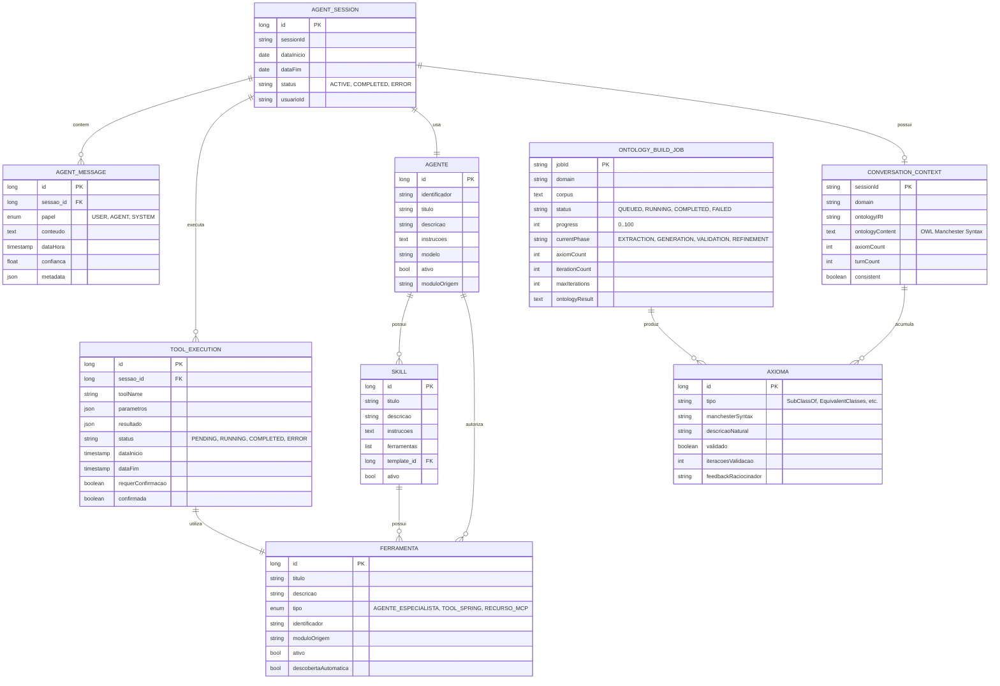

# CDU - Interface Agente Conversacional

## 1. Descrição do Caso de Uso

O caso de uso "Interface Agente Conversacional" permite que usuários interajam com o sistema através de linguagem natural, digitando comandos em um campo de texto que são processados por agentes de IA. Os agentes analisam a intenção do usuário, selecionam as ferramentas apropriadas e executam ações no sistema, com confirmação humana quando necessário. Esta interface representa uma evolução dos chatbots tradicionais para sistemas de agentes autônomos capazes de realizar ações complexas através de ferramentas.

A partir da arquitetura de **Agentes Guiados por Ontologias** (CDU-Agentes-Guiados-por-Ontologias), esta interface suporta dois modos adicionais de operação neuro-simbólica:

1. **Conversação com Validação Ontológica:** Durante a conversação, uma ontologia OWL 2 DL é construída incrementalmente e confrontada com as respostas do LLM para garantir consistência formal via raciocinador (Openllet).
2. **Construção Autônoma de Ontologias:** Um agente especialista recebe corpus em linguagem natural e produz uma ontologia OWL 2 DL completa, utilizando tools especializadas para cada construtor OWL e ciclos iterativos LLM-Reasoner para auto-correção.

**Padrão ia-core vs spring-ai-agent-utils original:**

O sistema adapta o padrão do spring-ai-agent-utils para usar banco de dados em vez de arquivos YAML:

| Aspecto | spring-ai-agent-utils (padrão) | ia-core-llm (adaptação) |
|---------|-------------------------------|------------------------|
| Configuração de sub-agentes | Arquivos `.md` com YAML frontmatter | Entidade `Agente` em banco de dados |
| Configuração de skills | Arquivos `.md` com YAML frontmatter | Entidade `Skill` em banco de dados |
| Configuração de ferramentas | Arquivos `.md` com YAML frontmatter | Entidade `Ferramenta` em banco de dados |
| Multi-model routing | Configuração YAML | Configuração via propriedades do `Agente` |
| Built-in tools | FileSystemTools, ShellTools, GrepTool, GlobTool | `WebSearchTool` (BraveWebSearchTool) + Tools OWL 2 DL |
| A2A protocol | Opcional | **Implementado** |
| Validação ontológica | Não disponível | **Ciclos LLM-Reasoner** com Openllet |

**Arquitetura de encapsulamento:**

O `AgentOrchestratorService` delega toda operação de chat ao `ChatApplicationService`, que encapsula a implementação do `spring-ai-agent-utils`. Isso permite trocar por outra biblioteca/framework se necessário.

## 2. Atores

| Ator | Descrição |
|------|------------|
| Usuário Final | Digita comandos em linguagem natural e interage com agentes |
| Agente de IA | Processa comandos, seleciona ferramentas e executa ações |
| Agente Conversacional Ontológico | Constrói ontologia incremental durante conversação e valida respostas contra axiomas formais |
| Agente Construtor de Ontologias | Agente autônomo que converte corpus em linguagem natural para ontologias OWL 2 DL completas |
| Sistema de Ferramentas | Fornece capacidades funcionais para execução de ações |
| Sistema de Tools OWL 2 DL | Ferramentas especializadas por construtor OWL (SubClassOf, EquivalentClasses, etc.) |
| Raciocinador (Openllet) | Verifica consistência formal de axiomas OWL 2 DL |
| Administrador | Configura habilidades, ferramentas e permissões dos agentes |

## 3. Fluxo Principal

### 3.1. Fluxo: Iniciar Sessão de Agente

1. Usuário acessa interface de agente conversacional.
2. Sistema exibe campo de texto com exemplos de capacidades (capability transparency).
3. Sistema lista ferramentas e habilidades disponíveis.
4. Usuário digita comando em linguagem natural.
5. Sistema envia comando para o agente.
6. Agente analisa intenção e contexto.
7. Agente seleciona ferramentas apropriadas.
8. Sistema exibe plano de ação proposto com nível de confiança.
9. Usuário confirma execução (para ações críticas).
10. Agente executa ações através das ferramentas.
11. Sistema exibe resultado com detalhes das ações realizadas.
12. Sistema mantém histórico da conversação.

### 3.2. Fluxo: Execução de Ação Simples

1. Usuário digita: "Crie um novo livro chamado 'Gênesis' com autor 'Moisés'".
2. Agente identifica intenção: criação de livro.
3. Agente seleciona ferramenta: LivroService.create().
4. Sistema exibe: "Vou criar o livro 'Gênesis' com autor 'Moisés'. Confirmar?".
5. Usuário confirma.
6. Agente executa ação.
7. Sistema exibe: "Livro criado com sucesso. ID: 123".

### 3.3. Fluxo: Execução de Ação Complexa

1. Usuário digita: "Liste todos os livros do Antigo Testamento e crie um resumo".
2. Agente identifica múltiplas ações: listar livros, filtrar por testamento, gerar resumo.
3. Agente seleciona ferramentas: LivroService.list(), LLMService.generateSummary().
4. Sistema exibe plano: "1. Listar livros, 2. Filtrar Antigo Testamento, 3. Gerar resumo".
5. Sistema exibe confiança: Alta (95%).
6. Usuário confirma.
7. Agente executa ações sequencialmente.
8. Sistema exibe progresso de cada etapa.
9. Sistema exibe resultado final.

### 3.4. Fluxo: Recuperação de Erro

1. Usuário digita comando ambíguo.
2. Agente detecta baixa confiança (40%).
3. Sistema exibe: "Não entendi completamente. Você quer: a) criar livro, b) editar livro, c) listar livros?".
4. Usuário seleciona opção.
5. Agente prossegue com ação esclarecida.

### 3.5. Fluxo: Busca na Internet via Agente

1. Usuário digita: "Pesquise informações atualizadas sobre o livro de Gênesis".
2. Agente identifica necessidade de busca na internet.
3. Agente seleciona WebSearchTool (built-in tool).
4. Sistema usa BraveWebSearchTool do spring-ai-agent-utils.
5. Sistema executa busca via Brave Search API.
6. Sistema extrai resultados relevantes.
7. Agente processa resultados e retorna resumo ao usuário.

### 3.6. Fluxo: Orquestração Multi-Agente com A2A

1. Usuário digita: "Analise o livro de Gênesis e crie um estudo bíblico completo".
2. Agente principal identifica necessidade de especialização.
3. Sistema delega tarefas a sub-agentes via protocolo A2A.
4. Sub-agente especialista em análise bíblica processa conteúdo.
5. Sub-agente especialista em criação de estudos gera estrutura.
6. Sistema agrega resultados dos sub-agentes.
7. Agente principal retorna resposta consolidada ao usuário.

### 3.7. Fluxo: Conversação com Validação Ontológica (Neuro-Simbólico)

1. Usuário inicia sessão conversacional com domínio ontológico (ex.: "Vamos modelar o domínio de animais").
2. Sistema cria `ConversationContext` com ontologia vazia e IRI do domínio.
3. Usuário digita afirmação em linguagem natural: "Todo cachorro é um mamífero".
4. Agente Conversacional Ontológico extrai axioma candidato via tool especializada (`SubClassOfTool`).
5. Tool constrói prompt especializado com contexto ontológico atual.
6. LLM gera axioma em Manchester Syntax: `SubClassOf(:Cachorro :Mamifero)`.
7. Sistema valida sintaxe do axioma gerado.
8. Sistema verifica consistência com ontologia existente via `OpenlletReasonerService`.
9. Se consistente: axioma é adicionado à ontologia da conversa.
10. Se inconsistente: `InconsistencyExplainer` traduz erro em linguagem natural, LLM recebe feedback e auto-corrige (ciclo LLM-Reasoner, máx. 3-5 iterações).
11. Ontologia da conversa é atualizada incrementalmente.
12. Nas interações subsequentes, o agente valida respostas do LLM contra os axiomas acumulados.
13. Sistema garante que toda resposta final respeita formalmente os axiomas descobertos.

**Exemplo detalhado:**
```
Usuário: "Todo cachorro é um mamífero"
  → Agente extrai: SubClassOf(:Cachorro :Mamifero)
  → Reasoner valida: ✓ Consistente
  → Ontologia atualizada

Usuário: "Qual é a característica de um mamífero?"
  → Agente gera resposta draft: "Mamíferos têm pelos e amamentam"
  → Validador: verifica consistência com axiomas existentes
  → Resposta validada e retornada
```

### 3.8. Fluxo: Construção Autônoma de Ontologia (Agente Construtor)

1. Usuário submete corpus/requisitos em linguagem natural (ex.: "Sistema de gestão de biblioteca. Livros têm autores, ISBN, Data de Publicação...").
2. Sistema cria job assíncrono com `OntologyBuildRequest`.
3. Agente Construtor analisa corpus e extrai elementos principais (classes, propriedades).
4. Para cada elemento, agente seleciona tool OWL 2 DL especializada:
   - `SubClassOfTool` para hierarquias
   - `ObjectPropertyDomainTool` para relacionamentos
   - `DataPropertyRangeTool` para restrições de tipos
   - `MaxCardinalityTool` para cardinalidades
   - `OneOfTool` para enumerações
5. Cada tool gera axiomas candidatos via LLM com prompt especializado.
6. Raciocinador (Openllet) valida consistência global:
   - Consistência geral da ontologia
   - Ausência de conflitos de cardinalidade
   - Satisfatibilidade de classes
7. Se inconsistências detectadas: ciclo LLM-Reasoner para auto-correção.
8. Processo itera até convergência ou limite de iterações.
9. Sistema retorna `OntologyBuildResult` com ontologia final, estatísticas e métricas.

**Exemplo detalhado:**
```
Corpus: "Sistema de gestão de biblioteca.
  Livros têm autores, ISBN, Data de Publicação.
  Usuários podem alugar livros.
  Um livro pode ter no máximo 5 cópias disponíveis."

  → Classes extraídas: :Livro, :Autor, :Usuario, :Aluguel
  → Propriedades: :temAutor, :temISBN, :dataPublicacao, :podeAlugar, :copia
  → Axiomas gerados:
    SubClassOf(:Livro :Publicacao)
    ObjectPropertyDomain(:temAutor :Livro)
    DataPropertyRange(:dataPublicacao xsd:gYear)
    ObjectMaxCardinality(5 :temCopia :Livro)
    EquivalentClasses(:EstadoLivro OneOf(:Disponivel :Indisponivel))
  → Reasoner: ✓ Consistente
  → Ontologia final produzida
```

### 3.9. Fluxo: Execução Direta de Tool OWL 2 DL

1. Usuário ou agente solicita execução de uma tool específica (ex.: `SubClassOfTool`).
2. Sistema recebe descrição em linguagem natural e contexto ontológico.
3. Tool constrói prompt especializado com template, contexto e exemplos.
4. LLM processa e retorna axioma em Manchester Syntax.
5. Sistema parseia resposta e valida sintaxe.
6. Raciocinador verifica consistência do axioma com ontologia existente.
7. Se consistente: retorna axioma validado.
8. Se inconsistente: executa ciclo LLM-Reasoner (feedback → reformulação → revalidação).
9. Retorna `ToolResult` com axioma, status, iterações usadas e feedback.

## 4. Fluxos Alternativos

### 4.1. Ação Requer Confirmação

1. Agente identifica ação sensível (ex: exclusão de dados).
2. Sistema exibe aviso de segurança.
3. Sistema solicita confirmação explícita.
4. Usuário confirma ou cancela.
5. Se confirmado, agente executa ação.
6. Se cancelado, sistema retorna ao estado anterior.

### 4.2. Ferramenta Indisponível

1. Agente tenta usar ferramenta que está indisponível.
2. Sistema detecta erro de disponibilidade.
3. Sistema exibe: "Ferramenta X temporariamente indisponível. Alternativa: Y".
4. Usuário escolhe alternativa ou cancela.
5. Se alternativa, agente usa ferramenta substituta.

### 4.3. Timeout de Resposta

1. Agente não responde dentro do tempo limite.
2. Sistema exibe: "Processamento demorando mais que o esperado".
3. Sistema oferece opções: "Continuar aguardando", "Cancelar", "Ver status".
4. Usuário seleciona opção.

### 4.4. Contexto Insuficiente

1. Usuário diga: "Edite o livro" (sem especificar qual).
2. Agente detecta ambiguidade.
3. Sistema exibe: "Qual livro você deseja editar?".
4. Sistema lista livros recentes.
5. Usuário seleciona livro.
6. Agente prossegue com ação.

### 4.5. Erro na Busca na Internet

1. Agente tenta usar WebSearchTool.
2. Sistema detecta erro ao navegar ou extrair resultados.
3. Sistema exibe mensagem de erro específica (timeout, bloqueio, etc).
4. Sistema sugere alternativas (usar dados locais, tentar novamente).
5. Usuário escolhe alternativa.

### 4.6. Falha na Comunicação A2A

1. Sistema tenta delegar tarefa a sub-agente via A2A.
2. Sistema detecta erro na comunicação com agente remoto.
3. Sistema exibe mensagem de erro amigável.
4. Sistema tenta fallback para agente local.
5. Se fallback disponível, prossegue com agente local.
6. Se não, solicita intervenção do usuário.

### 4.7. Inconsistência Ontológica Detectada (Ciclo LLM-Reasoner)

1. Durante conversação ontológica, agente gera axioma candidato.
2. Raciocinador (Openllet) detecta inconsistência com ontologia existente.
3. `InconsistencyExplainer` traduz erro técnico em linguagem natural (ex.: "A classe Cachorro é inconsistente porque você disse que Cachorro é um Mamífero, mas agora está dizendo que Cachorro não é um Mamífero").
4. Sistema informa ao LLM quais axiomas conflitam e sugere correções.
5. LLM reformula axioma e reenvia para validação.
6. Loop repete até convergência (máx. 3-5 iterações).
7. Se sem solução após limite de iterações: axioma é rejeitado e usuário é informado.

### 4.8. Falha no Parsing de Axioma OWL

1. LLM retorna resposta em formato inesperado (não Manchester Syntax válida).
2. Sistema detecta erro de parsing.
3. Sistema resubmete prompt com instruções mais específicas de formato.
4. Se falha persiste após 3 tentativas, retorna erro com explicação ao usuário/agente.

### 4.9. Classe Insatisfatível Detectada

1. Raciocinador identifica classe insatisfatível na ontologia.
2. Sistema lista axiomas que causam insatisfatibilidade.
3. `InconsistencyExplainer` gera explicação em linguagem natural.
4. Sistema sugere remoção ou modificação de axiomas conflitantes.
5. Usuário ou agente decide ação corretiva.

## 5. Fluxos de Navegação (Mestre-Detalhe)

### 5.1. Visualizar Histórico de Conversações

1. A partir da interface de agente, usuário acessa "Histórico".
2. Sistema exibe lista de sessões anteriores.
3. Usuário seleciona sessão.
4. Sistema carrega conversa completa.
5. Sistema exibe ações executadas e resultados.

### 5.2. Gerenciar Ferramentas Disponíveis

1. A partir da configuração, administrador acessa "Ferramentas".
2. Sistema exibe catálogo de ferramentas (incluindo Tools OWL 2 DL).
3. Administrador ativa/desativa ferramentas.
4. Administrador configura permissões por ferramenta.
5. Sistema aplica configurações.

### 5.3. Configurar Habilidades do Agente

1. A partir da configuração, administrador acessa "Habilidades".
2. Sistema exibe lista de habilidades disponíveis.
3. Administrador associa habilidades ao agente.
4. Administrador define parâmetros de cada habilidade.
5. Sistema salva configuração.

### 5.4. Monitorar Execução em Tempo Real

1. Durante execução de ação complexa, usuário acessa "Monitor".
2. Sistema exibe status de cada ferramenta sendo executada.
3. Sistema exibe logs detalhados.
4. Sistema permite intervenção manual.
5. Usuário pode pausar, continuar ou cancelar execução.

### 5.5. Gerenciar Agentes Especialistas

1. A partir da configuração, administrador acessa "Agentes".
2. Sistema exibe lista de agentes registrados em banco de dados.
3. Administrador cria novo agente.
4. Preenche: identificador, título, descrição, instruções, modelo.
5. Administrador associa ferramentas ao agente.
6. Sistema salva.
7. Administrador pode ativar/desativar agentes.

### 5.6. Configurar A2A

1. A partir da configuração, administrador acessa "A2A".
2. Sistema exibe status do protocolo A2A.
3. Administrador configura URL do servidor A2A.
4. Administrador configura ID do agente.
5. Sistema testa conexão.
6. Sistema salva configuração.

### 5.7. Visualizar Ontologia da Conversa

1. Durante ou após sessão conversacional ontológica, usuário acessa "Ontologia".
2. Sistema exibe ontologia OWL 2 DL construída incrementalmente.
3. Visualizador mostra hierarquia de classes, propriedades e axiomas.
4. Usuário pode exportar ontologia em formatos: Manchester Syntax, Turtle, RDF/XML, OWL/XML.
5. Sistema exibe estatísticas: total de classes, propriedades, axiomas, iterações de validação.

### 5.8. Acompanhar Progresso de Construção de Ontologia

1. Após submeter corpus ao Agente Construtor, usuário acessa "Progresso".
2. Sistema exibe status do job: fase atual (EXTRACTION, GENERATION, VALIDATION, REFINEMENT), progresso (%), contagem de axiomas.
3. Usuário pode cancelar job em execução.
4. Ao finalizar, sistema exibe ontologia resultante com métricas.

### 5.9. Gerenciar Tools OWL 2 DL

1. A partir da configuração, administrador acessa "Tools OWL 2 DL".
2. Sistema exibe catálogo de tools por categoria: ClassExpression, ObjectProperty, DataProperty, Individual, Annotation.
3. Cada tool mostra: nome do construtor, descrição, Manchester Syntax, exemplos de uso.
4. Administrador pode visualizar documentação detalhada de cada tool.

## 6. Regras de Negócio

| Regra | Descrição |
|-------|-----------|
| RN001 | Ações destrutivas (exclusão, alteração crítica) sempre requerem confirmação explícita |
| RN002 | Sistema deve exibir nível de confiança para cada ação proposta |
| RN003 | Histórico de conversações é persistido por 90 dias |
| RN004 | Agentes podem usar múltiplas ferramentas em uma única solicitação |
| RN005 | Sistema deve oferecer recuperação de erros com sugestões de ação |
| RN006 | Capacidades do agente devem ser transparentes antes da interação |
| RN007 | Ferramentas têm permissões granulares configuráveis |
| RN008 | Sistema deve manter contexto da conversação durante a sessão |
| RN009 | Timeout padrão de 30 segundos para respostas do agente |
| RN010 | Usuário pode intervir e cancelar ações em qualquer momento |
| RN011 | Configurações de agentes, skills e ferramentas são armazenadas em banco de dados (não YAML) |
| RN012 | Built-in tools incluem WebSearchTool (BraveWebSearchTool) e Tools OWL 2 DL |
| RN013 | Protocolo A2A é suportado para orquestração remota de agentes |
| RN014 | AgentOrchestratorService delega a ChatApplicationService (encapsulamento) |
| RN015 | Multi-model routing é configurado via propriedades da entidade Agente |
| RN016 | Sistema deve tentar fallback para agente local em caso de falha A2A |
| RN017 | Axiomas gerados pelo LLM devem ser validados pelo raciocinador (Openllet) antes de serem aceites na ontologia |
| RN018 | Ciclo LLM-Reasoner tem limite máximo de 3-5 iterações para evitar loops infinitos |
| RN019 | Cada tool OWL 2 DL é responsável por um único tipo de construtor (SubClassOf, EquivalentClasses, etc.) |
| RN020 | Tools OWL 2 DL são registradas como `Ferramenta` no banco de dados com `tipo = TOOL_SPRING` e `descobertaAutomatica = true` |
| RN021 | Ontologia construída na conversação é incremental — cada turno pode adicionar novos axiomas |
| RN022 | Inconsistências ontológicas devem ser explicadas em linguagem natural ao usuário via `InconsistencyExplainer` |
| RN023 | Agentes ontológicos utilizam `OpenlletReasonerService` (OWL 2 DL) para verificação formal |
| RN024 | Construção autônoma de ontologia é executada como job assíncrono com acompanhamento de progresso |
| RN025 | Templates de prompt para tools OWL são persistidos como entidade `Template` no banco de dados |

## 7. Estrutura de Dados



## 8. Contratos de Interface

### 8.1. Interface REST - Sessão de Agente

| Método | Endpoint | Descrição |
|--------|----------|------------|
| POST | `/api/v1/agent/session` | Cria nova sessão |
| POST | `/api/v1/agent/session/{sessionId}/message` | Envia mensagem para o agente |
| POST | `/api/v1/agent/session/{sessionId}/confirm` | Confirma ação pendente |
| POST | `/api/v1/agent/session/{sessionId}/cancel` | Cancela execução |
| GET | `/api/v1/agent/session/{sessionId}` | Busca detalhes da sessão |
| GET | `/api/v1/agent/session/{sessionId}/messages` | Lista mensagens da sessão |
| GET | `/api/v1/agent/session/{sessionId}/executions` | Lista execuções de ferramentas |
| GET | `/api/v1/agent/sessions` | Lista sessões do usuário |
| DELETE | `/api/v1/agent/session/{sessionId}` | Remove sessão |

### 8.2. Interface REST - Ferramentas

| Método | Endpoint | Descrição |
|--------|----------|------------|
| GET | `/api/v1/agent/tools` | Lista ferramentas disponíveis |
| GET | `/api/v1/agent/tools/{name}` | Busca detalhes da ferramenta |
| GET | `/api/v1/agent/tools/{name}/schema` | Busca schema de parâmetros |
| POST | `/api/v1/agent/tools/{name}/execute` | Executa ferramenta diretamente |

### 8.3. Interface REST - Configuração de Agente

| Método | Endpoint | Descrição |
|--------|----------|------------|
| GET | `/api/v1/agent/config` | Lista configurações de agente |
| POST | `/api/v1/agent/config` | Cria nova configuração |
| GET | `/api/v1/agent/config/{id}` | Busca configuração |
| PUT | `/api/v1/agent/config/{id}` | Atualiza configuração |
| DELETE | `/api/v1/agent/config/{id}` | Remove configuração |
| POST | `/api/v1/agent/config/{id}/skills` | Adiciona habilidade |
| DELETE | `/api/v1/agent/config/{id}/skills/{skillId}` | Remove habilidade |
| PUT | `/api/v1/agent/config/{id}/permissions` | Atualiza permissões de ferramentas |

### 8.4. Interface REST - Agente (banco de dados)

| Método | Endpoint | Descrição |
|--------|----------|------------|
| GET | `/api/v1/agent/agentes` | Lista agentes |
| POST | `/api/v1/agent/agentes` | Cria agente |
| GET | `/api/v1/agent/agentes/{id}` | Busca agente |
| PUT | `/api/v1/agent/agentes/{id}` | Atualiza agente |
| DELETE | `/api/v1/agent/agentes/{id}` | Remove agente |
| GET | `/api/v1/agent/agentes/{id}/ferramentas` | Lista ferramentas do agente |
| POST | `/api/v1/agent/agentes/{id}/ferramentas` | Adiciona ferramenta ao agente |
| DELETE | `/api/v1/agent/agentes/{id}/ferramentas/{ferramentaId}` | Remove ferramenta do agente |

### 8.5. Interface REST - Web Search

| Método | Endpoint | Descrição |
|--------|----------|------------|
| POST | `/api/v1/agent/web/search` | Realiza busca na internet |
| GET | `/api/v1/agent/web/status` | Status do serviço de busca |

### 8.6. Interface REST - A2A

| Método | Endpoint | Descrição |
|--------|----------|------------|
| POST | `/api/v1/agent/a2a/connect` | Conecta a servidor A2A remoto |
| GET | `/api/v1/agent/a2a/status` | Status da conexão A2A |
| POST | `/api/v1/agent/a2a/disconnect` | Desconecta de servidor A2A |
| GET | `/api/v1/agent/a2a/agents` | Lista agentes remotos disponíveis |

### 8.7. Interface REST - Agente Conversacional Ontológico

| Método | Endpoint | Descrição |
|--------|----------|------------|
| POST | `/api/v1/agentes/conversacional/sessoes` | Cria sessão conversacional com domínio ontológico |
| POST | `/api/v1/agentes/conversacional/{sessionId}/mensagens` | Envia mensagem com extração e validação de axiomas |
| GET | `/api/v1/agentes/conversacional/{sessionId}/ontologia` | Recupera ontologia atual da conversa (Manchester/Turtle) |
| GET | `/api/v1/agentes/conversacional/{sessionId}/historico` | Histórico de conversa com axiomas extraídos |
| DELETE | `/api/v1/agentes/conversacional/{sessionId}` | Encerra sessão conversacional |

### 8.8. Interface REST - Agente Construtor de Ontologias

| Método | Endpoint | Descrição |
|--------|----------|------------|
| POST | `/api/v1/agentes/construtor/jobs` | Inicia construção de ontologia a partir de corpus |
| GET | `/api/v1/agentes/construtor/jobs/{jobId}/progress` | Status e progresso do job |
| GET | `/api/v1/agentes/construtor/jobs/{jobId}/resultado` | Recupera ontologia final (se completo) |
| POST | `/api/v1/agentes/construtor/jobs/{jobId}/cancelar` | Cancela job em execução |

### 8.9. Interface REST - Tools OWL 2 DL

| Método | Endpoint | Descrição |
|--------|----------|------------|
| GET | `/api/v1/ferramentas/lista` | Lista todas as tools OWL 2 DL disponíveis |
| GET | `/api/v1/ferramentas/{id}/documentacao` | Documentação completa de uma tool (Manchester Syntax, exemplos) |
| POST | `/api/v1/ferramentas/{id}/executar` | Executa tool com validação ontológica |

### 8.10. Interface REST - Validação Ontológica

| Método | Endpoint | Descrição |
|--------|----------|------------|
| POST | `/api/v1/validacao/verificar-consistencia` | Valida consistência de axioma ou ontologia via Openllet |
| POST | `/api/v1/validacao/explicar-inconsistencia` | Explicação em linguagem natural de inconsistência |

### 8.11. Interface REST - Ontologias

| Método | Endpoint | Descrição |
|--------|----------|------------|
| POST | `/api/v1/ontologias/importar` | Importa ontologia (arquivo ou URI) |
| GET | `/api/v1/ontologias/{id}/axiomas` | Lista axiomas de ontologia (paginado, filtrável por tipo) |
| POST | `/api/v1/ontologias/{id}/exportar` | Exporta ontologia (Manchester Syntax, Turtle, RDF/XML, OWL/XML) |
| DELETE | `/api/v1/ontologias/{id}` | Remove ontologia |

## 9. Padrões de Interface Modernos

### 9.1. Transparência de Capacidades
- Sistema exibe 3-5 exemplos de comandos ao iniciar
- Lista visual de ferramentas disponíveis
- Indicadores de status de cada ferramenta

### 9.2. Visualização de Confiança
- Indicadores visuais de nível de confiança (alto/médio/baixo)
- Cores semânticas: verde (alto), amarelo (médio), vermelho (baixo)
- Explicação do motivo da baixa confiança

### 9.3. Padrões de Recuperação
- Sugestões de esclarecimento para comandos ambíguos
- Ofertas de alternativas quando ferramenta falha
- Preservação de contexto durante recuperação

### 9.4. Human-in-the-Loop
- Confirmação obrigatória para ações críticas
- Capacidade de intervenção durante execução
- Cancelamento a qualquer momento

### 9.5. Monitoramento em Tempo Real
- Dashboard de execução de ferramentas
- Logs detalhados de cada ação
- Indicadores de progresso para ações longas

### 9.6. Visualização de Ontologia
- Visualizador de hierarquia de classes e propriedades OWL
- Visualizador de axiomas com Manchester Syntax
- Indicadores de consistência em tempo real (verde = consistente, vermelho = inconsistente)
- Exportação em múltiplos formatos (Manchester Syntax, Turtle, RDF/XML, OWL/XML)

### 9.7. Feedback de Validação Ontológica
- Dialog de explicação de inconsistências em linguagem natural
- Visualização de axiomas conflitantes
- Sugestões de correção automáticas do LLM
- Indicador de iterações do ciclo LLM-Reasoner

## 10. Exemplos de Interação

### 10.1. Exemplo Simples
```
Usuário: "Crie um novo livro chamado 'Êxodo'"
Agente: "Vou criar o livro 'Êxodo'. Confirmar? [Sim] [Não]"
Usuário: [Sim]
Agente: "Livro criado com sucesso. ID: 456"
```

### 10.2. Exemplo Complexo
```
Usuário: "Liste todos os livros do Pentateuco e crie um resumo de cada um"
Agente: "Plano de ação:
1. Listar todos os livros
2. Filtrar livros do Pentateuco (Gênesis, Êxodo, Levítico, Números, Deuteronômio)
3. Gerar resumo de cada livro
Confiança: Alta (92%)
Confirmar? [Sim] [Não]"
Usuário: [Sim]
Agente: "Executando passo 1/3... ✓
Executando passo 2/3... ✓
Executando passo 3/3... ✓
Concluído. Resumos gerados para 5 livros."
```

### 10.3. Exemplo com Recuperação
```
Usuário: "Edite o livro"
Agente: "Qual livro você deseja editar?
[1] Gênesis (ID: 123)
[2] Êxodo (ID: 456)
[3] Levítico (ID: 789)"
Usuário: "2"
Agente: "O que deseja editar em Êxodo?"
```

### 10.4. Exemplo de Conversação com Validação Ontológica
```
Usuário: "Vamos modelar o domínio de animais"
Agente: "Sessão ontológica criada para domínio 'animais'. Ontologia vazia iniciada."

Usuário: "Todo cachorro é um mamífero"
Agente: "Axioma extraído: SubClassOf(:Cachorro :Mamifero)
Validação: ✓ Consistente
Ontologia atualizada (1 axioma)."

Usuário: "Todo gato também é mamífero"
Agente: "Axioma extraído: SubClassOf(:Gato :Mamifero)
Validação: ✓ Consistente
Ontologia atualizada (2 axiomas)."

Usuário: "Cachorro e gato são mutuamente exclusivos"
Agente: "Axioma extraído: DisjointClasses(:Cachorro :Gato)
Validação: ✓ Consistente
Ontologia atualizada (3 axiomas)."

Usuário: "Um cão-gato é ao mesmo tempo cachorro e gato"
Agente: "Axioma extraído: EquivalentClasses(:CaoGato ObjectIntersectionOf(:Cachorro :Gato))
Validação: ✗ Inconsistente
Explicação: A classe CaoGato seria insatisfatível porque Cachorro e Gato foram declarados
como mutuamente exclusivos (DisjointClasses). Um indivíduo não pode ser ambos ao mesmo tempo.
Sugestão: Remova DisjointClasses(:Cachorro :Gato) ou redefina CaoGato como subclasse de
apenas um deles."
```

### 10.5. Exemplo de Construção Autônoma de Ontologia
```
Usuário: "Construa uma ontologia a partir do seguinte:
Sistema de gestão de biblioteca.
Livros têm autores, ISBN.
Usuários podem alugar livros.
Um livro pode ter no máximo 5 cópias."

Agente: "Job de construção iniciado. ID: abc-123
Fase: EXTRACTION... extraídas 4 classes, 4 propriedades.
Fase: GENERATION... 8 axiomas candidatos gerados.
Fase: VALIDATION... verificando consistência...
Fase: REFINEMENT... 1 axioma ajustado após feedback do raciocinador.

Resultado final:
- Classes: 4 (Livro, Autor, Usuario, Aluguel)
- Propriedades: 4 (temAutor, temISBN, podeAlugar, temCopia)
- Axiomas: 8
- Iterações de validação: 2
- Consistência: ✓

Ontologia disponível para download em Manchester Syntax, Turtle ou RDF/XML."
```

## 11. Componentes da Arquitetura Neuro-Simbólica

### 11.1. Tools OWL 2 DL

Cada construtor OWL 2 DL possui uma tool LLM especializada (interface `OWLTool`, classe abstrata `AbstractOWLTool`) que:
1. Recebe descrição em linguagem natural
2. Constrói prompt especializado com contexto ontológico
3. Consulta LLM via `LLMCommunicator` (Spring AI)
4. Valida sintaxe do axioma gerado
5. Verifica consistência via raciocinador
6. Retorna axioma validado ou executa ciclo de feedback

**Categorias de Tools:**

| Categoria | Tools | Exemplo de Uso |
|-----------|-------|----------------|
| ClassExpression | `SubClassOfTool`, `EquivalentClassesTool`, `DisjointClassesTool`, `SomeValuesFromTool`, `AllValuesFromTool`, `MinCardinalityTool`, `MaxCardinalityTool`, `OneOfTool` | "X é um tipo de Y", "X tem no máximo N Y" |
| ObjectProperty | `ObjectPropertyDomainTool`, `ObjectPropertyRangeTool`, `InverseObjectPropertiesTool`, `TransitiveObjectPropertyTool`, `SymmetricObjectPropertyTool`, `FunctionalObjectPropertyTool` | "Domínio da propriedade", "Propriedade transitiva" |
| DataProperty | `DataPropertyDomainTool`, `DataPropertyRangeTool`, `FunctionalDataPropertyTool` | "Tipo de dado (xsd:integer, xsd:string)" |
| Individual | `ClassAssertionTool`, `ObjectPropertyAssertionTool`, `DataPropertyAssertionTool`, `SameIndividualTool`, `DifferentIndividualsTool` | "John é uma Pessoa", "Tom e Jerry são diferentes" |
| Annotation | `AnnotationAssertionTool` | Adição de metadados e documentação |

### 11.2. Ciclo LLM-Reasoner (LLMReasonerLoop)

Núcleo da abordagem neuro-simbólica:

```
LLM gera axiomas candidatos
    → Reasoner (Openllet) valida consistência
    → Se inconsistente: Reasoner explica conflito
    → InconsistencyExplainer traduz em linguagem natural
    → LLM recebe feedback e auto-corrige
    → Loop retorna ao passo 1 (máx. 3-5 iterações)
    → Resultado: axioma consistente ou rejeição com explicação
```

### 11.3. Integração com Stack Existente

```
Tool OWL 2 DL (gerar axioma)
    → CoreOWLService.criarAxioma() → OWL API → OWLDataFactory
    → OpenlletReasonerService.checkConsistency() → Openllet DL Reasoning
    → LLMCommunicator.sendPrompt() → ChatModel (Spring AI) → LLM Provider
```

## 12. Referências

- **CDU-Agentes-Guiados-por-Ontologias.md** — Especificação completa da arquitetura neuro-simbólica com OWL 2 DL e LLMs
- **ADR-048** — Embed AI MCP Skills Spring AI (arquitetura base dos módulos ia-core-llm-*)
- **CDU Manter-OWL** — Gerenciamento de ontologias OWL
- **CDU Manter-LLM** — Gerenciamento de LLM, chat, templates, prompts
- **spring-ai-agent-utils** — Framework base para orquestração multi-agente
- **OWL API + Openllet** — Stack Java para manipulação e raciocínio OWL 2 DL
