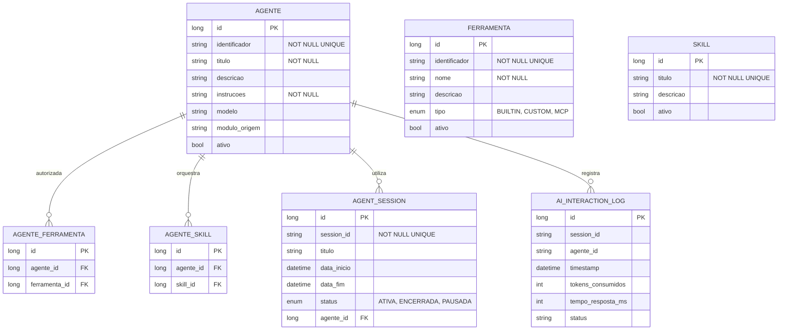

# CDU - Manter Agente

## 1. Descrição do Caso de Uso

O caso de uso "Manter Agente" permite o cadastro, consulta, alteração e exclusão de agentes LLM no sistema ia-core-llm. Um agente representa uma entidade especializada que pode orquestrar sub-agentes, utilizar ferramentas e executar skills específicas. Este módulo permite a gestão de agentes para orquestração multi-agente, incluindo configuração de instruções, modelo LLM, ferramentas autorizadas e skills disponíveis.

## 2. Atores

| Ator          | Descrição                                    |
|---------------|----------------------------------------------|
| Administrador | Usuário com acesso total ao sistema          |
| Desenvolvedor | Usuário responsável por criar agentes         |
| Usuário       | Usuário comum que pode visualizar agentes      |

## 3. Fluxo Principal

### 3.1. Fluxo: Cadastrar Agente

1. O ator acessa a opção "Cadastrar Agente" no menu.
2. O sistema exibe o formulário de cadastro de agente.
3. O ator preenche os dados obrigatórios (identificador, título, instruções).
4. O ator seleciona o modelo LLM preferido (ex: sonnet, opus, haiku, llama3.2-vision).
5. O ator seleciona as ferramentas autorizadas para este agente.
6. O ator seleciona as skills que este agente pode orquestrar.
7. O ator preenche os dados opcionais (descrição, módulo de origem).
8. O ator confirma o cadastro.
9. O sistema valida os dados:
    - Verifica se o identificador já está cadastrado
    - Verifica se o identificador segue o padrão esperado
    - Verifica se as ferramentas selecionadas estão disponíveis
    - Verifica se as skills selecionadas estão disponíveis
10. O sistema salva o agente no banco de dados.
11. O sistema exibe a mensagem de sucesso e os dados cadastrados.

### 3.2. Fluxo: Consultar Agente

1. O ator acessa a opção "Consultar Agente" no menu.
2. O sistema exibe a tela de pesquisa com filtros.
3. O ator informa os critérios de pesquisa (identificador, título, modelo, ativo).
4. O sistema retorna a lista de agentes que atendem aos critérios.
5. O ator seleciona um agente da lista.
6. O sistema exibe os dados detalhados do agente:
    - Identificador
    - Título
    - Descrição
    - Instruções
    - Modelo LLM
    - Ferramentas autorizadas
    - Skills disponíveis
    - Módulo de origem
    - Status (ativo/inativo)

### 3.3. Fluxo: Alterar Agente

1. O ator acessa a opção "Consultar Agente" e seleciona um agente.
2. O ator clica no botão "Editar".
3. O sistema exibe o formulário de alteração com os dados preenchidos.
4. O ator modifica os dados desejados (instruções, ferramentas, skills, modelo).
5. O ator confirma a alteração.
6. O sistema valida e salva as alterações.
7. O sistema exibe a mensagem de sucesso.

### 3.4. Fluxo: Excluir Agente

1. O ator acessa a opção "Consultar Agente" e seleciona um agente.
2. O ator clica no botão "Excluir".
3. O sistema solicita confirmação.
4. O ator confirma a exclusão.
5. O sistema verifica se há dependências (sessões ativas, sub-agentes dependentes).
6. Se não houver dependências, o sistema exclui o agente.
7. O sistema exibe a mensagem de sucesso.
8. Se houver dependências, o sistema exibe mensagem de erro indicando as dependências.

## 4. Fluxos Alternativos

### 4.1. Agente com Identificador Duplicado

1. No passo 9 do fluxo principal (Cadastrar), o sistema detecta identificador duplicado.
2. O sistema exibe mensagem de erro indicando que o identificador já está cadastrado.
3. O fluxo retorna ao passo 3.

### 4.2. Agente com Dependências

1. No passo 5 do fluxo de exclusão, o sistema detecta dependências.
2. O sistema exibe lista das dependências (ex: possui sessões ativas, é sub-agente de outros agentes).
3. O ator deve remover as dependências antes de excluir o agente.

### 4.3. Ferramenta Indisponível

1. No passo 9 do fluxo principal (Cadastrar), o sistema detecta que uma ferramenta selecionada está indisponível.
2. O sistema exibe mensagem de erro indicando qual ferramenta está indisponível.
3. O fluxo retorna ao passo 5.

## 5. Fluxos de Navegação (Mestre-Detalhe)

### 5.1. Gerenciar Ferramentas do Agente

1. A partir do formulário de agente (passo 5 do fluxo principal), o ator clica em "Adicionar Ferramenta".
2. O sistema exibe diálogo de seleção de ferramentas.
3. O ator seleciona as ferramentas desejadas.
4. O ator confirma.
5. O sistema adiciona as ferramentas à lista de ferramentas autorizadas.
6. O ator pode remover ferramentas da lista.
7. Ao salvar o agente, as ferramentas também são persistidas.

### 5.2. Gerenciar Skills do Agente

1. A partir do formulário de agente (passo 6 do fluxo principal), o ator clica em "Adicionar Skill".
2. O sistema exibe diálogo de seleção de skills.
3. O ator seleciona as skills desejadas.
4. O ator confirma.
5. O sistema adiciona as skills à lista de skills disponíveis.
6. O ator pode remover skills da lista.
7. Ao salvar o agente, as skills também são persistidas.

### 5.3. Visualizar Sessões do Agente

1. A partir da tela de detalhe do agente, o ator clica em "Ver Sessões".
2. O sistema exibe a lista de sessões ativas e encerradas do agente.
3. O ator pode acessar os detalhes de cada sessão.

### 5.4. Testar Agente

1. A partir da tela de detalhe do agente, o ator clica em "Testar".
2. O sistema exibe uma interface de teste.
3. O ator insere uma mensagem de teste.
4. O sistema envia a mensagem ao agente.
5. O sistema exibe a resposta do agente.

## 6. Regras de Negócio

| Regra | Descrição                                                         |
|-------|-------------------------------------------------------------------|
| RN001 | O identificador é obrigatório e deve ser único                      |
| RN002 | O título é obrigatório e não pode estar vazio                       |
| RN003 | As instruções são obrigatórias e não podem estar vazias             |
| RN004 | O modelo LLM define qual modelo será usado pelo agente             |
| RN005 | Um agente pode ter múltiplas ferramentas autorizadas                |
| RN006 | Um agente pode orquestrar múltiplas skills                          |
| RN007 | Agentes não podem ser excluídos se tiverem sessões ativas           |
| RN008 | O identificador deve seguir o padrão: modulo.nome_agente            |
| RN009 | O módulo de origem identifica de onde o agente provém                |
| RN010 | Agentes podem ser sub-agentes de outros agentes                       |

## 7. Estrutura de Dados

## 8. Contratos de Interface

### 8.1. Interface REST

| Método | Endpoint                      | Descrição                      |
|--------|-------------------------------|--------------------------------|
| GET    | `/api/v1/llm/agentes`        | Lista agentes com paginação     |
| GET    | `/api/v1/llm/agentes/{id}`   | Busca agente por ID            |
| POST   | `/api/v1/llm/agentes`        | Cadastra novo agente           |
| PUT    | `/api/v1/llm/agentes/{id}`   | Atualiza agente               |
| DELETE | `/api/v1/llm/agentes/{id}`   | Exclui agente                 |
| GET    | `/api/v1/llm/agentes/search` | Pesquisa por critérios         |
| POST   | `/api/v1/llm/agentes/{id}/testar` | Testa agente com mensagem |

### 8.2. Endpoints de Relacionamento

| Método | Endpoint                              | Descrição                 |
|--------|---------------------------------------|---------------------------|
| GET    | `/api/v1/llm/agentes/{id}/ferramentas` | Lista ferramentas autorizadas |
| POST   | `/api/v1/llm/agentes/{id}/ferramentas/{ferramentaId}` | Adiciona ferramenta |
| DELETE | `/api/v1/llm/agentes/{id}/ferramentas/{ferramentaId}` | Remove ferramenta |
| GET    | `/api/v1/llm/agentes/{id}/skills`   | Lista skills disponíveis |
| POST   | `/api/v1/llm/agentes/{id}/skills/{skillId}` | Adiciona skill |
| DELETE | `/api/v1/llm/agentes/{id}/skills/{skillId}` | Remove skill |
| GET    | `/api/v1/llm/agentes/{id}/sessoes`  | Lista sessões do agente |

### 8.3. Endpoints de Sub-Agentes

| Método | Endpoint                              | Descrição                 |
|--------|---------------------------------------|---------------------------|
| GET    | `/api/v1/llm/agentes/{id}/sub-agentes` | Lista sub-agentes |
| POST   | `/api/v1/llm/agentes/{id}/sub-agentes/{subAgenteId}` | Vincula sub-agente |
| DELETE | `/api/v1/llm/agentes/{id}/sub-agentes/{subAgenteId}` | Remove sub-agente |

## 9. Casos de Extensão

| Caso de Uso        | Descrição                                      |
|--------------------|------------------------------------------------|
| Manter Ferramenta  | Um agente utiliza ferramentas autorizadas       |
| Manter Skill       | Um agente orquestra skills                     |
| Sessão Agente      | Um agente é utilizado em sessões                |
| Auditoria IA       | Interações do agente são registradas no log     |
| Sessao Chat        | Agentes podem ser usados em sessões de chat     |
