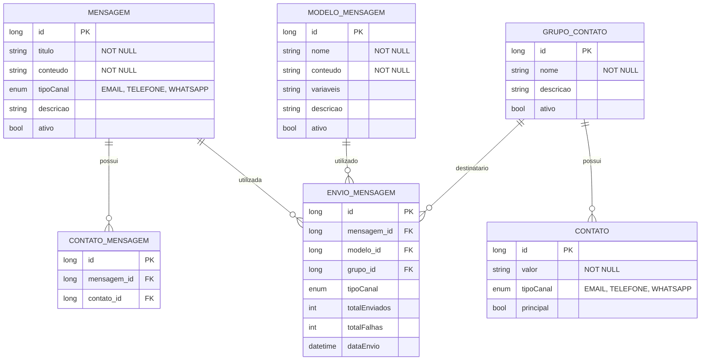

# CDU - Manter Communication

## 1. Descrição do Caso de Uso

O caso de uso "Manter Communication" permite o gerenciamento de comunicação no sistema ia-core, incluindo o cadastro de mensagens, modelos de mensagem, grupos de contatos e envio de mensagens através de diferentes canais (EMAIL, TELEFONE, WHATSAPP). Este módulo permite que o sistema envie notificações e comunicações para usuários e grupos de usuários de forma automatizada.

## 2. Atores

| Ator          | Descrição                                    |
|---------------|----------------------------------------------|
| Administrador | Usuário com acesso total ao sistema          |
| Comunicador   | Usuário responsável pelo envio de mensagens  |
| Usuário       | Usuário comum que pode visualizar mensagens   |

## 3. Fluxo Principal

### 3.1. Fluxo: Cadastrar Mensagem

1. O ator acessa a opção "Cadastrar Mensagem" no menu.
2. O sistema exibe o formulário de cadastro de mensagem.
3. O ator preenche os dados obrigatórios (título, conteúdo, tipo de canal).
4. O ator preenche os dados opcionais (descrição, variáveis).
5. O ator confirma o cadastro.
6. O sistema valida os dados:
    - Verifica se o título já está cadastrado
    - Verifica se o conteúdo está dentro dos padrões estabelecidos
7. O sistema salva a mensagem no banco de dados.
8. O sistema exibe a mensagem de sucesso e os dados cadastrados.

### 3.2. Fluxo: Cadastrar Modelo de Mensagem

1. O ator acessa a opção "Cadastrar Modelo" no menu.
2. O sistema exibe o formulário de cadastro de modelo.
3. O ator preenche os dados obrigatórios (nome, conteúdo).
4. O ator define as variáveis do modelo (ex: {{nome}}, {{data}}).
5. O ator confirma o cadastro.
6. O sistema valida o modelo:
    - Verifica se o nome já está cadastrado
    - Verifica se as variáveis estão corretamente formatadas
7. O sistema salva o modelo no banco de dados.
8. O sistema exibe a mensagem de sucesso.

### 3.3. Fluxo: Cadastrar Grupo de Contatos

1. O ator acessa a opção "Cadastrar Grupo" no menu.
2. O sistema exibe o formulário de cadastro de grupo.
3. O ator preenche os dados obrigatórios (nome).
4. O ator preenche os dados opcionais (descrição).
5. O ator adiciona contatos ao grupo.
6. O ator confirma o cadastro.
7. O sistema valida os dados:
    - Verifica se o nome já está cadastrado
    - Verifica se há pelo menos um contato no grupo
8. O sistema salva o grupo no banco de dados.
9. O sistema exibe a mensagem de sucesso.

### 3.4. Fluxo: Enviar Mensagem

1. O ator acessa a opção "Enviar Mensagem" no menu.
2. O sistema exibe o formulário de envio.
3. O ator seleciona o tipo de canal (EMAIL, TELEFONE, WHATSAPP).
4. O ator seleciona a mensagem ou modelo a ser enviado.
5. O ator define os destinatários (individual ou grupo).
6. O ator preenche as variáveis se necessário.
7. O ator confirma o envio.
8. O sistema valida os dados:
    - Verifica se há destinatários válidos
    - Verifica se as variáveis foram preenchidas
9. O sistema envia as mensagens.
10. O sistema exibe o relatório de envio (total enviados, total falhas).

## 4. Fluxos Alternativos

### 4.1. Mensagem com Título Duplicado

1. No passo 6 do fluxo principal (Cadastrar Mensagem), o sistema detecta título duplicado.
2. O sistema exibe mensagem de erro indicando que o título já está cadastrado.
3. O fluxo retorna ao passo 3.

### 4.2. Envio com Destinatários Inválidos

1. No passo 8 do fluxo de envio, o sistema detecta destinatários inválidos.
2. O sistema exibe lista de destinatários inválidos.
3. O ator deve corrigir a lista de destinatários antes de enviar.

### 4.3. Variáveis Não Preenchidas

1. No passo 8 do fluxo de envio, o sistema detecta variáveis não preenchidas.
2. O sistema exibe lista de variáveis obrigatórias.
3. O ator deve preencher as variáveis antes de enviar.

## 5. Fluxos de Navegação (Mestre-Detalhe)

### 5.1. Manter Contato de Grupo

1. A partir do formulário de grupo (passo 5 do fluxo principal), o ator clica em "Adicionar Contato".
2. O sistema exibe diálogo de contato.
3. O ator seleciona o contato existente ou cadastra novo.
4. O ator confirma.
5. O sistema adiciona contato à lista de contatos do grupo.
6. O ator pode remover contatos da lista.
7. Ao salvar o grupo, os contatos também são persistidos.

### 5.2. Vincular Contato à Mensagem

1. A partir do formulário de mensagem, o ator clica em "Adicionar Contato".
2. O sistema exibe diálogo de contato.
3. O ator preenche tipo de canal, valor e se é principal.
4. O ator confirma.
5. O sistema adiciona contato à lista de contatos da mensagem.

## 6. Regras de Negócio

| Regra | Descrição                                                         |
|-------|-------------------------------------------------------------------|
| RN001 | O campo título é obrigatório e deve ter entre 3 e 200 caracteres  |
| RN002 | O conteúdo da mensagem não pode ser vazio                        |
| RN003 | O tipo de canal pode ser: EMAIL, TELEFONE, WHATSAPP              |
| RN004 | Um grupo deve ter pelo menos um contato                          |
| RN005 | Variáveis de modelo devem seguir o formato {{nome_variavel}}     |
| RN006 | O envio de mensagens é assíncrono                                  |
| RN007 | O sistema mantém histórico de envios                             |

## 7. Estrutura de Dados

## 8. Contratos de Interface

### 8.1. Interface REST

| Método | Endpoint                          | Descrição                      |
|--------|-----------------------------------|--------------------------------|
| GET    | `/api/v1/communication/mensagens` | Lista mensagens com paginação   |
| GET    | `/api/v1/communication/mensagens/{id}` | Busca mensagem por ID       |
| POST   | `/api/v1/communication/mensagens` | Cadastra nova mensagem         |
| PUT    | `/api/v1/communication/mensagens/{id}` | Atualiza mensagem          |
| DELETE | `/api/v1/communication/mensagens/{id}` | Exclui mensagem            |
| GET    | `/api/v1/communication/modelos`   | Lista modelos com paginação    |
| GET    | `/api/v1/communication/modelos/{id}` | Busca modelo por ID        |
| POST   | `/api/v1/communication/modelos`   | Cadastra novo modelo          |
| PUT    | `/api/v1/communication/modelos/{id}` | Atualiza modelo           |
| DELETE | `/api/v1/communication/modelos/{id}` | Exclui modelo             |
| GET    | `/api/v1/communication/grupos`    | Lista grupos com paginação     |
| GET    | `/api/v1/communication/grupos/{id}` | Busca grupo por ID         |
| POST   | `/api/v1/communication/grupos`    | Cadastra novo grupo           |
| PUT    | `/api/v1/communication/grupos/{id}` | Atualiza grupo            |
| DELETE | `/api/v1/communication/grupos/{id}` | Exclui grupo              |

### 8.2. Endpoints de Envio

| Método | Endpoint                              | Descrição                 |
|--------|---------------------------------------|---------------------------|
| POST   | `/api/v1/communication/envio`         | Envia mensagem            |
| GET    | `/api/v1/communication/envio/{id}`     | Busca envio por ID        |
| GET    | `/api/v1/communication/envio/historico` | Lista histórico de envios |

### 8.3. Endpoints de Relacionamento

| Método | Endpoint                                          | Descrição                 |
|--------|---------------------------------------------------|---------------------------|
| GET    | `/api/v1/communication/grupos/{id}/contatos`     | Lista contatos do grupo   |
| POST   | `/api/v1/communication/grupos/{id}/contatos`     | Adiciona contato ao grupo |
| DELETE | `/api/v1/communication/grupos/{id}/contatos/{contatoId}` | Remove contato do grupo |

## 9. Casos de Extensão

| Caso de Uso        | Descrição                                      |
|--------------------|------------------------------------------------|
| Manter Security    | Controle de permissões para envio de mensagens |
| Manter Scheduler   | Agendamento de envios de mensagens             |
| Manter Report      | Relatórios de estatísticas de envio             |
