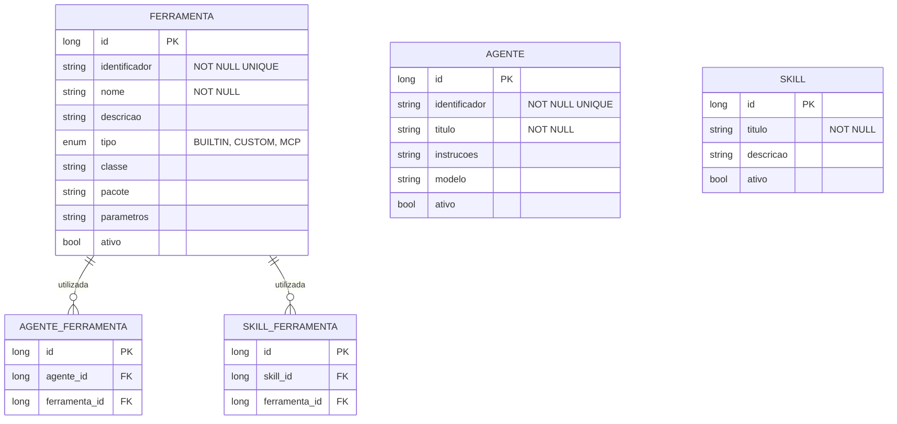

# CDU - Manter Ferramenta

## 1. Descrição do Caso de Uso

O caso de uso "Manter Ferramenta" permite o cadastro, consulta, alteração e exclusão de ferramentas no sistema ia-core-llm. Uma ferramenta representa uma função ou capacidade que pode ser invocada por agentes LLM (ex: busca web, processamento de imagem, extração de texto). Este módulo permite a gestão das ferramentas disponíveis para uso pelos agentes, incluindo descoberta automática de ferramentas anotadas com @Tool.

## 2. Atores

| Ator          | Descrição                                    |
|---------------|----------------------------------------------|
| Administrador | Usuário com acesso total ao sistema          |
| Desenvolvedor | Usuário responsável por criar ferramentas     |
| Usuário       | Usuário comum que pode visualizar ferramentas   |

## 3. Fluxo Principal

### 3.1. Fluxo: Cadastrar Ferramenta

1. O ator acessa a opção "Cadastrar Ferramenta" no menu.
2. O sistema exibe o formulário de cadastro de ferramenta.
3. O ator preenche os dados obrigatórios (identificador, nome, descrição).
4. O ator seleciona o tipo de ferramenta (BUILTIN, CUSTOM, MCP).
5. O ator preenche os dados opcionais (classe Java, pacote, parâmetros).
6. O ator confirma o cadastro.
7. O sistema valida os dados:
    - Verifica se o identificador já está cadastrado
    - Verifica se o identificador segue o padrão esperado
    - Verifica se a classe existe (se fornecida)
8. O sistema salva a ferramenta no banco de dados.
9. O sistema exibe a mensagem de sucesso e os dados cadastrados.

### 3.2. Fluxo: Consultar Ferramenta

1. O ator acessa a opção "Consultar Ferramenta" no menu.
2. O sistema exibe a tela de pesquisa com filtros.
3. O ator informa os critérios de pesquisa (identificador, nome, tipo).
4. O sistema retorna a lista de ferramentas que atendem aos critérios.
5. O ator seleciona uma ferramenta da lista.
6. O sistema exibe os dados detalhados da ferramenta:
    - Identificador
    - Nome
    - Descrição
    - Tipo
    - Classe Java
    - Pacote
    - Parâmetros
    - Agentes que utilizam esta ferramenta

### 3.3. Fluxo: Alterar Ferramenta

1. O ator acessa a opção "Consultar Ferramenta" e seleciona uma ferramenta.
2. O ator clica no botão "Editar".
3. O sistema exibe o formulário de alteração com os dados preenchidos.
4. O ator modifica os dados desejados (descrição, parâmetros).
5. O ator confirma a alteração.
6. O sistema valida e salva as alterações.
7. O sistema exibe a mensagem de sucesso.

### 3.4. Fluxo: Excluir Ferramenta

1. O ator acessa a opção "Consultar Ferramenta" e seleciona uma ferramenta.
2. O ator clica no botão "Excluir".
3. O sistema solicita confirmação.
4. O ator confirma a exclusão.
5. O sistema verifica se há dependências (agentes ativos que utilizam esta ferramenta).
6. Se não houver dependências, o sistema exclui a ferramenta.
7. O sistema exibe a mensagem de sucesso.
8. Se houver dependências, o sistema exibe mensagem de erro indicando as dependências.

## 4. Fluxos Alternativos

### 4.1. Ferramenta com Identificador Duplicado

1. No passo 7 do fluxo principal (Cadastrar), o sistema detecta identificador duplicado.
2. O sistema exibe mensagem de erro indicando que o identificador já está cadastrado.
3. O fluxo retorna ao passo 3.

### 4.2. Ferramenta com Dependências

1. No passo 5 do fluxo de exclusão, o sistema detecta dependências.
2. O sistema exibe lista dos agentes que utilizam esta ferramenta.
3. O ator deve remover a ferramenta dos agentes antes de excluí-la.

### 4.3. Classe Não Encontrada

1. No passo 7 do fluxo principal (Cadastrar), o sistema detecta que a classe fornecida não existe.
2. O sistema exibe mensagem de erro indicando que a classe não foi encontrada.
3. O fluxo retorna ao passo 5.

## 5. Fluxos de Navegação (Mestre-Detalhe)

### 5.1. Descobrir Ferramentas Automaticamente

1. A partir da lista de ferramentas, o ator clica em "Descobrir Ferramentas".
2. O sistema executa o FerramentaDiscoveryService para buscar classes anotadas com @Tool.
3. O sistema exibe a lista de ferramentas encontradas.
4. O ator seleciona as ferramentas que deseja cadastrar.
5. O sistema cadastra as ferramentas selecionadas automaticamente.

### 5.2. Vincular Ferramenta a Agente

1. A partir da tela de detalhe da ferramenta, o ator clica em "Vincular Agente".
2. O sistema exibe a lista de agentes disponíveis.
3. O ator seleciona os agentes que podem utilizar esta ferramenta.
4. O sistema vincula a ferramenta aos agentes selecionados.

### 5.3. Visualizar Agentes que Utilizam

1. A partir da tela de detalhe da ferramenta, o ator clica em "Ver Agentes".
2. O sistema exibe a lista de agentes que utilizam esta ferramenta.

## 6. Regras de Negócio

| Regra | Descrição                                                         |
|-------|-------------------------------------------------------------------|
| RN001 | O identificador é obrigatório e deve ser único                    |
| RN002 | O nome é obrigatório e não pode estar vazio                       |
| RN003 | O tipo de ferramenta pode ser: BUILTIN, CUSTOM, MCP              |
| RN004 | Ferramentas BUILTIN não podem ser excluídas                       |
| RN005 | Ferramentas não podem ser excluídas se estiverem em uso por agentes |
| RN006 | A descoberta automática busca classes anotadas com @Tool          |
| RN007 | O identificador deve seguir o padrão: modulo.nome_ferramenta       |

## 7. Estrutura de Dados

## 8. Contratos de Interface

### 8.1. Interface REST

| Método | Endpoint                      | Descrição                      |
|--------|-------------------------------|--------------------------------|
| GET    | `/api/v1/llm/ferramentas`     | Lista ferramentas com paginação |
| GET    | `/api/v1/llm/ferramentas/{id}` | Busca ferramenta por ID        |
| POST   | `/api/v1/llm/ferramentas`     | Cadastra nova ferramenta       |
| PUT    | `/api/v1/llm/ferramentas/{id}` | Atualiza ferramenta            |
| DELETE | `/api/v1/llm/ferramentas/{id}` | Exclui ferramenta              |
| GET    | `/api/v1/llm/ferramentas/search` | Pesquisa por critérios     |
| POST   | `/api/v1/llm/ferramentas/discover` | Descobre ferramentas @Tool |

### 8.2. Endpoints de Relacionamento

| Método | Endpoint                              | Descrição                 |
|--------|---------------------------------------|---------------------------|
| GET    | `/api/v1/llm/ferramentas/{id}/agentes` | Lista agentes que utilizam |
| POST   | `/api/v1/llm/ferramentas/{id}/agentes/{agenteId}` | Vincula a agente |
| DELETE | `/api/v1/llm/ferramentas/{id}/agentes/{agenteId}` | Remove de agente |

## 9. Casos de Extensão

| Caso de Uso        | Descrição                                      |
|--------------------|------------------------------------------------|
| Manter Agente      | Uma ferramenta pode ser utilizada por agentes   |
| Manter Skill       | Uma ferramenta pode ser utilizada por skills    |
| Interface Agente Conversacional | Ferramentas são usadas em conversações com agentes |
