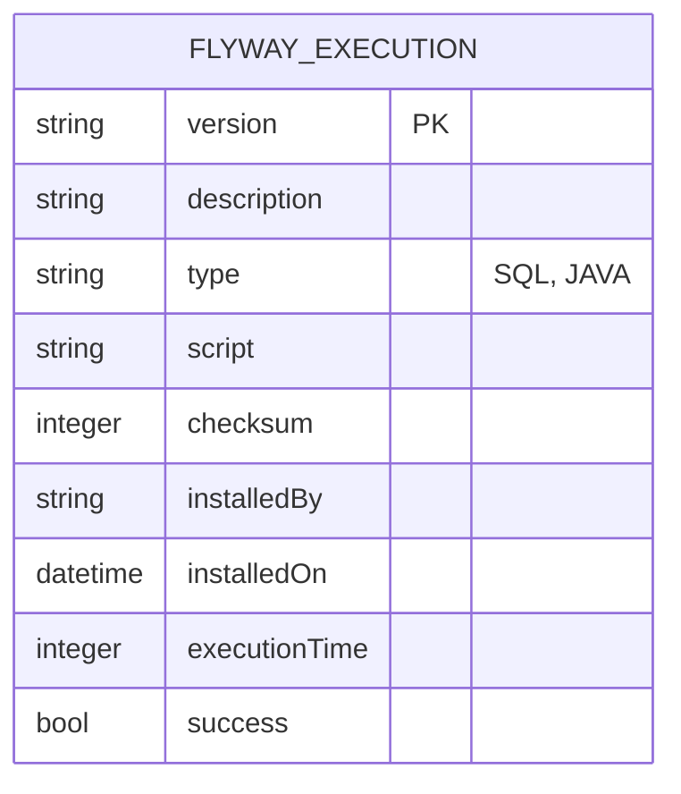

# CDU - Manter Flyway

## 1. Descrição do Caso de Uso

O caso de uso "Manter Flyway" permite o gerenciamento de migrações de banco de dados usando Flyway no sistema ia-core. Este módulo permite que administradores e desenvolvedores monitorem, executem e gerenciem as migrações de banco de dados de forma controlada e segura, garantindo a integridade e consistência do esquema do banco de dados.

## 2. Atores

| Ator        | Descrição                                    |
|-------------|----------------------------------------------|
| Administrador| Usuário com acesso total ao sistema          |
| DBA         | Administrador de banco de dados              |
| Desenvolvedor| Usuário responsável por criar migrations     |

## 3. Fluxo Principal

### 3.1. Fluxo: Consultar Status das Migrations

1. O ator acessa a opção "Status Flyway" no menu.
2. O sistema exibe o status atual das migrations:
    - Versão atual do banco
    - Migrations pendentes
    - Migrations aplicadas
    - Status de validação
3. O ator pode filtrar por versão ou status.
4. O sistema atualiza a lista em tempo real.

### 3.2. Fluxo: Executar Migrations

1. O ator acessa a opção "Executar Migrations" no menu.
2. O sistema exibe a lista de migrations pendentes.
3. O ator revisa as migrations a serem aplicadas.
4. O ator confirma a execução.
5. O sistema valida as migrations:
    - Verifica se há conflitos com migrations já aplicadas
    - Verifica se o checksum está correto
6. O sistema executa as migrations em ordem sequencial.
7. O sistema exibe o relatório de execução:
    - Migrations aplicadas com sucesso
    - Migrations que falharam
    - Tempo de execução
8. O sistema atualiza o status do banco.

### 3.3. Fluxo: Reparar Migrations

1. O ator acessa a opção "Reparar Flyway" no menu.
2. O sistema exibe as migrations que precisam de reparo.
3. O ator seleciona as migrations a serem reparadas.
4. O ator confirma o reparo.
5. O sistema recalcula os checksums das migrations.
6. O sistema atualiza o histórico de execuções.
7. O sistema exibe a mensagem de sucesso.

### 3.4. Fluxo: Limpar Banco (Clean)

1. O ator acessa a opção "Limpar Banco" no menu.
2. O sistema exibe aviso de que esta operação é irreversível.
3. O ator confirma a operação digitando "CONFIRMAR".
4. O sistema verifica se o ambiente permite esta operação:
    - Não permitido em produção
    - Requer confirmação adicional em staging
5. O sistema remove todas as tabelas e objetos do banco.
6. O sistema remove o histórico do Flyway.
7. O sistema exibe a mensagem de sucesso.

## 4. Fluxos Alternativos

### 4.1. Migration com Checksum Inválido

1. No passo 5 do fluxo principal (Executar Migrations), o sistema detecta checksum inválido.
2. O sistema exibe mensagem de erro indicando qual migration está com problema.
3. O ator deve reparar a migration antes de continuar.
4. O fluxo retorna ao passo 2.

### 4.2. Migration com Falha de Execução

1. Durante a execução de uma migration, ocorre um erro SQL.
2. O sistema interrompe a execução.
3. O sistema exibe o erro SQL detalhado.
4. O sistema faz rollback das migrations aplicadas nesta execução.
5. O ator deve corrigir a migration e executar novamente.

### 4.3. Operação de Clean Bloqueada

1. No passo 4 do fluxo de limpar banco, o sistema detecta ambiente de produção.
2. O sistema bloqueia a operação.
3. O sistema exibe mensagem de erro indicando que a operação não é permitida em produção.
4. O fluxo é encerrado.

## 5. Fluxos de Navegação (Mestre-Detalhe)

### 5.1. Visualizar Detalhes de Migration

1. A partir da lista de migrations (passo 2 do fluxo principal), o ator clica em uma migration.
2. O sistema exibe os detalhes da migration:
    - Versão
    - Descrição
    - Tipo (SQL, Java)
    - Script completo
    - Checksum
    - Data de instalação
    - Tempo de execução
    - Usuário que instalou
3. O ator pode visualizar o script da migration.

### 5.2. Visualizar Histórico de Execuções

1. A partir da lista de migrations, o ator clica em "Histórico".
2. O sistema exibe todas as execuções da migration:
    - Data e hora
    - Sucesso/Falha
    - Tempo de execução
    - Mensagem de erro (se houve falha)

## 6. Regras de Negócio

| Regra | Descrição                                                         |
|-------|-------------------------------------------------------------------|
| RN001 | Migrations devem ser executadas em ordem sequencial por versão    |
| RN002 | O checksum de uma migration não pode ser alterado após aplicação |
| RN003 | A operação de clean é proibida em ambiente de produção          |
| RN004 | A operação de clean requer confirmação dupla em staging          |
| RN005 | Migrations falhadas bloqueiam execuções subsequentes              |
| RN006 | O sistema mantém histórico completo de todas as execuções         |
| RN007 | A versão do banco é determinada pela última migration aplicada    |

## 7. Estrutura de Dados

## 8. Contratos de Interface

### 8.1. Interface REST

| Método | Endpoint                      | Descrição                      |
|--------|-------------------------------|--------------------------------|
| GET    | `/api/v1/flyway/status`      | Status atual das migrations    |
| GET    | `/api/v1/flyway/info`        | Informações detalhadas         |
| GET    | `/api/v1/flyway/validate`    | Valida migrations pendentes    |
| POST   | `/api/v1/flyway/migrate`     | Executa migrations pendentes    |
| POST   | `/api/v1/flyway/repair`      | Repara migrations              |
| POST   | `/api/v1/flyway/clean`       | Limpa o banco de dados         |
| POST   | `/api/v1/flyway/baseline`    | Cria baseline                  |
| GET    | `/api/v1/flyway/executions`  | Lista histórico de execuções   |
| GET    | `/api/v1/flyway/executions/{version}` | Detalhes de execução  |

### 8.2. Endpoints de Informação

| Método | Endpoint                              | Descrição                 |
|--------|---------------------------------------|---------------------------|
| GET    | `/api/v1/flyway/executions/{version}/script` | Script da migration |
| GET    | `/api/v1/flyway/executions/{version}/checksum` | Checksum da migration |

## 9. Casos de Extensão

| Caso de Uso        | Descrição                                      |
|--------------------|------------------------------------------------|
| Manter Security    | Controle de permissões para operações de DBA   |
| Manter Report      | Relatórios de histórico de migrations          |
| Manter Scheduler   | Agendamento automático de migrations           |
