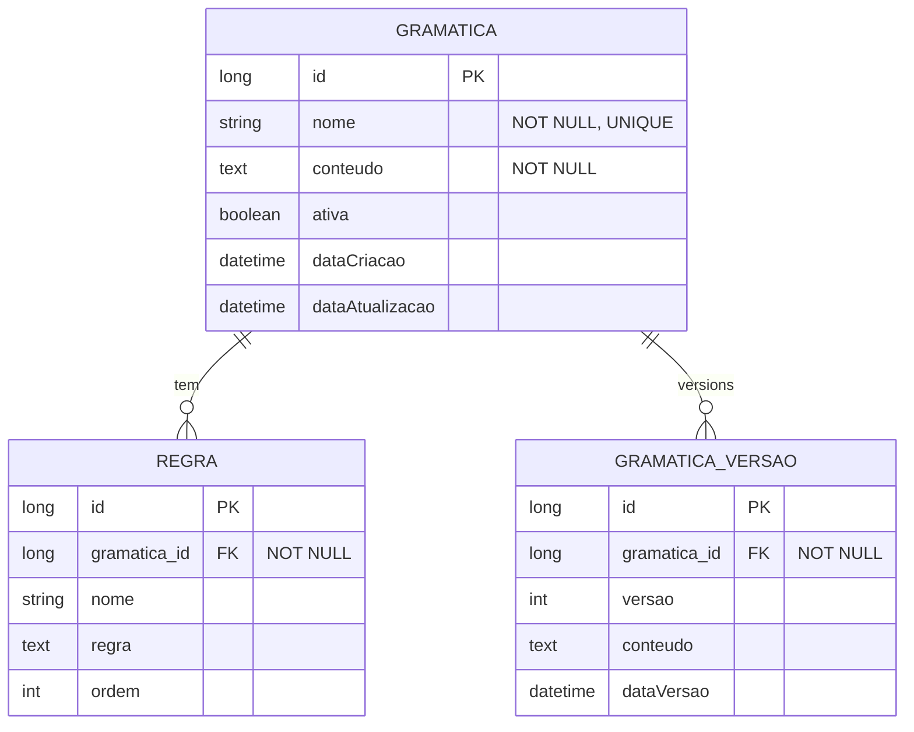

# CDU - Manter Grammar

## 1. Descrição do Caso de Uso

O caso de uso "Manter Grammar" gerencia as gramáticas ANTLR utilizadas para parsing de texto. Permite cadastrar e testar regras gramaticais para processamento de linguagem natural.

## 2. Atores

| Ator | Descrição |
|------|------------|
| Desenvolvedor | Cria e mantem gramáticas |
| Analista | Testa regras gramaticais |

## 3. Fluxo Principal

### 3.1. Fluxo: Criar Gramática

1. Ator acessa "Nova Gramática".
2. Sistema exibe editor.
3. Ator define nome.
4. Ator escreve regras em formato ANTLR.
5. Sistema valida sintaxe.
6. Sistema compila gramática.
7. Sistema gera parser.

### 3.2. Fluxo: Testar Gramática

1. Ator seleciona gramática.
2. Acessa "Testar".
3. Sistema exibe campo de entrada.
4. Ator informa texto.
5. Sistema processa com parser.
6. Sistema exibe resultado (árvore AST).

### 3.3. Fluxo: Editar Gramática

1. Ator seleciona gramática existente.
2. Modifica regras.
3. Sistema recompila.
4. Sistema atualiza parser.

## 4. Fluxos Alternativos

### 4.1. Erro de Sintaxe

1. Sistema detecta erro na gramática.
2. Exibe mensagem de erro com linha.
3. Ator corrige.

### 4.2. Gramática Ambígua

1. Sistema detecta ambiguidade.
2. Alerta ator.
3. Sugere alternativas.

## 5. Fluxos de Navegação (Mestre-Detalhe)

### 5.1. Gerenciar Regras

1. A partir da gramática, ator acessa "Regras".
2. Sistema exibe lista de regras.
3. Ator adiciona/edita/exclui regras.
4. Sistema valida cada regra.

### 5.2. Visualizar Tokens

1. A partir da gramática, ator acessa "Tokens".
2. Sistema exibe tokens definidos.
3. Ator pode ajustar.

### 5.3. Histórico de Versões

1. A partir da gramática, ator acessa "Histórico".
2. Sistema exibe versões anteriores.
3. Ator pode restaurar.

## 6. Regras de Negócio

| Regra | Descrição |
|-------|-----------|
| RN001 | Nome é obrigatório e único |
| RN002 | Regras devem ser válidas em ANTLR |
| RN003 | Compilação gera parser automaticamente |
| RN004 | Gramática ativa é usada em processamento |

## 7. Estrutura de Dados

## 8. Contratos de Interface

### 8.1. Interface REST

| Método | Endpoint | Descrição |
|--------|----------|------------|
| GET | `/api/v1/grammars` | Lista gramáticas |
| POST | `/api/v1/grammars` | Cria gramática |
| GET | `/api/v1/grammars/{id}` | Busca gramática |
| PUT | `/api/v1/grammars/{id}` | Atualiza gramática |
| DELETE | `/api/v1/grammars/{id}` | Exclui gramática |
| POST | `/api/v1/grammars/{id}/compile` | Compila gramática |
| POST | `/api/v1/grammars/{id}/test` | Testa gramática |

### 8.2. Endpoints de Relacionamento

| Método | Endpoint | Descrição |
|--------|----------|------------|
| GET | `/api/v1/grammars/{id}/regras` | Lista regras |
| POST | `/api/v1/grammars/{id}/regras` | Adiciona regra |
| GET | `/api/v1/grammars/{id}/tokens` | Lista tokens |
| GET | `/api/v1/grammars/{id}/historico` | Lista versões |
