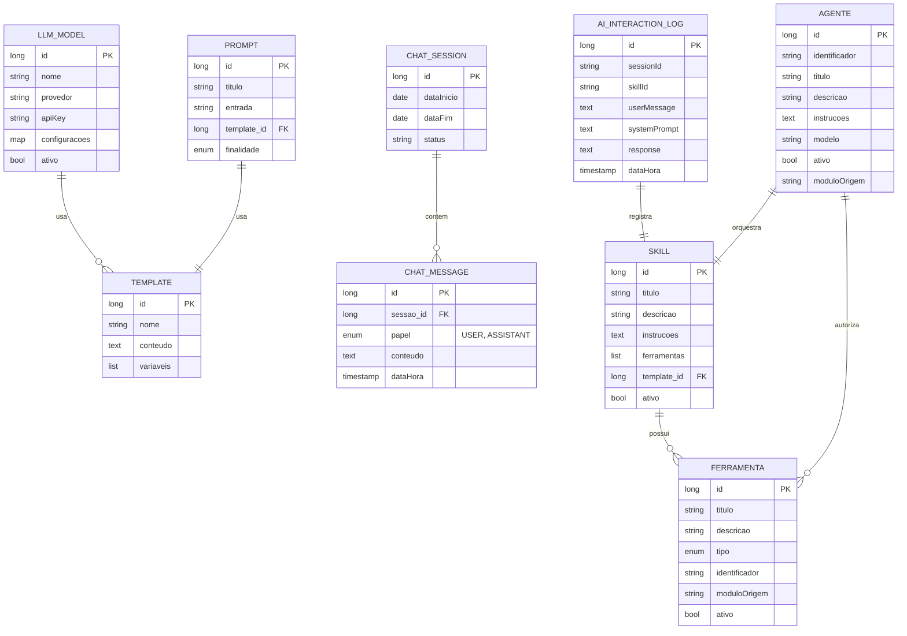

# CDU - GerenciarLLM

## 1. Descrição do Caso de Uso

O caso de uso "Gerenciar LLM" permite a configuração e utilização de Modelos de Linguagem de Grande Escala (LLM) no sistema. Fornece funcionalidades para聊天 (chat), criação de templates de prompts e gerenciamento de sessões de conversation.

## 2. Atores

| Ator | Descrição |
|------|------------|
| Administrador | Configura modelos LLM |
| Desenvolvedor | Cria templates de prompts |
| Usuário Final | Interage via chat |

## 3. Fluxo Principal

### 3.1. Fluxo: Configurar Modelo LLM

1. Administrador acessa configuração de LLM.
2. Sistema exibe modelos disponíveis.
3. Administrador seleciona provedor (OpenAI, Anthropic, etc).
4. Administrador configura API key e parâmetros.
5. Sistema valida conexão.
6. Sistema salva configuração.
7. Sistema exibe sucesso.

### 3.2. Fluxo: Criar Template de Prompt

1. Desenvolvedor acessa "Templates".
2. Sistema exibe lista de templates.
3. Desenvolvedor cria novo template.
4. Preenche: nome, descrição, variáveis, conteúdo.
5. Sistema valida template.
6. Sistema salva.
7. Sistema exibe sucesso.

### 3.3. Fluxo: Iniciar Sessão de Chat

1. Usuário acessa chat.
2. Sistema cria nova sessão.
3. Usuário envia mensagem.
4. Sistema processa via LLM.
5. Sistema exibe resposta.
6. Repetir 3-5 para continuar conversation.

### 3.4. Fluxo: Listar Histórico de Conversas

1. Usuário acessa histórico.
2. Sistema exibe conversas anteriores.
3. Usuário seleciona conversa.
4. Sistema carrega mensagens.

### 3.5. Fluxo: Processar Imagem com LLM

1. Usuário envia imagem para extração de texto.
2. Sistema aplica binarização (Otsu) na imagem.
3. Sistema comprime e redimensiona imagem.
4. Sistema envia imagem para LLM com prompt de extração.
5. LLM retorna texto extraído.
6. Sistema exibe resultado.

### 3.6. Fluxo: Aprender Texto no Vector Store

1. Usuário fornece texto para indexação.
2. Sistema divide texto em chunks.
3. Sistema gera embeddings.
4. Sistema armazena vetores no Vector Store.
5. Sistema confirma indexação.

### 3.7. Fluxo: Buscar na Internet via Browser

1. Usuário solicita busca na internet.
2. Sistema usa Selenium WebDriver para navegar.
3. Sistema executa busca em motor de busca.
4. Sistema extrai resultados relevantes.
5. Sistema retorna resultados ao usuário.

### 3.8. Fluxo: Gerenciar Agentes Especialistas

1. Administrador acessa gerenciamento de agentes.
2. Sistema exibe lista de agentes registrados.
3. Administrador cria novo agente.
4. Preenche: identificador, título, descrição, instruções, modelo, ferramentas.
5. Sistema valida agente.
6. Sistema salva.
7. Sistema exibe sucesso.

### 3.9. Fluxo: Orquestração Multi-Agente com A2A

1. Usuário inicia sessão de agente.
2. Sistema identifica agente principal.
3. Sistema delega tarefas a sub-agentes via protocolo A2A.
4. Sub-agentes executam tarefas em contextos dedicados.
5. Sistema agrega resultados.
6. Sistema retorna resposta consolidada.

## 4. Fluxos Alternativos

### 4.1. Erro na API LLM

1. Sistema detecta erro na chamada API.
2. Sistema exibe mensagem de erro amigável.
3. Sistema registra erro para análise.

### 4.2. Limite de Tokens Excedido

1. Sistema detecta excesso de tokens.
2. Sistema trunca conversation mais antiga.
3. Continua processamento.

### 4.3. Erro no Processamento de Imagem

1. Sistema detecta erro ao processar imagem.
2. Sistema exibe mensagem de erro específica (formato inválido, corrompida, etc).
3. Sistema registra erro para análise.

### 4.4. Falha na Indexação do Vector Store

1. Sistema detecta erro ao gerar embeddings.
2. Sistema exibe mensagem de erro amigável.
3. Sistema registra erro para análise.

### 4.5. Erro na Busca na Internet

1. Sistema detecta erro ao navegar ou extrair resultados.
2. Sistema exibe mensagem de erro específica (timeout, bloqueio, etc).
3. Sistema registra erro para análise.

### 4.6. Agente Indisponível

1. Sistema detecta que agente solicitado não está disponível.
2. Sistema exibe mensagem de erro amigável.
3. Sistema sugere agentes alternativos.

### 4.7. Falha na Comunicação A2A

1. Sistema detecta erro ao comunicar com agente remoto via A2A.
2. Sistema exibe mensagem de erro amigável.
3. Sistema registra erro para análise.
4. Sistema tenta fallback para agente local.

## 5. Fluxos de Navegação (Mestre-Detalhe)

### 5.1. Gerenciar Parâmetros do Modelo

1. A partir do formulário de modelo, o ator acessa "Parâmetros".
2. Sistema exibe lista de parâmetros configuráveis.
3. Ator ajusta: temperatura, top_p, max_tokens, etc.
4. Sistema salva configurações.
5. Configurações são aplicadas a todas as requisições.

### 5.2. Gerenciar Variáveis de Template

1. A partir do formulário de template, o ator acessa "Variáveis".
2. Sistema exibe lista de variáveis definidas.
3. Ator adiciona nova variável (nome, tipo, valor padrão).
4. Sistema valida nome único.
5. Sistema adiciona à lista.
6. Ator pode editar ou remover variáveis.

### 5.3. Gerenciar Mensagens da Sessão

1. A partir de uma sessão de chat, o ator visualiza mensagens.
2. Sistema exibe lista de mensagens (usuário e assistente).
3. Ator pode copiar mensagem.
4. Ator pode reiniciar sessão.
5. Sistema limpa histórico e cria nova sessão.

### 5.4. Processar Imagens para Extração de Texto

1. A partir da interface de chat, o ator acessa "Processar Imagem".
2. Sistema exibe formulário de upload de imagem.
3. Ator seleciona uma ou mais imagens.
4. Sistema processa imagens (binarização, compressão).
5. Sistema extrai texto usando LLM.
6. Sistema exibe texto extraído.

### 5.5. Gerenciar Vector Store

1. A partir da configuração, o ator acessa "Vector Store".
2. Sistema exibe status do Vector Store.
3. Ator pode adicionar texto para indexação.
4. Sistema gera embeddings e armazena vetores.
5. Ator pode limpar o Vector Store.

### 5.6. Gerenciar Agentes Especialistas

1. A partir da configuração, o ator acessa "Agentes".
2. Sistema exibe lista de agentes registrados.
3. Ator cria novo agente.
4. Preenche: identificador, título, descrição, instruções, modelo.
5. Ator associa ferramentas ao agente.
6. Sistema salva.
7. Ator pode ativar/desativar agentes.

### 5.7. Configurar A2A

1. A partir da configuração, o ator acessa "A2A".
2. Sistema exibe status do protocolo A2A.
3. Ator configura URL do servidor A2A.
4. Ator configura ID do agente.
5. Sistema testa conexão.
6. Sistema salva configuração.

## 6. Regras de Negócio

| Regra | Descrição |
|-------|-----------|
| RN001 | Cada provedor LLM tem configurações específicas |
| RN002 | Templates suportam variáveis no formato ${variavel} |
| RN003 | Histórico de chat é persistido |
| RN004 | Sessões podem ser retomadas |
| RN005 | Taxa de requisições pode ser limitada |
| RN006 | Processamento de imagem usa binarização Otsu para melhorar extração de texto |
| RN007 | Vector Store usa similaridade de 0.85 como threshold padrão |
| RN008 | Todas as interações com LLM são auditadas em LLM_AI_INTERACTION_LOG |
| RN009 | Sub-agentes especialistas são registrados em AgentRegistry |
| RN010 | Ferramentas podem ser descobertas automaticamente via scan de @Tool annotations |
| RN011 | Configurações de agentes, skills e ferramentas são armazenadas em banco de dados (não YAML) |
| RN012 | Built-in tools incluem apenas WebSearchTool (busca na internet via Selenium WebDriver) |
| RN013 | Protocolo A2A é suportado para orquestração remota de agentes |
| RN014 | AgentOrchestratorService delega a ChatApplicationService (encapsulamento) |
| RN015 | Multi-model routing é configurado via propriedades da entidade Agente |

## 7. Estrutura de Dados

## 8. Contratos de Interface

### 8.1. Interface REST - Modelo

| Método | Endpoint | Descrição |
|--------|----------|------------|
| GET | `/api/v1/llm/modelos` | Lista modelos |
| POST | `/api/v1/llm/modelos` | Cria modelo |
| GET | `/api/v1/llm/modelos/{id}` | Busca modelo |
| PUT | `/api/v1/llm/modelos/{id}` | Atualiza modelo |
| DELETE | `/api/v1/llm/modelos/{id}` | Remove modelo |
| PUT | `/api/v1/llm/modelos/{id}/ativar` | Ativa modelo |

### 8.2. Interface REST - Template

| Método | Endpoint | Descrição |
|--------|----------|------------|
| GET | `/api/v1/llm/templates` | Lista templates |
| POST | `/api/v1/llm/templates` | Cria template |
| GET | `/api/v1/llm/templates/{id}` | Busca template |
| PUT | `/api/v1/llm/templates/{id}` | Atualiza template |
| DELETE | `/api/v1/llm/templates/{id}` | Remove template |
| GET | `/api/v1/llm/templates/{id}/variaveis` | Lista variáveis |

### 8.3. Interface REST - Chat

| Método | Endpoint | Descrição |
|--------|----------|------------|
| POST | `/api/v1/llm/chat` | Envia mensagem |
| GET | `/api/v1/llm/sessoes` | Lista sessões |
| GET | `/api/v1/llm/sessoes/{id}` | Busca sessão |
| GET | `/api/v1/llm/sessoes/{id}/mensagens` | Lista mensagens |
| DELETE | `/api/v1/llm/sessoes/{id}` | Remove sessão |

### 8.4. Interface REST - Prompt

| Método | Endpoint | Descrição |
|--------|----------|------------|
| GET | `/api/v1/llm/prompts` | Lista prompts |
| POST | `/api/v1/llm/prompts` | Cria prompt |
| GET | `/api/v1/llm/prompts/{id}` | Busca prompt |
| PUT | `/api/v1/llm/prompts/{id}` | Atualiza prompt |
| DELETE | `/api/v1/llm/prompts/{id}` | Remove prompt |

### 8.5. Interface REST - Skill

| Método | Endpoint | Descrição |
|--------|----------|------------|
| GET | `/api/v1/llm/skills` | Lista skills |
| POST | `/api/v1/llm/skills` | Cria skill |
| GET | `/api/v1/llm/skills/{id}` | Busca skill |
| PUT | `/api/v1/llm/skills/{id}` | Atualiza skill |
| DELETE | `/api/v1/llm/skills/{id}` | Remove skill |
| GET | `/api/v1/llm/skills/{id}/ferramentas` | Lista ferramentas da skill |
| POST | `/api/v1/llm/skills/{id}/ferramentas` | Adiciona ferramenta à skill |
| DELETE | `/api/v1/llm/skills/{id}/ferramentas/{ferramentaId}` | Remove ferramenta da skill |

### 8.6. Interface REST - Ferramenta

| Método | Endpoint | Descrição |
|--------|----------|------------|
| GET | `/api/v1/llm/ferramentas` | Lista ferramentas |
| POST | `/api/v1/llm/ferramentas/sync` | Sincroniza ferramentas (discovery) |
| GET | `/api/v1/llm/ferramentas/{id}` | Busca ferramenta |
| PUT | `/api/v1/llm/ferramentas/{id}` | Atualiza ferramenta |
| DELETE | `/api/v1/llm/ferramentas/{id}` | Remove ferramenta |

### 8.7. Interface REST - Agent Session

| Método | Endpoint | Descrição |
|--------|----------|------------|
| POST | `/api/v1/llm/agent/session` | Cria/executa sessão de agente |
| POST | `/api/v1/llm/agent/session/confirm` | Confirma ação pendente |
| GET | `/api/v1/llm/agent/skills` | Lista skills disponíveis |

### 8.8. Interface REST - Vector Store

| Método | Endpoint | Descrição |
|--------|----------|------------|
| POST | `/api/v1/llm/vector-store/learn` | Adiciona texto ao Vector Store |
| DELETE | `/api/v1/llm/vector-store` | Limpa Vector Store |

### 8.9. Interface REST - Processamento de Imagem

| Método | Endpoint | Descrição |
|--------|----------|------------|
| POST | `/api/v1/llm/image/extract-text` | Extrai texto de imagens |
| POST | `/api/v1/llm/image/binarize` | Binariza imagem (Otsu) |
| POST | `/api/v1/llm/image/compress` | Comprime e redimensiona imagem |

### 8.10. Interface REST - Auditoria

| Método | Endpoint | Descrição |
|--------|----------|------------|
| GET | `/api/v1/llm/audit/interactions` | Lista interações auditadas |
| GET | `/api/v1/llm/audit/interactions/{id}` | Busca detalhes de interação |

### 8.11. Interface MCP

| Método | Endpoint | Descrição |
|--------|----------|------------|
| GET | `/.well-known/agent-card.json` | Metadados do agente MCP |
| SSE | `/mcp/sse` | Endpoint SSE para comunicação MCP |
| HTTP | `/mcp/**` | Endpoints HTTP do servidor MCP |

### 8.12. Interface REST - Agente

| Método | Endpoint | Descrição |
|--------|----------|------------|
| GET | `/api/v1/llm/agentes` | Lista agentes |
| POST | `/api/v1/llm/agentes` | Cria agente |
| GET | `/api/v1/llm/agentes/{id}` | Busca agente |
| PUT | `/api/v1/llm/agentes/{id}` | Atualiza agente |
| DELETE | `/api/v1/llm/agentes/{id}` | Remove agente |
| GET | `/api/v1/llm/agentes/{id}/ferramentas` | Lista ferramentas do agente |
| POST | `/api/v1/llm/agentes/{id}/ferramentas` | Adiciona ferramenta ao agente |
| DELETE | `/api/v1/llm/agentes/{id}/ferramentas/{ferramentaId}` | Remove ferramenta do agente |

### 8.13. Interface REST - Web Search

| Método | Endpoint | Descrição |
|--------|----------|------------|
| POST | `/api/v1/llm/web/search` | Realiza busca na internet |
| GET | `/api/v1/llm/web/status` | Status do serviço de busca |

### 8.14. Interface REST - A2A

| Método | Endpoint | Descrição |
|--------|----------|------------|
| POST | `/api/v1/llm/a2a/connect` | Conecta a servidor A2A remoto |
| GET | `/api/v1/llm/a2a/status` | Status da conexão A2A |
| POST | `/api/v1/llm/a2a/disconnect` | Desconecta de servidor A2A |
| GET | `/api/v1/llm/a2a/agents` | Lista agentes remotos disponíveis |
